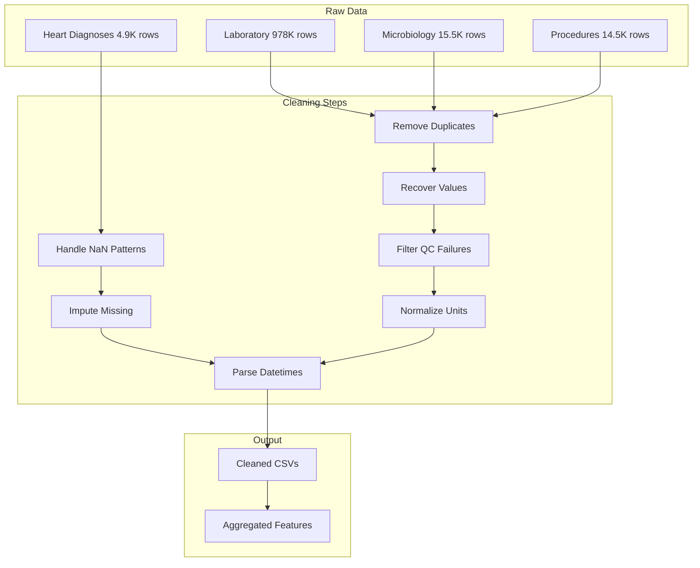

# Data Preprocessing Story for Tabular Data

## Overview

The preprocessing pipeline followed a consistent methodology across four clinical datasets, transforming raw hospital data into analysis-ready feature sets. Each dataset required different levels of cleaning based on its complexity and data quality.

---

## Dataset 1: Heart Diagnoses (~4.9K rows)

**Core patient dataset with extensive text data requiring creative imputation strategies.**

### Step 1: Data Quality Assessment

- Identified 25 columns including clinical notes (HPI, physical exam), imaging results, ICD codes, and demographics
- Found significant missingness: gender (72% missing), age (72% missing), dod (92% missing)
- Discovered disguised NaN values: `None`, `none`, `N/A`, `[]`, `['.']`, etc.

### Step 2: Whitespace Cleanup

- Removed newline characters and excess whitespace from all text fields
- Standardized string formatting across clinical notes

### Step 3: NaN Pattern Detection & Conversion

**Key Decision**: Systematically identified and converted placeholder values to proper NaN:

| Pattern | Rows Affected |
|---------|---------------|
| `None`, `none`, `None.` | 1,487+ rows |
| `[]`, `['.']`, `['-']` | 772+ rows |
| `N/A`, `na`, `nan` | Multiple columns |

### Step 4: Gender Imputation from Clinical Text

**Creative Solution**: Since 72% of gender values were missing, we developed a multi-stage imputation strategy:

1. **Stage 1 - Medical Keywords**: Searched HPI/reports for sex-specific terms (`female`, `male`, `woman`, `man`)
   - Filled 2,383 rows

2. **Stage 2 - Clinical Terms**: Used medical indicators (`pregnant`, `prostate`, `testicular`)
   - Filled additional 60 rows

3. **Stage 3 - Pronoun Analysis**: Counted gendered pronouns (`she`/`her` vs `he`/`his`)
   - Resolved conflicts by majority vote
   - Filled 837 more rows

4. **Stage 4 - Manual Review**: Examined remaining 10 rows individually
   - Assigned 4 based on clear text evidence ("gentleman", explicit "M"/"F" markers)

**Result**: Reduced missing gender from 3,501 to just 6 rows (99.8% imputed)

### Step 5: Age Imputation Strategy

**Sequential Approach** using group medians with minimum sample size (N=100):

1. **ICD Code + Gender Median**: If group has ≥100 samples, use median age
   - Filled 2,062 rows

2. **ICD Code Only Median**: Fall back to ICD-only groups
   - Filled 795 additional rows

**Result**: Imputed 81.6% of missing ages (2,857 of 3,501)

### Step 6: Datetime Conversion

- Converted `charttime`, `storetime` to datetime64[ns]
- Parsed `dod` (date of death) with proper format handling

### Step 7: Feature Engineering

**Mortality Indicator**: `is_dead` derived from presence of `dod`

**Imaging Features**:

- `n_imaging_tests`: Count of non-null imaging columns (X-ray, CT, MRI, Ultrasound, ECG, CATH)
- `has_radiology_exam`: Any of X-ray/CT/MRI/Ultrasound present
- `has_cardiac_exam`: ECG or CATH present
- `imaging_variety`: Total number of different imaging types

**ICD Category Classification**:

```
acute_mi       → I21, I22
ischemic_hd    → I20, I23, I24, I25
pericardial    → I30, I31
inflammatory   → I32, I33, I40
cardiomyopathy → I42
arrhythmia     → I44, I45, I47, I48, I49
valvular       → I34, I35, I36
heart_failure  → I50
cardiac_arrest → I46
```

**Cardiac Phenotype Flags**: `has_hf`, `has_arr`, `has_ami`, `has_arrest`, `has_valvular`, `has_inflammatory`

**Documentation Complexity**: Log-transformed text length from HPI, physical exam, reports

---

## Dataset 2: Laboratory Events (~978K rows)

**The most complex dataset requiring extensive cleaning and feature engineering.**

### Step 1: Data Quality Assessment

- Identified 14 columns including measurement values, reference ranges, QC flags, and examination metadata
- Found placeholder values masquerading as data: `___`, `NONE`, `ERROR`

### Step 2: Duplicate Removal

- Removed 2 exact duplicate rows

### Step 3: Value Recovery & Standardization

**Key Decision**: Rather than discarding non-numeric values, we extracted meaningful numeric information:

| Pattern | Transformation | Example |
|---------|----------------|---------|
| Placeholders | Convert to NaN | `___` → NaN |
| Divisions | Calculate result | `20/10` → 2.0 |
| Ranges | Take midpoint | `80-160` → 120 |
| Comparisons | Offset by 0.1 | `>1.05` → 1.15 |

This recovered **1,311 additional numeric values** through the `value_extracted` → `valuenum_merged` pipeline.

### Step 4: Quality Control Filtering

- Created binary QC indicators: `is_qc_fail`, `is_qc_warn`, `is_qc_ok`
- **Decision**: Set `valuenum_merged` to NaN for QC_FAIL rows (18,185 rows, 1.86% data loss)
- Rationale: Failed quality control measurements are unreliable for downstream analysis

### Step 5: Flag Validation

- Validated abnormal/normal flags against reference ranges
- **99.96% match rate** - excellent data quality
- Created `flag_corrected` for the 302 mismatched rows

### Step 6: Unit Normalization

- Standardized units across 34 analytes (e.g., mg/dL → mmol/L for glucose)
- Applied conversion factors to **642,381 measurements**
- Ensures comparability across different lab reporting conventions

### Step 7: Feature Aggregation (per admission)

Created clinically meaningful features grouped by (subject_id, hadm_id):

**Activity Metrics**: `num_labs`, `lab_time_span_hours`, `unique_lab_tests`

**Quality Indicators**: `abnormal_ratio`, `qc_fail_ratio`

**Clinical Values** (by fluid type):

- Blood: glucose, lactate, creatinine, hemoglobin, etc.
- Urine: glucose, creatinine, sodium, protein
- Blood Gas: pO2, pCO2, pH, base excess

**System Intensity Counts**: CBC, blood gas, liver, cardiac markers

---

## Dataset 3: Microbiology Events (~15.5K rows)

**Medium complexity with significant missingness patterns.**

### Step 1: Duplicate Removal

- Removed 1 duplicate row

### Step 2: QC Flag Handling

- Set dilution values to NaN for QC_FAIL rows (255 measurements, 1.64%)

### Step 3: Data Consistency Fix

- Fixed edge case: `>256` entries missing `dilution_comparison` were corrected

### Step 4: Missing Value Analysis

**Key Insight**: Missing values follow a hierarchical pattern:

```
┌─────────────────────────────────────────────────┐
│ All three missing (org_name, ab_name, dilution) │
│                   10,195 rows                   │
│    ┌───────────────────────────────────┐        │
│    │  ab_name + dilution missing: 571  │        │
│    │  ┌─────────────────────────┐      │        │
│    │  │ dilution only: 362     │      │        │
│    │  └─────────────────────────┘      │        │
│    └───────────────────────────────────┘        │
│         Complete rows: 4,458                    │
└─────────────────────────────────────────────────┘
```

**Decision**: Keep rows with missing organism/antibiotic data - they represent negative cultures (no organism found), which is clinically meaningful.

### Step 5: Feature Aggregation

**Diversity Metrics**: `unique_specimen_types`, `unique_organisms`, `unique_antibiotics`

**Susceptibility Profile**: `num_susceptible`, `num_resistant`, `num_intermediate`, `resistant_ratio`

**Activity**: `total_microbio_events`, `micro_time_span_hours`

---

## Dataset 4: Procedure Codes (~14.5K rows)

**Cleanest dataset requiring minimal preprocessing.**

### Step 1: Data Quality Check

- No duplicates found
- No invalid ICD codes (validated code lengths: 3-7 characters)
- No missing values in any column

### Step 2: Datetime Conversion

- Converted `chartdate` to datetime format

### Step 3: Feature Aggregation

- `total_procedures`: count of procedures per admission
- `unique_icd_codes`: diversity of procedure types
- `procedure_span_days`: duration of procedural care

**Observation**: Very high correlation (r=0.98) between `total_procedures`, `unique_icd_codes`, and `unique_titles` - most procedures have unique codes.

---

## Summary: Preprocessing Philosophy



### Key Principles Applied

1. **Data Recovery over Deletion**: Extracted numeric values from complex strings rather than discarding them
2. **Creative Imputation**: Used clinical text (HPI, reports) to impute missing demographics like gender
3. **Quality-Based Filtering**: Used QC flags to identify unreliable measurements
4. **Clinical Relevance**: Aggregated features at the admission level for patient-centric analysis
5. **Transparency**: Created indicator variables (`has_labs`, `has_micro`, `has_procedure`, `has_heart`) for downstream handling of missing data
6. **Correlation Awareness**: Analyzed feature correlations to identify redundancy before final feature selection

---

## Impact Summary

### Data Quality Improvements

- **Heart Diagnoses**: Imputed 99.8% of missing gender through text mining; 81.6% of missing ages via ICD-based medians
- **Laboratory**: Recovered 1,311 values through intelligent extraction; filtered 18,185 QC failures (1.86% loss)
- **Microbiology**: Preserved 4,458 complete culture results; handled 10,195 negative cultures appropriately
- **Procedures**: 100% data quality - no cleaning needed

### Feature Engineering Output

- **Heart Diagnoses**: 18 features including mortality, imaging variety, ICD categories, cardiac phenotypes
- **Laboratory**: 34 aggregated features per admission (activity, quality, clinical values, system counts)
- **Microbiology**: 17 features capturing diversity, susceptibility, and activity patterns
- **Procedures**: 6 features representing procedural complexity and duration

### Final Dataset Characteristics

- All datasets standardized to admission-level (subject_id, hadm_id) aggregation
- Consistent datetime handling across all temporal fields
- Unit normalization ensures cross-dataset comparability
- Missing data patterns documented and handled appropriately
- Total: ~75 engineered features across all datasets
