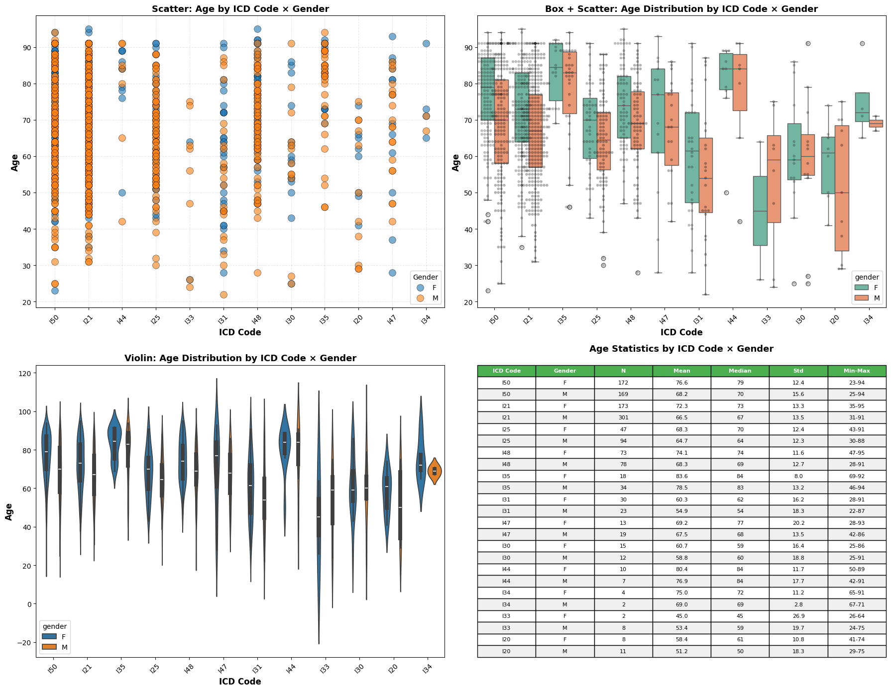
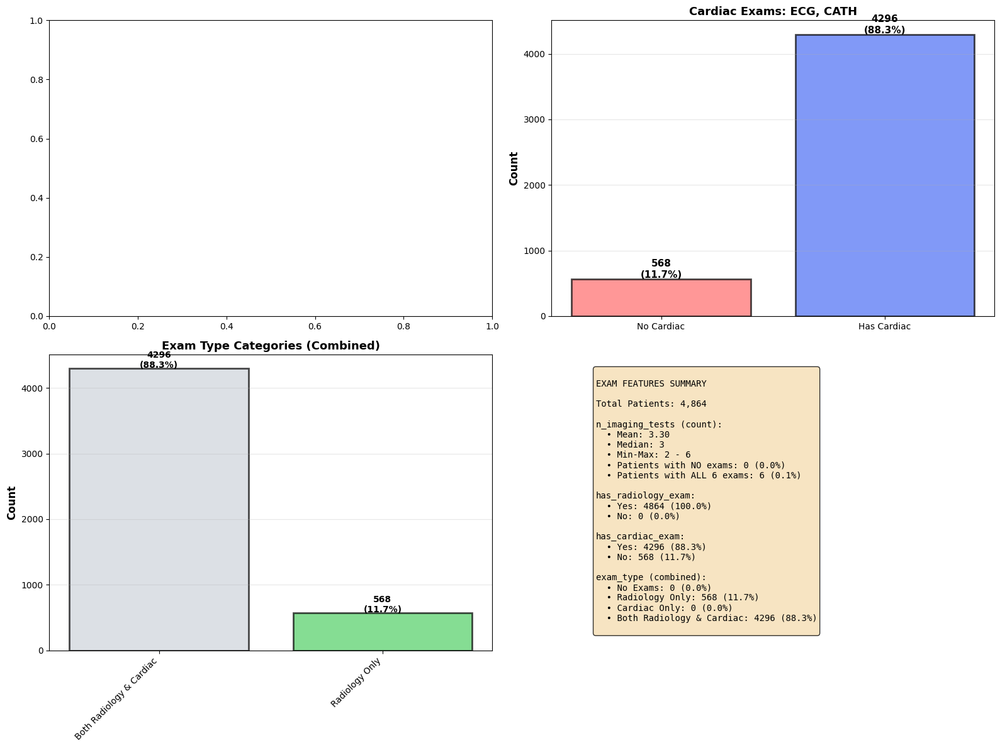

```python
%matplotlib inline
import math
import re
import numpy as np
import pandas as pd
import scipy.stats as stats
import matplotlib.pyplot as plt
import matplotlib.pyplot as plt
import seaborn as sns
import re

from collections import defaultdict
from scipy.stats import pearsonr
import pandas as pd
from IPython.display import display

```


```python
DATA_DIR = r"Y:\Studium\3. Sem UniPI\Data Analytics 4 digital Health\Data"

DATASETS = {
    "heart_diagnoses_1": "heart_diagnoses_1.csv",
    "laboratory_events_codes_2": "laboratory_events_codes_2.csv",
    "microbiology_events_codes_3": "microbiology_events_codes_3.csv",
    "procedure_code_4": "procedure_code_4.csv",
}
name = "heart_diagnoses_1"
```


```python
df = pd.read_csv(f"{DATA_DIR}/{DATASETS['heart_diagnoses_1']}", index_col=False)

df.columns
```


    Index(['note_id', 'subject_id', 'hadm_id', 'note_type', 'note_seq',
           'charttime', 'storetime', 'HPI', 'physical_exam', 'chief_complaint',
           'invasions', 'X-ray', 'CT', 'Ultrasound', 'CATH', 'ECG', 'MRI',
           'reports', 'subject_id_dx', 'icd_code', 'long_title', 'gender', 'age',
           'anchor_year', 'dod'],
          dtype='object')


# INspections


```python
sns.set_theme(style="whitegrid", context="notebook")

def is_available(name):
    return name in globals()

# Choose table
table = df

# 1) Missingness bar + heatmap (top 25 cols)
mis = table.isna().mean().sort_values(ascending=False)
plt.figure(figsize=(10,4))
sns.barplot(x=mis.head(25).index, y=mis.head(25).values, color="#4c6ef5")
plt.xticks(rotation=75, ha="right")
plt.ylabel("Missing fraction")
plt.title("Missingness (top 25 columns)")
plt.tight_layout()
plt.show()

plt.figure(figsize=(10,6))
sns.heatmap(table.head(300).isna(), cbar=False, yticklabels=False, cmap="viridis")
plt.title("Missingness pattern (first 300 rows)")
plt.tight_layout()
plt.show()

# 2) Numeric distributions: hist + box (stacked)
num_cols = [c for c in table.select_dtypes(include=[np.number]).columns if c not in ["subject_id","hadm_id"]]
n_show = min(len(num_cols), 12)
fig, axes = plt.subplots(n_show, 2, figsize=(10, 1.6*n_show))
for i, col in enumerate(num_cols[:n_show]):
    sns.histplot(table[col].dropna(), ax=axes[i,0], kde=True, color="#4dabf7")
    axes[i,0].set_title(f"{col} (hist)")
    sns.boxplot(x=table[col], ax=axes[i,1], color="#ffa94d")
    axes[i,1].set_title(f"{col} (box)")
plt.tight_layout()
plt.show()

# 3) Correlation: lower triangle heatmap
if len(num_cols) > 1:
    corr = table[num_cols].corr()
    mask = np.triu(np.ones_like(corr, dtype=bool))
    plt.figure(figsize=(10,8))
    sns.heatmap(corr, mask=mask, annot=True, fmt=".2f",
                cmap="coolwarm", center=0, square=True,
                linewidths=0.5, annot_kws={"size":8},
                cbar_kws={"label":"Correlation","shrink":0.8})
    plt.title("Correlation matrix (lower triangle)")
    plt.xticks(rotation=45, ha="right")
    plt.yticks(rotation=0)
    plt.tight_layout()
    plt.show()

# 4) Pairwise glance (top 4 numeric cols)
top4 = num_cols[:4]
if len(top4) >= 2:
    sns.pairplot(table[top4].dropna(), corner=True, diag_kind="hist")
    plt.suptitle("Pairwise plots (top 4 numeric features)", y=1.02)
    plt.show()
```

## A


```python
df.head(10)
```


```python
df.tail(10)

```

## B


```python
df.columns
```


```python
df[df.columns[:10]].head(10)
```


```python
df[df.columns[10:]].head(10)
```

## C


```python
df.columns
```


```python
df["note_type"].unique()
```


```python
nan_row = df[df['subject_id'] == 19998591]
nan_row
```


```python
nan_row = df[df['subject_id'] == 19998591]
nan_row
```

# Data Understanding and Preprocessing, cleaning of DF1 - heart


```python
df[['subject_id','hadm_id']].duplicated().any()
```


    np.False_


```python
df.groupby(['subject_id','hadm_id']).size().describe()
```


    count    4864.0
    mean        1.0
    std         0.0
    min         1.0
    25%         1.0
    50%         1.0
    75%         1.0
    max         1.0
    dtype: float64


```python
df.duplicated().sum()
```


    np.int64(0)


```python
df.info()
```

    <class 'pandas.core.frame.DataFrame'>
    RangeIndex: 4864 entries, 0 to 4863
    Data columns (total 25 columns):
     #   Column           Non-Null Count  Dtype  
    ---  ------           --------------  -----  
     0   note_id          4864 non-null   object 
     1   subject_id       4864 non-null   int64  
     2   hadm_id          4864 non-null   int64  
     3   note_type        4864 non-null   object 
     4   note_seq         4864 non-null   int64  
     5   charttime        4864 non-null   object 
     6   storetime        4864 non-null   object 
     7   HPI              4864 non-null   object 
     8   physical_exam    4864 non-null   object 
     9   chief_complaint  4852 non-null   object 
     10  invasions        4852 non-null   object 
     11  X-ray            4864 non-null   object 
     12  CT               4864 non-null   object 
     13  Ultrasound       4864 non-null   object 
     14  CATH             4864 non-null   object 
     15  ECG              4864 non-null   object 
     16  MRI              4864 non-null   object 
     17  reports          4864 non-null   object 
     18  subject_id_dx    4864 non-null   int64  
     19  icd_code         4864 non-null   object 
     20  long_title       4864 non-null   object 
     21  gender           1363 non-null   object 
     22  age              1363 non-null   float64
     23  anchor_year      1363 non-null   float64
     24  dod              398 non-null    object 
    dtypes: float64(2), int64(4), object(19)
    memory usage: 950.1+ KB
    

## Findings

FIRST Findings:
- gender, age anchor_year and dod, invasions, chief_complaint with NANs => they are only is this df_slim_slim so we can handle them before merging
- some dtyppes need conversions: chart/storetimes, dod?
- age, acnor year, are int64 but with .0
- find and convert weird Nones: \nNone\n\n \nnone\n, [], 
['.']                                                                                                                   

## Check for wrong NaNs / non typical entries in each column

PLAN:
- first remove all "\n" and whitespaces
- then find occurences of wrong NaNS, and convert them to np.na


```python
# Simple cleanup: remove newlines and extra whitespaces
def clean_whitespace(val):
    if isinstance(val, str):
        return val.replace('\n', '').replace('\r', '').strip()
    return val

for col in df.columns:
    df[col] = df[col].apply(clean_whitespace)

print("Whitespace cleanup completed")
df.info()
```

    Whitespace cleanup completed
    <class 'pandas.core.frame.DataFrame'>
    RangeIndex: 4864 entries, 0 to 4863
    Data columns (total 25 columns):
     #   Column           Non-Null Count  Dtype  
    ---  ------           --------------  -----  
     0   note_id          4864 non-null   object 
     1   subject_id       4864 non-null   int64  
     2   hadm_id          4864 non-null   int64  
     3   note_type        4864 non-null   object 
     4   note_seq         4864 non-null   int64  
     5   charttime        4864 non-null   object 
     6   storetime        4864 non-null   object 
     7   HPI              4864 non-null   object 
     8   physical_exam    4864 non-null   object 
     9   chief_complaint  4852 non-null   object 
     10  invasions        4852 non-null   object 
     11  X-ray            4864 non-null   object 
     12  CT               4864 non-null   object 
     13  Ultrasound       4864 non-null   object 
     14  CATH             4864 non-null   object 
     15  ECG              4864 non-null   object 
     16  MRI              4864 non-null   object 
     17  reports          4864 non-null   object 
     18  subject_id_dx    4864 non-null   int64  
     19  icd_code         4864 non-null   object 
     20  long_title       4864 non-null   object 
     21  gender           1363 non-null   object 
     22  age              1363 non-null   float64
     23  anchor_year      1363 non-null   float64
     24  dod              398 non-null    object 
    dtypes: float64(2), int64(4), object(19)
    memory usage: 950.1+ KB
    

#### Find wrong NaNs


```python
# compute and display value counts for every column (including NaNs)
value_counts_dict = {}

for col in df.columns:
    vc = df[col].value_counts(dropna=False)
    value_counts_dict[col] = vc
    print(f"\nColumn: '{col}'  | unique={vc.shape[0]}  | missing={df[col].isna().sum()}")
    # check the column's dtype (not the column name string)
    if not pd.api.types.is_numeric_dtype(df[col]) and col not in ["subject_id", "hadm_id", "note_id","charttime", "storetime", "dod"]:
        uniques = []
        for uni in df[col].unique():
            s = str(uni)
            if len(s) < 10:
                uniques.append(s)
        print(f"  sus Unique values: {uniques}")
```

    
    Column: 'note_id'  | unique=4761  | missing=0
    
    Column: 'subject_id'  | unique=4392  | missing=0
    
    Column: 'hadm_id'  | unique=4761  | missing=0
    
    Column: 'note_type'  | unique=1  | missing=0
      sus Unique values: ['DS']
    
    Column: 'note_seq'  | unique=64  | missing=0
    
    Column: 'charttime'  | unique=4466  | missing=0
    
    Column: 'storetime'  | unique=4761  | missing=0
    
    Column: 'HPI'  | unique=4760  | missing=0
      sus Unique values: []
    
    Column: 'physical_exam'  | unique=4749  | missing=0
      sus Unique values: []
    
    Column: 'chief_complaint'  | unique=1937  | missing=12
      sus Unique values: ['dyspnea', 'Dyspnea', 'Angina', 'lethargy', 'NSTEMI', 'tamponade', 'Syncope', 'Fall', 'SOB', 'VT storm', 'Vomiting', 'leg pain', 'nan', 'STEMI', 'DOE', 'hypoxia', 'Back pain', 'Weakness', 'angina', 'syncope', 'Fatigue', '___.', 'Cough', 'Hypoxia', '___ edema', 's/p STEMI', '___', 'hypoxemia', 'malaise', 'Fever', 'weakness', 'VTach', 'CP', 'Diarrhea', 'torsades', 'VF arrest', 'CHF', 's/p fall', 'SVT', 'Cough/SOB', 'VT arrest', 'fever', 'DYSPNEA', 'Dsypnea', 'TAVR', 'Arm Pain', 'Vtach', 'Syncope.', 'HTN', 'Neck pain', 'Nausea', 'Fevers', 'SOB.', 'fatigue', 'edema', 'Jaw Pain', 'leg edema', 'diarrhea', 'VF Arrest', 'SOB, CP', 'CP, STEMI', 'Lethargy', 'RUQ pain', 'Dizziness', 'CP, SOB', 'chest ___', 'NSTEMI.', 'Hypoxia.', 'V-tach', 'Confusion', 'Dyspnea.', 'Edema', 'toe pain', 'back pain', 'dyspnoea', 'SOB, AMS', 'Epistaxis', 'Anemia', 'dsypnea', 'Falls', 'VT Storm', 'dizziness', 'orthopnea', 'Orthopnea', 'Hematoma', 'Dypsnea.', 'A fib RVR', 'ACS', 'Leg pain', 'dypnea', 'CC: ___', 'AF', 'nausea', 'SOB/DOE', 'Back Pain', 'fall', 'VFib']
    
    Column: 'invasions'  | unique=2435  | missing=12
      sus Unique values: ['None', 'none', 'nan', 'CABG X', 'None.', '___ TAVR', 'N/A', 'none.', 'NONE', 'Dialysis', '___ cath', 'dialysis', '___ ___', 'Endoscopy', 'TEE', '___ line', 'TEE ___', '___ CABG', '___', 'TAVR ___', 'Intubated', 'CABGMVR', '***', 'LHC (___)', 's/p ___ 3', 'n/a', 'TAVR', 'ECHO', '___ Cath', '___ TEE', '', 'NA', 'EGD ___', 'C. cath', 'PCI ___', 'ECHO.', 'Bipap', 'PTCA', 'CABG, MVR', 'HD - ___', 'None..', '.', 'EGD', '___ LHC', 'CVVH', 'C. Cath', 'BiPAP', 'xxxxxx']
    
    Column: 'X-ray'  | unique=3972  | missing=0
      sus Unique values: ['[]', "['___:']", "['___']"]
    
    Column: 'CT'  | unique=1651  | missing=0
      sus Unique values: ['[]', "['.']", "['Scan']", "['scan.']", "['or']", "[':']", "['CHEST']"]
    
    Column: 'Ultrasound'  | unique=4193  | missing=0
      sus Unique values: ['[]', "[':']", "['___']", "['___:']"]
    
    Column: 'CATH'  | unique=2475  | missing=0
      sus Unique values: ['[]', "['___']", "['or']", "['___:']"]
    
    Column: 'ECG'  | unique=3204  | missing=0
      sus Unique values: ['[]', "['___']", "['-']", "['/']", "['.']"]
    
    Column: 'MRI'  | unique=169  | missing=0
      sus Unique values: ['[]', "['I or']", "['___']"]
    
    Column: 'reports'  | unique=4174  | missing=0
      sus Unique values: []
    
    Column: 'subject_id_dx'  | unique=4289  | missing=0
    
    Column: 'icd_code'  | unique=20  | missing=0
      sus Unique values: ['I50', 'I21', 'I35', 'I25', 'I48', 'I47', 'I31', 'I44', 'I33', 'I42', 'I30', 'I40', 'I20', 'I49', 'I24', 'I34', 'I46', 'I22', 'I36', 'I45']
    
    Column: 'long_title'  | unique=20  | missing=0
      sus Unique values: []
    
    Column: 'gender'  | unique=3  | missing=3501
      sus Unique values: ['F', 'nan', 'M']
    
    Column: 'age'  | unique=76  | missing=3501
    
    Column: 'anchor_year'  | unique=97  | missing=3501
    
    Column: 'dod'  | unique=352  | missing=4466
    

Findings - we found:
- TODO: ___ (e.g.: "['___']"s, ['___:']) is just anonymized, not a NaN IMO so we keep them?
- TODO: Also what about weird entries (e.g.:  "['or']", "xxxxxx", '***', )?

Safe wrong nans:
- to nan every non numeric col which is exactly "['-']", "['/']", "['.']", "[]", "['/']", "[':']", ...
- to np.NaN every non numeric, to_lower, column with ["none", "nan", "na", "N/A", "." ] in its entry


```python
sus_entries = ['', '\nNone\n \n', 'none', 'None.', "None..", "na", 'nan', 'null', '[\'.\']', '[]', '.', 'NaT', 'n/a', 'na', 'not available',"pd.na", "<nat>", "['-']", "['/']", "['.']", "[]", "['/']", "[':']"]
for col in df.columns:
    print(f"Column '{col}'")
    for entry in sus_entries:
        if entry.strip():  # skip empty string for .isin() check
            mask = df[col].astype(str).str.lower().str.contains(entry.lower(), regex=False, na=False)
        else:
            mask = df[col].astype(str).str.strip() == ''
        
        cnt = mask.sum()
        if cnt > 0:
            print(f"  '{entry}': {cnt} occurrences")
```

    Column 'note_id'
    Column 'subject_id'
    Column 'hadm_id'
    Column 'note_type'
    Column 'note_seq'
    Column 'charttime'
    Column 'storetime'
    Column 'HPI'
      'none': 152 occurrences
      'None.': 8 occurrences
      'na': 4578 occurrences
      'nan': 229 occurrences
      '[]': 15 occurrences
      '.': 4862 occurrences
      'NaT': 755 occurrences
      'n/a': 25 occurrences
      'na': 4578 occurrences
      'not available': 18 occurrences
      '[]': 15 occurrences
    Column 'physical_exam'
      'none': 126 occurrences
      'None.': 4 occurrences
      'None..': 1 occurrences
      'na': 3824 occurrences
      'nan': 19 occurrences
      '[]': 96 occurrences
      '.': 4626 occurrences
      'NaT': 591 occurrences
      'n/a': 3 occurrences
      'na': 3824 occurrences
      '[]': 96 occurrences
    Column 'chief_complaint'
      'none': 2 occurrences
      'na': 249 occurrences
      'nan': 12 occurrences
      '.': 141 occurrences
      'NaT': 8 occurrences
      'n/a': 2 occurrences
      'na': 249 occurrences
    Column 'invasions'
      '': 1 occurrences
      'none': 1487 occurrences
      'None.': 112 occurrences
      'None..': 1 occurrences
      'na': 671 occurrences
      'nan': 44 occurrences
      '.': 549 occurrences
      'NaT': 24 occurrences
      'n/a': 13 occurrences
      'na': 671 occurrences
    Column 'X-ray'
      'none': 55 occurrences
      'None.': 11 occurrences
      'na': 3429 occurrences
      'nan': 474 occurrences
      '[]': 773 occurrences
      '.': 3989 occurrences
      'NaT': 908 occurrences
      'n/a': 5 occurrences
      'na': 3429 occurrences
      'not available': 3 occurrences
      '[]': 773 occurrences
    Column 'CT'
      'none': 44 occurrences
      'None.': 5 occurrences
      'na': 1498 occurrences
      'nan': 460 occurrences
      '['.']': 7 occurrences
      '[]': 3205 occurrences
      '.': 1576 occurrences
      'NaT': 424 occurrences
      'n/a': 1 occurrences
      'na': 1498 occurrences
      'not available': 2 occurrences
      '['.']': 7 occurrences
      '[]': 3205 occurrences
      '[':']': 1 occurrences
    Column 'Ultrasound'
      'none': 64 occurrences
      'None.': 7 occurrences
      'na': 4054 occurrences
      'nan': 1116 occurrences
      '[]': 582 occurrences
      '.': 4247 occurrences
      'NaT': 1016 occurrences
      'n/a': 4 occurrences
      'na': 4054 occurrences
      'not available': 21 occurrences
      '[]': 582 occurrences
      '[':']': 2 occurrences
    Column 'CATH'
      'none': 113 occurrences
      'None.': 9 occurrences
      'na': 2316 occurrences
      'nan': 1722 occurrences
      '[]': 2331 occurrences
      '.': 2369 occurrences
      'NaT': 613 occurrences
      'n/a': 2 occurrences
      'na': 2316 occurrences
      'not available': 10 occurrences
      '[]': 2331 occurrences
    Column 'ECG'
      'none': 48 occurrences
      'None.': 5 occurrences
      'na': 1726 occurrences
      'nan': 431 occurrences
      '['.']': 1 occurrences
      '[]': 1596 occurrences
      '.': 3000 occurrences
      'NaT': 653 occurrences
      'n/a': 7 occurrences
      'na': 1726 occurrences
      'not available': 4 occurrences
      '['-']': 1 occurrences
      '['/']': 2 occurrences
      '['.']': 1 occurrences
      '[]': 1596 occurrences
      '['/']': 2 occurrences
    Column 'MRI'
      'none': 3 occurrences
      'None.': 1 occurrences
      'na': 121 occurrences
      'nan': 35 occurrences
      'null': 2 occurrences
      '[]': 4691 occurrences
      '.': 148 occurrences
      'NaT': 17 occurrences
      'na': 121 occurrences
      '[]': 4691 occurrences
    Column 'reports'
      'na': 1660 occurrences
      'nan': 21 occurrences
      '.': 3481 occurrences
      'NaT': 297 occurrences
      'na': 1660 occurrences
    Column 'subject_id_dx'
    Column 'icd_code'
    Column 'long_title'
      'na': 36 occurrences
      'na': 36 occurrences
    Column 'gender'
      'na': 3501 occurrences
      'nan': 3501 occurrences
      'na': 3501 occurrences
    Column 'age'
      'na': 3501 occurrences
      'nan': 3501 occurrences
      '.': 1363 occurrences
      'na': 3501 occurrences
    Column 'anchor_year'
      'na': 3501 occurrences
      'nan': 3501 occurrences
      '.': 1363 occurrences
      'na': 3501 occurrences
    Column 'dod'
      'na': 4466 occurrences
      'nan': 4466 occurrences
      'na': 4466 occurrences
    

### INspect weird entries
Findings - we found:
- TODO: ___ (e.g.: "['___']"s, ['___:']) is just anonymized, not a NaN IMO so we keep them?
- TODO: Also what about weird entries (e.g.:  "['or']", "xxxxxx", '***', )?

==> IMO remove bc we risk low quality data with wrong outliers


```python
df.columns
```


    Index(['note_id', 'subject_id', 'hadm_id', 'note_type', 'note_seq',
           'charttime', 'storetime', 'HPI', 'physical_exam', 'chief_complaint',
           'invasions', 'X-ray', 'CT', 'Ultrasound', 'CATH', 'ECG', 'MRI',
           'reports', 'subject_id_dx', 'icd_code', 'long_title', 'gender', 'age',
           'anchor_year', 'dod'],
          dtype='object')


```python
weird_entries = ['or', 'xxxxxx', '***', '-', '/', '.', ':', "['.']", "['or']", "['xxxxxx']", "['***']", "['-']", "['/']", "[':']"]

# For each column, find and display rows with weird entries
for col in df.columns:
    if col in ['subject_id', 'hadm_id', 'note_id', 'charttime', 'storetime', 'dod']:
        continue
    
    str_col = df[col].astype(str).str.lower()
    
    for entry in weird_entries:
        # Check for exact bracket format or loose match
        mask = (str_col == f"['{entry}']") | (str_col == f"[{entry}]") | (str_col == entry)
        
        if mask.sum() > 0:
            print(f"\n{'='*80}")
            print(f"Column '{col}' | Entry: '{entry}' | Found: {mask.sum()} rows")
            print(f"{'='*80}")
            display(df[mask][[col, 'subject_id', 'hadm_id' , 'HPI', 'X-ray', 'CT', 'Ultrasound', 'CATH', 'ECG', 'MRI', 'icd_code', 'gender', 'age',]].head(10))
```

    
    ================================================================================
    Column 'invasions' | Entry: 'xxxxxx' | Found: 1 rows
    ================================================================================
    


<div>
<style scoped>
    .dataframe tbody tr th:only-of-type {
        vertical-align: middle;
    }

    .dataframe tbody tr th {
        vertical-align: top;
    }

    .dataframe thead th {
        text-align: right;
    }
</style>
<table border="1" class="dataframe">
  <thead>
    <tr style="text-align: right;">
      <th></th>
      <th>invasions</th>
      <th>subject_id</th>
      <th>hadm_id</th>
      <th>HPI</th>
      <th>X-ray</th>
      <th>CT</th>
      <th>Ultrasound</th>
      <th>CATH</th>
      <th>ECG</th>
      <th>MRI</th>
      <th>icd_code</th>
      <th>gender</th>
      <th>age</th>
    </tr>
  </thead>
  <tbody>
    <tr>
      <th>4561</th>
      <td>xxxxxx</td>
      <td>19613127</td>
      <td>29371998</td>
      <td>:___ yo M with history of CABG ___ ___, DM, re...</td>
      <td>[':\nCHEST, AP UPRIGHT:  Lungs are clear.  Cha...</td>
      <td>[]</td>
      <td>['The left atrium is normal ___ size. No atria...</td>
      <td>['Findings  \nESTIMATED blood loss: &lt;40 cc  \n...</td>
      <td>[]</td>
      <td>[]</td>
      <td>I21</td>
      <td>NaN</td>
      <td>NaN</td>
    </tr>
  </tbody>
</table>
</div>


    
    ================================================================================
    Column 'invasions' | Entry: '***' | Found: 1 rows
    ================================================================================
    


<div>
<style scoped>
    .dataframe tbody tr th:only-of-type {
        vertical-align: middle;
    }

    .dataframe tbody tr th {
        vertical-align: top;
    }

    .dataframe thead th {
        text-align: right;
    }
</style>
<table border="1" class="dataframe">
  <thead>
    <tr style="text-align: right;">
      <th></th>
      <th>invasions</th>
      <th>subject_id</th>
      <th>hadm_id</th>
      <th>HPI</th>
      <th>X-ray</th>
      <th>CT</th>
      <th>Ultrasound</th>
      <th>CATH</th>
      <th>ECG</th>
      <th>MRI</th>
      <th>icd_code</th>
      <th>gender</th>
      <th>age</th>
    </tr>
  </thead>
  <tbody>
    <tr>
      <th>1444</th>
      <td>***</td>
      <td>13000446</td>
      <td>21786912</td>
      <td>:The patient is a ___ y/o man with a history o...</td>
      <td>[': Notable for RLL and LLL opacities', "FINDI...</td>
      <td>['CHEST W/O CONTRAST Study Date of ___ 1:30 __...</td>
      <td>[]</td>
      <td>[]</td>
      <td>[': Atrial Fibrillation, otherwise unchanged\n...</td>
      <td>[]</td>
      <td>I50</td>
      <td>NaN</td>
      <td>NaN</td>
    </tr>
  </tbody>
</table>
</div>


    
    ================================================================================
    Column 'invasions' | Entry: '.' | Found: 1 rows
    ================================================================================
    


<div>
<style scoped>
    .dataframe tbody tr th:only-of-type {
        vertical-align: middle;
    }

    .dataframe tbody tr th {
        vertical-align: top;
    }

    .dataframe thead th {
        text-align: right;
    }
</style>
<table border="1" class="dataframe">
  <thead>
    <tr style="text-align: right;">
      <th></th>
      <th>invasions</th>
      <th>subject_id</th>
      <th>hadm_id</th>
      <th>HPI</th>
      <th>X-ray</th>
      <th>CT</th>
      <th>Ultrasound</th>
      <th>CATH</th>
      <th>ECG</th>
      <th>MRI</th>
      <th>icd_code</th>
      <th>gender</th>
      <th>age</th>
    </tr>
  </thead>
  <tbody>
    <tr>
      <th>4123</th>
      <td>.</td>
      <td>18658392</td>
      <td>20046985</td>
      <td>:___ with a history of 3-vessel CABG in ___, C...</td>
      <td>['___: Dictated report: No mediastinal widenin...</td>
      <td>[]</td>
      <td>['___:']</td>
      <td>['___: \nSelective coronary angiography in thi...</td>
      <td>[': NSR, 1mm STE in V2, subtle 0.25-0.5 STE in...</td>
      <td>[]</td>
      <td>I21</td>
      <td>NaN</td>
      <td>NaN</td>
    </tr>
  </tbody>
</table>
</div>


    
    ================================================================================
    Column 'CT' | Entry: 'or' | Found: 1 rows
    ================================================================================
    


<div>
<style scoped>
    .dataframe tbody tr th:only-of-type {
        vertical-align: middle;
    }

    .dataframe tbody tr th {
        vertical-align: top;
    }

    .dataframe thead th {
        text-align: right;
    }
</style>
<table border="1" class="dataframe">
  <thead>
    <tr style="text-align: right;">
      <th></th>
      <th>CT</th>
      <th>subject_id</th>
      <th>hadm_id</th>
      <th>HPI</th>
      <th>X-ray</th>
      <th>CT</th>
      <th>Ultrasound</th>
      <th>CATH</th>
      <th>ECG</th>
      <th>MRI</th>
      <th>icd_code</th>
      <th>gender</th>
      <th>age</th>
    </tr>
  </thead>
  <tbody>
    <tr>
      <th>3505</th>
      <td>['or']</td>
      <td>17390272</td>
      <td>21500884</td>
      <td>:Mr. ___ is a ___ y/o man with a PMH of stage ...</td>
      <td>['___. \nApproved       \nComparison to ___.  ...</td>
      <td>['or']</td>
      <td>['The left atrium is normal ___ size. Left ven...</td>
      <td>[]</td>
      <td>['___ ___.   \nSinus rhythm with a normal infe...</td>
      <td>[]</td>
      <td>I48</td>
      <td>M</td>
      <td>71.0</td>
    </tr>
  </tbody>
</table>
</div>


    
    ================================================================================
    Column 'CT' | Entry: '.' | Found: 7 rows
    ================================================================================
    


<div>
<style scoped>
    .dataframe tbody tr th:only-of-type {
        vertical-align: middle;
    }

    .dataframe tbody tr th {
        vertical-align: top;
    }

    .dataframe thead th {
        text-align: right;
    }
</style>
<table border="1" class="dataframe">
  <thead>
    <tr style="text-align: right;">
      <th></th>
      <th>CT</th>
      <th>subject_id</th>
      <th>hadm_id</th>
      <th>HPI</th>
      <th>X-ray</th>
      <th>CT</th>
      <th>Ultrasound</th>
      <th>CATH</th>
      <th>ECG</th>
      <th>MRI</th>
      <th>icd_code</th>
      <th>gender</th>
      <th>age</th>
    </tr>
  </thead>
  <tbody>
    <tr>
      <th>508</th>
      <td>['.']</td>
      <td>11163793</td>
      <td>20185129</td>
      <td>:___ with aortic stenosis with worsening short...</td>
      <td>[':\nSemi-upright  portable  radiograph  of  t...</td>
      <td>['.']</td>
      <td>[':\nThe left atrium is mildly dilated. The es...</td>
      <td>[]</td>
      <td>[]</td>
      <td>[]</td>
      <td>I35</td>
      <td>NaN</td>
      <td>NaN</td>
    </tr>
    <tr>
      <th>787</th>
      <td>['.']</td>
      <td>11726958</td>
      <td>20977007</td>
      <td>:___ male with a past medical history of hyper...</td>
      <td>['(___)\nIMPRESSION:    \nNo radiographic evid...</td>
      <td>['.']</td>
      <td>["(___):\nResults  \nMeasurements  \nNormal Ra...</td>
      <td>[]</td>
      <td>[]</td>
      <td>[]</td>
      <td>I35</td>
      <td>M</td>
      <td>85.0</td>
    </tr>
    <tr>
      <th>940</th>
      <td>['.']</td>
      <td>11997596</td>
      <td>20044448</td>
      <td>:admitted from the ED withasymptomatic hypoten...</td>
      <td>['___:\nNear complete opacification of the rig...</td>
      <td>['.']</td>
      <td>['___\nThe estimated right atrial pressure is ...</td>
      <td>[]</td>
      <td>[]</td>
      <td>[]</td>
      <td>I31</td>
      <td>F</td>
      <td>34.0</td>
    </tr>
    <tr>
      <th>978</th>
      <td>['.']</td>
      <td>12075316</td>
      <td>21685796</td>
      <td>:HISTORY OF PRESENTING ILLNESS: Mr ___ is an _...</td>
      <td>['___\nThe pacemaker leads terminate in the ex...</td>
      <td>['.']</td>
      <td>['___ (from ___):\n\n2. Moderately severe conc...</td>
      <td>[]</td>
      <td>[]</td>
      <td>[]</td>
      <td>I50</td>
      <td>NaN</td>
      <td>NaN</td>
    </tr>
    <tr>
      <th>1871</th>
      <td>['.']</td>
      <td>13933090</td>
      <td>29951156</td>
      <td>:___ yo male with h/o CAD s/p MI, CABG and PCI...</td>
      <td>['on admission: Stable small right pleural eff...</td>
      <td>['.']</td>
      <td>['on ___:  The left atrium is mildly dilated. ...</td>
      <td>[]</td>
      <td>['on admission: Atrial fibrillation with rapid...</td>
      <td>[]</td>
      <td>I21</td>
      <td>NaN</td>
      <td>NaN</td>
    </tr>
    <tr>
      <th>4089</th>
      <td>['.']</td>
      <td>18579971</td>
      <td>28956349</td>
      <td>:Ms. ___ is a ___ year old female with CAD s/p...</td>
      <td>['___ 5:14 ___\nSingle bedside AP examination ...</td>
      <td>['.']</td>
      <td>['___: The left atrium is mildly dilated. The ...</td>
      <td>[]</td>
      <td>['demonstrated NSR at 82 bpm. Nl axis, nl inte...</td>
      <td>[]</td>
      <td>I50</td>
      <td>NaN</td>
      <td>NaN</td>
    </tr>
    <tr>
      <th>4834</th>
      <td>['.']</td>
      <td>19998571</td>
      <td>28956349</td>
      <td>:Ms. ___ is a ___ year old female with CAD s/p...</td>
      <td>['___ 5:14 ___\nSingle bedside AP examination ...</td>
      <td>['.']</td>
      <td>['___: The left atrium is mildly dilated. The ...</td>
      <td>[]</td>
      <td>['demonstrated NSR at 82 bpm. Nl axis, nl inte...</td>
      <td>[]</td>
      <td>I50</td>
      <td>NaN</td>
      <td>NaN</td>
    </tr>
  </tbody>
</table>
</div>


    
    ================================================================================
    Column 'CT' | Entry: ':' | Found: 1 rows
    ================================================================================
    


<div>
<style scoped>
    .dataframe tbody tr th:only-of-type {
        vertical-align: middle;
    }

    .dataframe tbody tr th {
        vertical-align: top;
    }

    .dataframe thead th {
        text-align: right;
    }
</style>
<table border="1" class="dataframe">
  <thead>
    <tr style="text-align: right;">
      <th></th>
      <th>CT</th>
      <th>subject_id</th>
      <th>hadm_id</th>
      <th>HPI</th>
      <th>X-ray</th>
      <th>CT</th>
      <th>Ultrasound</th>
      <th>CATH</th>
      <th>ECG</th>
      <th>MRI</th>
      <th>icd_code</th>
      <th>gender</th>
      <th>age</th>
    </tr>
  </thead>
  <tbody>
    <tr>
      <th>3698</th>
      <td>[':']</td>
      <td>17760700</td>
      <td>25501463</td>
      <td>:___ yo M with a history of asthma and seasona...</td>
      <td>[]</td>
      <td>[':']</td>
      <td>[':\nNo evidence of right groin hematoma, pseu...</td>
      <td>[':\n1.', ':\n1.', 'of this right dominant sys...</td>
      <td>[]</td>
      <td>[]</td>
      <td>I21</td>
      <td>NaN</td>
      <td>NaN</td>
    </tr>
  </tbody>
</table>
</div>


    
    ================================================================================
    Column 'CT' | Entry: '['.']' | Found: 7 rows
    ================================================================================
    


<div>
<style scoped>
    .dataframe tbody tr th:only-of-type {
        vertical-align: middle;
    }

    .dataframe tbody tr th {
        vertical-align: top;
    }

    .dataframe thead th {
        text-align: right;
    }
</style>
<table border="1" class="dataframe">
  <thead>
    <tr style="text-align: right;">
      <th></th>
      <th>CT</th>
      <th>subject_id</th>
      <th>hadm_id</th>
      <th>HPI</th>
      <th>X-ray</th>
      <th>CT</th>
      <th>Ultrasound</th>
      <th>CATH</th>
      <th>ECG</th>
      <th>MRI</th>
      <th>icd_code</th>
      <th>gender</th>
      <th>age</th>
    </tr>
  </thead>
  <tbody>
    <tr>
      <th>508</th>
      <td>['.']</td>
      <td>11163793</td>
      <td>20185129</td>
      <td>:___ with aortic stenosis with worsening short...</td>
      <td>[':\nSemi-upright  portable  radiograph  of  t...</td>
      <td>['.']</td>
      <td>[':\nThe left atrium is mildly dilated. The es...</td>
      <td>[]</td>
      <td>[]</td>
      <td>[]</td>
      <td>I35</td>
      <td>NaN</td>
      <td>NaN</td>
    </tr>
    <tr>
      <th>787</th>
      <td>['.']</td>
      <td>11726958</td>
      <td>20977007</td>
      <td>:___ male with a past medical history of hyper...</td>
      <td>['(___)\nIMPRESSION:    \nNo radiographic evid...</td>
      <td>['.']</td>
      <td>["(___):\nResults  \nMeasurements  \nNormal Ra...</td>
      <td>[]</td>
      <td>[]</td>
      <td>[]</td>
      <td>I35</td>
      <td>M</td>
      <td>85.0</td>
    </tr>
    <tr>
      <th>940</th>
      <td>['.']</td>
      <td>11997596</td>
      <td>20044448</td>
      <td>:admitted from the ED withasymptomatic hypoten...</td>
      <td>['___:\nNear complete opacification of the rig...</td>
      <td>['.']</td>
      <td>['___\nThe estimated right atrial pressure is ...</td>
      <td>[]</td>
      <td>[]</td>
      <td>[]</td>
      <td>I31</td>
      <td>F</td>
      <td>34.0</td>
    </tr>
    <tr>
      <th>978</th>
      <td>['.']</td>
      <td>12075316</td>
      <td>21685796</td>
      <td>:HISTORY OF PRESENTING ILLNESS: Mr ___ is an _...</td>
      <td>['___\nThe pacemaker leads terminate in the ex...</td>
      <td>['.']</td>
      <td>['___ (from ___):\n\n2. Moderately severe conc...</td>
      <td>[]</td>
      <td>[]</td>
      <td>[]</td>
      <td>I50</td>
      <td>NaN</td>
      <td>NaN</td>
    </tr>
    <tr>
      <th>1871</th>
      <td>['.']</td>
      <td>13933090</td>
      <td>29951156</td>
      <td>:___ yo male with h/o CAD s/p MI, CABG and PCI...</td>
      <td>['on admission: Stable small right pleural eff...</td>
      <td>['.']</td>
      <td>['on ___:  The left atrium is mildly dilated. ...</td>
      <td>[]</td>
      <td>['on admission: Atrial fibrillation with rapid...</td>
      <td>[]</td>
      <td>I21</td>
      <td>NaN</td>
      <td>NaN</td>
    </tr>
    <tr>
      <th>4089</th>
      <td>['.']</td>
      <td>18579971</td>
      <td>28956349</td>
      <td>:Ms. ___ is a ___ year old female with CAD s/p...</td>
      <td>['___ 5:14 ___\nSingle bedside AP examination ...</td>
      <td>['.']</td>
      <td>['___: The left atrium is mildly dilated. The ...</td>
      <td>[]</td>
      <td>['demonstrated NSR at 82 bpm. Nl axis, nl inte...</td>
      <td>[]</td>
      <td>I50</td>
      <td>NaN</td>
      <td>NaN</td>
    </tr>
    <tr>
      <th>4834</th>
      <td>['.']</td>
      <td>19998571</td>
      <td>28956349</td>
      <td>:Ms. ___ is a ___ year old female with CAD s/p...</td>
      <td>['___ 5:14 ___\nSingle bedside AP examination ...</td>
      <td>['.']</td>
      <td>['___: The left atrium is mildly dilated. The ...</td>
      <td>[]</td>
      <td>['demonstrated NSR at 82 bpm. Nl axis, nl inte...</td>
      <td>[]</td>
      <td>I50</td>
      <td>NaN</td>
      <td>NaN</td>
    </tr>
  </tbody>
</table>
</div>


    
    ================================================================================
    Column 'CT' | Entry: '['or']' | Found: 1 rows
    ================================================================================
    


<div>
<style scoped>
    .dataframe tbody tr th:only-of-type {
        vertical-align: middle;
    }

    .dataframe tbody tr th {
        vertical-align: top;
    }

    .dataframe thead th {
        text-align: right;
    }
</style>
<table border="1" class="dataframe">
  <thead>
    <tr style="text-align: right;">
      <th></th>
      <th>CT</th>
      <th>subject_id</th>
      <th>hadm_id</th>
      <th>HPI</th>
      <th>X-ray</th>
      <th>CT</th>
      <th>Ultrasound</th>
      <th>CATH</th>
      <th>ECG</th>
      <th>MRI</th>
      <th>icd_code</th>
      <th>gender</th>
      <th>age</th>
    </tr>
  </thead>
  <tbody>
    <tr>
      <th>3505</th>
      <td>['or']</td>
      <td>17390272</td>
      <td>21500884</td>
      <td>:Mr. ___ is a ___ y/o man with a PMH of stage ...</td>
      <td>['___. \nApproved       \nComparison to ___.  ...</td>
      <td>['or']</td>
      <td>['The left atrium is normal ___ size. Left ven...</td>
      <td>[]</td>
      <td>['___ ___.   \nSinus rhythm with a normal infe...</td>
      <td>[]</td>
      <td>I48</td>
      <td>M</td>
      <td>71.0</td>
    </tr>
  </tbody>
</table>
</div>


    
    ================================================================================
    Column 'CT' | Entry: '[':']' | Found: 1 rows
    ================================================================================
    


<div>
<style scoped>
    .dataframe tbody tr th:only-of-type {
        vertical-align: middle;
    }

    .dataframe tbody tr th {
        vertical-align: top;
    }

    .dataframe thead th {
        text-align: right;
    }
</style>
<table border="1" class="dataframe">
  <thead>
    <tr style="text-align: right;">
      <th></th>
      <th>CT</th>
      <th>subject_id</th>
      <th>hadm_id</th>
      <th>HPI</th>
      <th>X-ray</th>
      <th>CT</th>
      <th>Ultrasound</th>
      <th>CATH</th>
      <th>ECG</th>
      <th>MRI</th>
      <th>icd_code</th>
      <th>gender</th>
      <th>age</th>
    </tr>
  </thead>
  <tbody>
    <tr>
      <th>3698</th>
      <td>[':']</td>
      <td>17760700</td>
      <td>25501463</td>
      <td>:___ yo M with a history of asthma and seasona...</td>
      <td>[]</td>
      <td>[':']</td>
      <td>[':\nNo evidence of right groin hematoma, pseu...</td>
      <td>[':\n1.', ':\n1.', 'of this right dominant sys...</td>
      <td>[]</td>
      <td>[]</td>
      <td>I21</td>
      <td>NaN</td>
      <td>NaN</td>
    </tr>
  </tbody>
</table>
</div>


    
    ================================================================================
    Column 'Ultrasound' | Entry: ':' | Found: 2 rows
    ================================================================================
    


<div>
<style scoped>
    .dataframe tbody tr th:only-of-type {
        vertical-align: middle;
    }

    .dataframe tbody tr th {
        vertical-align: top;
    }

    .dataframe thead th {
        text-align: right;
    }
</style>
<table border="1" class="dataframe">
  <thead>
    <tr style="text-align: right;">
      <th></th>
      <th>Ultrasound</th>
      <th>subject_id</th>
      <th>hadm_id</th>
      <th>HPI</th>
      <th>X-ray</th>
      <th>CT</th>
      <th>Ultrasound</th>
      <th>CATH</th>
      <th>ECG</th>
      <th>MRI</th>
      <th>icd_code</th>
      <th>gender</th>
      <th>age</th>
    </tr>
  </thead>
  <tbody>
    <tr>
      <th>1387</th>
      <td>[':']</td>
      <td>12881289</td>
      <td>27293872</td>
      <td>:Mr. ___ is a ___ gentleman with history of CH...</td>
      <td>['S: Cardiomegaly is not changed. \nThere is \...</td>
      <td>[]</td>
      <td>[':']</td>
      <td>[]</td>
      <td>[':\nSinus bradycardia. Left anterior fascicul...</td>
      <td>[]</td>
      <td>I50</td>
      <td>NaN</td>
      <td>NaN</td>
    </tr>
    <tr>
      <th>3665</th>
      <td>[':']</td>
      <td>17689835</td>
      <td>22966211</td>
      <td>:___ year old male with a prior CAD history wh...</td>
      <td>[]</td>
      <td>[': No significant carotid \nartery stenosis (...</td>
      <td>[':']</td>
      <td>[': 1. Selective coronary angiography in this ...</td>
      <td>[]</td>
      <td>[]</td>
      <td>I25</td>
      <td>NaN</td>
      <td>NaN</td>
    </tr>
  </tbody>
</table>
</div>


    
    ================================================================================
    Column 'Ultrasound' | Entry: '[':']' | Found: 2 rows
    ================================================================================
    


<div>
<style scoped>
    .dataframe tbody tr th:only-of-type {
        vertical-align: middle;
    }

    .dataframe tbody tr th {
        vertical-align: top;
    }

    .dataframe thead th {
        text-align: right;
    }
</style>
<table border="1" class="dataframe">
  <thead>
    <tr style="text-align: right;">
      <th></th>
      <th>Ultrasound</th>
      <th>subject_id</th>
      <th>hadm_id</th>
      <th>HPI</th>
      <th>X-ray</th>
      <th>CT</th>
      <th>Ultrasound</th>
      <th>CATH</th>
      <th>ECG</th>
      <th>MRI</th>
      <th>icd_code</th>
      <th>gender</th>
      <th>age</th>
    </tr>
  </thead>
  <tbody>
    <tr>
      <th>1387</th>
      <td>[':']</td>
      <td>12881289</td>
      <td>27293872</td>
      <td>:Mr. ___ is a ___ gentleman with history of CH...</td>
      <td>['S: Cardiomegaly is not changed. \nThere is \...</td>
      <td>[]</td>
      <td>[':']</td>
      <td>[]</td>
      <td>[':\nSinus bradycardia. Left anterior fascicul...</td>
      <td>[]</td>
      <td>I50</td>
      <td>NaN</td>
      <td>NaN</td>
    </tr>
    <tr>
      <th>3665</th>
      <td>[':']</td>
      <td>17689835</td>
      <td>22966211</td>
      <td>:___ year old male with a prior CAD history wh...</td>
      <td>[]</td>
      <td>[': No significant carotid \nartery stenosis (...</td>
      <td>[':']</td>
      <td>[': 1. Selective coronary angiography in this ...</td>
      <td>[]</td>
      <td>[]</td>
      <td>I25</td>
      <td>NaN</td>
      <td>NaN</td>
    </tr>
  </tbody>
</table>
</div>


    
    ================================================================================
    Column 'CATH' | Entry: 'or' | Found: 1 rows
    ================================================================================
    


<div>
<style scoped>
    .dataframe tbody tr th:only-of-type {
        vertical-align: middle;
    }

    .dataframe tbody tr th {
        vertical-align: top;
    }

    .dataframe thead th {
        text-align: right;
    }
</style>
<table border="1" class="dataframe">
  <thead>
    <tr style="text-align: right;">
      <th></th>
      <th>CATH</th>
      <th>subject_id</th>
      <th>hadm_id</th>
      <th>HPI</th>
      <th>X-ray</th>
      <th>CT</th>
      <th>Ultrasound</th>
      <th>CATH</th>
      <th>ECG</th>
      <th>MRI</th>
      <th>icd_code</th>
      <th>gender</th>
      <th>age</th>
    </tr>
  </thead>
  <tbody>
    <tr>
      <th>698</th>
      <td>['or']</td>
      <td>11523129</td>
      <td>24110689</td>
      <td>:___ with PMH of CHF, DM2, HTN, and pseudogout...</td>
      <td>[]</td>
      <td>[]</td>
      <td>['___\nhe left atrium is elongated. The estima...</td>
      <td>['or']</td>
      <td>[]</td>
      <td>['I is recommended if \nclinically indicated f...</td>
      <td>I50</td>
      <td>F</td>
      <td>77.0</td>
    </tr>
  </tbody>
</table>
</div>


    
    ================================================================================
    Column 'CATH' | Entry: '['or']' | Found: 1 rows
    ================================================================================
    


<div>
<style scoped>
    .dataframe tbody tr th:only-of-type {
        vertical-align: middle;
    }

    .dataframe tbody tr th {
        vertical-align: top;
    }

    .dataframe thead th {
        text-align: right;
    }
</style>
<table border="1" class="dataframe">
  <thead>
    <tr style="text-align: right;">
      <th></th>
      <th>CATH</th>
      <th>subject_id</th>
      <th>hadm_id</th>
      <th>HPI</th>
      <th>X-ray</th>
      <th>CT</th>
      <th>Ultrasound</th>
      <th>CATH</th>
      <th>ECG</th>
      <th>MRI</th>
      <th>icd_code</th>
      <th>gender</th>
      <th>age</th>
    </tr>
  </thead>
  <tbody>
    <tr>
      <th>698</th>
      <td>['or']</td>
      <td>11523129</td>
      <td>24110689</td>
      <td>:___ with PMH of CHF, DM2, HTN, and pseudogout...</td>
      <td>[]</td>
      <td>[]</td>
      <td>['___\nhe left atrium is elongated. The estima...</td>
      <td>['or']</td>
      <td>[]</td>
      <td>['I is recommended if \nclinically indicated f...</td>
      <td>I50</td>
      <td>F</td>
      <td>77.0</td>
    </tr>
  </tbody>
</table>
</div>


    
    ================================================================================
    Column 'ECG' | Entry: '-' | Found: 1 rows
    ================================================================================
    


<div>
<style scoped>
    .dataframe tbody tr th:only-of-type {
        vertical-align: middle;
    }

    .dataframe tbody tr th {
        vertical-align: top;
    }

    .dataframe thead th {
        text-align: right;
    }
</style>
<table border="1" class="dataframe">
  <thead>
    <tr style="text-align: right;">
      <th></th>
      <th>ECG</th>
      <th>subject_id</th>
      <th>hadm_id</th>
      <th>HPI</th>
      <th>X-ray</th>
      <th>CT</th>
      <th>Ultrasound</th>
      <th>CATH</th>
      <th>ECG</th>
      <th>MRI</th>
      <th>icd_code</th>
      <th>gender</th>
      <th>age</th>
    </tr>
  </thead>
  <tbody>
    <tr>
      <th>2539</th>
      <td>['-']</td>
      <td>15299366</td>
      <td>20927864</td>
      <td>:___ yoM with PMHx of CKD, HTN, hypothyroidism...</td>
      <td>['___\nFINDINGS: \nModerate cardiomegaly is mi...</td>
      <td>[]</td>
      <td>['showing ST segment changes in the presence \...</td>
      <td>[]</td>
      <td>['-']</td>
      <td>[]</td>
      <td>I50</td>
      <td>M</td>
      <td>74.0</td>
    </tr>
  </tbody>
</table>
</div>


    
    ================================================================================
    Column 'ECG' | Entry: '/' | Found: 2 rows
    ================================================================================
    


<div>
<style scoped>
    .dataframe tbody tr th:only-of-type {
        vertical-align: middle;
    }

    .dataframe tbody tr th {
        vertical-align: top;
    }

    .dataframe thead th {
        text-align: right;
    }
</style>
<table border="1" class="dataframe">
  <thead>
    <tr style="text-align: right;">
      <th></th>
      <th>ECG</th>
      <th>subject_id</th>
      <th>hadm_id</th>
      <th>HPI</th>
      <th>X-ray</th>
      <th>CT</th>
      <th>Ultrasound</th>
      <th>CATH</th>
      <th>ECG</th>
      <th>MRI</th>
      <th>icd_code</th>
      <th>gender</th>
      <th>age</th>
    </tr>
  </thead>
  <tbody>
    <tr>
      <th>3112</th>
      <td>['/']</td>
      <td>16500918</td>
      <td>29563225</td>
      <td>:___ F with mild cognitive impairment,afib s/p...</td>
      <td>['___\nIMPRESSION: \nInterval decrease in righ...</td>
      <td>['CHEST ___\nIMPRESSION: \nNo evidence of pulm...</td>
      <td>['___\nIMPRESSION: No significant ischemic ECG...</td>
      <td>[]</td>
      <td>['/']</td>
      <td>[]</td>
      <td>I50</td>
      <td>NaN</td>
      <td>NaN</td>
    </tr>
    <tr>
      <th>3721</th>
      <td>['/']</td>
      <td>17848467</td>
      <td>21582547</td>
      <td>:___ yo M with Hx CAD (Ant MI in ___ s/p PCI w...</td>
      <td>['___: The cardiac, mediastinal and hilar \nco...</td>
      <td>[]</td>
      <td>['___:\nINTERPRETATION: This ___ yo man s/p MI...</td>
      <td>[]</td>
      <td>['/']</td>
      <td>[]</td>
      <td>I25</td>
      <td>NaN</td>
      <td>NaN</td>
    </tr>
  </tbody>
</table>
</div>


    
    ================================================================================
    Column 'ECG' | Entry: '.' | Found: 1 rows
    ================================================================================
    


<div>
<style scoped>
    .dataframe tbody tr th:only-of-type {
        vertical-align: middle;
    }

    .dataframe tbody tr th {
        vertical-align: top;
    }

    .dataframe thead th {
        text-align: right;
    }
</style>
<table border="1" class="dataframe">
  <thead>
    <tr style="text-align: right;">
      <th></th>
      <th>ECG</th>
      <th>subject_id</th>
      <th>hadm_id</th>
      <th>HPI</th>
      <th>X-ray</th>
      <th>CT</th>
      <th>Ultrasound</th>
      <th>CATH</th>
      <th>ECG</th>
      <th>MRI</th>
      <th>icd_code</th>
      <th>gender</th>
      <th>age</th>
    </tr>
  </thead>
  <tbody>
    <tr>
      <th>4350</th>
      <td>['.']</td>
      <td>19169852</td>
      <td>23660326</td>
      <td>:___ yom with h/o ETOH induced cardiomyopathy ...</td>
      <td>[': Biventricular ICD device is again noted wi...</td>
      <td>['bilat, no r/rh/wh, good air movement, resp \...</td>
      <td>[]</td>
      <td>[]</td>
      <td>['.']</td>
      <td>[]</td>
      <td>I50</td>
      <td>NaN</td>
      <td>NaN</td>
    </tr>
  </tbody>
</table>
</div>


    
    ================================================================================
    Column 'ECG' | Entry: '['.']' | Found: 1 rows
    ================================================================================
    


<div>
<style scoped>
    .dataframe tbody tr th:only-of-type {
        vertical-align: middle;
    }

    .dataframe tbody tr th {
        vertical-align: top;
    }

    .dataframe thead th {
        text-align: right;
    }
</style>
<table border="1" class="dataframe">
  <thead>
    <tr style="text-align: right;">
      <th></th>
      <th>ECG</th>
      <th>subject_id</th>
      <th>hadm_id</th>
      <th>HPI</th>
      <th>X-ray</th>
      <th>CT</th>
      <th>Ultrasound</th>
      <th>CATH</th>
      <th>ECG</th>
      <th>MRI</th>
      <th>icd_code</th>
      <th>gender</th>
      <th>age</th>
    </tr>
  </thead>
  <tbody>
    <tr>
      <th>4350</th>
      <td>['.']</td>
      <td>19169852</td>
      <td>23660326</td>
      <td>:___ yom with h/o ETOH induced cardiomyopathy ...</td>
      <td>[': Biventricular ICD device is again noted wi...</td>
      <td>['bilat, no r/rh/wh, good air movement, resp \...</td>
      <td>[]</td>
      <td>[]</td>
      <td>['.']</td>
      <td>[]</td>
      <td>I50</td>
      <td>NaN</td>
      <td>NaN</td>
    </tr>
  </tbody>
</table>
</div>


    
    ================================================================================
    Column 'ECG' | Entry: '['-']' | Found: 1 rows
    ================================================================================
    


<div>
<style scoped>
    .dataframe tbody tr th:only-of-type {
        vertical-align: middle;
    }

    .dataframe tbody tr th {
        vertical-align: top;
    }

    .dataframe thead th {
        text-align: right;
    }
</style>
<table border="1" class="dataframe">
  <thead>
    <tr style="text-align: right;">
      <th></th>
      <th>ECG</th>
      <th>subject_id</th>
      <th>hadm_id</th>
      <th>HPI</th>
      <th>X-ray</th>
      <th>CT</th>
      <th>Ultrasound</th>
      <th>CATH</th>
      <th>ECG</th>
      <th>MRI</th>
      <th>icd_code</th>
      <th>gender</th>
      <th>age</th>
    </tr>
  </thead>
  <tbody>
    <tr>
      <th>2539</th>
      <td>['-']</td>
      <td>15299366</td>
      <td>20927864</td>
      <td>:___ yoM with PMHx of CKD, HTN, hypothyroidism...</td>
      <td>['___\nFINDINGS: \nModerate cardiomegaly is mi...</td>
      <td>[]</td>
      <td>['showing ST segment changes in the presence \...</td>
      <td>[]</td>
      <td>['-']</td>
      <td>[]</td>
      <td>I50</td>
      <td>M</td>
      <td>74.0</td>
    </tr>
  </tbody>
</table>
</div>


    
    ================================================================================
    Column 'ECG' | Entry: '['/']' | Found: 2 rows
    ================================================================================
    


<div>
<style scoped>
    .dataframe tbody tr th:only-of-type {
        vertical-align: middle;
    }

    .dataframe tbody tr th {
        vertical-align: top;
    }

    .dataframe thead th {
        text-align: right;
    }
</style>
<table border="1" class="dataframe">
  <thead>
    <tr style="text-align: right;">
      <th></th>
      <th>ECG</th>
      <th>subject_id</th>
      <th>hadm_id</th>
      <th>HPI</th>
      <th>X-ray</th>
      <th>CT</th>
      <th>Ultrasound</th>
      <th>CATH</th>
      <th>ECG</th>
      <th>MRI</th>
      <th>icd_code</th>
      <th>gender</th>
      <th>age</th>
    </tr>
  </thead>
  <tbody>
    <tr>
      <th>3112</th>
      <td>['/']</td>
      <td>16500918</td>
      <td>29563225</td>
      <td>:___ F with mild cognitive impairment,afib s/p...</td>
      <td>['___\nIMPRESSION: \nInterval decrease in righ...</td>
      <td>['CHEST ___\nIMPRESSION: \nNo evidence of pulm...</td>
      <td>['___\nIMPRESSION: No significant ischemic ECG...</td>
      <td>[]</td>
      <td>['/']</td>
      <td>[]</td>
      <td>I50</td>
      <td>NaN</td>
      <td>NaN</td>
    </tr>
    <tr>
      <th>3721</th>
      <td>['/']</td>
      <td>17848467</td>
      <td>21582547</td>
      <td>:___ yo M with Hx CAD (Ant MI in ___ s/p PCI w...</td>
      <td>['___: The cardiac, mediastinal and hilar \nco...</td>
      <td>[]</td>
      <td>['___:\nINTERPRETATION: This ___ yo man s/p MI...</td>
      <td>[]</td>
      <td>['/']</td>
      <td>[]</td>
      <td>I25</td>
      <td>NaN</td>
      <td>NaN</td>
    </tr>
  </tbody>
</table>
</div>


### Convert Wront Nans to pd.na


```python
# Safe entries to convert to NaN (exact matches or lowercase)
safe_nan_patterns = {
    'exact': ["['-']", "['/']", "['.']", "[]", "[':']"],  # exact bracket matches
    'lower': ["none", "nan", "na", "n/a", "null", 'none.', "not available", 'None.', "None..", 'None.', 'None..', ]  # case-insensitive
}

for col in df.columns:
    # Skip ID/datetime columns
    if col in ['subject_id', 'hadm_id', 'note_id', 'charttime', 'storetime', 'dod']:
        continue
    
    # Convert to string for comparison, preserve original NaNs
    str_col = df[col].astype(str)
    
    # Remove whitespace for comparison (but keep original values)
    str_col_clean = str_col.str.replace(r'\s+', '', regex=True)
    
    # Exact matches (case-sensitive, whitespace-ignored)
    mask = str_col_clean.isin(safe_nan_patterns['exact'])
    
    # Case-insensitive matches (whitespace-ignored)
    mask |= str_col_clean.str.lower().isin(safe_nan_patterns['lower'])
    
    # Apply conversion
    df.loc[mask, col] = np.nan
    
    if mask.sum() > 0:
        print(f"{col}: converted {mask.sum()} entries to NaN")
```

    chief_complaint: converted 12 entries to NaN
    invasions: converted 1487 entries to NaN
    X-ray: converted 772 entries to NaN
    CT: converted 3182 entries to NaN
    Ultrasound: converted 580 entries to NaN
    CATH: converted 2328 entries to NaN
    ECG: converted 1594 entries to NaN
    MRI: converted 4691 entries to NaN
    gender: converted 3501 entries to NaN
    age: converted 3501 entries to NaN
    anchor_year: converted 3501 entries to NaN
    

Check sus entries after cleaning:


```python
# compute and display value counts for every column (including NaNs)
value_counts_dict = {}

for col in df.columns:
    vc = df[col].value_counts(dropna=False)
    value_counts_dict[col] = vc
    print(f"\nColumn: '{col}'  | unique={vc.shape[0]}  | missing={df[col].isna().sum()}")
    # check the column's dtype (not the column name string)
    if not pd.api.types.is_numeric_dtype(df[col]) and col not in ["subject_id", "hadm_id", "note_id","charttime", "storetime", "dod"]:
        uniques = []
        for uni in df[col].unique():
            s = str(uni)
            if len(s) < 10:
                uniques.append(s)
        print(f"  sus Unique values: {uniques}")
```

    
    Column: 'note_id'  | unique=4761  | missing=0
    
    Column: 'subject_id'  | unique=4392  | missing=0
    
    Column: 'hadm_id'  | unique=4761  | missing=0
    
    Column: 'note_type'  | unique=1  | missing=0
      sus Unique values: ['DS']
    
    Column: 'note_seq'  | unique=64  | missing=0
    
    Column: 'charttime'  | unique=4466  | missing=0
    
    Column: 'storetime'  | unique=4761  | missing=0
    
    Column: 'HPI'  | unique=4760  | missing=0
      sus Unique values: []
    
    Column: 'physical_exam'  | unique=4749  | missing=0
      sus Unique values: []
    
    Column: 'chief_complaint'  | unique=1937  | missing=12
      sus Unique values: ['dyspnea', 'Dyspnea', 'Angina', 'lethargy', 'NSTEMI', 'tamponade', 'Syncope', 'Fall', 'SOB', 'VT storm', 'Vomiting', 'leg pain', 'nan', 'STEMI', 'DOE', 'hypoxia', 'Back pain', 'Weakness', 'angina', 'syncope', 'Fatigue', '___.', 'Cough', 'Hypoxia', '___ edema', 's/p STEMI', '___', 'hypoxemia', 'malaise', 'Fever', 'weakness', 'VTach', 'CP', 'Diarrhea', 'torsades', 'VF arrest', 'CHF', 's/p fall', 'SVT', 'Cough/SOB', 'VT arrest', 'fever', 'DYSPNEA', 'Dsypnea', 'TAVR', 'Arm Pain', 'Vtach', 'Syncope.', 'HTN', 'Neck pain', 'Nausea', 'Fevers', 'SOB.', 'fatigue', 'edema', 'Jaw Pain', 'leg edema', 'diarrhea', 'VF Arrest', 'SOB, CP', 'CP, STEMI', 'Lethargy', 'RUQ pain', 'Dizziness', 'CP, SOB', 'chest ___', 'NSTEMI.', 'Hypoxia.', 'V-tach', 'Confusion', 'Dyspnea.', 'Edema', 'toe pain', 'back pain', 'dyspnoea', 'SOB, AMS', 'Epistaxis', 'Anemia', 'dsypnea', 'Falls', 'VT Storm', 'dizziness', 'orthopnea', 'Orthopnea', 'Hematoma', 'Dypsnea.', 'A fib RVR', 'ACS', 'Leg pain', 'dypnea', 'CC: ___', 'AF', 'nausea', 'SOB/DOE', 'Back Pain', 'fall', 'VFib']
    
    Column: 'invasions'  | unique=2427  | missing=1487
      sus Unique values: ['nan', 'CABG X', '___ TAVR', 'Dialysis', '___ cath', 'dialysis', '___ ___', 'Endoscopy', 'TEE', '___ line', 'TEE ___', '___ CABG', '___', 'TAVR ___', 'Intubated', 'CABGMVR', '***', 'LHC (___)', 's/p ___ 3', 'TAVR', 'ECHO', '___ Cath', '___ TEE', '', 'EGD ___', 'C. cath', 'PCI ___', 'ECHO.', 'Bipap', 'PTCA', 'CABG, MVR', 'HD - ___', 'None..', '.', 'EGD', '___ LHC', 'CVVH', 'C. Cath', 'BiPAP', 'xxxxxx']
    
    Column: 'X-ray'  | unique=3972  | missing=772
      sus Unique values: ['nan', "['___:']", "['___']"]
    
    Column: 'CT'  | unique=1649  | missing=3182
      sus Unique values: ['nan', "['Scan']", "['scan.']", "['or']", "['CHEST']"]
    
    Column: 'Ultrasound'  | unique=4192  | missing=580
      sus Unique values: ['nan', "['___']", "['___:']"]
    
    Column: 'CATH'  | unique=2475  | missing=2328
      sus Unique values: ['nan', "['___']", "['or']", "['___:']"]
    
    Column: 'ECG'  | unique=3201  | missing=1594
      sus Unique values: ['nan', "['___']"]
    
    Column: 'MRI'  | unique=169  | missing=4691
      sus Unique values: ['nan', "['I or']", "['___']"]
    
    Column: 'reports'  | unique=4174  | missing=0
      sus Unique values: []
    
    Column: 'subject_id_dx'  | unique=4289  | missing=0
    
    Column: 'icd_code'  | unique=20  | missing=0
      sus Unique values: ['I50', 'I21', 'I35', 'I25', 'I48', 'I47', 'I31', 'I44', 'I33', 'I42', 'I30', 'I40', 'I20', 'I49', 'I24', 'I34', 'I46', 'I22', 'I36', 'I45']
    
    Column: 'long_title'  | unique=20  | missing=0
      sus Unique values: []
    
    Column: 'gender'  | unique=3  | missing=3501
      sus Unique values: ['F', 'nan', 'M']
    
    Column: 'age'  | unique=76  | missing=3501
    
    Column: 'anchor_year'  | unique=97  | missing=3501
    
    Column: 'dod'  | unique=352  | missing=4466
    


```python
df.info()
```

    <class 'pandas.core.frame.DataFrame'>
    RangeIndex: 4864 entries, 0 to 4863
    Data columns (total 25 columns):
     #   Column           Non-Null Count  Dtype  
    ---  ------           --------------  -----  
     0   note_id          4864 non-null   object 
     1   subject_id       4864 non-null   int64  
     2   hadm_id          4864 non-null   int64  
     3   note_type        4864 non-null   object 
     4   note_seq         4864 non-null   float64
     5   charttime        4864 non-null   object 
     6   storetime        4864 non-null   object 
     7   HPI              4864 non-null   object 
     8   physical_exam    4864 non-null   object 
     9   chief_complaint  4852 non-null   object 
     10  invasions        3377 non-null   object 
     11  X-ray            4092 non-null   object 
     12  CT               1682 non-null   object 
     13  Ultrasound       4284 non-null   object 
     14  CATH             2536 non-null   object 
     15  ECG              3270 non-null   object 
     16  MRI              173 non-null    object 
     17  reports          4864 non-null   object 
     18  subject_id_dx    4864 non-null   float64
     19  icd_code         4864 non-null   object 
     20  long_title       4864 non-null   object 
     21  gender           1363 non-null   object 
     22  age              1363 non-null   float64
     23  anchor_year      1363 non-null   float64
     24  dod              398 non-null    object 
    dtypes: float64(4), int64(2), object(19)
    memory usage: 950.1+ KB
    

## Handle .0 in some int64 columns: age, acnor year, note_seq, are int64 but with .0


```python
df["age"].unique(), df["anchor_year"].unique()
```


    (array([75., nan, 66., 48., 53., 71., 73., 70., 54., 64., 49., 65., 67.,
            77., 63., 62., 57., 59., 83., 55., 86., 68., 45., 91., 61., 74.,
            76., 52., 69., 90., 87., 47., 42., 84., 88., 80., 85., 72., 41.,
            82., 79., 25., 38., 31., 51., 89., 81., 44., 46., 60., 50., 58.,
            56., 78., 33., 92., 34., 37., 39., 94., 43., 35., 40., 18., 30.,
            24., 22., 95., 27., 28., 23., 26., 93., 29., 32., 19.]),
     array([2186.,   nan, 2140., 2167., 2110., 2188., 2180., 2117., 2162.,
            2125., 2118., 2164., 2204., 2141., 2154., 2184., 2172., 2168.,
            2144., 2151., 2189., 2136., 2182., 2187., 2115., 2129., 2146.,
            2158., 2120., 2112., 2143., 2147., 2111., 2193., 2159., 2145.,
            2116., 2179., 2137., 2150., 2163., 2183., 2192., 2160., 2128.,
            2130., 2142., 2174., 2135., 2148., 2123., 2133., 2166., 2178.,
            2196., 2177., 2161., 2175., 2170., 2127., 2165., 2152., 2149.,
            2131., 2169., 2138., 2124., 2155., 2185., 2190., 2195., 2176.,
            2134., 2171., 2132., 2156., 2139., 2198., 2201., 2153., 2191.,
            2126., 2173., 2122., 2194., 2113., 2157., 2119., 2181., 2197.,
            2199., 2203., 2114., 2121., 2200., 2206., 2205.]))


```python
for col in ["age", "anchor_year", "note_seq", "subject_id_dx"]:
    print(col, "dtype before:", df[col].dtype, "missing:", df[col].isna().sum())

    # coerce any weird strings like '2171.0' -> numeric (will produce NaN for unparseable)
    tmp = pd.to_numeric(df[col], errors='coerce')

    print("after coercion: missing:", tmp.isna().sum(), "unique count:", tmp.nunique(dropna=True))

    # Option A: keep missing values -> nullable integer dtype
    df[col] = tmp.astype('Int64')   # preserves <NA>

    # Option B (only if tmp.isna().sum()==0): convert to plain int
    # if tmp.isna().sum() == 0:
    #     df[col] = tmp.astype(int)

    print(col, "dtype after:", df[col].dtype)
    display(df[col].head(10).astype(str))
```

    age dtype before: float64 missing: 3501
    after coercion: missing: 3501 unique count: 75
    age dtype after: Int64
    


    0      75
    1      75
    2    <NA>
    3    <NA>
    4      66
    5      48
    6    <NA>
    7    <NA>
    8    <NA>
    9    <NA>
    Name: age, dtype: object


    anchor_year dtype before: float64 missing: 3501
    after coercion: missing: 3501 unique count: 96
    anchor_year dtype after: Int64
    


    0    2186
    1    2186
    2    <NA>
    3    <NA>
    4    2140
    5    2167
    6    <NA>
    7    <NA>
    8    <NA>
    9    <NA>
    Name: anchor_year, dtype: object


    note_seq dtype before: float64 missing: 0
    after coercion: missing: 0 unique count: 64
    note_seq dtype after: Int64
    


    0    20
    1    21
    2     8
    3     8
    4    10
    5     2
    6     9
    7     3
    8     9
    9     4
    Name: note_seq, dtype: object


    subject_id_dx dtype before: float64 missing: 0
    after coercion: missing: 0 unique count: 4289
    subject_id_dx dtype after: Int64
    


    0    10000980
    1    10000980
    2    10002013
    3    10002155
    4    10004457
    5    10007058
    6    10010424
    7    10012343
    8    10013569
    9    10014651
    Name: subject_id_dx, dtype: object


```python
df["anchor_year"].unique(), df["age"].unique()
```


    (<IntegerArray>
     [2186, <NA>, 2140, 2167, 2110, 2188, 2180, 2117, 2162, 2125, 2118, 2164, 2204,
      2141, 2154, 2184, 2172, 2168, 2144, 2151, 2189, 2136, 2182, 2187, 2115, 2129,
      2146, 2158, 2120, 2112, 2143, 2147, 2111, 2193, 2159, 2145, 2116, 2179, 2137,
      2150, 2163, 2183, 2192, 2160, 2128, 2130, 2142, 2174, 2135, 2148, 2123, 2133,
      2166, 2178, 2196, 2177, 2161, 2175, 2170, 2127, 2165, 2152, 2149, 2131, 2169,
      2138, 2124, 2155, 2185, 2190, 2195, 2176, 2134, 2171, 2132, 2156, 2139, 2198,
      2201, 2153, 2191, 2126, 2173, 2122, 2194, 2113, 2157, 2119, 2181, 2197, 2199,
      2203, 2114, 2121, 2200, 2206, 2205]
     Length: 97, dtype: Int64,
     <IntegerArray>
     [  75, <NA>,   66,   48,   53,   71,   73,   70,   54,   64,   49,   65,   67,
        77,   63,   62,   57,   59,   83,   55,   86,   68,   45,   91,   61,   74,
        76,   52,   69,   90,   87,   47,   42,   84,   88,   80,   85,   72,   41,
        82,   79,   25,   38,   31,   51,   89,   81,   44,   46,   60,   50,   58,
        56,   78,   33,   92,   34,   37,   39,   94,   43,   35,   40,   18,   30,
        24,   22,   95,   27,   28,   23,   26,   93,   29,   32,   19]
     Length: 76, dtype: Int64)


 ## Convert charttime storetime (form 2185-01-11 03:00:00) and dod (2152-04-28) to dates dtypes


```python
cols = ['charttime', 'storetime']  

for col in cols:
    if col in df.columns:
        df[col] = pd.to_datetime(df[col], errors='coerce')
        print(f"{col}: parsed {df[col].notna().sum()} values, {df[col].isna().sum()} NaT")

# handle dod separately
df['dod'] = pd.to_datetime(df['dod'], errors='coerce', format='%Y-%m-%d')
print(f"dod: parsed {df['dod'].notna().sum()} values, {df['dod'].isna().sum()} NaT")

display(df[[c for c in df.columns if c in cols] + ['dod']].head())
```

    charttime: parsed 4864 values, 0 NaT
    storetime: parsed 4864 values, 0 NaT
    dod: parsed 398 values, 4466 NaT
    


<div>
<style scoped>
    .dataframe tbody tr th:only-of-type {
        vertical-align: middle;
    }

    .dataframe tbody tr th {
        vertical-align: top;
    }

    .dataframe thead th {
        text-align: right;
    }
</style>
<table border="1" class="dataframe">
  <thead>
    <tr style="text-align: right;">
      <th></th>
      <th>charttime</th>
      <th>storetime</th>
      <th>dod</th>
    </tr>
  </thead>
  <tbody>
    <tr>
      <th>0</th>
      <td>2188-01-06 03:00:00</td>
      <td>2188-01-07 23:49:00</td>
      <td>2193-08-26</td>
    </tr>
    <tr>
      <th>1</th>
      <td>2189-07-04 03:00:00</td>
      <td>2189-07-04 22:50:00</td>
      <td>2193-08-26</td>
    </tr>
    <tr>
      <th>2</th>
      <td>2160-07-13 03:00:00</td>
      <td>2160-07-15 16:59:00</td>
      <td>NaT</td>
    </tr>
    <tr>
      <th>3</th>
      <td>2129-08-19 03:00:00</td>
      <td>2129-08-20 15:29:00</td>
      <td>NaT</td>
    </tr>
    <tr>
      <th>4</th>
      <td>2141-08-14 03:00:00</td>
      <td>2141-08-14 21:50:00</td>
      <td>NaT</td>
    </tr>
  </tbody>
</table>
</div>


## Little intermed inspection 


```python
df.info()
```

    <class 'pandas.core.frame.DataFrame'>
    RangeIndex: 4864 entries, 0 to 4863
    Data columns (total 25 columns):
     #   Column           Non-Null Count  Dtype         
    ---  ------           --------------  -----         
     0   note_id          4864 non-null   object        
     1   subject_id       4864 non-null   int64         
     2   hadm_id          4864 non-null   int64         
     3   note_type        4864 non-null   object        
     4   note_seq         4864 non-null   Int64         
     5   charttime        4864 non-null   datetime64[ns]
     6   storetime        4864 non-null   datetime64[ns]
     7   HPI              4864 non-null   object        
     8   physical_exam    4864 non-null   object        
     9   chief_complaint  4852 non-null   object        
     10  invasions        3377 non-null   object        
     11  X-ray            4092 non-null   object        
     12  CT               1682 non-null   object        
     13  Ultrasound       4284 non-null   object        
     14  CATH             2536 non-null   object        
     15  ECG              3270 non-null   object        
     16  MRI              173 non-null    object        
     17  reports          4864 non-null   object        
     18  subject_id_dx    4864 non-null   Int64         
     19  icd_code         4864 non-null   object        
     20  long_title       4864 non-null   object        
     21  gender           1363 non-null   object        
     22  age              1363 non-null   Int64         
     23  anchor_year      1363 non-null   Int64         
     24  dod              398 non-null    datetime64[ns]
    dtypes: Int64(4), datetime64[ns](3), int64(2), object(16)
    memory usage: 969.1+ KB
    


```python
df[df.columns[:10]].head(10)
```


<div>
<style scoped>
    .dataframe tbody tr th:only-of-type {
        vertical-align: middle;
    }

    .dataframe tbody tr th {
        vertical-align: top;
    }

    .dataframe thead th {
        text-align: right;
    }
</style>
<table border="1" class="dataframe">
  <thead>
    <tr style="text-align: right;">
      <th></th>
      <th>note_id</th>
      <th>subject_id</th>
      <th>hadm_id</th>
      <th>note_type</th>
      <th>note_seq</th>
      <th>charttime</th>
      <th>storetime</th>
      <th>HPI</th>
      <th>physical_exam</th>
      <th>chief_complaint</th>
    </tr>
  </thead>
  <tbody>
    <tr>
      <th>0</th>
      <td>10000980-DS-20</td>
      <td>10000980</td>
      <td>29654838</td>
      <td>DS</td>
      <td>20</td>
      <td>2188-01-06 03:00:00</td>
      <td>2188-01-07 23:49:00</td>
      <td>:___ yo woman with h/o hypertension, hyperlipi...</td>
      <td>Admission exam:GENERAL- Oriented x3. Mood, aff...</td>
      <td>Shortness of breath</td>
    </tr>
    <tr>
      <th>1</th>
      <td>10000980-DS-21</td>
      <td>10000980</td>
      <td>26913865</td>
      <td>DS</td>
      <td>21</td>
      <td>2189-07-04 03:00:00</td>
      <td>2189-07-04 22:50:00</td>
      <td>:This is a ___ M with history of diabetes, dia...</td>
      <td>ADMISSION EXAM:General-  appears comfortable o...</td>
      <td>dyspnea</td>
    </tr>
    <tr>
      <th>2</th>
      <td>10002013-DS-8</td>
      <td>10002013</td>
      <td>24760295</td>
      <td>DS</td>
      <td>8</td>
      <td>2160-07-13 03:00:00</td>
      <td>2160-07-15 16:59:00</td>
      <td>:___ w/ PMH of CAD s/p PCI x3, s/p off-pump CA...</td>
      <td>Admission:VS- T 99.4 BP 157/88 HR 118 RR 24 96...</td>
      <td>chest pain</td>
    </tr>
    <tr>
      <th>3</th>
      <td>10002155-DS-8</td>
      <td>10002155</td>
      <td>23822395</td>
      <td>DS</td>
      <td>8</td>
      <td>2129-08-19 03:00:00</td>
      <td>2129-08-20 15:29:00</td>
      <td>:___ is a ___ yo female with a past medical hi...</td>
      <td>GENERAL: WDWN in NAD. Oriented x3. Mood, affec...</td>
      <td>chest pressure</td>
    </tr>
    <tr>
      <th>4</th>
      <td>10004457-DS-10</td>
      <td>10004457</td>
      <td>28723315</td>
      <td>DS</td>
      <td>10</td>
      <td>2141-08-14 03:00:00</td>
      <td>2141-08-14 21:50:00</td>
      <td>:Mr. ___ is a ___ with a hx of CAD (s/p DES to...</td>
      <td>On Admission:VS- 97.8 157/64 101 18 98% RA GEN...</td>
      <td>Abnormal Stress Test, New AI</td>
    </tr>
    <tr>
      <th>5</th>
      <td>10007058-DS-2</td>
      <td>10007058</td>
      <td>22954658</td>
      <td>DS</td>
      <td>2</td>
      <td>2167-11-12 03:00:00</td>
      <td>2167-11-13 14:39:00</td>
      <td>:Mr. ___ is a healthy ___ year-old male who pr...</td>
      <td>ADMISSION PHYSICAL EXAM:======================...</td>
      <td>Chest pain</td>
    </tr>
    <tr>
      <th>6</th>
      <td>10010424-DS-9</td>
      <td>10010424</td>
      <td>28388172</td>
      <td>DS</td>
      <td>9</td>
      <td>2164-05-31 03:00:00</td>
      <td>2164-06-24 13:20:00</td>
      <td>:This is a ___ year old male in his USOH with ...</td>
      <td>VS: T=AF BP=127/69 HR= 72 RR=20 O2 sat= 98  GE...</td>
      <td>DOE and Chest pressure</td>
    </tr>
    <tr>
      <th>7</th>
      <td>10012343-DS-3</td>
      <td>10012343</td>
      <td>27658045</td>
      <td>DS</td>
      <td>3</td>
      <td>2146-03-22 03:00:00</td>
      <td>2146-03-23 16:42:00</td>
      <td>:___ F with h/o gastric bypass surgery present...</td>
      <td>VS: 97.9 104/70 60 16 99% on 2L  GENERAL: NAD....</td>
      <td>chest pain</td>
    </tr>
    <tr>
      <th>8</th>
      <td>10013569-DS-9</td>
      <td>10013569</td>
      <td>22891949</td>
      <td>DS</td>
      <td>9</td>
      <td>2167-11-15 03:00:00</td>
      <td>2167-11-18 21:36:00</td>
      <td>:___ w/ PMH significant for CHF (LVEF 30% in _...</td>
      <td>Admission:97.3, 145/79, 76, 20, 96% 2L nc. Wt ...</td>
      <td>Dyspnea</td>
    </tr>
    <tr>
      <th>9</th>
      <td>10014651-DS-4</td>
      <td>10014651</td>
      <td>20051301</td>
      <td>DS</td>
      <td>4</td>
      <td>2138-05-01 03:00:00</td>
      <td>2138-05-03 19:23:00</td>
      <td>:___ is a ___ year old woman with HTN, HLD, DM...</td>
      <td>=======================ADMISSION PHYSICAL EXAM...</td>
      <td>Leg swelling, dyspnea on exertion, orthopnea</td>
    </tr>
  </tbody>
</table>
</div>


```python
df[df.columns[10:]].head(10)
```


<div>
<style scoped>
    .dataframe tbody tr th:only-of-type {
        vertical-align: middle;
    }

    .dataframe tbody tr th {
        vertical-align: top;
    }

    .dataframe thead th {
        text-align: right;
    }
</style>
<table border="1" class="dataframe">
  <thead>
    <tr style="text-align: right;">
      <th></th>
      <th>invasions</th>
      <th>X-ray</th>
      <th>CT</th>
      <th>Ultrasound</th>
      <th>CATH</th>
      <th>ECG</th>
      <th>MRI</th>
      <th>reports</th>
      <th>subject_id_dx</th>
      <th>icd_code</th>
      <th>long_title</th>
      <th>gender</th>
      <th>age</th>
      <th>anchor_year</th>
      <th>dod</th>
    </tr>
  </thead>
  <tbody>
    <tr>
      <th>0</th>
      <td>NaN</td>
      <td>['___:', 'views of the chest demonstrate low l...</td>
      <td>NaN</td>
      <td>['___:\nThe left atrium is mildly dilated. The...</td>
      <td>NaN</td>
      <td>['___  7:56:06 ___  \nBaseline artifact. Sinus...</td>
      <td>NaN</td>
      <td>Sinus bradycardia with sinus arrhythmia | Prol...</td>
      <td>10000980</td>
      <td>I50</td>
      <td>Heart failure</td>
      <td>F</td>
      <td>75</td>
      <td>2186</td>
      <td>2193-08-26</td>
    </tr>
    <tr>
      <th>1</th>
      <td>Cardiac catheterization ___</td>
      <td>[': ___\nRight upper lobe pneumonia or mass.  ...</td>
      <td>['CHEST: ___\n1.  Diffuse confluent ground-gla...</td>
      <td>[': ___\nThe left atrium is elongated. There i...</td>
      <td>[': ___\n1. Selective coronary angiography of ...</td>
      <td>NaN</td>
      <td>NaN</td>
      <td>Sinus bradycardia with sinus arrhythmia | Prol...</td>
      <td>10000980</td>
      <td>I21</td>
      <td>Acute myocardial infarction</td>
      <td>F</td>
      <td>75</td>
      <td>2186</td>
      <td>2193-08-26</td>
    </tr>
    <tr>
      <th>2</th>
      <td>cardiac catheterization</td>
      <td>['___- New moderate left pleural effusion with...</td>
      <td>['Chest ___.  No CT evidence for pulmonary emb...</td>
      <td>NaN</td>
      <td>['___. Selective coronary angiography of this ...</td>
      <td>['on admission- Sinus tachycardia. Extensive S...</td>
      <td>NaN</td>
      <td>Sinus tachycardia | Extensive ST-T changes may...</td>
      <td>10002013</td>
      <td>I21</td>
      <td>Acute myocardial infarction</td>
      <td>NaN</td>
      <td>&lt;NA&gt;</td>
      <td>&lt;NA&gt;</td>
      <td>NaT</td>
    </tr>
    <tr>
      <th>3</th>
      <td>Cardiac cathetherization</td>
      <td>NaN</td>
      <td>['anteriorly, no \ncrackles, wheezes or rhonch...</td>
      <td>NaN</td>
      <td>[':  \nLMCA: 40% distal\nLAD: Occluded difficu...</td>
      <td>[':  new LBBB with STE in V1 -V3 &amp; V5 that in ...</td>
      <td>NaN</td>
      <td>*** CONSIDER ACUTE ST ELEVATION MI *** | Sinus...</td>
      <td>10002155</td>
      <td>I21</td>
      <td>Acute myocardial infarction</td>
      <td>NaN</td>
      <td>&lt;NA&gt;</td>
      <td>&lt;NA&gt;</td>
      <td>NaT</td>
    </tr>
    <tr>
      <th>4</th>
      <td>NaN</td>
      <td>NaN</td>
      <td>['/MR or TEE is suggested to \nevaluate for po...</td>
      <td>[':  \nAnginal type symptoms with borderline i...</td>
      <td>NaN</td>
      <td>['(see exercise report for details). Resting s...</td>
      <td>NaN</td>
      <td>Sinus rhythm | Normal ECG</td>
      <td>10004457</td>
      <td>I35</td>
      <td>Nonrheumatic aortic valve disorders</td>
      <td>M</td>
      <td>66</td>
      <td>2140</td>
      <td>NaT</td>
    </tr>
    <tr>
      <th>5</th>
      <td>___ - Percutaneous coronary intervention with ...</td>
      <td>['___:\nLungs are fully expanded and clear.  C...</td>
      <td>['___:\n1.  Infrarenal abdominal aortic aneury...</td>
      <td>['(___):  \nThe left atrium is mildly dilated....</td>
      <td>['(___):  RCA occluded with thrombus in mid- t...</td>
      <td>['(___):  \nNSR, nl axis, no ST changes']</td>
      <td>NaN</td>
      <td>Age not entered, assumed to be  50 years old f...</td>
      <td>10007058</td>
      <td>I21</td>
      <td>Acute myocardial infarction</td>
      <td>M</td>
      <td>48</td>
      <td>2167</td>
      <td>NaT</td>
    </tr>
    <tr>
      <th>6</th>
      <td>Cardiac catheterization</td>
      <td>NaN</td>
      <td>['anteriorly. No \ncrackles, wheezes or rhonch...</td>
      <td>[':\nThe left atrium is mildly dilated. Left v...</td>
      <td>['COMMENTS:      \n1.', '.  \nNow with femoral...</td>
      <td>NaN</td>
      <td>NaN</td>
      <td>--- Warning: Data quality may affect interpret...</td>
      <td>10010424</td>
      <td>I25</td>
      <td>Chronic ischemic heart disease</td>
      <td>NaN</td>
      <td>&lt;NA&gt;</td>
      <td>&lt;NA&gt;</td>
      <td>NaT</td>
    </tr>
    <tr>
      <th>7</th>
      <td>Cardiac catheterization with stending of the r...</td>
      <td>NaN</td>
      <td>NaN</td>
      <td>['(Complete) Done ___ at 8:25:18 AM The left a...</td>
      <td>['Study Date of ___ 1. Selective', "of this ri...</td>
      <td>[': NSR @58, LAD, Q in III, biphasic TW in V3-...</td>
      <td>NaN</td>
      <td>Sinus bradycardia with PVC(s) | Prolonged QT i...</td>
      <td>10012343</td>
      <td>I21</td>
      <td>Acute myocardial infarction</td>
      <td>NaN</td>
      <td>&lt;NA&gt;</td>
      <td>&lt;NA&gt;</td>
      <td>NaT</td>
    </tr>
    <tr>
      <th>8</th>
      <td>NaN</td>
      <td>[':  IMPRESSION:  Enlarged cardiac silhouette ...</td>
      <td>NaN</td>
      <td>[': There is mild symmetric left ventricular h...</td>
      <td>NaN</td>
      <td>[': Atrial sensing and ventricular pacing whic...</td>
      <td>NaN</td>
      <td>Ventricular pacing | Pacemaker rhythm - no fur...</td>
      <td>10013569</td>
      <td>I50</td>
      <td>Heart failure</td>
      <td>NaN</td>
      <td>&lt;NA&gt;</td>
      <td>&lt;NA&gt;</td>
      <td>NaT</td>
    </tr>
    <tr>
      <th>9</th>
      <td>None(Left Heart Catheterization at ___</td>
      <td>NaN</td>
      <td>['CHEST WITHOUT CONTRAST\n\nFINDINGS: \nTHORAC...</td>
      <td>['The left atrial volume index is moderately i...</td>
      <td>NaN</td>
      <td>NaN</td>
      <td>['I\nFINDINGS\n- Left Atrium ___ Veins (PV): M...</td>
      <td>Sinus tachycardia. | Leftward axis | Inferior ...</td>
      <td>10014651</td>
      <td>I50</td>
      <td>Heart failure</td>
      <td>NaN</td>
      <td>&lt;NA&gt;</td>
      <td>&lt;NA&gt;</td>
      <td>NaT</td>
    </tr>
  </tbody>
</table>
</div>


## Handle missing values


```python
# print sum of all missing values per column
for col in df.columns:
    missing_count = df[col].isna().sum()
    if missing_count > 0:
        print(f"Column '{col}': {missing_count} missing values")
```

    Column 'chief_complaint': 12 missing values
    Column 'invasions': 1487 missing values
    Column 'X-ray': 772 missing values
    Column 'CT': 3182 missing values
    Column 'Ultrasound': 580 missing values
    Column 'CATH': 2328 missing values
    Column 'ECG': 1594 missing values
    Column 'MRI': 4691 missing values
    Column 'gender': 3501 missing values
    Column 'age': 3501 missing values
    Column 'anchor_year': 3501 missing values
    Column 'dod': 4466 missing values
    

- no dod entry means not dead?  => convert to has_died variable
- for xray, cath, ecg, ... => combine to one/two variable anyways (0/1 or 0/6), missing means this test was not performed
. chief complaint and invasions are text columns => dismiss anyways
- anchor_year: ?

### Infer gender by icd_group (Old idea for gender, dindnt work)
cant really be imputed realiably by icd_gorup for example, but check if icd_code infers sex:


```python
print("="*80)
print("INFER MISSING GENDER FROM SEX-SPECIFIC ICD CODES")
print("="*80)

# Check missing gender
print(f"\nMissing gender values: {df['gender'].isna().sum()}")
display(df[df['gender'].isna()][['subject_id', 'hadm_id', 'gender', 'icd_code', 'icd_code', 'age']].head(10))

# Define sex-specific ICD code patterns (ICD-9 and ICD-10)
sex_specific_codes = {
    'M': [  # Male-specific conditions
        'C61',      # Prostate cancer (ICD-10)
        '185',      # Prostate cancer (ICD-9)
        'C62',      # Testicular cancer (ICD-10)
        '186',      # Testicular cancer (ICD-9)
        'N40',      # Benign prostate hyperplasia (ICD-10)
        '600',      # Benign prostate hyperplasia (ICD-9)
        'N41',      # Prostatitis (ICD-10)
        '601',      # Prostatitis (ICD-9)
        'N42',      # Prostate disorders (ICD-10)
        'N43',      # Hydrocele (ICD-10)
        '603',      # Hydrocele (ICD-9)
        'N44',      # Testicular torsion (ICD-10)
        '608',      # Testicular torsion (ICD-9)
        'Z12.11',   # Prostate screening (ICD-10)
        'Z90.79',   # Absence of prostate (ICD-10)
    ],
    'F': [  # Female-specific conditions
        'C53',      # Cervical cancer (ICD-10)
        '180',      # Cervical cancer (ICD-9)
        'C54',      # Endometrial cancer (ICD-10)
        '182',      # Endometrial cancer (ICD-9)
        'C56',      # Ovarian cancer (ICD-10)
        '183',      # Ovarian cancer (ICD-9)
        'C50',      # Breast cancer (ICD-10)
        '174',      # Breast cancer female (ICD-9)
        'N70',      # Salpingitis/oophoritis (ICD-10)
        '614',      # Salpingitis (ICD-9)
        'N71',      # Endometritis (ICD-10)
        'N72',      # Cervicitis (ICD-10)
        'N73',      # Female pelvic inflammatory disease (ICD-10)
        'N80',      # Endometriosis (ICD-10)
        '617',      # Endometriosis (ICD-9)
        'N81',      # Genital prolapse (ICD-10)
        'N84',      # Polyp of uterus (ICD-10)
        'N85',      # Uterine disorders (ICD-10)
        'N86',      # Erosion of cervix (ICD-10)
        'O',        # Pregnancy-related codes start with O (ICD-10)
        'Z34',      # Pregnancy supervision (ICD-10)
        'Z3A',      # Weeks of gestation (ICD-10)
    ]
}

# Fill missing gender from sex-specific ICD codes
before_fill = df['gender'].isna().sum()
filled_count = 0

for idx, row in df[df['gender'].isna()].iterrows():
    icd_code = str(row['icd_code'])
    
    # Check if ICD code matches male-specific conditions
    for male_code in sex_specific_codes['M']:
        if male_code in icd_code:
            df.loc[idx, 'gender'] = 'M'
            filled_count += 1
            break
    
    # Check if ICD code matches female-specific conditions (only if not already filled)
    if pd.isna(df.loc[idx, 'gender']):
        for female_code in sex_specific_codes['F']:
            if female_code in icd_code:
                df.loc[idx, 'gender'] = 'F'
                filled_count += 1
                break

after_fill = df['gender'].isna().sum()

print(f"\nFilled {filled_count} rows by sex-specific ICD codes")
print(f"Remaining missing gender: {after_fill}")

# Show inferred genders
if filled_count > 0:
    print("\n" + "="*80)
    print("SAMPLE OF INFERRED GENDERS")
    print("="*80)
    inferred_mask = ~(df[['subject_id', 'hadm_id', 'gender', 'icd_code']].duplicated(subset=['subject_id', 'hadm_id'], keep=False))
    display(df[inferred_mask][['subject_id', 'hadm_id', 'gender', 'icd_code']].head(15))

# Summary
print("\n" + "="*80)
print("GENDER SUMMARY")
print("="*80)
print(df['gender'].value_counts(dropna=False))
print(f"\nGender dtype: {df['gender'].dtype}")
print(f"Total missing: {df['gender'].isna().sum()}")
```

    ================================================================================
    INFER MISSING GENDER FROM SEX-SPECIFIC ICD CODES
    ================================================================================
    
    Missing gender values: 3501
    


<div>
<style scoped>
    .dataframe tbody tr th:only-of-type {
        vertical-align: middle;
    }

    .dataframe tbody tr th {
        vertical-align: top;
    }

    .dataframe thead th {
        text-align: right;
    }
</style>
<table border="1" class="dataframe">
  <thead>
    <tr style="text-align: right;">
      <th></th>
      <th>subject_id</th>
      <th>hadm_id</th>
      <th>gender</th>
      <th>icd_code</th>
      <th>icd_code</th>
      <th>age</th>
    </tr>
  </thead>
  <tbody>
    <tr>
      <th>2</th>
      <td>10002013</td>
      <td>24760295</td>
      <td>NaN</td>
      <td>I21</td>
      <td>I21</td>
      <td>&lt;NA&gt;</td>
    </tr>
    <tr>
      <th>3</th>
      <td>10002155</td>
      <td>23822395</td>
      <td>NaN</td>
      <td>I21</td>
      <td>I21</td>
      <td>&lt;NA&gt;</td>
    </tr>
    <tr>
      <th>6</th>
      <td>10010424</td>
      <td>28388172</td>
      <td>NaN</td>
      <td>I25</td>
      <td>I25</td>
      <td>&lt;NA&gt;</td>
    </tr>
    <tr>
      <th>7</th>
      <td>10012343</td>
      <td>27658045</td>
      <td>NaN</td>
      <td>I21</td>
      <td>I21</td>
      <td>&lt;NA&gt;</td>
    </tr>
    <tr>
      <th>8</th>
      <td>10013569</td>
      <td>22891949</td>
      <td>NaN</td>
      <td>I50</td>
      <td>I50</td>
      <td>&lt;NA&gt;</td>
    </tr>
    <tr>
      <th>9</th>
      <td>10014651</td>
      <td>20051301</td>
      <td>NaN</td>
      <td>I50</td>
      <td>I50</td>
      <td>&lt;NA&gt;</td>
    </tr>
    <tr>
      <th>10</th>
      <td>10017531</td>
      <td>20668418</td>
      <td>NaN</td>
      <td>I21</td>
      <td>I21</td>
      <td>&lt;NA&gt;</td>
    </tr>
    <tr>
      <th>11</th>
      <td>10017886</td>
      <td>20015927</td>
      <td>NaN</td>
      <td>I50</td>
      <td>I50</td>
      <td>&lt;NA&gt;</td>
    </tr>
    <tr>
      <th>13</th>
      <td>10023117</td>
      <td>28872262</td>
      <td>NaN</td>
      <td>I50</td>
      <td>I50</td>
      <td>&lt;NA&gt;</td>
    </tr>
    <tr>
      <th>14</th>
      <td>10024331</td>
      <td>27524226</td>
      <td>NaN</td>
      <td>I21</td>
      <td>I21</td>
      <td>&lt;NA&gt;</td>
    </tr>
  </tbody>
</table>
</div>


    
    Filled 0 rows by sex-specific ICD codes
    Remaining missing gender: 3501
    
    ================================================================================
    GENDER SUMMARY
    ================================================================================
    gender
    NaN    3501
    M       781
    F       582
    Name: count, dtype: int64
    
    Gender dtype: object
    Total missing: 3501
    

### Gender


```python
# Group by (subject_id, hadm_id) and get the most common age
admission_age_map = df[df['age'].notna()].groupby(['subject_id', 'hadm_id'])['age'].agg(
    lambda x: x.mode()[0] if len(x.mode()) > 0 else x.iloc[0]
)

before_fill_1 = df['age'].isna().sum()

# Create multiindex for matching
df_missing = df[df['age'].isna()].copy()
df.loc[df['age'].isna(), 'age'] = df_missing.apply(
    lambda row: admission_age_map.get((row['subject_id'], row['hadm_id']), pd.NA),
    axis=1
)

after_fill_1 = df['age'].isna().sum()
filled_1 = before_fill_1 - after_fill_1

print(f"Filled {filled_1} rows by (subject_id, hadm_id)")
print(f"Remaining missing: {after_fill_1}")
```

    Filled 0 rows by (subject_id, hadm_id)
    Remaining missing: 3501
    

==> none to directly copy

=> cant infer age from gender and vice versa 

#### try to impute from text: hpi reports or phsical_exam


```python
# check for overlap of missing ages and genders
missing_age_and_gender = df[df['age'].isna() & df['gender'].isna()]
print(f"Number of rows with missing age and gender: {len(missing_age_and_gender)}")
```

    Number of rows with missing age and gender: 3501
    

Lets find WiTH word boudnaries


```python
def impute_gender_from_keywords(female_keywords, male_keywords, resolve_conflicting=False):
    missing_age_and_gender = df[df['age'].isna() & df['gender'].isna()]
    print(f"Missing gender before: {df['gender'].isna().sum()}")
    # Track matching details
    female_matches = []
    male_matches = []
    both_matches = []
    no_match = []

    text_cols = [col for col in  ['HPI', 'physical_exam', 'reports'] if col in df.columns]
    # Now fill gender with word boundary matching
    for idx, row in missing_age_and_gender.iterrows():
        combined_text = ''
        found_female = False
        found_male = False
        female_count = 0
        male_count = 0
        
        for col in text_cols:
            if pd.notna(row[col]):
                combined_text += str(row[col]).lower() + ' '
        
        # Check for female keywords
        for kw in female_keywords:
            if re.search(kw, combined_text):
                found_female = True
                female_count += len(re.findall(kw, combined_text))
        
        # Check for male keywords
        for kw in male_keywords:
            if re.search(kw, combined_text):
                found_male = True
                male_count += len(re.findall(kw, combined_text))
        
        # Track matches
        if found_female and found_male:
            both_matches.append(idx)
            # Resolve conflicting by taking the one with more matches
            if resolve_conflicting:
                if female_count > male_count:
                    female_matches.append(idx)
                    df.loc[idx, 'gender'] = 'F'
                elif male_count > female_count:
                    male_matches.append(idx)
                    df.loc[idx, 'gender'] = 'M'
                # If equal, leave unresolved
        elif found_female:
            female_matches.append(idx)
            df.loc[idx, 'gender'] = 'F'
        elif found_male:
            male_matches.append(idx)
            df.loc[idx, 'gender'] = 'M'
        else:
            no_match.append(idx)

    # Display conflicting rows - DETAILED ANALYSIS
    if both_matches:
        print(f"\n{'='*80}")
        print("CONFLICTING ROWS - DETAILED ANALYSIS")
        print(f"{'='*80}")
        print(f"Total conflicting rows: {len(both_matches)}\n")
        
        # For each conflicting row, show which keywords matched and counts
        for idx in both_matches:
            row = df.loc[idx]
            combined_text = ''
            for col in text_cols:
                if pd.notna(row[col]):
                    combined_text += str(row[col]).lower() + ' '
            
            # Find which female keywords matched and count
            female_kws_found = []
            female_total = 0
            for kw in female_keywords:
                matches = re.findall(kw, combined_text)
                if matches:
                    female_kws_found.append((kw, len(matches)))
                    female_total += len(matches)
            
            # Find which male keywords matched and count
            male_kws_found = []
            male_total = 0
            for kw in male_keywords:
                matches = re.findall(kw, combined_text)
                if matches:
                    male_kws_found.append((kw, len(matches)))
                    male_total += len(matches)
            
            print(f"Subject: {row['subject_id']} | Admission: {row['hadm_id']}")
            print(f"  ICD Code: {row['icd_code']}")
            print(f"  ✓ Female keywords ({female_total} total): {female_kws_found}")
            print(f"  ✓ Male keywords ({male_total} total): {male_kws_found}")
            if resolve_conflicting:
                if female_total > male_total:
                    print(f"  → RESOLVED: F (more female matches)")
                elif male_total > female_total:
                    print(f"  → RESOLVED: M (more male matches)")
                else:
                    print(f"  → UNRESOLVED: Equal match counts")
            print(f"  Text preview: {combined_text[:100]}...")
            print()

    # Print summary
    print(f"\n{'='*80}")
    print("GENDER IMPUTATION SUMMARY")
    print(f"{'='*80}")
    print(f"Female keywords matched: {len(female_matches)} rows")
    print(f"Male keywords matched: {len(male_matches)} rows")
    if resolve_conflicting:
        resolved_count = len([idx for idx in both_matches if pd.notna(df.loc[idx, 'gender'])])
        print(f"Conflicting rows resolved: {resolved_count}/{len(both_matches)} rows ✓")
        print(f"Conflicting rows unresolved: {len(both_matches) - resolved_count} rows (equal counts)")
    else:
        print(f"BOTH female AND male keywords: {len(both_matches)} rows ⚠️ (not resolved)")
    print(f"No keywords matched: {len(no_match)} rows")
    print(f"\nTotal imputed: {len(female_matches) + len(male_matches)}")
    print(f"Missing gender now: {df['gender'].isna().sum()}")
```


```python
female_keywords = [r'\bfemale\b', r'\bwoman\b',   r'\bMs\.?\b', ]  # r'\bMs.\b' ,r'\bMs\b',
male_keywords = [ r'\bmale\b', r'\bman\b',  r'\bMr\.?\b',]  #r'\bMr.\b', r'\bMr\b',
impute_gender_from_keywords(female_keywords, male_keywords)
```

    Missing gender before: 3501
    
    ================================================================================
    CONFLICTING ROWS - DETAILED ANALYSIS
    ================================================================================
    Total conflicting rows: 8
    
    Subject: 10758974 | Admission: 21950450
      ICD Code: I21
      ✓ Female keywords (1 total): [('\\bfemale\\b', 1)]
      ✓ Male keywords (1 total): [('\\bman\\b', 1)]
      Text preview: :mr. ___ is ___ year-old man who does not regularly seek medical care a history of myocardial infarc...
    
    Subject: 11511538 | Admission: 28660165
      ICD Code: I25
      ✓ Female keywords (1 total): [('\\bfemale\\b', 1)]
      ✓ Male keywords (1 total): [('\\bmale\\b', 1)]
      Text preview: :___ y.o male with pmhx of hiv infection last cd4 was ___, presenting with chest pain with radiation...
    
    Subject: 12951138 | Admission: 26549626
      ICD Code: I25
      ✓ Female keywords (1 total): [('\\bfemale\\b', 1)]
      ✓ Male keywords (1 total): [('\\bmale\\b', 1)]
      Text preview: :___ yo female history of htn, hl, dm, and 3v cad transferred to ct surgery from his cardiologist in...
    
    Subject: 13207228 | Admission: 26473644
      ICD Code: I50
      ✓ Female keywords (2 total): [('\\bfemale\\b', 2)]
      ✓ Male keywords (1 total): [('\\bmale\\b', 1)]
      Text preview: :___ year old female with cardiomyopathy, pacer for many years, s/p pacer revision on ___ coming in ...
    
    Subject: 15306507 | Admission: 24528909
      ICD Code: I48
      ✓ Female keywords (1 total): [('\\bwoman\\b', 1)]
      ✓ Male keywords (1 total): [('\\bman\\b', 1)]
      Text preview: :___ with a pmh significant for hypertension and hyperlipidemia who was in her usoh when she had a n...
    
    Subject: 18356670 | Admission: 28265855
      ICD Code: I31
      ✓ Female keywords (1 total): [('\\bfemale\\b', 1)]
      ✓ Male keywords (1 total): [('\\bmale\\b', 1)]
      Text preview: :this is a ___ year-old female with a history of severe dchf, cad s/p cath ___ ___ lad), large peric...
    
    Subject: 19064985 | Admission: 26220179
      ICD Code: I21
      ✓ Female keywords (1 total): [('\\bfemale\\b', 1)]
      ✓ Male keywords (1 total): [('\\bmale\\b', 1)]
      Text preview: :___ female with a history of hypertension, palpitations, hl, and hypothyroidism who presents with 2...
    
    Subject: 19612002 | Admission: 25270343
      ICD Code: I50
      ✓ Female keywords (1 total): [('\\bfemale\\b', 1)]
      ✓ Male keywords (1 total): [('\\bman\\b', 1)]
      Text preview: :___ female with history of afib on coumadin, systolic heart failure (ef 35-55%), previous mitral an...
    
    
    ================================================================================
    GENDER IMPUTATION SUMMARY
    ================================================================================
    Female keywords matched: 1010 rows
    Male keywords matched: 1381 rows
    BOTH female AND male keywords: 8 rows ⚠️ (not resolved)
    No keywords matched: 1102 rows
    
    Total imputed: 2391
    Missing gender now: 1110
    

We can manually impute those 8 by looking at the text:


```python
print(f"Missing gender before: {df['gender'].isna().sum()}")
df.loc[(df["subject_id"] == 10758974) & (df["hadm_id"] == 21950450), "gender"] = "M"
df.loc[(df["subject_id"] == 11511538) & (df["hadm_id"] == 28660165), "gender"] = "M"
df.loc[(df["subject_id"] == 12951138) & (df["hadm_id"] == 26549626), "gender"] = "F"
df.loc[(df["subject_id"] == 13207228) & (df["hadm_id"] == 26473644), "gender"] = "F"
df.loc[(df["subject_id"] == 15306507) & (df["hadm_id"] == 24528909), "gender"] = "F"
df.loc[(df["subject_id"] == 18356670) & (df["hadm_id"] == 28265855), "gender"] = "F"
df.loc[(df["subject_id"] == 19064985) & (df["hadm_id"] == 26220179), "gender"] = "F"
df.loc[(df["subject_id"] == 19612002) & (df["hadm_id"] == 25270343), "gender"] = "F"

print("Manual gender assignments completed")
print(f"Missing gender: {df['gender'].isna().sum()}")
print(f"\nGender distribution:")
print(df['gender'].value_counts(dropna=False))
print(f"Missing gender now: {df['gender'].isna().sum()}")

```

    Missing gender before: 1110
    Manual gender assignments completed
    Missing gender: 1102
    
    Gender distribution:
    gender
    M      2164
    F      1598
    NaN    1102
    Name: count, dtype: int64
    Missing gender now: 1102
    


```python
female_keywords = [ r'\bpregnant\b',
    r'\bpregnancy\b',
    r'\bmenopaus',
    r'\bbreast\b',        # when describing patient (not family)
    r'\bovarian\b', ] 
male_keywords = [      r'\bprostate\b', r'\btesticular\b', ] 
impute_gender_from_keywords(female_keywords, male_keywords)

```

    Missing gender before: 1102
    
    ================================================================================
    GENDER IMPUTATION SUMMARY
    ================================================================================
    Female keywords matched: 41 rows
    Male keywords matched: 19 rows
    BOTH female AND male keywords: 0 rows ⚠️ (not resolved)
    No keywords matched: 1042 rows
    
    Total imputed: 60
    Missing gender now: 1042
    


```python
female_keywords = [
    r'\bher\b',        # standalone 'her'
    r'\bshe\b',        # standalone 'she'
    r'\bf\b',          # standalone 'f'
    r'\bf\.(?:\s|$)',  # 'f.' followed by space or end
]

male_keywords = [
    r'\bhis\b',        # standalone 'his'
    r'\bhe\b',         # standalone 'he'
    r'\bm\b',          # standalone 'm'
    r'\bm\.(?:\s|$)',  # 'm.' followed by space or end
]

impute_gender_from_keywords(female_keywords, male_keywords)
```

    Missing gender before: 1042
    
    ================================================================================
    CONFLICTING ROWS - DETAILED ANALYSIS
    ================================================================================
    Total conflicting rows: 198
    
    Subject: 10012343 | Admission: 27658045
      ICD Code: I21
      ✓ Female keywords (4 total): [('\\bshe\\b', 3), ('\\bf\\b', 1)]
      ✓ Male keywords (1 total): [('\\bm\\b', 1)]
      Text preview: :___ f with h/o gastric bypass surgery presented with crushing chest pain while on treadmill after 1...
    
    Subject: 10063534 | Admission: 26199018
      ICD Code: I31
      ✓ Female keywords (1 total): [('\\bf\\b', 1)]
      ✓ Male keywords (7 total): [('\\bhis\\b', 1), ('\\bhe\\b', 4), ('\\bm\\b', 2)]
      Text preview: :___ y/o m w/hx chf (ef 35%), a fib on coumadin (last inr 2.8 two days ago), s/p pacemaker for brady...
    
    Subject: 10124346 | Admission: 24026336
      ICD Code: I21
      ✓ Female keywords (4 total): [('\\bher\\b', 2), ('\\bshe\\b', 1), ('\\bf\\b', 1)]
      ✓ Male keywords (1 total): [('\\bm\\b', 1)]
      Text preview: :___ yr/o f with pmhx sig for bladder issues/recurrent utis, hypothyrodism, and depression who prese...
    
    Subject: 10231100 | Admission: 22879976
      ICD Code: I25
      ✓ Female keywords (2 total): [('\\bf\\b', 2)]
      ✓ Male keywords (9 total): [('\\bhis\\b', 1), ('\\bhe\\b', 8)]
      Text preview: :___ with htn hl, dm2, stable angina for several months and positive stress test (ett).  he presente...
    
    Subject: 10244046 | Admission: 27440644
      ICD Code: I30
      ✓ Female keywords (34 total): [('\\bher\\b', 5), ('\\bshe\\b', 29)]
      ✓ Male keywords (3 total): [('\\bhe\\b', 2), ('\\bm\\b', 1)]
      Text preview: :___ y/o with hx of htn, anxiety, several herniated discs, polyarthralgia on prednisone who was hosp...
    
    Subject: 10274377 | Admission: 29835662
      ICD Code: I21
      ✓ Female keywords (11 total): [('\\bher\\b', 3), ('\\bshe\\b', 8)]
      ✓ Male keywords (2 total): [('\\bm\\b', 2)]
      Text preview: :___ y/of with type 2 dm, ___ transferred to the ccu following nstemi c/b  dissection of om2 during ...
    
    Subject: 10364180 | Admission: 29187882
      ICD Code: I50
      ✓ Female keywords (3 total): [('\\bher\\b', 2), ('\\bshe\\b', 1)]
      ✓ Male keywords (1 total): [('\\bm\\b', 1)]
      Text preview: :___ with pmh copd (emphysema, chron bronchitis), asthma, ckd, hypertension, and pruritic xerosis, r...
    
    Subject: 10407730 | Admission: 29168802
      ICD Code: I21
      ✓ Female keywords (17 total): [('\\bher\\b', 4), ('\\bshe\\b', 13)]
      ✓ Male keywords (1 total): [('\\bm\\b', 1)]
      Text preview: :___ with pmh cad (cabg ___, cardiac cath ___ for angina showed severe 3-vessel native dx, patent li...
    
    Subject: 10459488 | Admission: 22157520
      ICD Code: I21
      ✓ Female keywords (7 total): [('\\bher\\b', 2), ('\\bshe\\b', 5)]
      ✓ Male keywords (1 total): [('\\bm\\b', 1)]
      Text preview: :ms. ___ is a ___ with pmh significant for hld, significant family hx. of cad, and crohn's disease w...
    
    Subject: 10488401 | Admission: 22380230
      ICD Code: I50
      ✓ Female keywords (3 total): [('\\bher\\b', 1), ('\\bshe\\b', 2)]
      ✓ Male keywords (3 total): [('\\bhe\\b', 3)]
      Text preview: :___ w/ pmh of non-ischemic, bx-negative cmy (idiopathic vs. sarcoid; ef recently decreased from 35-...
    
    Subject: 10631298 | Admission: 21839567
      ICD Code: I25
      ✓ Female keywords (2 total): [('\\bshe\\b', 2)]
      ✓ Male keywords (29 total): [('\\bhis\\b', 9), ('\\bhe\\b', 19), ('\\bm\\b', 1)]
      Text preview: :___ ___-speaking only with hyperlipidemia, htn, asthma presents with sob. dtr concerned because he ...
    
    Subject: 10750883 | Admission: 23834082
      ICD Code: I50
      ✓ Female keywords (18 total): [('\\bher\\b', 7), ('\\bshe\\b', 11)]
      ✓ Male keywords (1 total): [('\\bm\\b', 1)]
      Text preview: :___ with past medical history of aortic stenosis status post aortic valve replacement, diabetes, hy...
    
    Subject: 10783054 | Admission: 24032537
      ICD Code: I21
      ✓ Female keywords (1 total): [('\\bf\\b', 1)]
      ✓ Male keywords (12 total): [('\\bhis\\b', 1), ('\\bhe\\b', 9), ('\\bm\\b', 2)]
      Text preview: :mr. ___ is a ___ yo m w/h/o hyperlipidemia who p/w chest pain. patient called his pcp ___ ___ with ...
    
    Subject: 10850692 | Admission: 22583896
      ICD Code: I25
      ✓ Female keywords (1 total): [('\\bher\\b', 1)]
      ✓ Male keywords (27 total): [('\\bhis\\b', 6), ('\\bhe\\b', 20), ('\\bm\\b', 1)]
      Text preview: :patient is a ___ m with history of cad s/p mi ___ yrs ago with nstemi ___, s/p recent hospitalizati...
    
    Subject: 11021643 | Admission: 24317913
      ICD Code: I21
      ✓ Female keywords (30 total): [('\\bher\\b', 9), ('\\bshe\\b', 19), ('\\bf\\b', 2)]
      ✓ Male keywords (1 total): [('\\bm\\b', 1)]
      Text preview: :___ y/o f with pmhx significant for cad s/p bms in ___ and cabg (lima-lad, svg-om, svg-rpda) in ___...
    
    Subject: 11021643 | Admission: 23970855
      ICD Code: I21
      ✓ Female keywords (13 total): [('\\bher\\b', 7), ('\\bshe\\b', 6)]
      ✓ Male keywords (1 total): [('\\bm\\b', 1)]
      Text preview: :___ with pmh cad s/p pci (___) and cabg (___), htn, hld, poorly controlled dmii, ckd iii, asthma, s...
    
    Subject: 11135990 | Admission: 23073226
      ICD Code: I21
      ✓ Female keywords (1 total): [('\\bf\\b', 1)]
      ✓ Male keywords (7 total): [('\\bhe\\b', 6), ('\\bm\\b', 1)]
      Text preview: :___ no significant pmh who presented w/ severe retrosternal chest pain to osh and was found to have...
    
    Subject: 11208359 | Admission: 24111361
      ICD Code: I50
      ✓ Female keywords (7 total): [('\\bher\\b', 1), ('\\bshe\\b', 4), ('\\bf\\b', 2)]
      ✓ Male keywords (1 total): [('\\bm\\b', 1)]
      Text preview: :___ yo f w/ pmh of p/w hypoxia in office and new b pleural effusions. pt. recently dx w/ chf ef 45-...
    
    Subject: 11224566 | Admission: 21709111
      ICD Code: I50
      ✓ Female keywords (1 total): [('\\bf\\b', 1)]
      ✓ Male keywords (15 total): [('\\bhis\\b', 2), ('\\bhe\\b', 12), ('\\bm\\b', 1)]
      Text preview: :___ yo m c htn, dm2, osa, asthma, scheduled for ___ ___ c dr. ___ dyspnea, tachypnea, diaphoresis. ...
    
    Subject: 11325169 | Admission: 26969257
      ICD Code: I21
      ✓ Female keywords (8 total): [('\\bher\\b', 2), ('\\bshe\\b', 5), ('\\bf\\b', 1)]
      ✓ Male keywords (2 total): [('\\bhe\\b', 1), ('\\bm\\b', 1)]
      Text preview: :___ f dm, esrd s/p renal transplant ___ on tacro/mmf, severe 2v cad (lad, 80% plcx) with cp overnig...
    
    Subject: 11326324 | Admission: 27033695
      ICD Code: I50
      ✓ Female keywords (1 total): [('\\bf\\b', 1)]
      ✓ Male keywords (8 total): [('\\bhe\\b', 6), ('\\bm\\b', 2)]
      Text preview: :___ catholic priest with h/o cabg ___, chronic schf 30%, s/p icd placement in ___ with generator ch...
    
    Subject: 11351047 | Admission: 25799837
      ICD Code: I50
      ✓ Female keywords (1 total): [('\\bf\\b', 1)]
      ✓ Male keywords (17 total): [('\\bhis\\b', 3), ('\\bhe\\b', 13), ('\\bm\\b', 1)]
      Text preview: :the patient is an ___ yo m with chf (ef 25%), cad s/p extensive anteroseptal and apical mi ___ and ...
    
    Subject: 11352800 | Admission: 28431901
      ICD Code: I50
      ✓ Female keywords (1 total): [('\\bshe\\b', 1)]
      ✓ Male keywords (21 total): [('\\bhis\\b', 6), ('\\bhe\\b', 14), ('\\bm\\b', 1)]
      Text preview: : ___ year old m w/ ___ sig for htn, hypothyroidism, afib s/p avr w/maze procedure ___ with progress...
    
    Subject: 11381986 | Admission: 24943916
      ICD Code: I50
      ✓ Female keywords (5 total): [('\\bher\\b', 3), ('\\bshe\\b', 2)]
      ✓ Male keywords (1 total): [('\\bm\\b', 1)]
      Text preview: :___ with history of severe pulmonary sarcoid, history of pe on coumadin, cardiomyopathy, and ckd, p...
    
    Subject: 11409375 | Admission: 22873495
      ICD Code: I50
      ✓ Female keywords (8 total): [('\\bher\\b', 2), ('\\bshe\\b', 6)]
      ✓ Male keywords (1 total): [('\\bm\\b', 1)]
      Text preview: :___ with chf (ef 45-50% ___, htn, and atrial fibrillation presents with increased sob.of note, she ...
    
    Subject: 11569042 | Admission: 21252944
      ICD Code: I21
      ✓ Female keywords (1 total): [('\\bshe\\b', 1)]
      ✓ Male keywords (17 total): [('\\bhis\\b', 5), ('\\bhe\\b', 11), ('\\bm\\b', 1)]
      Text preview: :___ yo m h/o achalasia s/p laparoscopic ___ myotomy ___, hyperlipidemia, bph who presented to the e...
    
    Subject: 11649885 | Admission: 27647206
      ICD Code: I50
      ✓ Female keywords (1 total): [('\\bher\\b', 1)]
      ✓ Male keywords (22 total): [('\\bhis\\b', 10), ('\\bhe\\b', 10), ('\\bm\\b', 2)]
      Text preview: :mr. ___ is an ___ yo rh m with h/o aml (off chemo since___ due to drug-induced chf, cad s/p stents,...
    
    Subject: 11723660 | Admission: 20502229
      ICD Code: I25
      ✓ Female keywords (10 total): [('\\bher\\b', 6), ('\\bshe\\b', 4)]
      ✓ Male keywords (1 total): [('\\bm\\b', 1)]
      Text preview: :___ with a history of kidney cancer with metastasis to the lungs, prior heart block and torsades wi...
    
    Subject: 11859014 | Admission: 21866732
      ICD Code: I50
      ✓ Female keywords (3 total): [('\\bher\\b', 1), ('\\bshe\\b', 2)]
      ✓ Male keywords (9 total): [('\\bhis\\b', 3), ('\\bhe\\b', 5), ('\\bm\\b', 1)]
      Text preview: :___ m pmhx ckd (stageiii) and afib p/w bilateral ___ swelling x 1 month. patient reported that he f...
    
    Subject: 11859083 | Admission: 28257480
      ICD Code: I21
      ✓ Female keywords (10 total): [('\\bher\\b', 6), ('\\bshe\\b', 4)]
      ✓ Male keywords (1 total): [('\\bm\\b', 1)]
      Text preview: :___ pmhx significant for cad cad s/p lad stenting in ___ c/b restenosis and brachytherapy in ___, s...
    
    Subject: 11868338 | Admission: 24626831
      ICD Code: I48
      ✓ Female keywords (18 total): [('\\bher\\b', 2), ('\\bshe\\b', 15), ('\\bf\\b', 1)]
      ✓ Male keywords (1 total): [('\\bm\\b', 1)]
      Text preview: :___ f with htn, asthma and anxiety presents with chest pain. two months ago, she had a uri and sinc...
    
    Subject: 11868667 | Admission: 28710203
      ICD Code: I50
      ✓ Female keywords (15 total): [('\\bher\\b', 5), ('\\bshe\\b', 10)]
      ✓ Male keywords (1 total): [('\\bhe\\b', 1)]
      Text preview: :see nightfloat h&p for full details.  briefly, the patient is a ___ with pmh dmii, ckd, reporting t...
    
    Subject: 11888513 | Admission: 24594074
      ICD Code: I50
      ✓ Female keywords (20 total): [('\\bher\\b', 6), ('\\bshe\\b', 14)]
      ✓ Male keywords (1 total): [('\\bm\\b', 1)]
      Text preview: :___ poor historian, declines to give much of her history presently, not regularly followed by physi...
    
    Subject: 11901556 | Admission: 26798092
      ICD Code: I50
      ✓ Female keywords (12 total): [('\\bher\\b', 1), ('\\bshe\\b', 11)]
      ✓ Male keywords (1 total): [('\\bm\\b', 1)]
      Text preview: :ms. ___ is a ___ with no significant past medical history who presented with exertional chest press...
    
    Subject: 12143980 | Admission: 26395235
      ICD Code: I50
      ✓ Female keywords (1 total): [('\\bf\\b', 1)]
      ✓ Male keywords (14 total): [('\\bhis\\b', 2), ('\\bhe\\b', 12)]
      Text preview: :___ with a past medical history of cad s/p mi x2 and pcta x2 with stent placement in ___, lad stent...
    
    Subject: 12293903 | Admission: 25422096
      ICD Code: I34
      ✓ Female keywords (1 total): [('\\bf\\b', 1)]
      ✓ Male keywords (12 total): [('\\bhis\\b', 2), ('\\bhe\\b', 10)]
      Text preview: :___ with h/o afib, chf, htn, hypercholesterolemia transferred from ___ for evaluation of flail post...
    
    Subject: 12298181 | Admission: 25776085
      ICD Code: I50
      ✓ Female keywords (1 total): [('\\bf\\b', 1)]
      ✓ Male keywords (18 total): [('\\bhis\\b', 9), ('\\bhe\\b', 8), ('\\bm\\b', 1)]
      Text preview: :___ with h/o cva x2 and resultant r sided weakness and expressive aphasia, ckd, pvd including cad s...
    
    Subject: 12361033 | Admission: 27705280
      ICD Code: I50
      ✓ Female keywords (1 total): [('\\bf\\b', 1)]
      ✓ Male keywords (4 total): [('\\bhe\\b', 4)]
      Text preview: :___ y.o. with cad s/p multiple pci most recent ___ of the rca, ___ with lvef ___ transferred from o...
    
    Subject: 12426774 | Admission: 22067762
      ICD Code: I50
      ✓ Female keywords (1 total): [('\\bf\\b', 1)]
      ✓ Male keywords (9 total): [('\\bhis\\b', 1), ('\\bhe\\b', 8)]
      Text preview: :mr. ___ is a ___ with stage v ckd___ diabetic nephropathy, chf, htn, dm, osa who p/w anasarca. the ...
    
    Subject: 12443010 | Admission: 28047232
      ICD Code: I21
      ✓ Female keywords (29 total): [('\\bher\\b', 5), ('\\bshe\\b', 22), ('\\bf\\b', 2)]
      ✓ Male keywords (1 total): [('\\bm\\b', 1)]
      Text preview: :___ f with h/o cad s/p ___ in ___ and redo ___ in ___ presented to osh with jaw pain, headache, and...
    
    Subject: 12456080 | Admission: 21837963
      ICD Code: I25
      ✓ Female keywords (7 total): [('\\bher\\b', 2), ('\\bshe\\b', 4), ('\\bf\\b', 1)]
      ✓ Male keywords (3 total): [('\\bhe\\b', 3)]
      Text preview: :___ with hx of htn, hl, nonobstructive cad, hfref ((lvef = 41 % ___ and mvr (porcine) ___ years ago...
    
    Subject: 12458552 | Admission: 28629168
      ICD Code: I25
      ✓ Female keywords (1 total): [('\\bf\\b', 1)]
      ✓ Male keywords (8 total): [('\\bhis\\b', 1), ('\\bhe\\b', 5), ('\\bm\\b', 2)]
      Text preview: :___ yo m with hx of cad with recent des to omb on ___, esrd s/p lrrt in ___, hypertension, pmr, and...
    
    Subject: 12468660 | Admission: 25663336
      ICD Code: I25
      ✓ Female keywords (21 total): [('\\bher\\b', 5), ('\\bshe\\b', 15), ('\\bf\\b', 1)]
      ✓ Male keywords (2 total): [('\\bm\\b', 1), ('\\bm\\.(?:\\s|$)', 1)]
      Text preview: :the patient is an ___ yof w/ a h/o cad s/p cabg in ___ and chronic stable angina since then present...
    
    Subject: 12495837 | Admission: 20329436
      ICD Code: I35
      ✓ Female keywords (15 total): [('\\bher\\b', 5), ('\\bshe\\b', 10)]
      ✓ Male keywords (1 total): [('\\bhis\\b', 1)]
      Text preview: :ms. ___ is an ___ with a h/o severe as, afib on coumadin, htn, hld who was transferred from osh wit...
    
    Subject: 12527107 | Admission: 24759738
      ICD Code: I49
      ✓ Female keywords (2 total): [('\\bshe\\b', 2)]
      ✓ Male keywords (11 total): [('\\bhis\\b', 3), ('\\bhe\\b', 8)]
      Text preview: :___ y/o with history of chf ___ idiopathic cardiomyopathy with ef of 22%, aicd/pacemaker, thyroid c...
    
    Subject: 12557215 | Admission: 22845638
      ICD Code: I21
      ✓ Female keywords (19 total): [('\\bher\\b', 6), ('\\bshe\\b', 13)]
      ✓ Male keywords (1 total): [('\\bhis\\b', 1)]
      Text preview: :this is a ___ with no significant pmhx who presented with chest pain, found to have inferior stemi,...
    
    Subject: 12559662 | Admission: 22933072
      ICD Code: I50
      ✓ Female keywords (1 total): [('\\bf\\b', 1)]
      ✓ Male keywords (15 total): [('\\bhis\\b', 6), ('\\bhe\\b', 9)]
      Text preview: :___ with cardiac risk factors of htn, hl, previous smoker, also h/o afib not on coumadin, copd, cad...
    
    Subject: 12567152 | Admission: 20377424
      ICD Code: I48
      ✓ Female keywords (13 total): [('\\bher\\b', 2), ('\\bshe\\b', 10), ('\\bf\\b', 1)]
      ✓ Male keywords (5 total): [('\\bhe\\b', 3), ('\\bm\\b', 2)]
      Text preview: :ms. ___ is a ___ yo f with pmh of htn, dm ii, nstemi ___ who was transferred from osh for further m...
    
    Subject: 12678659 | Admission: 23586555
      ICD Code: I21
      ✓ Female keywords (19 total): [('\\bher\\b', 1), ('\\bshe\\b', 17), ('\\bf\\b', 1)]
      ✓ Male keywords (1 total): [('\\bm\\b', 1)]
      Text preview: :___ f with copd, htn, bilateral hip replacements, depression, anxiety transferred from osh for nste...
    
    Subject: 12751607 | Admission: 24497669
      ICD Code: I21
      ✓ Female keywords (1 total): [('\\bf\\b', 1)]
      ✓ Male keywords (16 total): [('\\bhis\\b', 3), ('\\bhe\\b', 8), ('\\bm\\b', 4), ('\\bm\\.(?:\\s|$)', 1)]
      Text preview: :___ yom w/ a h/o cad s/p lad stent in ___ for nstemi presents to his outpatient cariologist with se...
    
    Subject: 12831040 | Admission: 27134906
      ICD Code: I50
      ✓ Female keywords (4 total): [('\\bher\\b', 1), ('\\bshe\\b', 2), ('\\bf\\b', 1)]
      ✓ Male keywords (1 total): [('\\bhe\\b', 1)]
      Text preview: :ms. ___ is a ___ y/o f with h/o dm and htn p/w a 2 week history of palpitations, one week history o...
    
    Subject: 12868814 | Admission: 23370581
      ICD Code: I20
      ✓ Female keywords (14 total): [('\\bher\\b', 2), ('\\bshe\\b', 12)]
      ✓ Male keywords (1 total): [('\\bm\\b', 1)]
      Text preview: :ms ___ is a ___ with past medical history significant for paroxysmal atrial fibrillation complicate...
    
    Subject: 12871369 | Admission: 28583590
      ICD Code: I25
      ✓ Female keywords (15 total): [('\\bher\\b', 3), ('\\bshe\\b', 11), ('\\bf\\b', 1)]
      ✓ Male keywords (3 total): [('\\bhe\\b', 3)]
      Text preview: :ms. ___ is a ___ f w/hx of cad s/p des to lad and lcx ___ in ___, who presents with intermittent ch...
    
    Subject: 12878746 | Admission: 24149181
      ICD Code: I21
      ✓ Female keywords (1 total): [('\\bf\\b', 1)]
      ✓ Male keywords (13 total): [('\\bhis\\b', 2), ('\\bhe\\b', 11)]
      Text preview: :this is a ___ yom with history of htn, hep c who presented today with sudden onset of l chest pain ...
    
    Subject: 13086918 | Admission: 20541665
      ICD Code: I50
      ✓ Female keywords (10 total): [('\\bher\\b', 3), ('\\bshe\\b', 7)]
      ✓ Male keywords (1 total): [('\\bm\\b', 1)]
      Text preview: :hpi: ms. ___ is a ___ yof with type i diabetes, morbid obesity (wheelcheer bound), cad s/p cabg, di...
    
    Subject: 13105851 | Admission: 25223710
      ICD Code: I40
      ✓ Female keywords (1 total): [('\\bf\\b', 1)]
      ✓ Male keywords (19 total): [('\\bhis\\b', 2), ('\\bhe\\b', 16), ('\\bm\\b', 1)]
      Text preview: :___ yo m w/ probable cad, htn/hld, hfpef, ___ transferred from ___ where he presented with producti...
    
    Subject: 13232343 | Admission: 23661870
      ICD Code: I48
      ✓ Female keywords (11 total): [('\\bher\\b', 1), ('\\bshe\\b', 9), ('\\bf\\b', 1)]
      ✓ Male keywords (1 total): [('\\bm\\b', 1)]
      Text preview: :___ yo f with no medical history (has not seen md in ___, practices ___ presents with cough and "fe...
    
    Subject: 13307829 | Admission: 29793521
      ICD Code: I35
      ✓ Female keywords (1 total): [('\\bshe\\b', 1)]
      ✓ Male keywords (13 total): [('\\bhis\\b', 3), ('\\bhe\\b', 10)]
      Text preview: :patient is a ___ with a history of htn, moderate as, severe copd on home o2, who presents for cardi...
    
    Subject: 13329216 | Admission: 27598941
      ICD Code: I25
      ✓ Female keywords (1 total): [('\\bshe\\b', 1)]
      ✓ Male keywords (14 total): [('\\bhis\\b', 1), ('\\bhe\\b', 13)]
      Text preview: :___ with aortic stenosis s/p tissue avr ___, esrd s/p extended care kidney transplantation in ___, ...
    
    Subject: 13415856 | Admission: 25112271
      ICD Code: I50
      ✓ Female keywords (11 total): [('\\bher\\b', 6), ('\\bshe\\b', 4), ('\\bf\\b', 1)]
      ✓ Male keywords (1 total): [('\\bm\\b', 1)]
      Text preview: :___ yo f with chf and afib presents with ___ week history of increasing sob and progressive bilater...
    
    Subject: 13455912 | Admission: 24030797
      ICD Code: I21
      ✓ Female keywords (5 total): [('\\bshe\\b', 4), ('\\bf\\b', 1)]
      ✓ Male keywords (1 total): [('\\bm\\b', 1)]
      Text preview: :___ f with h/o anxiety disorder, tobacco use, and family history of mi presented following 5 days o...
    
    Subject: 13516301 | Admission: 28298062
      ICD Code: I30
      ✓ Female keywords (8 total): [('\\bher\\b', 3), ('\\bshe\\b', 4), ('\\bf\\b', 1)]
      ✓ Male keywords (1 total): [('\\bm\\b', 1)]
      Text preview: :___ y/o f with hx bladder cancer s/p urostomy, right lung cancer, afib s/p mini-maze c/b post-proce...
    
    Subject: 13552589 | Admission: 26711632
      ICD Code: I50
      ✓ Female keywords (2 total): [('\\bshe\\b', 2)]
      ✓ Male keywords (26 total): [('\\bhis\\b', 12), ('\\bhe\\b', 14)]
      Text preview: :mr. ___ is a ___ with pmh pvd, cad s/p ___, aaa repair, tia, antithrombin iii deficiency who was tr...
    
    Subject: 13558899 | Admission: 26754259
      ICD Code: I35
      ✓ Female keywords (9 total): [('\\bher\\b', 1), ('\\bshe\\b', 7), ('\\bf\\b', 1)]
      ✓ Male keywords (1 total): [('\\bm\\b', 1)]
      Text preview: :___ y/o f w/ pmhx cva (___) on plavix, htn, renal cysts, r pelvic mass, and severe as who presented...
    
    Subject: 13592879 | Admission: 28810604
      ICD Code: I48
      ✓ Female keywords (16 total): [('\\bher\\b', 4), ('\\bshe\\b', 12)]
      ✓ Male keywords (3 total): [('\\bhe\\b', 3)]
      Text preview: :___ pmhx cad (s/p bms to ___ ___, des to lad per patient in ___, aortic stenosis vs sclerosis, htn ...
    
    Subject: 13628670 | Admission: 26900303
      ICD Code: I50
      ✓ Female keywords (1 total): [('\\bf\\b', 1)]
      ✓ Male keywords (10 total): [('\\bhis\\b', 2), ('\\bhe\\b', 7), ('\\bm\\b', 1)]
      Text preview: : ___ with pmh as s/p porcine avr, cad s/p stent in lcx, junctional bradycardia s/p pacemaker admitt...
    
    Subject: 13713209 | Admission: 25462338
      ICD Code: I21
      ✓ Female keywords (1 total): [('\\bf\\b', 1)]
      ✓ Male keywords (6 total): [('\\bhis\\b', 2), ('\\bhe\\b', 4)]
      Text preview: :___ w/ hx of chronic angina, htn, dm, esrd s/p renal transplant now making urine and not on dialysi...
    
    Subject: 13752513 | Admission: 26713827
      ICD Code: I31
      ✓ Female keywords (5 total): [('\\bher\\b', 1), ('\\bshe\\b', 4)]
      ✓ Male keywords (1 total): [('\\bm\\b', 1)]
      Text preview: :___ presenting for chest pain. the patient reports she woke up the morning prior to presentation wi...
    
    Subject: 13816466 | Admission: 21971081
      ICD Code: I25
      ✓ Female keywords (2 total): [('\\bher\\b', 1), ('\\bshe\\b', 1)]
      ✓ Male keywords (1 total): [('\\bm\\b', 1)]
      Text preview: :___ with htn, hld, chf, cad s/p imi ___ s/p pci to ___, admitted here ___ with ua, trop neg, pmibi ...
    
    Subject: 13878681 | Admission: 24229546
      ICD Code: I21
      ✓ Female keywords (1 total): [('\\bshe\\b', 1)]
      ✓ Male keywords (23 total): [('\\bhis\\b', 8), ('\\bhe\\b', 13), ('\\bm\\b', 2)]
      Text preview: :this is an ___ m with cad s/p cabg, diastolic heart failure, pad, ckd with unstable angina (negativ...
    
    Subject: 13878681 | Admission: 25904926
      ICD Code: I25
      ✓ Female keywords (2 total): [('\\bf\\b', 2)]
      ✓ Male keywords (17 total): [('\\bhis\\b', 2), ('\\bhe\\b', 15)]
      Text preview: :___ potugese creole speaking, cad s/p cabg ___ at ___. nstemi s/p desx6 to svg-om, ri, drca ___, di...
    
    Subject: 13945948 | Admission: 24549265
      ICD Code: I21
      ✓ Female keywords (7 total): [('\\bher\\b', 2), ('\\bshe\\b', 5)]
      ✓ Male keywords (1 total): [('\\bm\\b', 1)]
      Text preview: :___ with a pmh notable for htn and hld who is now transferred to the ccu from ___ for evaluation of...
    
    Subject: 13976804 | Admission: 26426575
      ICD Code: I25
      ✓ Female keywords (1 total): [('\\bshe\\b', 1)]
      ✓ Male keywords (37 total): [('\\bhis\\b', 17), ('\\bhe\\b', 19), ('\\bm\\b', 1)]
      Text preview: :___ with cad s/p pci through right radial access in ___ (s/p 5 des to rca) and ___ (s/p 2 des to re...
    
    Subject: 14021435 | Admission: 26018807
      ICD Code: I21
      ✓ Female keywords (1 total): [('\\bf\\b', 1)]
      ✓ Male keywords (8 total): [('\\bhis\\b', 1), ('\\bhe\\b', 7)]
      Text preview: :mr ___ is a ___ w/brother with hocm/icd p/w syncope andfall.pt reports that this am he was working ...
    
    Subject: 14041058 | Admission: 28139282
      ICD Code: I21
      ✓ Female keywords (37 total): [('\\bher\\b', 10), ('\\bshe\\b', 25), ('\\bf\\b', 2)]
      ✓ Male keywords (1 total): [('\\bm\\b', 1)]
      Text preview: :___ y/o f with no signficant pmhx, who presented to the ed with chest pain that started this mornin...
    
    Subject: 14125243 | Admission: 22816609
      ICD Code: I25
      ✓ Female keywords (7 total): [('\\bher\\b', 4), ('\\bshe\\b', 3)]
      ✓ Male keywords (1 total): [('\\bhe\\b', 1)]
      Text preview: :patient presented to pcp with vague chest pain and was found to have reversible small anterior defe...
    
    Subject: 14170716 | Admission: 25561162
      ICD Code: I48
      ✓ Female keywords (29 total): [('\\bher\\b', 3), ('\\bshe\\b', 25), ('\\bf\\b', 1)]
      ✓ Male keywords (2 total): [('\\bhe\\b', 2)]
      Text preview: :___ f with history of htn, hl, paroxysmal afib (patient does not know all the details, but per note...
    
    Subject: 14178020 | Admission: 26198771
      ICD Code: I50
      ✓ Female keywords (2 total): [('\\bf\\b', 2)]
      ✓ Male keywords (18 total): [('\\bhis\\b', 4), ('\\bhe\\b', 12), ('\\bm\\b', 2)]
      Text preview: :this is an ___ yo m with h/o pulmonary fibrosis, pulmonary hypertension, chf, s/p bioprothesic avr,...
    
    Subject: 14194607 | Admission: 24261792
      ICD Code: I31
      ✓ Female keywords (2 total): [('\\bher\\b', 2)]
      ✓ Male keywords (23 total): [('\\bhis\\b', 6), ('\\bhe\\b', 16), ('\\bm\\b', 1)]
      Text preview: :___ yo m w esrd on hd secondary to htn presenting with chest pain, malaise, and hyperkalemia. he de...
    
    Subject: 14240807 | Admission: 29220221
      ICD Code: I21
      ✓ Female keywords (1 total): [('\\bf\\b', 1)]
      ✓ Male keywords (15 total): [('\\bhis\\b', 6), ('\\bhe\\b', 9)]
      Text preview: :mr. ___ is a ___ with a pmh s/f chronic systolic and diastolic heart failure, and esrd on hd who pr...
    
    Subject: 14281506 | Admission: 23502279
      ICD Code: I25
      ✓ Female keywords (9 total): [('\\bher\\b', 1), ('\\bshe\\b', 7), ('\\bf\\b', 1)]
      ✓ Male keywords (2 total): [('\\bhe\\b', 2)]
      Text preview: :___ hx of cad s/p bms most recently ___, on plavix pw left sided chest pain x ___ days. pain descri...
    
    Subject: 14407680 | Admission: 21666806
      ICD Code: I50
      ✓ Female keywords (27 total): [('\\bher\\b', 9), ('\\bshe\\b', 16), ('\\bf\\b', 2)]
      ✓ Male keywords (3 total): [('\\bhe\\b', 3)]
      Text preview: :___ yo f w/ pmh significant for ra on mtx and prednisone, severe ___ p/w right sided chest pain and...
    
    Subject: 14431245 | Admission: 27306663
      ICD Code: I25
      ✓ Female keywords (1 total): [('\\bshe\\b', 1)]
      ✓ Male keywords (6 total): [('\\bhis\\b', 2), ('\\bhe\\b', 3), ('\\bm\\b', 1)]
      Text preview: :this is a ___ year old m with a pmh of cad s/p des to ostial lad in ___, who presents with chest pa...
    
    Subject: 14500691 | Admission: 27281570
      ICD Code: I50
      ✓ Female keywords (9 total): [('\\bher\\b', 3), ('\\bshe\\b', 6)]
      ✓ Male keywords (1 total): [('\\bhe\\b', 1)]
      Text preview: :___ with h/o uterine cancer, gi bleed, multiple abdominal adhesions s/p lysis, moderate to severe m...
    
    Subject: 14535815 | Admission: 25212824
      ICD Code: I21
      ✓ Female keywords (1 total): [('\\bf\\b', 1)]
      ✓ Male keywords (8 total): [('\\bhis\\b', 2), ('\\bhe\\b', 6)]
      Text preview: : mr ___ is a ___ w/hx of iddm2, htn, cva, pvd, sig cad (multiple stents/isr, most recent poba lcx _...
    
    Subject: 14552415 | Admission: 24373310
      ICD Code: I21
      ✓ Female keywords (1 total): [('\\bf\\b', 1)]
      ✓ Male keywords (14 total): [('\\bhis\\b', 1), ('\\bhe\\b', 13)]
      Text preview: :mr. ___ is an ___ with hx of htn and hypothyroidism who presents with "indigestion" since this morn...
    
    Subject: 14664256 | Admission: 26934673
      ICD Code: I50
      ✓ Female keywords (2 total): [('\\bshe\\b', 1), ('\\bf\\b', 1)]
      ✓ Male keywords (19 total): [('\\bhis\\b', 2), ('\\bhe\\b', 17)]
      Text preview: :___ transferred from ___ due to persistent fever. the patient reports that he was recently hospital...
    
    Subject: 14705004 | Admission: 28989380
      ICD Code: I21
      ✓ Female keywords (6 total): [('\\bher\\b', 2), ('\\bshe\\b', 4)]
      ✓ Male keywords (10 total): [('\\bhis\\b', 4), ('\\bhe\\b', 6)]
      Text preview: :___ w/ dementia, cad s/p angioplasty to circumflex, htn, hyperlipidemia presents as transfer from _...
    
    Subject: 14792425 | Admission: 22251048
      ICD Code: I50
      ✓ Female keywords (14 total): [('\\bher\\b', 3), ('\\bshe\\b', 10), ('\\bf\\b', 1)]
      ✓ Male keywords (1 total): [('\\bm\\b', 1)]
      Text preview: :___ yo f with a idiopathic dilated cardiomyopathy, hypertension and dm ii who presents with decompe...
    
    Subject: 14835862 | Admission: 25515591
      ICD Code: I21
      ✓ Female keywords (1 total): [('\\bf\\b', 1)]
      ✓ Male keywords (35 total): [('\\bhis\\b', 10), ('\\bhe\\b', 24), ('\\bm\\b', 1)]
      Text preview: :mr. ___ is a ___ m with htn, hl, copd, and newly diagnosed ___ , now s/p his first round of chemoth...
    
    Subject: 14865887 | Admission: 20512428
      ICD Code: I48
      ✓ Female keywords (1 total): [('\\bshe\\b', 1)]
      ✓ Male keywords (10 total): [('\\bhis\\b', 2), ('\\bhe\\b', 8)]
      Text preview: :mr. ___ is a ___ year old gentleman, with a pmh of cad and severe mr ___ cabg (lima-lad, svg-am and...
    
    Subject: 15012696 | Admission: 25296555
      ICD Code: I50
      ✓ Female keywords (1 total): [('\\bshe\\b', 1)]
      ✓ Male keywords (18 total): [('\\bhis\\b', 4), ('\\bhe\\b', 13), ('\\bm\\b', 1)]
      Text preview: :chief complaint: altered mental status ___ m with alcoholic hepatitis, recently admitted for altere...
    
    Subject: 15033599 | Admission: 28836514
      ICD Code: I50
      ✓ Female keywords (18 total): [('\\bher\\b', 4), ('\\bshe\\b', 13), ('\\bf\\b', 1)]
      ✓ Male keywords (1 total): [('\\bm\\b', 1)]
      Text preview: :attending admission note date: ___time: ___________________________________________________pcp: ___...
    
    Subject: 15061157 | Admission: 25426484
      ICD Code: I21
      ✓ Female keywords (6 total): [('\\bher\\b', 2), ('\\bshe\\b', 4)]
      ✓ Male keywords (1 total): [('\\bhe\\b', 1)]
      Text preview: :patient is a ___ w/ htn, hld, cad (medically treated, remote lhc without intervention), transferred...
    
    Subject: 15094687 | Admission: 22713634
      ICD Code: I48
      ✓ Female keywords (1 total): [('\\bf\\b', 1)]
      ✓ Male keywords (21 total): [('\\bhis\\b', 4), ('\\bhe\\b', 16), ('\\bm\\b', 1)]
      Text preview: :pt is a ___ with h/o afib and htn who presents from ___ ___ after evaluation for afib with rvr and ...
    
    Subject: 15226191 | Admission: 26207901
      ICD Code: I48
      ✓ Female keywords (17 total): [('\\bher\\b', 3), ('\\bshe\\b', 13), ('\\bf\\b', 1)]
      ✓ Male keywords (1 total): [('\\bm\\b', 1)]
      Text preview: :___ ___ f with htn who came to the ___ one month ago was brought to ___ for cough and sob discovere...
    
    Subject: 15227267 | Admission: 21681277
      ICD Code: I21
      ✓ Female keywords (25 total): [('\\bher\\b', 9), ('\\bshe\\b', 15), ('\\bf\\b', 1)]
      ✓ Male keywords (1 total): [('\\bhe\\b', 1)]
      Text preview: :ms. ___ is a ___ yo f with h/o current tobacco abuse, hypertension, ___ transferred from osh with s...
    
    Subject: 15251751 | Admission: 21236551
      ICD Code: I50
      ✓ Female keywords (4 total): [('\\bher\\b', 3), ('\\bshe\\b', 1)]
      ✓ Male keywords (5 total): [('\\bhe\\b', 3), ('\\bm\\b', 2)]
      Text preview: :chf exacerbation ___ y/of with pmh of htn, dm, pe in ___ on coum and chf (unknown ef) p/w increased...
    
    Subject: 15274888 | Admission: 29083417
      ICD Code: I50
      ✓ Female keywords (5 total): [('\\bher\\b', 1), ('\\bshe\\b', 2), ('\\bf\\b', 2)]
      ✓ Male keywords (1 total): [('\\bm\\b', 1)]
      Text preview: :___ f h/o copd, chronic diastolic chf, dementia, who was sent to ___ ed by ___ nurses for evaluatio...
    
    Subject: 15285738 | Admission: 29005497
      ICD Code: I50
      ✓ Female keywords (10 total): [('\\bher\\b', 3), ('\\bshe\\b', 7)]
      ✓ Male keywords (1 total): [('\\bhe\\b', 1)]
      Text preview: :___ w/ hcv, htn, hl, esrd s/p cadaveric transplant on cyclosporine/cellcept presentes with dyspnea ...
    
    Subject: 15333396 | Admission: 25641251
      ICD Code: I25
      ✓ Female keywords (6 total): [('\\bher\\b', 2), ('\\bshe\\b', 4)]
      ✓ Male keywords (3 total): [('\\bhe\\b', 3)]
      Text preview: :___ with pmh htn, hlp presents with the complaint of l sided chest pain upon both exertion and rest...
    
    Subject: 15380734 | Admission: 29383525
      ICD Code: I21
      ✓ Female keywords (14 total): [('\\bher\\b', 2), ('\\bshe\\b', 11), ('\\bf\\b', 1)]
      ✓ Male keywords (1 total): [('\\bm\\b', 1)]
      Text preview: :___ with pmh cad s/p lad stemi in ___, dm ii, h/o cva, hl presents after 1 day of generalized weakn...
    
    Subject: 15382919 | Admission: 22281682
      ICD Code: I21
      ✓ Female keywords (2 total): [('\\bshe\\b', 2)]
      ✓ Male keywords (12 total): [('\\bhis\\b', 5), ('\\bhe\\b', 7)]
      Text preview: : ___ with h/o chf, pacemaker presenting with 3 days of fatigue. his main caregiver is his wife's si...
    
    Subject: 15566276 | Admission: 20364996
      ICD Code: I25
      ✓ Female keywords (1 total): [('\\bshe\\b', 1)]
      ✓ Male keywords (7 total): [('\\bhis\\b', 3), ('\\bhe\\b', 3), ('\\bm\\b', 1)]
      Text preview: :mr. ___ is a ___ h/o iddm, htn, ckd, hl who presented to his pcp office today with chest discomfort...
    
    Subject: 15706668 | Admission: 26999958
      ICD Code: I50
      ✓ Female keywords (8 total): [('\\bshe\\b', 7), ('\\bf\\b', 1)]
      ✓ Male keywords (1 total): [('\\bm\\b', 1)]
      Text preview: :ms. ___ is a ___ y.o. f with h/o diastolic chf, atrial fibrillation, cva with residual r deficits, ...
    
    Subject: 15776555 | Admission: 26361058
      ICD Code: I48
      ✓ Female keywords (1 total): [('\\bf\\b', 1)]
      ✓ Male keywords (15 total): [('\\bhis\\b', 3), ('\\bhe\\b', 12)]
      Text preview: :___ yom w/ a h/o dm, s/p r bka and l aka, esrd on dialysis, cad (s/p mi per our records, he denies ...
    
    Subject: 15777569 | Admission: 22027911
      ICD Code: I48
      ✓ Female keywords (1 total): [('\\bf\\b', 1)]
      ✓ Male keywords (19 total): [('\\bhis\\b', 2), ('\\bhe\\b', 17)]
      Text preview: :mr. ___ is a ___ gentleman with paroxysmal afib on warfarin & amiodarone s/p several tee/cv in the ...
    
    Subject: 15798014 | Admission: 28010649
      ICD Code: I21
      ✓ Female keywords (12 total): [('\\bher\\b', 2), ('\\bshe\\b', 8), ('\\bf\\b', 2)]
      ✓ Male keywords (1 total): [('\\bm\\b', 1)]
      Text preview: :___ yo f w/ htn, hyperchol, dm presented to osh w/ weakness and inability to move her lower extremi...
    
    Subject: 15812823 | Admission: 26136381
      ICD Code: I50
      ✓ Female keywords (1 total): [('\\bf\\b', 1)]
      ✓ Male keywords (16 total): [('\\bhis\\b', 6), ('\\bhe\\b', 9), ('\\bm\\b', 1)]
      Text preview: :patient is an ___ year old gentleman with hx cad, htn,hypercholesterolemia, pvd, s/p aaa repair wit...
    
    Subject: 15864243 | Admission: 22552975
      ICD Code: I25
      ✓ Female keywords (18 total): [('\\bher\\b', 9), ('\\bshe\\b', 9)]
      ✓ Male keywords (1 total): [('\\bm\\b', 1)]
      Text preview: :___ with a history of cad with her first mi age ___, and subsequent mis age ___, ___, and most rece...
    
    Subject: 15865325 | Admission: 29281913
      ICD Code: I25
      ✓ Female keywords (1 total): [('\\bf\\b', 1)]
      ✓ Male keywords (9 total): [('\\bhis\\b', 1), ('\\bhe\\b', 7), ('\\bm\\b', 1)]
      Text preview: :mr. ___ is an ___ with a pmh s/f, three vessel cad, htn, hyperlipidemia, and prior cva who presents...
    
    Subject: 15904475 | Admission: 26763831
      ICD Code: I50
      ✓ Female keywords (24 total): [('\\bher\\b', 11), ('\\bshe\\b', 13)]
      ✓ Male keywords (1 total): [('\\bm\\b', 1)]
      Text preview: :___ with hfpef, af on anticoagulation, r. mca stroke ___ af ___, dm2 c/b neuropathy who presents wi...
    
    Subject: 15908727 | Admission: 22040853
      ICD Code: I21
      ✓ Female keywords (4 total): [('\\bf\\b', 4)]
      ✓ Male keywords (2 total): [('\\bhis\\b', 1), ('\\bhe\\b', 1)]
      Text preview: :___ pmhx htn, obesity, tia x2 (minimal ___ records; pt not seen between ___ and ___, last hospitali...
    
    Subject: 15954569 | Admission: 22975834
      ICD Code: I21
      ✓ Female keywords (5 total): [('\\bher\\b', 1), ('\\bshe\\b', 4)]
      ✓ Male keywords (3 total): [('\\bhe\\b', 3)]
      Text preview: :___ year old femal with known 3v cad s/p stent to lcx in ___ with ischemic cardiomyopathy and ef 25...
    
    Subject: 15970196 | Admission: 28426669
      ICD Code: I21
      ✓ Female keywords (14 total): [('\\bher\\b', 5), ('\\bshe\\b', 8), ('\\bf\\b', 1)]
      ✓ Male keywords (1 total): [('\\bm\\b', 1)]
      Text preview: :___ f with hx of afib on aspirin only because of frequent falls, paranoid dementia and recent admis...
    
    Subject: 16068427 | Admission: 29976160
      ICD Code: I50
      ✓ Female keywords (13 total): [('\\bher\\b', 7), ('\\bshe\\b', 6)]
      ✓ Male keywords (2 total): [('\\bhe\\b', 2)]
      Text preview: :ms. ___ is an ___ year-old ___ patient, with a pmh of atrial fibrillation (not on warfarin due to f...
    
    Subject: 16070839 | Admission: 20457634
      ICD Code: I21
      ✓ Female keywords (26 total): [('\\bher\\b', 3), ('\\bshe\\b', 21), ('\\bf\\b', 2)]
      ✓ Male keywords (1 total): [('\\bm\\b', 1)]
      Text preview: :___ y/o f with htn and asthma who presented to ___ with left-sided chest pain. she reports that, wh...
    
    Subject: 16071145 | Admission: 27578086
      ICD Code: I50
      ✓ Female keywords (20 total): [('\\bher\\b', 7), ('\\bshe\\b', 13)]
      ✓ Male keywords (1 total): [('\\bm\\b', 1)]
      Text preview: :ms. ___ is a ___ who has not seen md in ___ years who presented to osh with worsening bilateral low...
    
    Subject: 16072577 | Admission: 27665833
      ICD Code: I25
      ✓ Female keywords (22 total): [('\\bher\\b', 9), ('\\bshe\\b', 12), ('\\bf\\b', 1)]
      ✓ Male keywords (2 total): [('\\bhe\\b', 1), ('\\bm\\b', 1)]
      Text preview: :___ f with h/o alzheimer's dementia, nstemi s/p rca ___ placed on ___ admitted overnight for an epi...
    
    Subject: 16119864 | Admission: 26147831
      ICD Code: I46
      ✓ Female keywords (1 total): [('\\bher\\b', 1)]
      ✓ Male keywords (27 total): [('\\bhis\\b', 13), ('\\bhe\\b', 12), ('\\bm\\b', 2)]
      Text preview: :___ yo m with a history of cad, pvd, hypertension, hyperlipidemia, diabetes mellitus ii and chronic...
    
    Subject: 16260041 | Admission: 24848148
      ICD Code: I25
      ✓ Female keywords (1 total): [('\\bher\\b', 1)]
      ✓ Male keywords (17 total): [('\\bhis\\b', 4), ('\\bhe\\b', 12), ('\\bm\\b', 1)]
      Text preview: :i have seen and examined the patient and agree with assuming his/her care. for the complete history...
    
    Subject: 16263374 | Admission: 28231478
      ICD Code: I21
      ✓ Female keywords (1 total): [('\\bf\\b', 1)]
      ✓ Male keywords (29 total): [('\\bhis\\b', 5), ('\\bhe\\b', 21), ('\\bm\\b', 3)]
      Text preview: :___ yo m smoker transferred from ___ for nstemi. the patient has had several days of crescendo ches...
    
    Subject: 16341994 | Admission: 28306030
      ICD Code: I50
      ✓ Female keywords (1 total): [('\\bf\\b', 1)]
      ✓ Male keywords (11 total): [('\\bhis\\b', 3), ('\\bhe\\b', 7), ('\\bm\\b', 1)]
      Text preview: :this is a ___ yo m with a pmhx of dm ii, htn, hld and cad s/p cabg and stent who also has a h/o pul...
    
    Subject: 16352262 | Admission: 22686849
      ICD Code: I48
      ✓ Female keywords (25 total): [('\\bher\\b', 8), ('\\bshe\\b', 16), ('\\bf\\b', 1)]
      ✓ Male keywords (1 total): [('\\bm\\b', 1)]
      Text preview: :___ f with pmh obesity, hl, t2dm on insulin, gerd presents with sscp radiating down left arm and up...
    
    Subject: 16477638 | Admission: 29281188
      ICD Code: I48
      ✓ Female keywords (10 total): [('\\bher\\b', 4), ('\\bshe\\b', 6)]
      ✓ Male keywords (1 total): [('\\bm\\b', 1)]
      Text preview: :ms. ___ is a ___ with cad (known 3 vessel, lad, lcx, and rca s/p multiple des), htn, dyslipidemia, ...
    
    Subject: 16569455 | Admission: 29912863
      ICD Code: I21
      ✓ Female keywords (10 total): [('\\bher\\b', 2), ('\\bshe\\b', 7), ('\\bf\\b', 1)]
      ✓ Male keywords (1 total): [('\\bhe\\b', 1)]
      Text preview: :ms. ___ is a ___ yo f with pmh signficant for ___, pvd, and pbc who initially presented to ___ with...
    
    Subject: 16580873 | Admission: 26674718
      ICD Code: I48
      ✓ Female keywords (7 total): [('\\bshe\\b', 7)]
      ✓ Male keywords (2 total): [('\\bm\\b', 2)]
      Text preview: :___ with hx of a flutter, iddm, asthma and mood disorder that presents from a group home in ___ aft...
    
    Subject: 16583561 | Admission: 23569867
      ICD Code: I35
      ✓ Female keywords (14 total): [('\\bher\\b', 1), ('\\bshe\\b', 12), ('\\bf\\b', 1)]
      ✓ Male keywords (3 total): [('\\bhe\\b', 3)]
      Text preview: :___ yo f w/ h/o cad, severe aos (aoa 0.45, mean grad 33 on echo of ___, mod pulm htn, copd fev1 31%...
    
    Subject: 16759769 | Admission: 26803404
      ICD Code: I50
      ✓ Female keywords (1 total): [('\\bf\\b', 1)]
      ✓ Male keywords (12 total): [('\\bhis\\b', 5), ('\\bhe\\b', 7)]
      Text preview: :___ h/o dm2, htn, h/o cva, cri presented for epi visit to dr. ___ today with cc of difficulty breat...
    
    Subject: 16784408 | Admission: 23476159
      ICD Code: I50
      ✓ Female keywords (20 total): [('\\bher\\b', 3), ('\\bshe\\b', 16), ('\\bf\\b', 1)]
      ✓ Male keywords (1 total): [('\\bhe\\b', 1)]
      Text preview: :___ y/o f with a history of atrial fibrillation s/p cardioversion (___), htn, tias who presents fee...
    
    Subject: 16785883 | Admission: 20150583
      ICD Code: I25
      ✓ Female keywords (1 total): [('\\bf\\b', 1)]
      ✓ Male keywords (10 total): [('\\bhis\\b', 2), ('\\bhe\\b', 6), ('\\bm\\b', 2)]
      Text preview: :___ yo m c/ pmhx cad s/p cabg in ___, s/p pcis in ___ and on ___, hypertension, hyperlipidemia, dia...
    
    Subject: 16817512 | Admission: 21466132
      ICD Code: I21
      ✓ Female keywords (2 total): [('\\bf\\b', 1), ('\\bf\\.(?:\\s|$)', 1)]
      ✓ Male keywords (17 total): [('\\bhis\\b', 3), ('\\bhe\\b', 14)]
      Text preview: :mr ___ is a ___ with h/o htn, hld, ___, sleep apnea, coming to ccu from the cath lab after emergent...
    
    Subject: 16895261 | Admission: 27603012
      ICD Code: I35
      ✓ Female keywords (1 total): [('\\bher\\b', 1)]
      ✓ Male keywords (7 total): [('\\bhis\\b', 1), ('\\bhe\\b', 5), ('\\bm\\b', 1)]
      Text preview: :___ m s/p cabg x4v and left cea, s/p thalamic stroke ___ withsevere aortic stenosis planned for tav...
    
    Subject: 16923609 | Admission: 20538777
      ICD Code: I35
      ✓ Female keywords (8 total): [('\\bher\\b', 1), ('\\bshe\\b', 5), ('\\bf\\b', 2)]
      ✓ Male keywords (3 total): [('\\bhe\\b', 3)]
      Text preview: :patient is a ___ ___ only f with pmhx of htn, t2dm, critical as with valve area of 0.5cm2 by tte, g...
    
    Subject: 16952127 | Admission: 24593964
      ICD Code: I50
      ✓ Female keywords (1 total): [('\\bf\\b', 1)]
      ✓ Male keywords (1 total): [('\\bm\\b', 1)]
      Text preview: :___ yo m with a h/o lflg severe as ___ 1.0), ischemic cardiomyopathy(ef 40%), cad s/p nstemi, ckd, ...
    
    Subject: 17098064 | Admission: 20535212
      ICD Code: I21
      ✓ Female keywords (18 total): [('\\bher\\b', 5), ('\\bshe\\b', 13)]
      ✓ Male keywords (2 total): [('\\bhe\\b', 2)]
      Text preview: :this is a ___ w/h/o htn, dyslipidemia, dm2 and tobacco use who was transferred from osh for cardiac...
    
    Subject: 17134419 | Admission: 29231110
      ICD Code: I50
      ✓ Female keywords (1 total): [('\\bshe\\b', 1)]
      ✓ Male keywords (14 total): [('\\bhis\\b', 5), ('\\bhe\\b', 8), ('\\bm\\b', 1)]
      Text preview: :___ year old patient with a prior hx of afib with rvr, htn, copd, hyperlipidemia was admitted to __...
    
    Subject: 17156219 | Admission: 23404051
      ICD Code: I34
      ✓ Female keywords (22 total): [('\\bher\\b', 6), ('\\bshe\\b', 16)]
      ✓ Male keywords (1 total): [('\\bm\\b', 1)]
      Text preview: :___ with h/o of htn, hld, t1dm, cad, s/p bioprosthetic avr ___, s/p ppm, and currently sched for mv...
    
    Subject: 17187018 | Admission: 29595043
      ICD Code: I25
      ✓ Female keywords (2 total): [('\\bf\\b', 2)]
      ✓ Male keywords (6 total): [('\\bhis\\b', 3), ('\\bhe\\b', 3)]
      Text preview: :___ y/o with htn, recent postive ett who has been lost to cardiology f/up, who presents to ed with ...
    
    Subject: 17187988 | Admission: 24637540
      ICD Code: I50
      ✓ Female keywords (15 total): [('\\bher\\b', 5), ('\\bshe\\b', 9), ('\\bf\\b', 1)]
      ✓ Male keywords (1 total): [('\\bhis\\b', 1)]
      Text preview: :___ yo f with recent history of group b streptococcal tricuspid endocarditis and septic pe in the s...
    
    Subject: 17194276 | Admission: 27661315
      ICD Code: I50
      ✓ Female keywords (4 total): [('\\bher\\b', 1), ('\\bshe\\b', 2), ('\\bf\\b', 1)]
      ✓ Male keywords (1 total): [('\\bm\\b', 1)]
      Text preview: :hpi: ___ y/o f with a pmh of biliary cirrhosis ___ cbd stricture after ccy, s/p hepaticojejunostomy...
    
    Subject: 17212891 | Admission: 26935296
      ICD Code: I50
      ✓ Female keywords (12 total): [('\\bher\\b', 4), ('\\bshe\\b', 7), ('\\bf\\b', 1)]
      ✓ Male keywords (2 total): [('\\bhe\\b', 1), ('\\bm\\b', 1)]
      Text preview: :ms. ___ is a ___ y/o f with a hx of hyperlipidemia, hypertension, emphysema who developed sob and l...
    
    Subject: 17311139 | Admission: 24498361
      ICD Code: I25
      ✓ Female keywords (9 total): [('\\bher\\b', 1), ('\\bshe\\b', 7), ('\\bf\\b', 1)]
      ✓ Male keywords (1 total): [('\\bm\\b', 1)]
      Text preview: :___ yo f with hypertension, hyperlipidemia, and ckd transferred from ___ with positive persantine s...
    
    Subject: 17329106 | Admission: 24927899
      ICD Code: I20
      ✓ Female keywords (15 total): [('\\bher\\b', 9), ('\\bshe\\b', 6)]
      ✓ Male keywords (1 total): [('\\bm\\b', 1)]
      Text preview: :hpi: this is a ___ with cad/stent (on coumadin and plavix) x 2/sarcoid/copd/asthma with acute episo...
    
    Subject: 17394909 | Admission: 23372300
      ICD Code: I21
      ✓ Female keywords (11 total): [('\\bher\\b', 3), ('\\bshe\\b', 8)]
      ✓ Male keywords (1 total): [('\\bm\\b', 1)]
      Text preview: :ms. ___ is an ___ w/ hx cad s/p nstemi ___ w/o pci, prior rv infarction, htn, hld, pvd, w/ likely b...
    
    Subject: 17414813 | Admission: 20766522
      ICD Code: I21
      ✓ Female keywords (1 total): [('\\bf\\b', 1)]
      ✓ Male keywords (11 total): [('\\bhis\\b', 5), ('\\bhe\\b', 6)]
      Text preview: :___ yom w/ a h/o cad s/p cabg x 5 in ___ and s/p 2x bms to svg to om1 (90% occluded) at ___ in ___ ...
    
    Subject: 17459052 | Admission: 25976116
      ICD Code: I21
      ✓ Female keywords (8 total): [('\\bher\\b', 2), ('\\bshe\\b', 6)]
      ✓ Male keywords (1 total): [('\\bm\\b', 1)]
      Text preview: :ms. ___ is a ___ with a history of htn and hld who presents with episodes of chest tightness that b...
    
    Subject: 17521224 | Admission: 25616020
      ICD Code: I50
      ✓ Female keywords (21 total): [('\\bher\\b', 6), ('\\bshe\\b', 15)]
      ✓ Male keywords (3 total): [('\\bhe\\b', 3)]
      Text preview: :___ hx dm1, esrd s/p renal tx ___ (baseline cr 1.9), cad s/p cabg with multiple pci, chf ef 40%, re...
    
    Subject: 17794301 | Admission: 21140176
      ICD Code: I50
      ✓ Female keywords (9 total): [('\\bher\\b', 2), ('\\bshe\\b', 7)]
      ✓ Male keywords (1 total): [('\\bm\\b', 1)]
      Text preview: :___ with hx significant for tobacco abuse, no known medical hx, who presented to ___ by ems today a...
    
    Subject: 17798591 | Admission: 20693022
      ICD Code: I48
      ✓ Female keywords (18 total): [('\\bher\\b', 6), ('\\bshe\\b', 11), ('\\bf\\b', 1)]
      ✓ Male keywords (1 total): [('\\bhe\\b', 1)]
      Text preview: :___ a h/o hypertensive heart disease, documented svt, presumed cad, chronic diastolic heart failure...
    
    Subject: 17890530 | Admission: 23216525
      ICD Code: I50
      ✓ Female keywords (32 total): [('\\bher\\b', 8), ('\\bshe\\b', 24)]
      ✓ Male keywords (1 total): [('\\bm\\b', 1)]
      Text preview: :___ with pmh of hfpef, paf, pah on 3l home o2, ckd, dm2, htn, and hld, who presents for worsening s...
    
    Subject: 17937834 | Admission: 28743286
      ICD Code: I50
      ✓ Female keywords (1 total): [('\\bf\\b', 1)]
      ✓ Male keywords (15 total): [('\\bhis\\b', 3), ('\\bhe\\b', 11), ('\\bm\\b', 1)]
      Text preview: :___ yo m with hx of dm1 c/b esrd, gastroparesis, retinopathy, dka; ___ syndrome, hypertension, who ...
    
    Subject: 18018996 | Admission: 24561559
      ICD Code: I25
      ✓ Female keywords (1 total): [('\\bf\\b', 1)]
      ✓ Male keywords (18 total): [('\\bhis\\b', 4), ('\\bhe\\b', 14)]
      Text preview: :___ with t1dm, esrd on hd, asthma, copd, osa, htn, hld, cad s/p pci p/w ___ day h/o stuttering, sha...
    
    Subject: 18057037 | Admission: 29313695
      ICD Code: I21
      ✓ Female keywords (26 total): [('\\bher\\b', 18), ('\\bshe\\b', 8)]
      ✓ Male keywords (3 total): [('\\bhe\\b', 3)]
      Text preview: :___ with history of systolic/diastolic chf (ef 45-50%), htn, nstemi, who presents with sudden onset...
    
    Subject: 18088420 | Admission: 29566684
      ICD Code: I21
      ✓ Female keywords (1 total): [('\\bf\\b', 1)]
      ✓ Male keywords (16 total): [('\\bhe\\b', 15), ('\\bm\\b', 1)]
      Text preview: :mr. ___ is a ___ with history of cad s/p cabg (lima to lad, svg to diagonal), htn, hl presents tran...
    
    Subject: 18193043 | Admission: 27045774
      ICD Code: I44
      ✓ Female keywords (1 total): [('\\bshe\\b', 1)]
      ✓ Male keywords (7 total): [('\\bhis\\b', 2), ('\\bhe\\b', 5)]
      Text preview: :___ w/ copd, afib on coumadin, moderate dementia and urinary retention with an indwelling foley, ad...
    
    Subject: 18311140 | Admission: 23699033
      ICD Code: I48
      ✓ Female keywords (15 total): [('\\bher\\b', 4), ('\\bshe\\b', 10), ('\\bf\\b', 1)]
      ✓ Male keywords (3 total): [('\\bhe\\b', 3)]
      Text preview: :___ yo f c pmh af, tachy/brady syndrome, dilated cardiomyopathy (ef = 30%), dm2, mr presents as osh...
    
    Subject: 18325765 | Admission: 20836883
      ICD Code: I25
      ✓ Female keywords (7 total): [('\\bher\\b', 2), ('\\bshe\\b', 5)]
      ✓ Male keywords (1 total): [('\\bm\\b', 1)]
      Text preview: :___ htn, hld, iddm2, ckd, cad s/p stent ___ ___ p/w orthopnea, abnormal exercise mibi for lhc.pt wa...
    
    Subject: 18379244 | Admission: 27979946
      ICD Code: I50
      ✓ Female keywords (11 total): [('\\bher\\b', 2), ('\\bshe\\b', 9)]
      ✓ Male keywords (2 total): [('\\bhe\\b', 1), ('\\bm\\b', 1)]
      Text preview: :ms. ___ is a ___ with pmh significant for non-ischemic cm (ef 20%) s/p ___ icd implantation in ___,...
    
    Subject: 18417736 | Admission: 20697911
      ICD Code: I50
      ✓ Female keywords (2 total): [('\\bf\\b', 2)]
      ✓ Male keywords (10 total): [('\\bhe\\b', 9), ('\\bm\\b', 1)]
      Text preview: :___ yo m with pmhx cad s/p cabg ___, nstemi in ___ with unsuccessful desx3 to svg-om, des to svg-pd...
    
    Subject: 18494908 | Admission: 20361888
      ICD Code: I42
      ✓ Female keywords (12 total): [('\\bher\\b', 4), ('\\bshe\\b', 7), ('\\bf\\b', 1)]
      ✓ Male keywords (1 total): [('\\bm\\b', 1)]
      Text preview: :___ f non-ischemic cmy now s/p unsuccessful aicd ___ (difficulty placing cs lead) who initially pre...
    
    Subject: 18563244 | Admission: 25438213
      ICD Code: I25
      ✓ Female keywords (2 total): [('\\bher\\b', 1), ('\\bshe\\b', 1)]
      ✓ Male keywords (1 total): [('\\bm\\b', 1)]
      Text preview: :___ h/o cad s/p cabg ___ (svg to om, rca, d1 and 3 lima to lad graft) and cardiac cath ___ showing ...
    
    Subject: 18614569 | Admission: 22631083
      ICD Code: I21
      ✓ Female keywords (2 total): [('\\bf\\b', 2)]
      ✓ Male keywords (10 total): [('\\bhis\\b', 3), ('\\bhe\\b', 6), ('\\bm\\b', 1)]
      Text preview: :___ with history of nstemi in ___ s/p rca stent, aortitis with right iliac dissection, diabetes, mu...
    
    Subject: 18704123 | Admission: 23435531
      ICD Code: I50
      ✓ Female keywords (1 total): [('\\bf\\b', 1)]
      ✓ Male keywords (7 total): [('\\bhis\\b', 2), ('\\bhe\\b', 3), ('\\bm\\b', 2)]
      Text preview: :___ yo m with h/o cad s/p cabg ___, ckd, p/w progressive dyspnea on exertion and increasing periphe...
    
    Subject: 18714839 | Admission: 21842610
      ICD Code: I48
      ✓ Female keywords (2 total): [('\\bf\\b', 2)]
      ✓ Male keywords (8 total): [('\\bhis\\b', 1), ('\\bhe\\b', 7)]
      Text preview: :hpi:___ w/ htn, dl, afib, and t(8;21) positive aml now in morphologicand hematologic remission (wit...
    
    Subject: 18743674 | Admission: 24617894
      ICD Code: I21
      ✓ Female keywords (15 total): [('\\bher\\b', 4), ('\\bshe\\b', 11)]
      ✓ Male keywords (1 total): [('\\bm\\b', 1)]
      Text preview: :___ smoker with history of mi (___) s/p pci (___) with lcx des and rca occlusion c/b vf arrest, htn...
    
    Subject: 18828251 | Admission: 25195699
      ICD Code: I50
      ✓ Female keywords (1 total): [('\\bf\\b', 1)]
      ✓ Male keywords (15 total): [('\\bhis\\b', 6), ('\\bhe\\b', 9)]
      Text preview: :mr. ___ is a ___ gentleman with htn, dm2, cad s/p 5v cabg ___, afib, chf (ef 20%), and esrd s/p r c...
    
    Subject: 18847279 | Admission: 22064412
      ICD Code: I35
      ✓ Female keywords (2 total): [('\\bher\\b', 1), ('\\bshe\\b', 1)]
      ✓ Male keywords (1 total): [('\\bm\\b', 1)]
      Text preview: :___ h/o critical aortic stenosis (valve area 0.6 cm2),acute systolic on chronic diastolic chf (ef 2...
    
    Subject: 18853045 | Admission: 20505738
      ICD Code: I50
      ✓ Female keywords (1 total): [('\\bf\\b', 1)]
      ✓ Male keywords (11 total): [('\\bhis\\b', 1), ('\\bhe\\b', 10)]
      Text preview: :this is a ___ y/om w/h/o dilated cardiomyopathy (ef 30%), ckd who presents with shortness of breath...
    
    Subject: 18954316 | Admission: 20485228
      ICD Code: I21
      ✓ Female keywords (2 total): [('\\bshe\\b', 2)]
      ✓ Male keywords (2 total): [('\\bm\\b', 2)]
      Text preview: :___ y/of with pmh of turner's syndrome on ___ transferred to the ccu following stemi s/p des to lad...
    
    Subject: 19002762 | Admission: 24680281
      ICD Code: I50
      ✓ Female keywords (21 total): [('\\bher\\b', 9), ('\\bshe\\b', 11), ('\\bf\\b', 1)]
      ✓ Male keywords (3 total): [('\\bhe\\b', 2), ('\\bm\\b', 1)]
      Text preview: :___ ___ cad s/p pci ___ with stents, htn, femur fracture ___ p/w bilateral ___ edema x 1 week with ...
    
    Subject: 19030295 | Admission: 24107608
      ICD Code: I21
      ✓ Female keywords (9 total): [('\\bher\\b', 4), ('\\bshe\\b', 5)]
      ✓ Male keywords (1 total): [('\\bm\\b', 1)]
      Text preview: :___ with a h/o presumed cad (cath in 1980s with minimal cad, prinzmetal's angina but mibi ___ with ...
    
    Subject: 19038726 | Admission: 22911781
      ICD Code: I33
      ✓ Female keywords (1 total): [('\\bf\\b', 1)]
      ✓ Male keywords (14 total): [('\\bhis\\b', 3), ('\\bhe\\b', 11)]
      Text preview: :pt transferred from ___ for medical management of bacteremia, endocarditis and back pain not improv...
    
    Subject: 19093103 | Admission: 25095647
      ICD Code: I25
      ✓ Female keywords (23 total): [('\\bher\\b', 5), ('\\bshe\\b', 17), ('\\bf\\b', 1)]
      ✓ Male keywords (1 total): [('\\bhe\\b', 1)]
      Text preview: :___ yo f w/ obesity, significant family history of early mi's, htn, dvts and rheumatoid arthritis t...
    
    Subject: 19151721 | Admission: 20015883
      ICD Code: I21
      ✓ Female keywords (8 total): [('\\bshe\\b', 8)]
      ✓ Male keywords (1 total): [('\\bhe\\b', 1)]
      Text preview: :___ h/o cad s/p cabg ___ with chf, dm, pvd, aaa s/p repair presenting from ___ for nstemi following...
    
    Subject: 19172342 | Admission: 25521069
      ICD Code: I21
      ✓ Female keywords (1 total): [('\\bf\\b', 1)]
      ✓ Male keywords (9 total): [('\\bhis\\b', 2), ('\\bhe\\b', 5), ('\\bm\\b', 2)]
      Text preview: :___ pmh of htn, hld, dm2, and 40py tobacco use presenting with 2 weeks of exertional, non-radiating...
    
    Subject: 19189928 | Admission: 21145253
      ICD Code: I50
      ✓ Female keywords (4 total): [('\\bshe\\b', 4)]
      ✓ Male keywords (1 total): [('\\bm\\b', 1)]
      Text preview: :___ with dm, cardiomyopathy of unclear etiology with ef 20%, presents with ___ edema and dyspnea x ...
    
    Subject: 19213219 | Admission: 20405795
      ICD Code: I47
      ✓ Female keywords (10 total): [('\\bher\\b', 5), ('\\bshe\\b', 5)]
      ✓ Male keywords (2 total): [('\\bhe\\b', 2)]
      Text preview: :___ w/ pmhx dchf (tte ___: mild pulm htn,lvh, normal biventricular function), paroxysmal afib, pulm...
    
    Subject: 19223560 | Admission: 26519466
      ICD Code: I30
      ✓ Female keywords (4 total): [('\\bher\\b', 2), ('\\bshe\\b', 1), ('\\bf\\b', 1)]
      ✓ Male keywords (1 total): [('\\bm\\b', 1)]
      Text preview: :___ yr/o f with ___ past medical history who is transfered from ___ to ___ for concerns over perica...
    
    Subject: 19241057 | Admission: 22903651
      ICD Code: I25
      ✓ Female keywords (14 total): [('\\bher\\b', 5), ('\\bshe\\b', 8), ('\\bf\\b', 1)]
      ✓ Male keywords (1 total): [('\\bm\\b', 1)]
      Text preview: :___ f s/p pci w bms lcx, ladpresented to ___ on ___ with three episodes of resting chest pain ___ w...
    
    Subject: 19263770 | Admission: 28398099
      ICD Code: I21
      ✓ Female keywords (15 total): [('\\bher\\b', 5), ('\\bshe\\b', 8), ('\\bf\\b', 2)]
      ✓ Male keywords (1 total): [('\\bm\\b', 1)]
      Text preview: :___ f with a medical history notable for hypertension presenting with nausea, poor po intake, and w...
    
    Subject: 19395583 | Admission: 29151309
      ICD Code: I25
      ✓ Female keywords (9 total): [('\\bshe\\b', 8), ('\\bf\\b', 1)]
      ✓ Male keywords (2 total): [('\\bm\\b', 2)]
      Text preview: :___ y/o f with complex pmh significant for cad, chronic atrial fibrillation, history of syncope, s/...
    
    Subject: 19433531 | Admission: 21854291
      ICD Code: I48
      ✓ Female keywords (17 total): [('\\bher\\b', 7), ('\\bshe\\b', 10)]
      ✓ Male keywords (2 total): [('\\bm\\b', 2)]
      Text preview: :ms ___ is a ___ with paroxysmal atrial fibrillation s/p cardioversion x3 (last in ___, diastolic he...
    
    Subject: 19433531 | Admission: 27424994
      ICD Code: I48
      ✓ Female keywords (8 total): [('\\bshe\\b', 7), ('\\bf\\b', 1)]
      ✓ Male keywords (1 total): [('\\bm\\b', 1)]
      Text preview: :___ with paroxysmal atrial fibrillation s/p cardioversion x4 (last was <1 week ago), diastolic hear...
    
    Subject: 19669999 | Admission: 27161253
      ICD Code: I25
      ✓ Female keywords (14 total): [('\\bher\\b', 1), ('\\bshe\\b', 13)]
      ✓ Male keywords (2 total): [('\\bhe\\b', 2)]
      Text preview: :source: ___ records from webomr and paper copies. reliability: patient does not remember details of...
    
    Subject: 19699260 | Admission: 25530837
      ICD Code: I21
      ✓ Female keywords (13 total): [('\\bher\\b', 2), ('\\bshe\\b', 10), ('\\bf\\b', 1)]
      ✓ Male keywords (1 total): [('\\bm\\b', 1)]
      Text preview: :___ yo f living at ___ with h/o htn, hl, and gerd presents to the ed with chest pressure and progre...
    
    Subject: 19760514 | Admission: 27402238
      ICD Code: I50
      ✓ Female keywords (2 total): [('\\bf\\b', 2)]
      ✓ Male keywords (9 total): [('\\bhis\\b', 3), ('\\bhe\\b', 4), ('\\bm\\b', 2)]
      Text preview: :this is a ___ yo m who is 5 weeks s/p tricuspid valve replacement for severe nonischemic cardiomyop...
    
    Subject: 19841666 | Admission: 27999519
      ICD Code: I50
      ✓ Female keywords (1 total): [('\\bf\\b', 1)]
      ✓ Male keywords (4 total): [('\\bhis\\b', 1), ('\\bhe\\b', 3)]
      Text preview: :mr. ___ is a ___ with a pmh s/f cad, chf with an ef 20%, and known long term smoking history who pr...
    
    Subject: 19998497 | Admission: 21557581
      ICD Code: I25
      ✓ Female keywords (19 total): [('\\bher\\b', 7), ('\\bshe\\b', 10), ('\\bf\\b', 2)]
      ✓ Male keywords (2 total): [('\\bhe\\b', 2)]
      Text preview: :___ f with a history of cad who presents with chest pain. she has noticed substernal chest pain tha...
    
    Subject: 19998518 | Admission: 21866732
      ICD Code: I50
      ✓ Female keywords (3 total): [('\\bher\\b', 1), ('\\bshe\\b', 2)]
      ✓ Male keywords (9 total): [('\\bhis\\b', 3), ('\\bhe\\b', 5), ('\\bm\\b', 1)]
      Text preview: :___ m pmhx ckd (stageiii) and afib p/w bilateral ___ swelling x 1 month. patient reported that he f...
    
    Subject: 19998537 | Admission: 24107608
      ICD Code: I21
      ✓ Female keywords (9 total): [('\\bher\\b', 4), ('\\bshe\\b', 5)]
      ✓ Male keywords (1 total): [('\\bm\\b', 1)]
      Text preview: :___ with a h/o presumed cad (cath in 1980s with minimal cad, prinzmetal's angina but mibi ___ with ...
    
    Subject: 19998542 | Admission: 26388053
      ICD Code: I48
      ✓ Female keywords (17 total): [('\\bher\\b', 5), ('\\bshe\\b', 10), ('\\bf\\b', 2)]
      ✓ Male keywords (1 total): [('\\bm\\b', 1)]
      Text preview: :___ yo f non-smoker, social etoh, history ?paroxysmal afib presented to ___ afternoon ___ after 24h...
    
    Subject: 19998554 | Admission: 28047232
      ICD Code: I21
      ✓ Female keywords (29 total): [('\\bher\\b', 5), ('\\bshe\\b', 22), ('\\bf\\b', 2)]
      ✓ Male keywords (1 total): [('\\bm\\b', 1)]
      Text preview: :___ f with h/o cad s/p ___ in ___ and redo ___ in ___ presented to osh with jaw pain, headache, and...
    
    Subject: 19998561 | Admission: 29399908
      ICD Code: I25
      ✓ Female keywords (9 total): [('\\bher\\b', 2), ('\\bshe\\b', 6), ('\\bf\\b', 1)]
      ✓ Male keywords (2 total): [('\\bm\\b', 1), ('\\bm\\.(?:\\s|$)', 1)]
      Text preview: :___ yo f with hx of cad with inferior stemi ___ s/p catheterization showing 3vd with rca 100% occlu...
    
    Subject: 19998566 | Admission: 28298062
      ICD Code: I30
      ✓ Female keywords (8 total): [('\\bher\\b', 3), ('\\bshe\\b', 4), ('\\bf\\b', 1)]
      ✓ Male keywords (1 total): [('\\bm\\b', 1)]
      Text preview: :___ y/o f with hx bladder cancer s/p urostomy, right lung cancer, afib s/p mini-maze c/b post-proce...
    
    Subject: 19998574 | Admission: 24307134
      ICD Code: I21
      ✓ Female keywords (20 total): [('\\bher\\b', 7), ('\\bshe\\b', 13)]
      ✓ Male keywords (1 total): [('\\bm\\b', 1)]
      Text preview: :___ with htn, macular degenration, without known cad with new rca stemi s/p bms x2..  mrs ___ first...
    
    Subject: 19998590 | Admission: 29383525
      ICD Code: I21
      ✓ Female keywords (14 total): [('\\bher\\b', 2), ('\\bshe\\b', 11), ('\\bf\\b', 1)]
      ✓ Male keywords (1 total): [('\\bm\\b', 1)]
      Text preview: :___ with pmh cad s/p lad stemi in ___, dm ii, h/o cva, hl presents after 1 day of generalized weakn...
    
    Subject: 19998592 | Admission: 26305582
      ICD Code: I49
      ✓ Female keywords (8 total): [('\\bher\\b', 3), ('\\bshe\\b', 5)]
      ✓ Male keywords (1 total): [('\\bm\\b', 1)]
      Text preview: :___ with chfpef, hypertension, paroxysmal atrial fibrillation on rate control and warfarin who pres...
    
    
    ================================================================================
    GENDER IMPUTATION SUMMARY
    ================================================================================
    Female keywords matched: 260 rows
    Male keywords matched: 577 rows
    BOTH female AND male keywords: 198 rows ⚠️ (not resolved)
    No keywords matched: 7 rows
    
    Total imputed: 837
    Missing gender now: 205
    

use resovle conflcitng option which takes the gender with more keywords found


```python
female_keywords = [
    r'\bher\b',        # standalone 'her'
    r'\bshe\b',        # standalone 'she'
    r'\bf\b',          # standalone 'f'
    r'\bf\.(?:\s|$)',  # 'f.' followed by space or end
]

male_keywords = [
    r'\bhis\b',        # standalone 'his'
    r'\bhe\b',         # standalone 'he'
    r'\bm\b',          # standalone 'm'
    r'\bm\.(?:\s|$)',  # 'm.' followed by space or end
]

impute_gender_from_keywords(female_keywords, male_keywords, resolve_conflicting=True)
```

    Missing gender before: 205
    
    ================================================================================
    CONFLICTING ROWS - DETAILED ANALYSIS
    ================================================================================
    Total conflicting rows: 198
    
    Subject: 10012343 | Admission: 27658045
      ICD Code: I21
      ✓ Female keywords (4 total): [('\\bshe\\b', 3), ('\\bf\\b', 1)]
      ✓ Male keywords (1 total): [('\\bm\\b', 1)]
      → RESOLVED: F (more female matches)
      Text preview: :___ f with h/o gastric bypass surgery presented with crushing chest pain while on treadmill after 1...
    
    Subject: 10063534 | Admission: 26199018
      ICD Code: I31
      ✓ Female keywords (1 total): [('\\bf\\b', 1)]
      ✓ Male keywords (7 total): [('\\bhis\\b', 1), ('\\bhe\\b', 4), ('\\bm\\b', 2)]
      → RESOLVED: M (more male matches)
      Text preview: :___ y/o m w/hx chf (ef 35%), a fib on coumadin (last inr 2.8 two days ago), s/p pacemaker for brady...
    
    Subject: 10124346 | Admission: 24026336
      ICD Code: I21
      ✓ Female keywords (4 total): [('\\bher\\b', 2), ('\\bshe\\b', 1), ('\\bf\\b', 1)]
      ✓ Male keywords (1 total): [('\\bm\\b', 1)]
      → RESOLVED: F (more female matches)
      Text preview: :___ yr/o f with pmhx sig for bladder issues/recurrent utis, hypothyrodism, and depression who prese...
    
    Subject: 10231100 | Admission: 22879976
      ICD Code: I25
      ✓ Female keywords (2 total): [('\\bf\\b', 2)]
      ✓ Male keywords (9 total): [('\\bhis\\b', 1), ('\\bhe\\b', 8)]
      → RESOLVED: M (more male matches)
      Text preview: :___ with htn hl, dm2, stable angina for several months and positive stress test (ett).  he presente...
    
    Subject: 10244046 | Admission: 27440644
      ICD Code: I30
      ✓ Female keywords (34 total): [('\\bher\\b', 5), ('\\bshe\\b', 29)]
      ✓ Male keywords (3 total): [('\\bhe\\b', 2), ('\\bm\\b', 1)]
      → RESOLVED: F (more female matches)
      Text preview: :___ y/o with hx of htn, anxiety, several herniated discs, polyarthralgia on prednisone who was hosp...
    
    Subject: 10274377 | Admission: 29835662
      ICD Code: I21
      ✓ Female keywords (11 total): [('\\bher\\b', 3), ('\\bshe\\b', 8)]
      ✓ Male keywords (2 total): [('\\bm\\b', 2)]
      → RESOLVED: F (more female matches)
      Text preview: :___ y/of with type 2 dm, ___ transferred to the ccu following nstemi c/b  dissection of om2 during ...
    
    Subject: 10364180 | Admission: 29187882
      ICD Code: I50
      ✓ Female keywords (3 total): [('\\bher\\b', 2), ('\\bshe\\b', 1)]
      ✓ Male keywords (1 total): [('\\bm\\b', 1)]
      → RESOLVED: F (more female matches)
      Text preview: :___ with pmh copd (emphysema, chron bronchitis), asthma, ckd, hypertension, and pruritic xerosis, r...
    
    Subject: 10407730 | Admission: 29168802
      ICD Code: I21
      ✓ Female keywords (17 total): [('\\bher\\b', 4), ('\\bshe\\b', 13)]
      ✓ Male keywords (1 total): [('\\bm\\b', 1)]
      → RESOLVED: F (more female matches)
      Text preview: :___ with pmh cad (cabg ___, cardiac cath ___ for angina showed severe 3-vessel native dx, patent li...
    
    Subject: 10459488 | Admission: 22157520
      ICD Code: I21
      ✓ Female keywords (7 total): [('\\bher\\b', 2), ('\\bshe\\b', 5)]
      ✓ Male keywords (1 total): [('\\bm\\b', 1)]
      → RESOLVED: F (more female matches)
      Text preview: :ms. ___ is a ___ with pmh significant for hld, significant family hx. of cad, and crohn's disease w...
    
    Subject: 10488401 | Admission: 22380230
      ICD Code: I50
      ✓ Female keywords (3 total): [('\\bher\\b', 1), ('\\bshe\\b', 2)]
      ✓ Male keywords (3 total): [('\\bhe\\b', 3)]
      → UNRESOLVED: Equal match counts
      Text preview: :___ w/ pmh of non-ischemic, bx-negative cmy (idiopathic vs. sarcoid; ef recently decreased from 35-...
    
    Subject: 10631298 | Admission: 21839567
      ICD Code: I25
      ✓ Female keywords (2 total): [('\\bshe\\b', 2)]
      ✓ Male keywords (29 total): [('\\bhis\\b', 9), ('\\bhe\\b', 19), ('\\bm\\b', 1)]
      → RESOLVED: M (more male matches)
      Text preview: :___ ___-speaking only with hyperlipidemia, htn, asthma presents with sob. dtr concerned because he ...
    
    Subject: 10750883 | Admission: 23834082
      ICD Code: I50
      ✓ Female keywords (18 total): [('\\bher\\b', 7), ('\\bshe\\b', 11)]
      ✓ Male keywords (1 total): [('\\bm\\b', 1)]
      → RESOLVED: F (more female matches)
      Text preview: :___ with past medical history of aortic stenosis status post aortic valve replacement, diabetes, hy...
    
    Subject: 10783054 | Admission: 24032537
      ICD Code: I21
      ✓ Female keywords (1 total): [('\\bf\\b', 1)]
      ✓ Male keywords (12 total): [('\\bhis\\b', 1), ('\\bhe\\b', 9), ('\\bm\\b', 2)]
      → RESOLVED: M (more male matches)
      Text preview: :mr. ___ is a ___ yo m w/h/o hyperlipidemia who p/w chest pain. patient called his pcp ___ ___ with ...
    
    Subject: 10850692 | Admission: 22583896
      ICD Code: I25
      ✓ Female keywords (1 total): [('\\bher\\b', 1)]
      ✓ Male keywords (27 total): [('\\bhis\\b', 6), ('\\bhe\\b', 20), ('\\bm\\b', 1)]
      → RESOLVED: M (more male matches)
      Text preview: :patient is a ___ m with history of cad s/p mi ___ yrs ago with nstemi ___, s/p recent hospitalizati...
    
    Subject: 11021643 | Admission: 24317913
      ICD Code: I21
      ✓ Female keywords (30 total): [('\\bher\\b', 9), ('\\bshe\\b', 19), ('\\bf\\b', 2)]
      ✓ Male keywords (1 total): [('\\bm\\b', 1)]
      → RESOLVED: F (more female matches)
      Text preview: :___ y/o f with pmhx significant for cad s/p bms in ___ and cabg (lima-lad, svg-om, svg-rpda) in ___...
    
    Subject: 11021643 | Admission: 23970855
      ICD Code: I21
      ✓ Female keywords (13 total): [('\\bher\\b', 7), ('\\bshe\\b', 6)]
      ✓ Male keywords (1 total): [('\\bm\\b', 1)]
      → RESOLVED: F (more female matches)
      Text preview: :___ with pmh cad s/p pci (___) and cabg (___), htn, hld, poorly controlled dmii, ckd iii, asthma, s...
    
    Subject: 11135990 | Admission: 23073226
      ICD Code: I21
      ✓ Female keywords (1 total): [('\\bf\\b', 1)]
      ✓ Male keywords (7 total): [('\\bhe\\b', 6), ('\\bm\\b', 1)]
      → RESOLVED: M (more male matches)
      Text preview: :___ no significant pmh who presented w/ severe retrosternal chest pain to osh and was found to have...
    
    Subject: 11208359 | Admission: 24111361
      ICD Code: I50
      ✓ Female keywords (7 total): [('\\bher\\b', 1), ('\\bshe\\b', 4), ('\\bf\\b', 2)]
      ✓ Male keywords (1 total): [('\\bm\\b', 1)]
      → RESOLVED: F (more female matches)
      Text preview: :___ yo f w/ pmh of p/w hypoxia in office and new b pleural effusions. pt. recently dx w/ chf ef 45-...
    
    Subject: 11224566 | Admission: 21709111
      ICD Code: I50
      ✓ Female keywords (1 total): [('\\bf\\b', 1)]
      ✓ Male keywords (15 total): [('\\bhis\\b', 2), ('\\bhe\\b', 12), ('\\bm\\b', 1)]
      → RESOLVED: M (more male matches)
      Text preview: :___ yo m c htn, dm2, osa, asthma, scheduled for ___ ___ c dr. ___ dyspnea, tachypnea, diaphoresis. ...
    
    Subject: 11325169 | Admission: 26969257
      ICD Code: I21
      ✓ Female keywords (8 total): [('\\bher\\b', 2), ('\\bshe\\b', 5), ('\\bf\\b', 1)]
      ✓ Male keywords (2 total): [('\\bhe\\b', 1), ('\\bm\\b', 1)]
      → RESOLVED: F (more female matches)
      Text preview: :___ f dm, esrd s/p renal transplant ___ on tacro/mmf, severe 2v cad (lad, 80% plcx) with cp overnig...
    
    Subject: 11326324 | Admission: 27033695
      ICD Code: I50
      ✓ Female keywords (1 total): [('\\bf\\b', 1)]
      ✓ Male keywords (8 total): [('\\bhe\\b', 6), ('\\bm\\b', 2)]
      → RESOLVED: M (more male matches)
      Text preview: :___ catholic priest with h/o cabg ___, chronic schf 30%, s/p icd placement in ___ with generator ch...
    
    Subject: 11351047 | Admission: 25799837
      ICD Code: I50
      ✓ Female keywords (1 total): [('\\bf\\b', 1)]
      ✓ Male keywords (17 total): [('\\bhis\\b', 3), ('\\bhe\\b', 13), ('\\bm\\b', 1)]
      → RESOLVED: M (more male matches)
      Text preview: :the patient is an ___ yo m with chf (ef 25%), cad s/p extensive anteroseptal and apical mi ___ and ...
    
    Subject: 11352800 | Admission: 28431901
      ICD Code: I50
      ✓ Female keywords (1 total): [('\\bshe\\b', 1)]
      ✓ Male keywords (21 total): [('\\bhis\\b', 6), ('\\bhe\\b', 14), ('\\bm\\b', 1)]
      → RESOLVED: M (more male matches)
      Text preview: : ___ year old m w/ ___ sig for htn, hypothyroidism, afib s/p avr w/maze procedure ___ with progress...
    
    Subject: 11381986 | Admission: 24943916
      ICD Code: I50
      ✓ Female keywords (5 total): [('\\bher\\b', 3), ('\\bshe\\b', 2)]
      ✓ Male keywords (1 total): [('\\bm\\b', 1)]
      → RESOLVED: F (more female matches)
      Text preview: :___ with history of severe pulmonary sarcoid, history of pe on coumadin, cardiomyopathy, and ckd, p...
    
    Subject: 11409375 | Admission: 22873495
      ICD Code: I50
      ✓ Female keywords (8 total): [('\\bher\\b', 2), ('\\bshe\\b', 6)]
      ✓ Male keywords (1 total): [('\\bm\\b', 1)]
      → RESOLVED: F (more female matches)
      Text preview: :___ with chf (ef 45-50% ___, htn, and atrial fibrillation presents with increased sob.of note, she ...
    
    Subject: 11569042 | Admission: 21252944
      ICD Code: I21
      ✓ Female keywords (1 total): [('\\bshe\\b', 1)]
      ✓ Male keywords (17 total): [('\\bhis\\b', 5), ('\\bhe\\b', 11), ('\\bm\\b', 1)]
      → RESOLVED: M (more male matches)
      Text preview: :___ yo m h/o achalasia s/p laparoscopic ___ myotomy ___, hyperlipidemia, bph who presented to the e...
    
    Subject: 11649885 | Admission: 27647206
      ICD Code: I50
      ✓ Female keywords (1 total): [('\\bher\\b', 1)]
      ✓ Male keywords (22 total): [('\\bhis\\b', 10), ('\\bhe\\b', 10), ('\\bm\\b', 2)]
      → RESOLVED: M (more male matches)
      Text preview: :mr. ___ is an ___ yo rh m with h/o aml (off chemo since___ due to drug-induced chf, cad s/p stents,...
    
    Subject: 11723660 | Admission: 20502229
      ICD Code: I25
      ✓ Female keywords (10 total): [('\\bher\\b', 6), ('\\bshe\\b', 4)]
      ✓ Male keywords (1 total): [('\\bm\\b', 1)]
      → RESOLVED: F (more female matches)
      Text preview: :___ with a history of kidney cancer with metastasis to the lungs, prior heart block and torsades wi...
    
    Subject: 11859014 | Admission: 21866732
      ICD Code: I50
      ✓ Female keywords (3 total): [('\\bher\\b', 1), ('\\bshe\\b', 2)]
      ✓ Male keywords (9 total): [('\\bhis\\b', 3), ('\\bhe\\b', 5), ('\\bm\\b', 1)]
      → RESOLVED: M (more male matches)
      Text preview: :___ m pmhx ckd (stageiii) and afib p/w bilateral ___ swelling x 1 month. patient reported that he f...
    
    Subject: 11859083 | Admission: 28257480
      ICD Code: I21
      ✓ Female keywords (10 total): [('\\bher\\b', 6), ('\\bshe\\b', 4)]
      ✓ Male keywords (1 total): [('\\bm\\b', 1)]
      → RESOLVED: F (more female matches)
      Text preview: :___ pmhx significant for cad cad s/p lad stenting in ___ c/b restenosis and brachytherapy in ___, s...
    
    Subject: 11868338 | Admission: 24626831
      ICD Code: I48
      ✓ Female keywords (18 total): [('\\bher\\b', 2), ('\\bshe\\b', 15), ('\\bf\\b', 1)]
      ✓ Male keywords (1 total): [('\\bm\\b', 1)]
      → RESOLVED: F (more female matches)
      Text preview: :___ f with htn, asthma and anxiety presents with chest pain. two months ago, she had a uri and sinc...
    
    Subject: 11868667 | Admission: 28710203
      ICD Code: I50
      ✓ Female keywords (15 total): [('\\bher\\b', 5), ('\\bshe\\b', 10)]
      ✓ Male keywords (1 total): [('\\bhe\\b', 1)]
      → RESOLVED: F (more female matches)
      Text preview: :see nightfloat h&p for full details.  briefly, the patient is a ___ with pmh dmii, ckd, reporting t...
    
    Subject: 11888513 | Admission: 24594074
      ICD Code: I50
      ✓ Female keywords (20 total): [('\\bher\\b', 6), ('\\bshe\\b', 14)]
      ✓ Male keywords (1 total): [('\\bm\\b', 1)]
      → RESOLVED: F (more female matches)
      Text preview: :___ poor historian, declines to give much of her history presently, not regularly followed by physi...
    
    Subject: 11901556 | Admission: 26798092
      ICD Code: I50
      ✓ Female keywords (12 total): [('\\bher\\b', 1), ('\\bshe\\b', 11)]
      ✓ Male keywords (1 total): [('\\bm\\b', 1)]
      → RESOLVED: F (more female matches)
      Text preview: :ms. ___ is a ___ with no significant past medical history who presented with exertional chest press...
    
    Subject: 12143980 | Admission: 26395235
      ICD Code: I50
      ✓ Female keywords (1 total): [('\\bf\\b', 1)]
      ✓ Male keywords (14 total): [('\\bhis\\b', 2), ('\\bhe\\b', 12)]
      → RESOLVED: M (more male matches)
      Text preview: :___ with a past medical history of cad s/p mi x2 and pcta x2 with stent placement in ___, lad stent...
    
    Subject: 12293903 | Admission: 25422096
      ICD Code: I34
      ✓ Female keywords (1 total): [('\\bf\\b', 1)]
      ✓ Male keywords (12 total): [('\\bhis\\b', 2), ('\\bhe\\b', 10)]
      → RESOLVED: M (more male matches)
      Text preview: :___ with h/o afib, chf, htn, hypercholesterolemia transferred from ___ for evaluation of flail post...
    
    Subject: 12298181 | Admission: 25776085
      ICD Code: I50
      ✓ Female keywords (1 total): [('\\bf\\b', 1)]
      ✓ Male keywords (18 total): [('\\bhis\\b', 9), ('\\bhe\\b', 8), ('\\bm\\b', 1)]
      → RESOLVED: M (more male matches)
      Text preview: :___ with h/o cva x2 and resultant r sided weakness and expressive aphasia, ckd, pvd including cad s...
    
    Subject: 12361033 | Admission: 27705280
      ICD Code: I50
      ✓ Female keywords (1 total): [('\\bf\\b', 1)]
      ✓ Male keywords (4 total): [('\\bhe\\b', 4)]
      → RESOLVED: M (more male matches)
      Text preview: :___ y.o. with cad s/p multiple pci most recent ___ of the rca, ___ with lvef ___ transferred from o...
    
    Subject: 12426774 | Admission: 22067762
      ICD Code: I50
      ✓ Female keywords (1 total): [('\\bf\\b', 1)]
      ✓ Male keywords (9 total): [('\\bhis\\b', 1), ('\\bhe\\b', 8)]
      → RESOLVED: M (more male matches)
      Text preview: :mr. ___ is a ___ with stage v ckd___ diabetic nephropathy, chf, htn, dm, osa who p/w anasarca. the ...
    
    Subject: 12443010 | Admission: 28047232
      ICD Code: I21
      ✓ Female keywords (29 total): [('\\bher\\b', 5), ('\\bshe\\b', 22), ('\\bf\\b', 2)]
      ✓ Male keywords (1 total): [('\\bm\\b', 1)]
      → RESOLVED: F (more female matches)
      Text preview: :___ f with h/o cad s/p ___ in ___ and redo ___ in ___ presented to osh with jaw pain, headache, and...
    
    Subject: 12456080 | Admission: 21837963
      ICD Code: I25
      ✓ Female keywords (7 total): [('\\bher\\b', 2), ('\\bshe\\b', 4), ('\\bf\\b', 1)]
      ✓ Male keywords (3 total): [('\\bhe\\b', 3)]
      → RESOLVED: F (more female matches)
      Text preview: :___ with hx of htn, hl, nonobstructive cad, hfref ((lvef = 41 % ___ and mvr (porcine) ___ years ago...
    
    Subject: 12458552 | Admission: 28629168
      ICD Code: I25
      ✓ Female keywords (1 total): [('\\bf\\b', 1)]
      ✓ Male keywords (8 total): [('\\bhis\\b', 1), ('\\bhe\\b', 5), ('\\bm\\b', 2)]
      → RESOLVED: M (more male matches)
      Text preview: :___ yo m with hx of cad with recent des to omb on ___, esrd s/p lrrt in ___, hypertension, pmr, and...
    
    Subject: 12468660 | Admission: 25663336
      ICD Code: I25
      ✓ Female keywords (21 total): [('\\bher\\b', 5), ('\\bshe\\b', 15), ('\\bf\\b', 1)]
      ✓ Male keywords (2 total): [('\\bm\\b', 1), ('\\bm\\.(?:\\s|$)', 1)]
      → RESOLVED: F (more female matches)
      Text preview: :the patient is an ___ yof w/ a h/o cad s/p cabg in ___ and chronic stable angina since then present...
    
    Subject: 12495837 | Admission: 20329436
      ICD Code: I35
      ✓ Female keywords (15 total): [('\\bher\\b', 5), ('\\bshe\\b', 10)]
      ✓ Male keywords (1 total): [('\\bhis\\b', 1)]
      → RESOLVED: F (more female matches)
      Text preview: :ms. ___ is an ___ with a h/o severe as, afib on coumadin, htn, hld who was transferred from osh wit...
    
    Subject: 12527107 | Admission: 24759738
      ICD Code: I49
      ✓ Female keywords (2 total): [('\\bshe\\b', 2)]
      ✓ Male keywords (11 total): [('\\bhis\\b', 3), ('\\bhe\\b', 8)]
      → RESOLVED: M (more male matches)
      Text preview: :___ y/o with history of chf ___ idiopathic cardiomyopathy with ef of 22%, aicd/pacemaker, thyroid c...
    
    Subject: 12557215 | Admission: 22845638
      ICD Code: I21
      ✓ Female keywords (19 total): [('\\bher\\b', 6), ('\\bshe\\b', 13)]
      ✓ Male keywords (1 total): [('\\bhis\\b', 1)]
      → RESOLVED: F (more female matches)
      Text preview: :this is a ___ with no significant pmhx who presented with chest pain, found to have inferior stemi,...
    
    Subject: 12559662 | Admission: 22933072
      ICD Code: I50
      ✓ Female keywords (1 total): [('\\bf\\b', 1)]
      ✓ Male keywords (15 total): [('\\bhis\\b', 6), ('\\bhe\\b', 9)]
      → RESOLVED: M (more male matches)
      Text preview: :___ with cardiac risk factors of htn, hl, previous smoker, also h/o afib not on coumadin, copd, cad...
    
    Subject: 12567152 | Admission: 20377424
      ICD Code: I48
      ✓ Female keywords (13 total): [('\\bher\\b', 2), ('\\bshe\\b', 10), ('\\bf\\b', 1)]
      ✓ Male keywords (5 total): [('\\bhe\\b', 3), ('\\bm\\b', 2)]
      → RESOLVED: F (more female matches)
      Text preview: :ms. ___ is a ___ yo f with pmh of htn, dm ii, nstemi ___ who was transferred from osh for further m...
    
    Subject: 12678659 | Admission: 23586555
      ICD Code: I21
      ✓ Female keywords (19 total): [('\\bher\\b', 1), ('\\bshe\\b', 17), ('\\bf\\b', 1)]
      ✓ Male keywords (1 total): [('\\bm\\b', 1)]
      → RESOLVED: F (more female matches)
      Text preview: :___ f with copd, htn, bilateral hip replacements, depression, anxiety transferred from osh for nste...
    
    Subject: 12751607 | Admission: 24497669
      ICD Code: I21
      ✓ Female keywords (1 total): [('\\bf\\b', 1)]
      ✓ Male keywords (16 total): [('\\bhis\\b', 3), ('\\bhe\\b', 8), ('\\bm\\b', 4), ('\\bm\\.(?:\\s|$)', 1)]
      → RESOLVED: M (more male matches)
      Text preview: :___ yom w/ a h/o cad s/p lad stent in ___ for nstemi presents to his outpatient cariologist with se...
    
    Subject: 12831040 | Admission: 27134906
      ICD Code: I50
      ✓ Female keywords (4 total): [('\\bher\\b', 1), ('\\bshe\\b', 2), ('\\bf\\b', 1)]
      ✓ Male keywords (1 total): [('\\bhe\\b', 1)]
      → RESOLVED: F (more female matches)
      Text preview: :ms. ___ is a ___ y/o f with h/o dm and htn p/w a 2 week history of palpitations, one week history o...
    
    Subject: 12868814 | Admission: 23370581
      ICD Code: I20
      ✓ Female keywords (14 total): [('\\bher\\b', 2), ('\\bshe\\b', 12)]
      ✓ Male keywords (1 total): [('\\bm\\b', 1)]
      → RESOLVED: F (more female matches)
      Text preview: :ms ___ is a ___ with past medical history significant for paroxysmal atrial fibrillation complicate...
    
    Subject: 12871369 | Admission: 28583590
      ICD Code: I25
      ✓ Female keywords (15 total): [('\\bher\\b', 3), ('\\bshe\\b', 11), ('\\bf\\b', 1)]
      ✓ Male keywords (3 total): [('\\bhe\\b', 3)]
      → RESOLVED: F (more female matches)
      Text preview: :ms. ___ is a ___ f w/hx of cad s/p des to lad and lcx ___ in ___, who presents with intermittent ch...
    
    Subject: 12878746 | Admission: 24149181
      ICD Code: I21
      ✓ Female keywords (1 total): [('\\bf\\b', 1)]
      ✓ Male keywords (13 total): [('\\bhis\\b', 2), ('\\bhe\\b', 11)]
      → RESOLVED: M (more male matches)
      Text preview: :this is a ___ yom with history of htn, hep c who presented today with sudden onset of l chest pain ...
    
    Subject: 13086918 | Admission: 20541665
      ICD Code: I50
      ✓ Female keywords (10 total): [('\\bher\\b', 3), ('\\bshe\\b', 7)]
      ✓ Male keywords (1 total): [('\\bm\\b', 1)]
      → RESOLVED: F (more female matches)
      Text preview: :hpi: ms. ___ is a ___ yof with type i diabetes, morbid obesity (wheelcheer bound), cad s/p cabg, di...
    
    Subject: 13105851 | Admission: 25223710
      ICD Code: I40
      ✓ Female keywords (1 total): [('\\bf\\b', 1)]
      ✓ Male keywords (19 total): [('\\bhis\\b', 2), ('\\bhe\\b', 16), ('\\bm\\b', 1)]
      → RESOLVED: M (more male matches)
      Text preview: :___ yo m w/ probable cad, htn/hld, hfpef, ___ transferred from ___ where he presented with producti...
    
    Subject: 13232343 | Admission: 23661870
      ICD Code: I48
      ✓ Female keywords (11 total): [('\\bher\\b', 1), ('\\bshe\\b', 9), ('\\bf\\b', 1)]
      ✓ Male keywords (1 total): [('\\bm\\b', 1)]
      → RESOLVED: F (more female matches)
      Text preview: :___ yo f with no medical history (has not seen md in ___, practices ___ presents with cough and "fe...
    
    Subject: 13307829 | Admission: 29793521
      ICD Code: I35
      ✓ Female keywords (1 total): [('\\bshe\\b', 1)]
      ✓ Male keywords (13 total): [('\\bhis\\b', 3), ('\\bhe\\b', 10)]
      → RESOLVED: M (more male matches)
      Text preview: :patient is a ___ with a history of htn, moderate as, severe copd on home o2, who presents for cardi...
    
    Subject: 13329216 | Admission: 27598941
      ICD Code: I25
      ✓ Female keywords (1 total): [('\\bshe\\b', 1)]
      ✓ Male keywords (14 total): [('\\bhis\\b', 1), ('\\bhe\\b', 13)]
      → RESOLVED: M (more male matches)
      Text preview: :___ with aortic stenosis s/p tissue avr ___, esrd s/p extended care kidney transplantation in ___, ...
    
    Subject: 13415856 | Admission: 25112271
      ICD Code: I50
      ✓ Female keywords (11 total): [('\\bher\\b', 6), ('\\bshe\\b', 4), ('\\bf\\b', 1)]
      ✓ Male keywords (1 total): [('\\bm\\b', 1)]
      → RESOLVED: F (more female matches)
      Text preview: :___ yo f with chf and afib presents with ___ week history of increasing sob and progressive bilater...
    
    Subject: 13455912 | Admission: 24030797
      ICD Code: I21
      ✓ Female keywords (5 total): [('\\bshe\\b', 4), ('\\bf\\b', 1)]
      ✓ Male keywords (1 total): [('\\bm\\b', 1)]
      → RESOLVED: F (more female matches)
      Text preview: :___ f with h/o anxiety disorder, tobacco use, and family history of mi presented following 5 days o...
    
    Subject: 13516301 | Admission: 28298062
      ICD Code: I30
      ✓ Female keywords (8 total): [('\\bher\\b', 3), ('\\bshe\\b', 4), ('\\bf\\b', 1)]
      ✓ Male keywords (1 total): [('\\bm\\b', 1)]
      → RESOLVED: F (more female matches)
      Text preview: :___ y/o f with hx bladder cancer s/p urostomy, right lung cancer, afib s/p mini-maze c/b post-proce...
    
    Subject: 13552589 | Admission: 26711632
      ICD Code: I50
      ✓ Female keywords (2 total): [('\\bshe\\b', 2)]
      ✓ Male keywords (26 total): [('\\bhis\\b', 12), ('\\bhe\\b', 14)]
      → RESOLVED: M (more male matches)
      Text preview: :mr. ___ is a ___ with pmh pvd, cad s/p ___, aaa repair, tia, antithrombin iii deficiency who was tr...
    
    Subject: 13558899 | Admission: 26754259
      ICD Code: I35
      ✓ Female keywords (9 total): [('\\bher\\b', 1), ('\\bshe\\b', 7), ('\\bf\\b', 1)]
      ✓ Male keywords (1 total): [('\\bm\\b', 1)]
      → RESOLVED: F (more female matches)
      Text preview: :___ y/o f w/ pmhx cva (___) on plavix, htn, renal cysts, r pelvic mass, and severe as who presented...
    
    Subject: 13592879 | Admission: 28810604
      ICD Code: I48
      ✓ Female keywords (16 total): [('\\bher\\b', 4), ('\\bshe\\b', 12)]
      ✓ Male keywords (3 total): [('\\bhe\\b', 3)]
      → RESOLVED: F (more female matches)
      Text preview: :___ pmhx cad (s/p bms to ___ ___, des to lad per patient in ___, aortic stenosis vs sclerosis, htn ...
    
    Subject: 13628670 | Admission: 26900303
      ICD Code: I50
      ✓ Female keywords (1 total): [('\\bf\\b', 1)]
      ✓ Male keywords (10 total): [('\\bhis\\b', 2), ('\\bhe\\b', 7), ('\\bm\\b', 1)]
      → RESOLVED: M (more male matches)
      Text preview: : ___ with pmh as s/p porcine avr, cad s/p stent in lcx, junctional bradycardia s/p pacemaker admitt...
    
    Subject: 13713209 | Admission: 25462338
      ICD Code: I21
      ✓ Female keywords (1 total): [('\\bf\\b', 1)]
      ✓ Male keywords (6 total): [('\\bhis\\b', 2), ('\\bhe\\b', 4)]
      → RESOLVED: M (more male matches)
      Text preview: :___ w/ hx of chronic angina, htn, dm, esrd s/p renal transplant now making urine and not on dialysi...
    
    Subject: 13752513 | Admission: 26713827
      ICD Code: I31
      ✓ Female keywords (5 total): [('\\bher\\b', 1), ('\\bshe\\b', 4)]
      ✓ Male keywords (1 total): [('\\bm\\b', 1)]
      → RESOLVED: F (more female matches)
      Text preview: :___ presenting for chest pain. the patient reports she woke up the morning prior to presentation wi...
    
    Subject: 13816466 | Admission: 21971081
      ICD Code: I25
      ✓ Female keywords (2 total): [('\\bher\\b', 1), ('\\bshe\\b', 1)]
      ✓ Male keywords (1 total): [('\\bm\\b', 1)]
      → RESOLVED: F (more female matches)
      Text preview: :___ with htn, hld, chf, cad s/p imi ___ s/p pci to ___, admitted here ___ with ua, trop neg, pmibi ...
    
    Subject: 13878681 | Admission: 24229546
      ICD Code: I21
      ✓ Female keywords (1 total): [('\\bshe\\b', 1)]
      ✓ Male keywords (23 total): [('\\bhis\\b', 8), ('\\bhe\\b', 13), ('\\bm\\b', 2)]
      → RESOLVED: M (more male matches)
      Text preview: :this is an ___ m with cad s/p cabg, diastolic heart failure, pad, ckd with unstable angina (negativ...
    
    Subject: 13878681 | Admission: 25904926
      ICD Code: I25
      ✓ Female keywords (2 total): [('\\bf\\b', 2)]
      ✓ Male keywords (17 total): [('\\bhis\\b', 2), ('\\bhe\\b', 15)]
      → RESOLVED: M (more male matches)
      Text preview: :___ potugese creole speaking, cad s/p cabg ___ at ___. nstemi s/p desx6 to svg-om, ri, drca ___, di...
    
    Subject: 13945948 | Admission: 24549265
      ICD Code: I21
      ✓ Female keywords (7 total): [('\\bher\\b', 2), ('\\bshe\\b', 5)]
      ✓ Male keywords (1 total): [('\\bm\\b', 1)]
      → RESOLVED: F (more female matches)
      Text preview: :___ with a pmh notable for htn and hld who is now transferred to the ccu from ___ for evaluation of...
    
    Subject: 13976804 | Admission: 26426575
      ICD Code: I25
      ✓ Female keywords (1 total): [('\\bshe\\b', 1)]
      ✓ Male keywords (37 total): [('\\bhis\\b', 17), ('\\bhe\\b', 19), ('\\bm\\b', 1)]
      → RESOLVED: M (more male matches)
      Text preview: :___ with cad s/p pci through right radial access in ___ (s/p 5 des to rca) and ___ (s/p 2 des to re...
    
    Subject: 14021435 | Admission: 26018807
      ICD Code: I21
      ✓ Female keywords (1 total): [('\\bf\\b', 1)]
      ✓ Male keywords (8 total): [('\\bhis\\b', 1), ('\\bhe\\b', 7)]
      → RESOLVED: M (more male matches)
      Text preview: :mr ___ is a ___ w/brother with hocm/icd p/w syncope andfall.pt reports that this am he was working ...
    
    Subject: 14041058 | Admission: 28139282
      ICD Code: I21
      ✓ Female keywords (37 total): [('\\bher\\b', 10), ('\\bshe\\b', 25), ('\\bf\\b', 2)]
      ✓ Male keywords (1 total): [('\\bm\\b', 1)]
      → RESOLVED: F (more female matches)
      Text preview: :___ y/o f with no signficant pmhx, who presented to the ed with chest pain that started this mornin...
    
    Subject: 14125243 | Admission: 22816609
      ICD Code: I25
      ✓ Female keywords (7 total): [('\\bher\\b', 4), ('\\bshe\\b', 3)]
      ✓ Male keywords (1 total): [('\\bhe\\b', 1)]
      → RESOLVED: F (more female matches)
      Text preview: :patient presented to pcp with vague chest pain and was found to have reversible small anterior defe...
    
    Subject: 14170716 | Admission: 25561162
      ICD Code: I48
      ✓ Female keywords (29 total): [('\\bher\\b', 3), ('\\bshe\\b', 25), ('\\bf\\b', 1)]
      ✓ Male keywords (2 total): [('\\bhe\\b', 2)]
      → RESOLVED: F (more female matches)
      Text preview: :___ f with history of htn, hl, paroxysmal afib (patient does not know all the details, but per note...
    
    Subject: 14178020 | Admission: 26198771
      ICD Code: I50
      ✓ Female keywords (2 total): [('\\bf\\b', 2)]
      ✓ Male keywords (18 total): [('\\bhis\\b', 4), ('\\bhe\\b', 12), ('\\bm\\b', 2)]
      → RESOLVED: M (more male matches)
      Text preview: :this is an ___ yo m with h/o pulmonary fibrosis, pulmonary hypertension, chf, s/p bioprothesic avr,...
    
    Subject: 14194607 | Admission: 24261792
      ICD Code: I31
      ✓ Female keywords (2 total): [('\\bher\\b', 2)]
      ✓ Male keywords (23 total): [('\\bhis\\b', 6), ('\\bhe\\b', 16), ('\\bm\\b', 1)]
      → RESOLVED: M (more male matches)
      Text preview: :___ yo m w esrd on hd secondary to htn presenting with chest pain, malaise, and hyperkalemia. he de...
    
    Subject: 14240807 | Admission: 29220221
      ICD Code: I21
      ✓ Female keywords (1 total): [('\\bf\\b', 1)]
      ✓ Male keywords (15 total): [('\\bhis\\b', 6), ('\\bhe\\b', 9)]
      → RESOLVED: M (more male matches)
      Text preview: :mr. ___ is a ___ with a pmh s/f chronic systolic and diastolic heart failure, and esrd on hd who pr...
    
    Subject: 14281506 | Admission: 23502279
      ICD Code: I25
      ✓ Female keywords (9 total): [('\\bher\\b', 1), ('\\bshe\\b', 7), ('\\bf\\b', 1)]
      ✓ Male keywords (2 total): [('\\bhe\\b', 2)]
      → RESOLVED: F (more female matches)
      Text preview: :___ hx of cad s/p bms most recently ___, on plavix pw left sided chest pain x ___ days. pain descri...
    
    Subject: 14407680 | Admission: 21666806
      ICD Code: I50
      ✓ Female keywords (27 total): [('\\bher\\b', 9), ('\\bshe\\b', 16), ('\\bf\\b', 2)]
      ✓ Male keywords (3 total): [('\\bhe\\b', 3)]
      → RESOLVED: F (more female matches)
      Text preview: :___ yo f w/ pmh significant for ra on mtx and prednisone, severe ___ p/w right sided chest pain and...
    
    Subject: 14431245 | Admission: 27306663
      ICD Code: I25
      ✓ Female keywords (1 total): [('\\bshe\\b', 1)]
      ✓ Male keywords (6 total): [('\\bhis\\b', 2), ('\\bhe\\b', 3), ('\\bm\\b', 1)]
      → RESOLVED: M (more male matches)
      Text preview: :this is a ___ year old m with a pmh of cad s/p des to ostial lad in ___, who presents with chest pa...
    
    Subject: 14500691 | Admission: 27281570
      ICD Code: I50
      ✓ Female keywords (9 total): [('\\bher\\b', 3), ('\\bshe\\b', 6)]
      ✓ Male keywords (1 total): [('\\bhe\\b', 1)]
      → RESOLVED: F (more female matches)
      Text preview: :___ with h/o uterine cancer, gi bleed, multiple abdominal adhesions s/p lysis, moderate to severe m...
    
    Subject: 14535815 | Admission: 25212824
      ICD Code: I21
      ✓ Female keywords (1 total): [('\\bf\\b', 1)]
      ✓ Male keywords (8 total): [('\\bhis\\b', 2), ('\\bhe\\b', 6)]
      → RESOLVED: M (more male matches)
      Text preview: : mr ___ is a ___ w/hx of iddm2, htn, cva, pvd, sig cad (multiple stents/isr, most recent poba lcx _...
    
    Subject: 14552415 | Admission: 24373310
      ICD Code: I21
      ✓ Female keywords (1 total): [('\\bf\\b', 1)]
      ✓ Male keywords (14 total): [('\\bhis\\b', 1), ('\\bhe\\b', 13)]
      → RESOLVED: M (more male matches)
      Text preview: :mr. ___ is an ___ with hx of htn and hypothyroidism who presents with "indigestion" since this morn...
    
    Subject: 14664256 | Admission: 26934673
      ICD Code: I50
      ✓ Female keywords (2 total): [('\\bshe\\b', 1), ('\\bf\\b', 1)]
      ✓ Male keywords (19 total): [('\\bhis\\b', 2), ('\\bhe\\b', 17)]
      → RESOLVED: M (more male matches)
      Text preview: :___ transferred from ___ due to persistent fever. the patient reports that he was recently hospital...
    
    Subject: 14705004 | Admission: 28989380
      ICD Code: I21
      ✓ Female keywords (6 total): [('\\bher\\b', 2), ('\\bshe\\b', 4)]
      ✓ Male keywords (10 total): [('\\bhis\\b', 4), ('\\bhe\\b', 6)]
      → RESOLVED: M (more male matches)
      Text preview: :___ w/ dementia, cad s/p angioplasty to circumflex, htn, hyperlipidemia presents as transfer from _...
    
    Subject: 14792425 | Admission: 22251048
      ICD Code: I50
      ✓ Female keywords (14 total): [('\\bher\\b', 3), ('\\bshe\\b', 10), ('\\bf\\b', 1)]
      ✓ Male keywords (1 total): [('\\bm\\b', 1)]
      → RESOLVED: F (more female matches)
      Text preview: :___ yo f with a idiopathic dilated cardiomyopathy, hypertension and dm ii who presents with decompe...
    
    Subject: 14835862 | Admission: 25515591
      ICD Code: I21
      ✓ Female keywords (1 total): [('\\bf\\b', 1)]
      ✓ Male keywords (35 total): [('\\bhis\\b', 10), ('\\bhe\\b', 24), ('\\bm\\b', 1)]
      → RESOLVED: M (more male matches)
      Text preview: :mr. ___ is a ___ m with htn, hl, copd, and newly diagnosed ___ , now s/p his first round of chemoth...
    
    Subject: 14865887 | Admission: 20512428
      ICD Code: I48
      ✓ Female keywords (1 total): [('\\bshe\\b', 1)]
      ✓ Male keywords (10 total): [('\\bhis\\b', 2), ('\\bhe\\b', 8)]
      → RESOLVED: M (more male matches)
      Text preview: :mr. ___ is a ___ year old gentleman, with a pmh of cad and severe mr ___ cabg (lima-lad, svg-am and...
    
    Subject: 15012696 | Admission: 25296555
      ICD Code: I50
      ✓ Female keywords (1 total): [('\\bshe\\b', 1)]
      ✓ Male keywords (18 total): [('\\bhis\\b', 4), ('\\bhe\\b', 13), ('\\bm\\b', 1)]
      → RESOLVED: M (more male matches)
      Text preview: :chief complaint: altered mental status ___ m with alcoholic hepatitis, recently admitted for altere...
    
    Subject: 15033599 | Admission: 28836514
      ICD Code: I50
      ✓ Female keywords (18 total): [('\\bher\\b', 4), ('\\bshe\\b', 13), ('\\bf\\b', 1)]
      ✓ Male keywords (1 total): [('\\bm\\b', 1)]
      → RESOLVED: F (more female matches)
      Text preview: :attending admission note date: ___time: ___________________________________________________pcp: ___...
    
    Subject: 15061157 | Admission: 25426484
      ICD Code: I21
      ✓ Female keywords (6 total): [('\\bher\\b', 2), ('\\bshe\\b', 4)]
      ✓ Male keywords (1 total): [('\\bhe\\b', 1)]
      → RESOLVED: F (more female matches)
      Text preview: :patient is a ___ w/ htn, hld, cad (medically treated, remote lhc without intervention), transferred...
    
    Subject: 15094687 | Admission: 22713634
      ICD Code: I48
      ✓ Female keywords (1 total): [('\\bf\\b', 1)]
      ✓ Male keywords (21 total): [('\\bhis\\b', 4), ('\\bhe\\b', 16), ('\\bm\\b', 1)]
      → RESOLVED: M (more male matches)
      Text preview: :pt is a ___ with h/o afib and htn who presents from ___ ___ after evaluation for afib with rvr and ...
    
    Subject: 15226191 | Admission: 26207901
      ICD Code: I48
      ✓ Female keywords (17 total): [('\\bher\\b', 3), ('\\bshe\\b', 13), ('\\bf\\b', 1)]
      ✓ Male keywords (1 total): [('\\bm\\b', 1)]
      → RESOLVED: F (more female matches)
      Text preview: :___ ___ f with htn who came to the ___ one month ago was brought to ___ for cough and sob discovere...
    
    Subject: 15227267 | Admission: 21681277
      ICD Code: I21
      ✓ Female keywords (25 total): [('\\bher\\b', 9), ('\\bshe\\b', 15), ('\\bf\\b', 1)]
      ✓ Male keywords (1 total): [('\\bhe\\b', 1)]
      → RESOLVED: F (more female matches)
      Text preview: :ms. ___ is a ___ yo f with h/o current tobacco abuse, hypertension, ___ transferred from osh with s...
    
    Subject: 15251751 | Admission: 21236551
      ICD Code: I50
      ✓ Female keywords (4 total): [('\\bher\\b', 3), ('\\bshe\\b', 1)]
      ✓ Male keywords (5 total): [('\\bhe\\b', 3), ('\\bm\\b', 2)]
      → RESOLVED: M (more male matches)
      Text preview: :chf exacerbation ___ y/of with pmh of htn, dm, pe in ___ on coum and chf (unknown ef) p/w increased...
    
    Subject: 15274888 | Admission: 29083417
      ICD Code: I50
      ✓ Female keywords (5 total): [('\\bher\\b', 1), ('\\bshe\\b', 2), ('\\bf\\b', 2)]
      ✓ Male keywords (1 total): [('\\bm\\b', 1)]
      → RESOLVED: F (more female matches)
      Text preview: :___ f h/o copd, chronic diastolic chf, dementia, who was sent to ___ ed by ___ nurses for evaluatio...
    
    Subject: 15285738 | Admission: 29005497
      ICD Code: I50
      ✓ Female keywords (10 total): [('\\bher\\b', 3), ('\\bshe\\b', 7)]
      ✓ Male keywords (1 total): [('\\bhe\\b', 1)]
      → RESOLVED: F (more female matches)
      Text preview: :___ w/ hcv, htn, hl, esrd s/p cadaveric transplant on cyclosporine/cellcept presentes with dyspnea ...
    
    Subject: 15333396 | Admission: 25641251
      ICD Code: I25
      ✓ Female keywords (6 total): [('\\bher\\b', 2), ('\\bshe\\b', 4)]
      ✓ Male keywords (3 total): [('\\bhe\\b', 3)]
      → RESOLVED: F (more female matches)
      Text preview: :___ with pmh htn, hlp presents with the complaint of l sided chest pain upon both exertion and rest...
    
    Subject: 15380734 | Admission: 29383525
      ICD Code: I21
      ✓ Female keywords (14 total): [('\\bher\\b', 2), ('\\bshe\\b', 11), ('\\bf\\b', 1)]
      ✓ Male keywords (1 total): [('\\bm\\b', 1)]
      → RESOLVED: F (more female matches)
      Text preview: :___ with pmh cad s/p lad stemi in ___, dm ii, h/o cva, hl presents after 1 day of generalized weakn...
    
    Subject: 15382919 | Admission: 22281682
      ICD Code: I21
      ✓ Female keywords (2 total): [('\\bshe\\b', 2)]
      ✓ Male keywords (12 total): [('\\bhis\\b', 5), ('\\bhe\\b', 7)]
      → RESOLVED: M (more male matches)
      Text preview: : ___ with h/o chf, pacemaker presenting with 3 days of fatigue. his main caregiver is his wife's si...
    
    Subject: 15566276 | Admission: 20364996
      ICD Code: I25
      ✓ Female keywords (1 total): [('\\bshe\\b', 1)]
      ✓ Male keywords (7 total): [('\\bhis\\b', 3), ('\\bhe\\b', 3), ('\\bm\\b', 1)]
      → RESOLVED: M (more male matches)
      Text preview: :mr. ___ is a ___ h/o iddm, htn, ckd, hl who presented to his pcp office today with chest discomfort...
    
    Subject: 15706668 | Admission: 26999958
      ICD Code: I50
      ✓ Female keywords (8 total): [('\\bshe\\b', 7), ('\\bf\\b', 1)]
      ✓ Male keywords (1 total): [('\\bm\\b', 1)]
      → RESOLVED: F (more female matches)
      Text preview: :ms. ___ is a ___ y.o. f with h/o diastolic chf, atrial fibrillation, cva with residual r deficits, ...
    
    Subject: 15776555 | Admission: 26361058
      ICD Code: I48
      ✓ Female keywords (1 total): [('\\bf\\b', 1)]
      ✓ Male keywords (15 total): [('\\bhis\\b', 3), ('\\bhe\\b', 12)]
      → RESOLVED: M (more male matches)
      Text preview: :___ yom w/ a h/o dm, s/p r bka and l aka, esrd on dialysis, cad (s/p mi per our records, he denies ...
    
    Subject: 15777569 | Admission: 22027911
      ICD Code: I48
      ✓ Female keywords (1 total): [('\\bf\\b', 1)]
      ✓ Male keywords (19 total): [('\\bhis\\b', 2), ('\\bhe\\b', 17)]
      → RESOLVED: M (more male matches)
      Text preview: :mr. ___ is a ___ gentleman with paroxysmal afib on warfarin & amiodarone s/p several tee/cv in the ...
    
    Subject: 15798014 | Admission: 28010649
      ICD Code: I21
      ✓ Female keywords (12 total): [('\\bher\\b', 2), ('\\bshe\\b', 8), ('\\bf\\b', 2)]
      ✓ Male keywords (1 total): [('\\bm\\b', 1)]
      → RESOLVED: F (more female matches)
      Text preview: :___ yo f w/ htn, hyperchol, dm presented to osh w/ weakness and inability to move her lower extremi...
    
    Subject: 15812823 | Admission: 26136381
      ICD Code: I50
      ✓ Female keywords (1 total): [('\\bf\\b', 1)]
      ✓ Male keywords (16 total): [('\\bhis\\b', 6), ('\\bhe\\b', 9), ('\\bm\\b', 1)]
      → RESOLVED: M (more male matches)
      Text preview: :patient is an ___ year old gentleman with hx cad, htn,hypercholesterolemia, pvd, s/p aaa repair wit...
    
    Subject: 15864243 | Admission: 22552975
      ICD Code: I25
      ✓ Female keywords (18 total): [('\\bher\\b', 9), ('\\bshe\\b', 9)]
      ✓ Male keywords (1 total): [('\\bm\\b', 1)]
      → RESOLVED: F (more female matches)
      Text preview: :___ with a history of cad with her first mi age ___, and subsequent mis age ___, ___, and most rece...
    
    Subject: 15865325 | Admission: 29281913
      ICD Code: I25
      ✓ Female keywords (1 total): [('\\bf\\b', 1)]
      ✓ Male keywords (9 total): [('\\bhis\\b', 1), ('\\bhe\\b', 7), ('\\bm\\b', 1)]
      → RESOLVED: M (more male matches)
      Text preview: :mr. ___ is an ___ with a pmh s/f, three vessel cad, htn, hyperlipidemia, and prior cva who presents...
    
    Subject: 15904475 | Admission: 26763831
      ICD Code: I50
      ✓ Female keywords (24 total): [('\\bher\\b', 11), ('\\bshe\\b', 13)]
      ✓ Male keywords (1 total): [('\\bm\\b', 1)]
      → RESOLVED: F (more female matches)
      Text preview: :___ with hfpef, af on anticoagulation, r. mca stroke ___ af ___, dm2 c/b neuropathy who presents wi...
    
    Subject: 15908727 | Admission: 22040853
      ICD Code: I21
      ✓ Female keywords (4 total): [('\\bf\\b', 4)]
      ✓ Male keywords (2 total): [('\\bhis\\b', 1), ('\\bhe\\b', 1)]
      → RESOLVED: F (more female matches)
      Text preview: :___ pmhx htn, obesity, tia x2 (minimal ___ records; pt not seen between ___ and ___, last hospitali...
    
    Subject: 15954569 | Admission: 22975834
      ICD Code: I21
      ✓ Female keywords (5 total): [('\\bher\\b', 1), ('\\bshe\\b', 4)]
      ✓ Male keywords (3 total): [('\\bhe\\b', 3)]
      → RESOLVED: F (more female matches)
      Text preview: :___ year old femal with known 3v cad s/p stent to lcx in ___ with ischemic cardiomyopathy and ef 25...
    
    Subject: 15970196 | Admission: 28426669
      ICD Code: I21
      ✓ Female keywords (14 total): [('\\bher\\b', 5), ('\\bshe\\b', 8), ('\\bf\\b', 1)]
      ✓ Male keywords (1 total): [('\\bm\\b', 1)]
      → RESOLVED: F (more female matches)
      Text preview: :___ f with hx of afib on aspirin only because of frequent falls, paranoid dementia and recent admis...
    
    Subject: 16068427 | Admission: 29976160
      ICD Code: I50
      ✓ Female keywords (13 total): [('\\bher\\b', 7), ('\\bshe\\b', 6)]
      ✓ Male keywords (2 total): [('\\bhe\\b', 2)]
      → RESOLVED: F (more female matches)
      Text preview: :ms. ___ is an ___ year-old ___ patient, with a pmh of atrial fibrillation (not on warfarin due to f...
    
    Subject: 16070839 | Admission: 20457634
      ICD Code: I21
      ✓ Female keywords (26 total): [('\\bher\\b', 3), ('\\bshe\\b', 21), ('\\bf\\b', 2)]
      ✓ Male keywords (1 total): [('\\bm\\b', 1)]
      → RESOLVED: F (more female matches)
      Text preview: :___ y/o f with htn and asthma who presented to ___ with left-sided chest pain. she reports that, wh...
    
    Subject: 16071145 | Admission: 27578086
      ICD Code: I50
      ✓ Female keywords (20 total): [('\\bher\\b', 7), ('\\bshe\\b', 13)]
      ✓ Male keywords (1 total): [('\\bm\\b', 1)]
      → RESOLVED: F (more female matches)
      Text preview: :ms. ___ is a ___ who has not seen md in ___ years who presented to osh with worsening bilateral low...
    
    Subject: 16072577 | Admission: 27665833
      ICD Code: I25
      ✓ Female keywords (22 total): [('\\bher\\b', 9), ('\\bshe\\b', 12), ('\\bf\\b', 1)]
      ✓ Male keywords (2 total): [('\\bhe\\b', 1), ('\\bm\\b', 1)]
      → RESOLVED: F (more female matches)
      Text preview: :___ f with h/o alzheimer's dementia, nstemi s/p rca ___ placed on ___ admitted overnight for an epi...
    
    Subject: 16119864 | Admission: 26147831
      ICD Code: I46
      ✓ Female keywords (1 total): [('\\bher\\b', 1)]
      ✓ Male keywords (27 total): [('\\bhis\\b', 13), ('\\bhe\\b', 12), ('\\bm\\b', 2)]
      → RESOLVED: M (more male matches)
      Text preview: :___ yo m with a history of cad, pvd, hypertension, hyperlipidemia, diabetes mellitus ii and chronic...
    
    Subject: 16260041 | Admission: 24848148
      ICD Code: I25
      ✓ Female keywords (1 total): [('\\bher\\b', 1)]
      ✓ Male keywords (17 total): [('\\bhis\\b', 4), ('\\bhe\\b', 12), ('\\bm\\b', 1)]
      → RESOLVED: M (more male matches)
      Text preview: :i have seen and examined the patient and agree with assuming his/her care. for the complete history...
    
    Subject: 16263374 | Admission: 28231478
      ICD Code: I21
      ✓ Female keywords (1 total): [('\\bf\\b', 1)]
      ✓ Male keywords (29 total): [('\\bhis\\b', 5), ('\\bhe\\b', 21), ('\\bm\\b', 3)]
      → RESOLVED: M (more male matches)
      Text preview: :___ yo m smoker transferred from ___ for nstemi. the patient has had several days of crescendo ches...
    
    Subject: 16341994 | Admission: 28306030
      ICD Code: I50
      ✓ Female keywords (1 total): [('\\bf\\b', 1)]
      ✓ Male keywords (11 total): [('\\bhis\\b', 3), ('\\bhe\\b', 7), ('\\bm\\b', 1)]
      → RESOLVED: M (more male matches)
      Text preview: :this is a ___ yo m with a pmhx of dm ii, htn, hld and cad s/p cabg and stent who also has a h/o pul...
    
    Subject: 16352262 | Admission: 22686849
      ICD Code: I48
      ✓ Female keywords (25 total): [('\\bher\\b', 8), ('\\bshe\\b', 16), ('\\bf\\b', 1)]
      ✓ Male keywords (1 total): [('\\bm\\b', 1)]
      → RESOLVED: F (more female matches)
      Text preview: :___ f with pmh obesity, hl, t2dm on insulin, gerd presents with sscp radiating down left arm and up...
    
    Subject: 16477638 | Admission: 29281188
      ICD Code: I48
      ✓ Female keywords (10 total): [('\\bher\\b', 4), ('\\bshe\\b', 6)]
      ✓ Male keywords (1 total): [('\\bm\\b', 1)]
      → RESOLVED: F (more female matches)
      Text preview: :ms. ___ is a ___ with cad (known 3 vessel, lad, lcx, and rca s/p multiple des), htn, dyslipidemia, ...
    
    Subject: 16569455 | Admission: 29912863
      ICD Code: I21
      ✓ Female keywords (10 total): [('\\bher\\b', 2), ('\\bshe\\b', 7), ('\\bf\\b', 1)]
      ✓ Male keywords (1 total): [('\\bhe\\b', 1)]
      → RESOLVED: F (more female matches)
      Text preview: :ms. ___ is a ___ yo f with pmh signficant for ___, pvd, and pbc who initially presented to ___ with...
    
    Subject: 16580873 | Admission: 26674718
      ICD Code: I48
      ✓ Female keywords (7 total): [('\\bshe\\b', 7)]
      ✓ Male keywords (2 total): [('\\bm\\b', 2)]
      → RESOLVED: F (more female matches)
      Text preview: :___ with hx of a flutter, iddm, asthma and mood disorder that presents from a group home in ___ aft...
    
    Subject: 16583561 | Admission: 23569867
      ICD Code: I35
      ✓ Female keywords (14 total): [('\\bher\\b', 1), ('\\bshe\\b', 12), ('\\bf\\b', 1)]
      ✓ Male keywords (3 total): [('\\bhe\\b', 3)]
      → RESOLVED: F (more female matches)
      Text preview: :___ yo f w/ h/o cad, severe aos (aoa 0.45, mean grad 33 on echo of ___, mod pulm htn, copd fev1 31%...
    
    Subject: 16759769 | Admission: 26803404
      ICD Code: I50
      ✓ Female keywords (1 total): [('\\bf\\b', 1)]
      ✓ Male keywords (12 total): [('\\bhis\\b', 5), ('\\bhe\\b', 7)]
      → RESOLVED: M (more male matches)
      Text preview: :___ h/o dm2, htn, h/o cva, cri presented for epi visit to dr. ___ today with cc of difficulty breat...
    
    Subject: 16784408 | Admission: 23476159
      ICD Code: I50
      ✓ Female keywords (20 total): [('\\bher\\b', 3), ('\\bshe\\b', 16), ('\\bf\\b', 1)]
      ✓ Male keywords (1 total): [('\\bhe\\b', 1)]
      → RESOLVED: F (more female matches)
      Text preview: :___ y/o f with a history of atrial fibrillation s/p cardioversion (___), htn, tias who presents fee...
    
    Subject: 16785883 | Admission: 20150583
      ICD Code: I25
      ✓ Female keywords (1 total): [('\\bf\\b', 1)]
      ✓ Male keywords (10 total): [('\\bhis\\b', 2), ('\\bhe\\b', 6), ('\\bm\\b', 2)]
      → RESOLVED: M (more male matches)
      Text preview: :___ yo m c/ pmhx cad s/p cabg in ___, s/p pcis in ___ and on ___, hypertension, hyperlipidemia, dia...
    
    Subject: 16817512 | Admission: 21466132
      ICD Code: I21
      ✓ Female keywords (2 total): [('\\bf\\b', 1), ('\\bf\\.(?:\\s|$)', 1)]
      ✓ Male keywords (17 total): [('\\bhis\\b', 3), ('\\bhe\\b', 14)]
      → RESOLVED: M (more male matches)
      Text preview: :mr ___ is a ___ with h/o htn, hld, ___, sleep apnea, coming to ccu from the cath lab after emergent...
    
    Subject: 16895261 | Admission: 27603012
      ICD Code: I35
      ✓ Female keywords (1 total): [('\\bher\\b', 1)]
      ✓ Male keywords (7 total): [('\\bhis\\b', 1), ('\\bhe\\b', 5), ('\\bm\\b', 1)]
      → RESOLVED: M (more male matches)
      Text preview: :___ m s/p cabg x4v and left cea, s/p thalamic stroke ___ withsevere aortic stenosis planned for tav...
    
    Subject: 16923609 | Admission: 20538777
      ICD Code: I35
      ✓ Female keywords (8 total): [('\\bher\\b', 1), ('\\bshe\\b', 5), ('\\bf\\b', 2)]
      ✓ Male keywords (3 total): [('\\bhe\\b', 3)]
      → RESOLVED: F (more female matches)
      Text preview: :patient is a ___ ___ only f with pmhx of htn, t2dm, critical as with valve area of 0.5cm2 by tte, g...
    
    Subject: 16952127 | Admission: 24593964
      ICD Code: I50
      ✓ Female keywords (1 total): [('\\bf\\b', 1)]
      ✓ Male keywords (1 total): [('\\bm\\b', 1)]
      → UNRESOLVED: Equal match counts
      Text preview: :___ yo m with a h/o lflg severe as ___ 1.0), ischemic cardiomyopathy(ef 40%), cad s/p nstemi, ckd, ...
    
    Subject: 17098064 | Admission: 20535212
      ICD Code: I21
      ✓ Female keywords (18 total): [('\\bher\\b', 5), ('\\bshe\\b', 13)]
      ✓ Male keywords (2 total): [('\\bhe\\b', 2)]
      → RESOLVED: F (more female matches)
      Text preview: :this is a ___ w/h/o htn, dyslipidemia, dm2 and tobacco use who was transferred from osh for cardiac...
    
    Subject: 17134419 | Admission: 29231110
      ICD Code: I50
      ✓ Female keywords (1 total): [('\\bshe\\b', 1)]
      ✓ Male keywords (14 total): [('\\bhis\\b', 5), ('\\bhe\\b', 8), ('\\bm\\b', 1)]
      → RESOLVED: M (more male matches)
      Text preview: :___ year old patient with a prior hx of afib with rvr, htn, copd, hyperlipidemia was admitted to __...
    
    Subject: 17156219 | Admission: 23404051
      ICD Code: I34
      ✓ Female keywords (22 total): [('\\bher\\b', 6), ('\\bshe\\b', 16)]
      ✓ Male keywords (1 total): [('\\bm\\b', 1)]
      → RESOLVED: F (more female matches)
      Text preview: :___ with h/o of htn, hld, t1dm, cad, s/p bioprosthetic avr ___, s/p ppm, and currently sched for mv...
    
    Subject: 17187018 | Admission: 29595043
      ICD Code: I25
      ✓ Female keywords (2 total): [('\\bf\\b', 2)]
      ✓ Male keywords (6 total): [('\\bhis\\b', 3), ('\\bhe\\b', 3)]
      → RESOLVED: M (more male matches)
      Text preview: :___ y/o with htn, recent postive ett who has been lost to cardiology f/up, who presents to ed with ...
    
    Subject: 17187988 | Admission: 24637540
      ICD Code: I50
      ✓ Female keywords (15 total): [('\\bher\\b', 5), ('\\bshe\\b', 9), ('\\bf\\b', 1)]
      ✓ Male keywords (1 total): [('\\bhis\\b', 1)]
      → RESOLVED: F (more female matches)
      Text preview: :___ yo f with recent history of group b streptococcal tricuspid endocarditis and septic pe in the s...
    
    Subject: 17194276 | Admission: 27661315
      ICD Code: I50
      ✓ Female keywords (4 total): [('\\bher\\b', 1), ('\\bshe\\b', 2), ('\\bf\\b', 1)]
      ✓ Male keywords (1 total): [('\\bm\\b', 1)]
      → RESOLVED: F (more female matches)
      Text preview: :hpi: ___ y/o f with a pmh of biliary cirrhosis ___ cbd stricture after ccy, s/p hepaticojejunostomy...
    
    Subject: 17212891 | Admission: 26935296
      ICD Code: I50
      ✓ Female keywords (12 total): [('\\bher\\b', 4), ('\\bshe\\b', 7), ('\\bf\\b', 1)]
      ✓ Male keywords (2 total): [('\\bhe\\b', 1), ('\\bm\\b', 1)]
      → RESOLVED: F (more female matches)
      Text preview: :ms. ___ is a ___ y/o f with a hx of hyperlipidemia, hypertension, emphysema who developed sob and l...
    
    Subject: 17311139 | Admission: 24498361
      ICD Code: I25
      ✓ Female keywords (9 total): [('\\bher\\b', 1), ('\\bshe\\b', 7), ('\\bf\\b', 1)]
      ✓ Male keywords (1 total): [('\\bm\\b', 1)]
      → RESOLVED: F (more female matches)
      Text preview: :___ yo f with hypertension, hyperlipidemia, and ckd transferred from ___ with positive persantine s...
    
    Subject: 17329106 | Admission: 24927899
      ICD Code: I20
      ✓ Female keywords (15 total): [('\\bher\\b', 9), ('\\bshe\\b', 6)]
      ✓ Male keywords (1 total): [('\\bm\\b', 1)]
      → RESOLVED: F (more female matches)
      Text preview: :hpi: this is a ___ with cad/stent (on coumadin and plavix) x 2/sarcoid/copd/asthma with acute episo...
    
    Subject: 17394909 | Admission: 23372300
      ICD Code: I21
      ✓ Female keywords (11 total): [('\\bher\\b', 3), ('\\bshe\\b', 8)]
      ✓ Male keywords (1 total): [('\\bm\\b', 1)]
      → RESOLVED: F (more female matches)
      Text preview: :ms. ___ is an ___ w/ hx cad s/p nstemi ___ w/o pci, prior rv infarction, htn, hld, pvd, w/ likely b...
    
    Subject: 17414813 | Admission: 20766522
      ICD Code: I21
      ✓ Female keywords (1 total): [('\\bf\\b', 1)]
      ✓ Male keywords (11 total): [('\\bhis\\b', 5), ('\\bhe\\b', 6)]
      → RESOLVED: M (more male matches)
      Text preview: :___ yom w/ a h/o cad s/p cabg x 5 in ___ and s/p 2x bms to svg to om1 (90% occluded) at ___ in ___ ...
    
    Subject: 17459052 | Admission: 25976116
      ICD Code: I21
      ✓ Female keywords (8 total): [('\\bher\\b', 2), ('\\bshe\\b', 6)]
      ✓ Male keywords (1 total): [('\\bm\\b', 1)]
      → RESOLVED: F (more female matches)
      Text preview: :ms. ___ is a ___ with a history of htn and hld who presents with episodes of chest tightness that b...
    
    Subject: 17521224 | Admission: 25616020
      ICD Code: I50
      ✓ Female keywords (21 total): [('\\bher\\b', 6), ('\\bshe\\b', 15)]
      ✓ Male keywords (3 total): [('\\bhe\\b', 3)]
      → RESOLVED: F (more female matches)
      Text preview: :___ hx dm1, esrd s/p renal tx ___ (baseline cr 1.9), cad s/p cabg with multiple pci, chf ef 40%, re...
    
    Subject: 17794301 | Admission: 21140176
      ICD Code: I50
      ✓ Female keywords (9 total): [('\\bher\\b', 2), ('\\bshe\\b', 7)]
      ✓ Male keywords (1 total): [('\\bm\\b', 1)]
      → RESOLVED: F (more female matches)
      Text preview: :___ with hx significant for tobacco abuse, no known medical hx, who presented to ___ by ems today a...
    
    Subject: 17798591 | Admission: 20693022
      ICD Code: I48
      ✓ Female keywords (18 total): [('\\bher\\b', 6), ('\\bshe\\b', 11), ('\\bf\\b', 1)]
      ✓ Male keywords (1 total): [('\\bhe\\b', 1)]
      → RESOLVED: F (more female matches)
      Text preview: :___ a h/o hypertensive heart disease, documented svt, presumed cad, chronic diastolic heart failure...
    
    Subject: 17890530 | Admission: 23216525
      ICD Code: I50
      ✓ Female keywords (32 total): [('\\bher\\b', 8), ('\\bshe\\b', 24)]
      ✓ Male keywords (1 total): [('\\bm\\b', 1)]
      → RESOLVED: F (more female matches)
      Text preview: :___ with pmh of hfpef, paf, pah on 3l home o2, ckd, dm2, htn, and hld, who presents for worsening s...
    
    Subject: 17937834 | Admission: 28743286
      ICD Code: I50
      ✓ Female keywords (1 total): [('\\bf\\b', 1)]
      ✓ Male keywords (15 total): [('\\bhis\\b', 3), ('\\bhe\\b', 11), ('\\bm\\b', 1)]
      → RESOLVED: M (more male matches)
      Text preview: :___ yo m with hx of dm1 c/b esrd, gastroparesis, retinopathy, dka; ___ syndrome, hypertension, who ...
    
    Subject: 18018996 | Admission: 24561559
      ICD Code: I25
      ✓ Female keywords (1 total): [('\\bf\\b', 1)]
      ✓ Male keywords (18 total): [('\\bhis\\b', 4), ('\\bhe\\b', 14)]
      → RESOLVED: M (more male matches)
      Text preview: :___ with t1dm, esrd on hd, asthma, copd, osa, htn, hld, cad s/p pci p/w ___ day h/o stuttering, sha...
    
    Subject: 18057037 | Admission: 29313695
      ICD Code: I21
      ✓ Female keywords (26 total): [('\\bher\\b', 18), ('\\bshe\\b', 8)]
      ✓ Male keywords (3 total): [('\\bhe\\b', 3)]
      → RESOLVED: F (more female matches)
      Text preview: :___ with history of systolic/diastolic chf (ef 45-50%), htn, nstemi, who presents with sudden onset...
    
    Subject: 18088420 | Admission: 29566684
      ICD Code: I21
      ✓ Female keywords (1 total): [('\\bf\\b', 1)]
      ✓ Male keywords (16 total): [('\\bhe\\b', 15), ('\\bm\\b', 1)]
      → RESOLVED: M (more male matches)
      Text preview: :mr. ___ is a ___ with history of cad s/p cabg (lima to lad, svg to diagonal), htn, hl presents tran...
    
    Subject: 18193043 | Admission: 27045774
      ICD Code: I44
      ✓ Female keywords (1 total): [('\\bshe\\b', 1)]
      ✓ Male keywords (7 total): [('\\bhis\\b', 2), ('\\bhe\\b', 5)]
      → RESOLVED: M (more male matches)
      Text preview: :___ w/ copd, afib on coumadin, moderate dementia and urinary retention with an indwelling foley, ad...
    
    Subject: 18311140 | Admission: 23699033
      ICD Code: I48
      ✓ Female keywords (15 total): [('\\bher\\b', 4), ('\\bshe\\b', 10), ('\\bf\\b', 1)]
      ✓ Male keywords (3 total): [('\\bhe\\b', 3)]
      → RESOLVED: F (more female matches)
      Text preview: :___ yo f c pmh af, tachy/brady syndrome, dilated cardiomyopathy (ef = 30%), dm2, mr presents as osh...
    
    Subject: 18325765 | Admission: 20836883
      ICD Code: I25
      ✓ Female keywords (7 total): [('\\bher\\b', 2), ('\\bshe\\b', 5)]
      ✓ Male keywords (1 total): [('\\bm\\b', 1)]
      → RESOLVED: F (more female matches)
      Text preview: :___ htn, hld, iddm2, ckd, cad s/p stent ___ ___ p/w orthopnea, abnormal exercise mibi for lhc.pt wa...
    
    Subject: 18379244 | Admission: 27979946
      ICD Code: I50
      ✓ Female keywords (11 total): [('\\bher\\b', 2), ('\\bshe\\b', 9)]
      ✓ Male keywords (2 total): [('\\bhe\\b', 1), ('\\bm\\b', 1)]
      → RESOLVED: F (more female matches)
      Text preview: :ms. ___ is a ___ with pmh significant for non-ischemic cm (ef 20%) s/p ___ icd implantation in ___,...
    
    Subject: 18417736 | Admission: 20697911
      ICD Code: I50
      ✓ Female keywords (2 total): [('\\bf\\b', 2)]
      ✓ Male keywords (10 total): [('\\bhe\\b', 9), ('\\bm\\b', 1)]
      → RESOLVED: M (more male matches)
      Text preview: :___ yo m with pmhx cad s/p cabg ___, nstemi in ___ with unsuccessful desx3 to svg-om, des to svg-pd...
    
    Subject: 18494908 | Admission: 20361888
      ICD Code: I42
      ✓ Female keywords (12 total): [('\\bher\\b', 4), ('\\bshe\\b', 7), ('\\bf\\b', 1)]
      ✓ Male keywords (1 total): [('\\bm\\b', 1)]
      → RESOLVED: F (more female matches)
      Text preview: :___ f non-ischemic cmy now s/p unsuccessful aicd ___ (difficulty placing cs lead) who initially pre...
    
    Subject: 18563244 | Admission: 25438213
      ICD Code: I25
      ✓ Female keywords (2 total): [('\\bher\\b', 1), ('\\bshe\\b', 1)]
      ✓ Male keywords (1 total): [('\\bm\\b', 1)]
      → RESOLVED: F (more female matches)
      Text preview: :___ h/o cad s/p cabg ___ (svg to om, rca, d1 and 3 lima to lad graft) and cardiac cath ___ showing ...
    
    Subject: 18614569 | Admission: 22631083
      ICD Code: I21
      ✓ Female keywords (2 total): [('\\bf\\b', 2)]
      ✓ Male keywords (10 total): [('\\bhis\\b', 3), ('\\bhe\\b', 6), ('\\bm\\b', 1)]
      → RESOLVED: M (more male matches)
      Text preview: :___ with history of nstemi in ___ s/p rca stent, aortitis with right iliac dissection, diabetes, mu...
    
    Subject: 18704123 | Admission: 23435531
      ICD Code: I50
      ✓ Female keywords (1 total): [('\\bf\\b', 1)]
      ✓ Male keywords (7 total): [('\\bhis\\b', 2), ('\\bhe\\b', 3), ('\\bm\\b', 2)]
      → RESOLVED: M (more male matches)
      Text preview: :___ yo m with h/o cad s/p cabg ___, ckd, p/w progressive dyspnea on exertion and increasing periphe...
    
    Subject: 18714839 | Admission: 21842610
      ICD Code: I48
      ✓ Female keywords (2 total): [('\\bf\\b', 2)]
      ✓ Male keywords (8 total): [('\\bhis\\b', 1), ('\\bhe\\b', 7)]
      → RESOLVED: M (more male matches)
      Text preview: :hpi:___ w/ htn, dl, afib, and t(8;21) positive aml now in morphologicand hematologic remission (wit...
    
    Subject: 18743674 | Admission: 24617894
      ICD Code: I21
      ✓ Female keywords (15 total): [('\\bher\\b', 4), ('\\bshe\\b', 11)]
      ✓ Male keywords (1 total): [('\\bm\\b', 1)]
      → RESOLVED: F (more female matches)
      Text preview: :___ smoker with history of mi (___) s/p pci (___) with lcx des and rca occlusion c/b vf arrest, htn...
    
    Subject: 18828251 | Admission: 25195699
      ICD Code: I50
      ✓ Female keywords (1 total): [('\\bf\\b', 1)]
      ✓ Male keywords (15 total): [('\\bhis\\b', 6), ('\\bhe\\b', 9)]
      → RESOLVED: M (more male matches)
      Text preview: :mr. ___ is a ___ gentleman with htn, dm2, cad s/p 5v cabg ___, afib, chf (ef 20%), and esrd s/p r c...
    
    Subject: 18847279 | Admission: 22064412
      ICD Code: I35
      ✓ Female keywords (2 total): [('\\bher\\b', 1), ('\\bshe\\b', 1)]
      ✓ Male keywords (1 total): [('\\bm\\b', 1)]
      → RESOLVED: F (more female matches)
      Text preview: :___ h/o critical aortic stenosis (valve area 0.6 cm2),acute systolic on chronic diastolic chf (ef 2...
    
    Subject: 18853045 | Admission: 20505738
      ICD Code: I50
      ✓ Female keywords (1 total): [('\\bf\\b', 1)]
      ✓ Male keywords (11 total): [('\\bhis\\b', 1), ('\\bhe\\b', 10)]
      → RESOLVED: M (more male matches)
      Text preview: :this is a ___ y/om w/h/o dilated cardiomyopathy (ef 30%), ckd who presents with shortness of breath...
    
    Subject: 18954316 | Admission: 20485228
      ICD Code: I21
      ✓ Female keywords (2 total): [('\\bshe\\b', 2)]
      ✓ Male keywords (2 total): [('\\bm\\b', 2)]
      → UNRESOLVED: Equal match counts
      Text preview: :___ y/of with pmh of turner's syndrome on ___ transferred to the ccu following stemi s/p des to lad...
    
    Subject: 19002762 | Admission: 24680281
      ICD Code: I50
      ✓ Female keywords (21 total): [('\\bher\\b', 9), ('\\bshe\\b', 11), ('\\bf\\b', 1)]
      ✓ Male keywords (3 total): [('\\bhe\\b', 2), ('\\bm\\b', 1)]
      → RESOLVED: F (more female matches)
      Text preview: :___ ___ cad s/p pci ___ with stents, htn, femur fracture ___ p/w bilateral ___ edema x 1 week with ...
    
    Subject: 19030295 | Admission: 24107608
      ICD Code: I21
      ✓ Female keywords (9 total): [('\\bher\\b', 4), ('\\bshe\\b', 5)]
      ✓ Male keywords (1 total): [('\\bm\\b', 1)]
      → RESOLVED: F (more female matches)
      Text preview: :___ with a h/o presumed cad (cath in 1980s with minimal cad, prinzmetal's angina but mibi ___ with ...
    
    Subject: 19038726 | Admission: 22911781
      ICD Code: I33
      ✓ Female keywords (1 total): [('\\bf\\b', 1)]
      ✓ Male keywords (14 total): [('\\bhis\\b', 3), ('\\bhe\\b', 11)]
      → RESOLVED: M (more male matches)
      Text preview: :pt transferred from ___ for medical management of bacteremia, endocarditis and back pain not improv...
    
    Subject: 19093103 | Admission: 25095647
      ICD Code: I25
      ✓ Female keywords (23 total): [('\\bher\\b', 5), ('\\bshe\\b', 17), ('\\bf\\b', 1)]
      ✓ Male keywords (1 total): [('\\bhe\\b', 1)]
      → RESOLVED: F (more female matches)
      Text preview: :___ yo f w/ obesity, significant family history of early mi's, htn, dvts and rheumatoid arthritis t...
    
    Subject: 19151721 | Admission: 20015883
      ICD Code: I21
      ✓ Female keywords (8 total): [('\\bshe\\b', 8)]
      ✓ Male keywords (1 total): [('\\bhe\\b', 1)]
      → RESOLVED: F (more female matches)
      Text preview: :___ h/o cad s/p cabg ___ with chf, dm, pvd, aaa s/p repair presenting from ___ for nstemi following...
    
    Subject: 19172342 | Admission: 25521069
      ICD Code: I21
      ✓ Female keywords (1 total): [('\\bf\\b', 1)]
      ✓ Male keywords (9 total): [('\\bhis\\b', 2), ('\\bhe\\b', 5), ('\\bm\\b', 2)]
      → RESOLVED: M (more male matches)
      Text preview: :___ pmh of htn, hld, dm2, and 40py tobacco use presenting with 2 weeks of exertional, non-radiating...
    
    Subject: 19189928 | Admission: 21145253
      ICD Code: I50
      ✓ Female keywords (4 total): [('\\bshe\\b', 4)]
      ✓ Male keywords (1 total): [('\\bm\\b', 1)]
      → RESOLVED: F (more female matches)
      Text preview: :___ with dm, cardiomyopathy of unclear etiology with ef 20%, presents with ___ edema and dyspnea x ...
    
    Subject: 19213219 | Admission: 20405795
      ICD Code: I47
      ✓ Female keywords (10 total): [('\\bher\\b', 5), ('\\bshe\\b', 5)]
      ✓ Male keywords (2 total): [('\\bhe\\b', 2)]
      → RESOLVED: F (more female matches)
      Text preview: :___ w/ pmhx dchf (tte ___: mild pulm htn,lvh, normal biventricular function), paroxysmal afib, pulm...
    
    Subject: 19223560 | Admission: 26519466
      ICD Code: I30
      ✓ Female keywords (4 total): [('\\bher\\b', 2), ('\\bshe\\b', 1), ('\\bf\\b', 1)]
      ✓ Male keywords (1 total): [('\\bm\\b', 1)]
      → RESOLVED: F (more female matches)
      Text preview: :___ yr/o f with ___ past medical history who is transfered from ___ to ___ for concerns over perica...
    
    Subject: 19241057 | Admission: 22903651
      ICD Code: I25
      ✓ Female keywords (14 total): [('\\bher\\b', 5), ('\\bshe\\b', 8), ('\\bf\\b', 1)]
      ✓ Male keywords (1 total): [('\\bm\\b', 1)]
      → RESOLVED: F (more female matches)
      Text preview: :___ f s/p pci w bms lcx, ladpresented to ___ on ___ with three episodes of resting chest pain ___ w...
    
    Subject: 19263770 | Admission: 28398099
      ICD Code: I21
      ✓ Female keywords (15 total): [('\\bher\\b', 5), ('\\bshe\\b', 8), ('\\bf\\b', 2)]
      ✓ Male keywords (1 total): [('\\bm\\b', 1)]
      → RESOLVED: F (more female matches)
      Text preview: :___ f with a medical history notable for hypertension presenting with nausea, poor po intake, and w...
    
    Subject: 19395583 | Admission: 29151309
      ICD Code: I25
      ✓ Female keywords (9 total): [('\\bshe\\b', 8), ('\\bf\\b', 1)]
      ✓ Male keywords (2 total): [('\\bm\\b', 2)]
      → RESOLVED: F (more female matches)
      Text preview: :___ y/o f with complex pmh significant for cad, chronic atrial fibrillation, history of syncope, s/...
    
    Subject: 19433531 | Admission: 21854291
      ICD Code: I48
      ✓ Female keywords (17 total): [('\\bher\\b', 7), ('\\bshe\\b', 10)]
      ✓ Male keywords (2 total): [('\\bm\\b', 2)]
      → RESOLVED: F (more female matches)
      Text preview: :ms ___ is a ___ with paroxysmal atrial fibrillation s/p cardioversion x3 (last in ___, diastolic he...
    
    Subject: 19433531 | Admission: 27424994
      ICD Code: I48
      ✓ Female keywords (8 total): [('\\bshe\\b', 7), ('\\bf\\b', 1)]
      ✓ Male keywords (1 total): [('\\bm\\b', 1)]
      → RESOLVED: F (more female matches)
      Text preview: :___ with paroxysmal atrial fibrillation s/p cardioversion x4 (last was <1 week ago), diastolic hear...
    
    Subject: 19669999 | Admission: 27161253
      ICD Code: I25
      ✓ Female keywords (14 total): [('\\bher\\b', 1), ('\\bshe\\b', 13)]
      ✓ Male keywords (2 total): [('\\bhe\\b', 2)]
      → RESOLVED: F (more female matches)
      Text preview: :source: ___ records from webomr and paper copies. reliability: patient does not remember details of...
    
    Subject: 19699260 | Admission: 25530837
      ICD Code: I21
      ✓ Female keywords (13 total): [('\\bher\\b', 2), ('\\bshe\\b', 10), ('\\bf\\b', 1)]
      ✓ Male keywords (1 total): [('\\bm\\b', 1)]
      → RESOLVED: F (more female matches)
      Text preview: :___ yo f living at ___ with h/o htn, hl, and gerd presents to the ed with chest pressure and progre...
    
    Subject: 19760514 | Admission: 27402238
      ICD Code: I50
      ✓ Female keywords (2 total): [('\\bf\\b', 2)]
      ✓ Male keywords (9 total): [('\\bhis\\b', 3), ('\\bhe\\b', 4), ('\\bm\\b', 2)]
      → RESOLVED: M (more male matches)
      Text preview: :this is a ___ yo m who is 5 weeks s/p tricuspid valve replacement for severe nonischemic cardiomyop...
    
    Subject: 19841666 | Admission: 27999519
      ICD Code: I50
      ✓ Female keywords (1 total): [('\\bf\\b', 1)]
      ✓ Male keywords (4 total): [('\\bhis\\b', 1), ('\\bhe\\b', 3)]
      → RESOLVED: M (more male matches)
      Text preview: :mr. ___ is a ___ with a pmh s/f cad, chf with an ef 20%, and known long term smoking history who pr...
    
    Subject: 19998497 | Admission: 21557581
      ICD Code: I25
      ✓ Female keywords (19 total): [('\\bher\\b', 7), ('\\bshe\\b', 10), ('\\bf\\b', 2)]
      ✓ Male keywords (2 total): [('\\bhe\\b', 2)]
      → RESOLVED: F (more female matches)
      Text preview: :___ f with a history of cad who presents with chest pain. she has noticed substernal chest pain tha...
    
    Subject: 19998518 | Admission: 21866732
      ICD Code: I50
      ✓ Female keywords (3 total): [('\\bher\\b', 1), ('\\bshe\\b', 2)]
      ✓ Male keywords (9 total): [('\\bhis\\b', 3), ('\\bhe\\b', 5), ('\\bm\\b', 1)]
      → RESOLVED: M (more male matches)
      Text preview: :___ m pmhx ckd (stageiii) and afib p/w bilateral ___ swelling x 1 month. patient reported that he f...
    
    Subject: 19998537 | Admission: 24107608
      ICD Code: I21
      ✓ Female keywords (9 total): [('\\bher\\b', 4), ('\\bshe\\b', 5)]
      ✓ Male keywords (1 total): [('\\bm\\b', 1)]
      → RESOLVED: F (more female matches)
      Text preview: :___ with a h/o presumed cad (cath in 1980s with minimal cad, prinzmetal's angina but mibi ___ with ...
    
    Subject: 19998542 | Admission: 26388053
      ICD Code: I48
      ✓ Female keywords (17 total): [('\\bher\\b', 5), ('\\bshe\\b', 10), ('\\bf\\b', 2)]
      ✓ Male keywords (1 total): [('\\bm\\b', 1)]
      → RESOLVED: F (more female matches)
      Text preview: :___ yo f non-smoker, social etoh, history ?paroxysmal afib presented to ___ afternoon ___ after 24h...
    
    Subject: 19998554 | Admission: 28047232
      ICD Code: I21
      ✓ Female keywords (29 total): [('\\bher\\b', 5), ('\\bshe\\b', 22), ('\\bf\\b', 2)]
      ✓ Male keywords (1 total): [('\\bm\\b', 1)]
      → RESOLVED: F (more female matches)
      Text preview: :___ f with h/o cad s/p ___ in ___ and redo ___ in ___ presented to osh with jaw pain, headache, and...
    
    Subject: 19998561 | Admission: 29399908
      ICD Code: I25
      ✓ Female keywords (9 total): [('\\bher\\b', 2), ('\\bshe\\b', 6), ('\\bf\\b', 1)]
      ✓ Male keywords (2 total): [('\\bm\\b', 1), ('\\bm\\.(?:\\s|$)', 1)]
      → RESOLVED: F (more female matches)
      Text preview: :___ yo f with hx of cad with inferior stemi ___ s/p catheterization showing 3vd with rca 100% occlu...
    
    Subject: 19998566 | Admission: 28298062
      ICD Code: I30
      ✓ Female keywords (8 total): [('\\bher\\b', 3), ('\\bshe\\b', 4), ('\\bf\\b', 1)]
      ✓ Male keywords (1 total): [('\\bm\\b', 1)]
      → RESOLVED: F (more female matches)
      Text preview: :___ y/o f with hx bladder cancer s/p urostomy, right lung cancer, afib s/p mini-maze c/b post-proce...
    
    Subject: 19998574 | Admission: 24307134
      ICD Code: I21
      ✓ Female keywords (20 total): [('\\bher\\b', 7), ('\\bshe\\b', 13)]
      ✓ Male keywords (1 total): [('\\bm\\b', 1)]
      → RESOLVED: F (more female matches)
      Text preview: :___ with htn, macular degenration, without known cad with new rca stemi s/p bms x2..  mrs ___ first...
    
    Subject: 19998590 | Admission: 29383525
      ICD Code: I21
      ✓ Female keywords (14 total): [('\\bher\\b', 2), ('\\bshe\\b', 11), ('\\bf\\b', 1)]
      ✓ Male keywords (1 total): [('\\bm\\b', 1)]
      → RESOLVED: F (more female matches)
      Text preview: :___ with pmh cad s/p lad stemi in ___, dm ii, h/o cva, hl presents after 1 day of generalized weakn...
    
    Subject: 19998592 | Admission: 26305582
      ICD Code: I49
      ✓ Female keywords (8 total): [('\\bher\\b', 3), ('\\bshe\\b', 5)]
      ✓ Male keywords (1 total): [('\\bm\\b', 1)]
      → RESOLVED: F (more female matches)
      Text preview: :___ with chfpef, hypertension, paroxysmal atrial fibrillation on rate control and warfarin who pres...
    
    
    ================================================================================
    GENDER IMPUTATION SUMMARY
    ================================================================================
    Female keywords matched: 117 rows
    Male keywords matched: 78 rows
    Conflicting rows resolved: 195/198 rows ✓
    Conflicting rows unresolved: 3 rows (equal counts)
    No keywords matched: 7 rows
    
    Total imputed: 195
    Missing gender now: 10
    

plot missing rows


```python
print("="*80)
print("ROWS WITH MISSING GENDER - TEXT COLUMNS")
print("="*80)

# Get rows with missing gender
missing_gender = df[df['gender'].isna()]
print(f"\nTotal rows with missing gender: {len(missing_gender)}\n")

# Display relevant columns
text_cols = ['HPI', 'physical_exam', 'reports']
text_cols = [col for col in text_cols if col in df.columns]

display_cols = ['subject_id', 'hadm_id', 'gender', 'age', 'icd_code'] + text_cols

display(missing_gender[display_cols])

# Show text preview for each missing gender row
print("\n" + "="*80)
print("DETAILED TEXT PREVIEW FOR MISSING GENDER ROWS")
print("="*80)

for idx, row in missing_gender.iterrows():
    print(f"\n{'─'*80}")
    print(f"Subject: {row['subject_id']} | Admission: {row['hadm_id']} | ICD: {row['icd_code']}")
    
    for col in text_cols:
        if pd.notna(row[col]):
            text_preview = str(row[col])[:200]
            print(f"\n  {col}:")
            print(f"    {text_preview}...")
        else:
            print(f"\n  {col}: [MISSING]")
```

    ================================================================================
    ROWS WITH MISSING GENDER - TEXT COLUMNS
    ================================================================================
    
    Total rows with missing gender: 10
    
    


<div>
<style scoped>
    .dataframe tbody tr th:only-of-type {
        vertical-align: middle;
    }

    .dataframe tbody tr th {
        vertical-align: top;
    }

    .dataframe thead th {
        text-align: right;
    }
</style>
<table border="1" class="dataframe">
  <thead>
    <tr style="text-align: right;">
      <th></th>
      <th>subject_id</th>
      <th>hadm_id</th>
      <th>gender</th>
      <th>age</th>
      <th>icd_code</th>
      <th>HPI</th>
      <th>physical_exam</th>
      <th>reports</th>
    </tr>
  </thead>
  <tbody>
    <tr>
      <th>212</th>
      <td>10488401</td>
      <td>22380230</td>
      <td>NaN</td>
      <td>&lt;NA&gt;</td>
      <td>I50</td>
      <td>:___ w/ PMH of non-ischemic, bx-negative CMY (...</td>
      <td>ADMISSION PHYSICAL EXAMINATION:Vitals: T AF, 1...</td>
      <td>Sinus rhythm | Consider left atrial abnormalit...</td>
    </tr>
    <tr>
      <th>739</th>
      <td>11618742</td>
      <td>23460628</td>
      <td>NaN</td>
      <td>&lt;NA&gt;</td>
      <td>I50</td>
      <td>:___ year old gentleman with a known history o...</td>
      <td>Physical Exam on Admission:VS - 98, 168/63, HR...</td>
      <td>Sinus rhythm with borderline 1st degree A-V bl...</td>
    </tr>
    <tr>
      <th>1008</th>
      <td>12118363</td>
      <td>23198189</td>
      <td>NaN</td>
      <td>&lt;NA&gt;</td>
      <td>I21</td>
      <td>:___ CABG ___ (LIMA to LAD, SVG-D-OM, SVG-PDA ...</td>
      <td>`ADMISSION PHYSICAL EXAMINATION:  ============...</td>
      <td>Sinus tachycardia | RBBB and LPFB | ST depr, c...</td>
    </tr>
    <tr>
      <th>1431</th>
      <td>12977557</td>
      <td>20558377</td>
      <td>NaN</td>
      <td>&lt;NA&gt;</td>
      <td>I48</td>
      <td>:___ with history of CAD (3VD, s/p CABG, ___ _...</td>
      <td>ADMISSION EXAM:VS: 98.5; 109-146/67-94; 79-133...</td>
      <td>Sinus rhythm with borderline 1st degree A-V bl...</td>
    </tr>
    <tr>
      <th>2097</th>
      <td>14367824</td>
      <td>22913973</td>
      <td>NaN</td>
      <td>&lt;NA&gt;</td>
      <td>I21</td>
      <td>:___ year old gentleman with increasing shortn...</td>
      <td>ADMISSION PHYSICAL EXAM:======================...</td>
      <td>Possible atrial flutter with PVC(s) or aberran...</td>
    </tr>
    <tr>
      <th>2163</th>
      <td>14514717</td>
      <td>21037073</td>
      <td>NaN</td>
      <td>&lt;NA&gt;</td>
      <td>I21</td>
      <td>:___ with no past medical history, transfer fr...</td>
      <td>Admission Exam:VS: 97.5 142/81 81 18 96% on 2L...</td>
      <td>Sinus rhythm | Possible left ventricular hyper...</td>
    </tr>
    <tr>
      <th>3228</th>
      <td>16788558</td>
      <td>24277472</td>
      <td>NaN</td>
      <td>&lt;NA&gt;</td>
      <td>I25</td>
      <td>:___ presented to ___ on ___ with headache and...</td>
      <td>On Admission: Gen: Awake, alert, NAD Neuro: No...</td>
      <td>Sinus rhythm with frequent PVCs | Prolonged QT...</td>
    </tr>
    <tr>
      <th>3318</th>
      <td>16952127</td>
      <td>24593964</td>
      <td>NaN</td>
      <td>&lt;NA&gt;</td>
      <td>I50</td>
      <td>:___ yo M with a h/o LFLG severe AS ___ 1.0), ...</td>
      <td>Physical Exam on Admission:VS: T= 97.9 F BP= 9...</td>
      <td>Sinus rhythm | Atrial premature complex | RBBB...</td>
    </tr>
    <tr>
      <th>4243</th>
      <td>18954316</td>
      <td>20485228</td>
      <td>NaN</td>
      <td>&lt;NA&gt;</td>
      <td>I21</td>
      <td>:___ y/oF with PMH of Turner's syndrome on ___...</td>
      <td>On Admission:VS: T= 97.6 BP= 199/76  HR= 100 R...</td>
      <td>Sinus rhythm. | Rightward axis | Anteroseptal ...</td>
    </tr>
    <tr>
      <th>4548</th>
      <td>19585875</td>
      <td>26988170</td>
      <td>NaN</td>
      <td>&lt;NA&gt;</td>
      <td>I21</td>
      <td>:___ with history of CAD with stents in ___, H...</td>
      <td>ADMISSION PHYSICALT 97.7 BP 124/49 HR 54 R 10 ...</td>
      <td>Atrial fibrillation with slow ventricular resp...</td>
    </tr>
  </tbody>
</table>
</div>


    
    ================================================================================
    DETAILED TEXT PREVIEW FOR MISSING GENDER ROWS
    ================================================================================
    
    ────────────────────────────────────────────────────────────────────────────────
    Subject: 10488401 | Admission: 22380230 | ICD: I50
    
      HPI:
        :___ w/ PMH of non-ischemic, bx-negative CMY (idiopathic vs. sarcoid; EF recently decreased from 35-40% in ___ to 20% on ___, severe pHTN (echo showed RVSP 60mmHg), severe MR and TR, HTN, glucose into...
    
      physical_exam:
        ADMISSION PHYSICAL EXAMINATION:Vitals: T AF, 112/77, 84, 19, 100% RAGeneral: NAD, AAOx3, in cath lab post-RHCHEENT: NCAT, EOMI, MMM, no icterusNeck: RIJ incision from RHC access covered by clean dress...
    
      reports:
        Sinus rhythm | Consider left atrial abnormality | Possible left anterior fascicular block | Inferior infarct - age undetermined | Possible anterior infarct - age undetermined | Abnormal ECG | Sinus rh...
    
    ────────────────────────────────────────────────────────────────────────────────
    Subject: 11618742 | Admission: 23460628 | ICD: I50
    
      HPI:
        :___ year old gentleman with a known history of CAD s/p LAD stenting and ultimately single vessel CABG/AVR in ___ who presented with recurrent chest pain/dyspnea with exertion as well as PND/orthopnea...
    
      physical_exam:
        Physical Exam on Admission:VS - 98, 168/63, HR 76, RR-21, 99RA  GENERAL: NAD  HEENT: AT/NC, EOMI, PERRL, anicteric sclera, pink conjunctiva, MMM, good dentition  NECK: nontender supple neck, no LAD, J...
    
      reports:
        Sinus rhythm with borderline 1st degree A-V block. | Possible left anterior fascicular block | LVH with secondary repolarization abnormality | Extensive ST-T changes are probably due to ventricular hy...
    
    ────────────────────────────────────────────────────────────────────────────────
    Subject: 12118363 | Admission: 23198189 | ICD: I21
    
      HPI:
        :___ CABG ___ (LIMA to LAD, SVG-D-OM, SVG-PDA [occluded]), PVD with iliac and femoral endarterectomy and stenting in bilateral iliacs, small AAA, poorly controlled diabetes mellitus, hypertension, hyp...
    
      physical_exam:
        `ADMISSION PHYSICAL EXAMINATION:  ===============================VS: 97.2 103 116/48 20 100% CMV 50% GEN: Pleasant, calm  HEENT: No conjunctival pallor. No icterus. MMM. OP clear.  NECK: Supple, No LA...
    
      reports:
        Sinus tachycardia | RBBB and LPFB | ST depr, consider ischemia, anterolateral lds | Probable left atrial enlargement | Nonspecific intraventricular conduction delay | SINUS RHYTHM | INDETERMINATE FRON...
    
    ────────────────────────────────────────────────────────────────────────────────
    Subject: 12977557 | Admission: 20558377 | ICD: I48
    
      HPI:
        :___ with history of CAD (3VD, s/p CABG, ___ ___, HTN, HLD presents with chest pain and palpitations.  Chest pain occured evening prior to presentation, located over anterior of chest, at rest, non-ra...
    
      physical_exam:
        ADMISSION EXAM:VS: 98.5; 109-146/67-94; 79-133; 18; 98%RA 72.6kgGENERAL: elderly, well-appearing, NADHEENT: ___, MMM, EOMI, sclera anictericNECK: Supple, no thyromegaly, no JVD. HEART: RRR, ___ systol...
    
      reports:
        Sinus rhythm with borderline 1st degree A-V block | Possible left ventricular hypertrophy | Lateral ST-T changes are probably due to ventricular hypertrophy | Abnormal ECG | Left ventricular hypertrop...
    
    ────────────────────────────────────────────────────────────────────────────────
    Subject: 14367824 | Admission: 22913973 | ICD: I21
    
      HPI:
        :___ year old gentleman with increasing shortness of breath andfatigue over the last several months. Markedly increased overlast 5 days. Several months ago could walk>1 mile now can onlywalk ___ feet ...
    
      physical_exam:
        ADMISSION PHYSICAL EXAM:========================T 98.5 Pulse: 80 Afib   Resp: 22  O2 sat: 99% RAB/P  Right:    Left: 165/72Height:  183 cm   Weight: 275 lbs/125 kg___: lying in bed w/o distressSkin: D...
    
      reports:
        Possible atrial flutter with PVC(s) or aberrant ventricular conduction. | Left axis deviation | RBBB with left anterior fascicular block | Inferior/lateral ST-T changes are nonspecific | Abnormal ECG ...
    
    ────────────────────────────────────────────────────────────────────────────────
    Subject: 14514717 | Admission: 21037073 | ICD: I21
    
      HPI:
        :___ with no past medical history, transfer from OSH for NSTEMI. Was in usual state of health until 2 days prior to presentation, noted intermittant twitch in chest - does not describe as discomfort o...
    
      physical_exam:
        Admission Exam:VS: 97.5 142/81 81 18 96% on 2LGENERAL: Well appearing, NAD, relaxed  HEENT: NC/AT, PERRLA, EOMI, sclerae anicteric, MMM, OP clear.  NECK: Supple, no JVD, no carotid bruits.  HEART: RRR...
    
      reports:
        Sinus rhythm | Possible left ventricular hypertrophy | Extensive ST-T changes may be due to hypertrophy and/or ischemia | Abnormal ECG | Ant/septal and lateral ST-T changes may be due to myocardial is...
    
    ────────────────────────────────────────────────────────────────────────────────
    Subject: 16788558 | Admission: 24277472 | ICD: I25
    
      HPI:
        :___ presented to ___ on ___ with headache and chest pain. CP was L sided, non-radiating, tightness. HA was frontal without vision changes. SBP >200 onpresentation. Rec'd Motrin and Tylenol for HA and...
    
      physical_exam:
        On Admission: Gen: Awake, alert, NAD Neuro: No focal deficit   Neck: No JVD appreciated  CV: Normal s1s2, irregular   Chest: LS clear  ABD: Soft, non-tender, non-distended.   Extr: Warm, well perfused...
    
      reports:
        Sinus rhythm with frequent PVCs | Prolonged QT interval | Lateral ST-T changes are nonspecific | Abnormal ECG | Sinus rhythm with PVC(s). | Poor R wave progression - probable normal variant | Inferior...
    
    ────────────────────────────────────────────────────────────────────────────────
    Subject: 16952127 | Admission: 24593964 | ICD: I50
    
      HPI:
        :___ yo M with a h/o LFLG severe AS ___ 1.0), ischemic cardiomyopathy(EF 40%), CAD s/p NSTEMI, CKD, recent admission for HF, who presented ___ with weakness, bradycardia, and 4 lb weight gain. On ___,...
    
      physical_exam:
        Physical Exam on Admission:VS: T= 97.9 F BP= 98.0 HR= 72 RR=20 O2 sat=SaO2: 92% RA 99% 2L  I/O: ___   Wt: 87.0 kg. Last reported dry weight 87.6.  GENERAL: In NAD. Oriented x3. Mood, affect appropriat...
    
      reports:
        Sinus rhythm | Atrial premature complex | RBBB and LAFB | Probable left ventricular hypertrophy | Abnrm T, consider ischemia, anterolateral lds | Right bundle branch block | Left ventricular hypertrop...
    
    ────────────────────────────────────────────────────────────────────────────────
    Subject: 18954316 | Admission: 20485228 | ICD: I21
    
      HPI:
        :___ y/oF with PMH of Turner's syndrome on ___ transferred to the CCU following STEMI s/p DES to LAD..Symptoms started with stuttering chest discomfort x 2 days, described as left shoulder, back and a...
    
      physical_exam:
        On Admission:VS: T= 97.6 BP= 199/76  HR= 100 RR= 18  O2 sat= 97% on ___ GENERAL: NAD. Oriented x3.HEENT: NCAT. Sclera anicteric. PERRL, EOMI.  NECK: Short/ webbed appearring neck.  Supple with JVP of ...
    
      reports:
        Sinus rhythm. | Rightward axis | Anteroseptal infarct - age undetermined | Low QRS voltages in precordial leads | Abnormal ECG | Possible anteroseptal infarct - age undetermined | Sinus rhythm | Later...
    
    ────────────────────────────────────────────────────────────────────────────────
    Subject: 19585875 | Admission: 26988170 | ICD: I21
    
      HPI:
        :___ with history of CAD with stents in ___, HTN, HLD, who initially presented to ___ with acute-onset chest pain, found to have elevated ST segmentsin the anterior leads, trop 0.02 and transferred to...
    
      physical_exam:
        ADMISSION PHYSICALT 97.7 BP 124/49 HR 54 R 10 SpO2 84 ra while talkingGen: NAD Neck: supple, no JVD  CV: RRR no MRGLungs: mild bibasilar crackles Abdomen: soft, nontender, nondistended   Ext: warm, we...
    
      reports:
        Atrial fibrillation with slow ventricular response. | Prolonged QT interval | Left axis deviation | RBBB with left anterior fascicular block | Poor R wave progression - cannot rule out anteroseptal in...
    


```python
print("="*80)
print("MANUAL GENDER ASSIGNMENT FROM TEXT ANALYSIS")
print("="*80)

# Analyze text clues for each row:
# 1. "10488401|22380230" - Uses "w/" (with), no clear gender pronouns
# 2. "11618742|23460628" - "gentleman" = MALE
# 3. "12118363|23198189" - No clear gender marker
# 4. "12977557|20558377" - No clear gender marker  
# 5. "14367824|22913973" - "gentleman" = MALE
# 6. "14514717|21037073" - No clear gender marker
# 7. "16788558|24277472" - No clear gender marker
# 8. "16952127|24593964" - "yo M" = MALE (explicit M marker)
# 9. "18954316|20485228" - "y/oF" = FEMALE (explicit F marker)
# 10. "19585875|26988170" - No clear gender marker

print("\nManually assigning gender based on text evidence:\n")

# Clear assignments
assignments = [
    (11618742, 23460628, "M", "gentleman"),
    (14367824, 22913973, "M", "gentleman"),
    (16952127, 24593964, "M", "explicit 'yo M' in HPI"),
    (18954316, 20485228, "F", "explicit 'y/oF' in HPI"),
]

for subject_id, hadm_id, gender, reason in assignments:
    df.loc[(df["subject_id"] == subject_id) & (df["hadm_id"] == hadm_id), "gender"] = gender
    print(f"✓ Subject {subject_id} | Admission {hadm_id} → {gender}  ({reason})")

print(f"\nMissing gender before: {df['gender'].isna().sum()}")
print(f"Assigned 4 rows with clear evidence")
print(f"\nRemaining missing gender: {df['gender'].isna().sum()}")
print(f"\nGender distribution:")
print(df['gender'].value_counts(dropna=False))
```

    ================================================================================
    MANUAL GENDER ASSIGNMENT FROM TEXT ANALYSIS
    ================================================================================
    
    Manually assigning gender based on text evidence:
    
    ✓ Subject 11618742 | Admission 23460628 → M  (gentleman)
    ✓ Subject 14367824 | Admission 22913973 → M  (gentleman)
    ✓ Subject 16952127 | Admission 24593964 → M  (explicit 'yo M' in HPI)
    ✓ Subject 18954316 | Admission 20485228 → F  (explicit 'y/oF' in HPI)
    
    Missing gender before: 6
    Assigned 4 rows with clear evidence
    
    Remaining missing gender: 6
    
    Gender distribution:
    gender
    M      2841
    F      2017
    NaN       6
    Name: count, dtype: int64
    

=> we have only 6 NaNs remaing

### Age

Infer age:
- try first by unqieuy key (subject_id, hadm_id); so same person => none present
- impute from text
- otherwie mean from icd group?


```python
def impute_age_from_keywords(age_keywords, impute=False):
    """
    Extract age from text using keywords.
    
    Args:
        age_keywords: List of regex patterns to search for age indicators
        impute: If True, fill missing ages; if False, just display findings
    """
    missing_age = df[df['age'].isna()]
    print(f"Missing age before: {df['age'].isna().sum()}")
    print(f"Total rows to check: {len(missing_age)}\n")
    
    text_cols = [col for col in ['HPI', 'physical_exam', 'reports'] if col in df.columns]
    
    matches_found = []
    no_match = []
    
    # First pass: find all rows with keywords and extract numbers
    for idx, row in missing_age.iterrows():
        for col in text_cols:
            if pd.notna(row[col]):
                text = str(row[col]).lower()
                
                # Check for keywords
                found_keyword = False
                for kw in age_keywords:
                    if re.search(kw, text):
                        found_keyword = True
                        break
                
                if found_keyword:
                    # Extract all numbers from text (potential ages)
                    numbers = re.findall(r'\b(\d{1,3})\b', text)
                    
                    # Filter reasonable ages (typically 0-120)
                    potential_ages = [int(n) for n in numbers if 0 <= int(n) <= 120]
                    
                    if potential_ages:  # Only add if ages were found
                        matches_found.append({
                            'idx': idx,
                            'subject_id': row['subject_id'],
                            'hadm_id': row['hadm_id'],
                            'icd_code': row['icd_code'],
                            'column': col,  # Track which column the match was found in
                            'potential_ages': potential_ages,
                            'text_preview': text
                        })
                        break  # Move to next row after finding match in this column
        else:
            no_match.append(idx)
    
    # Display findings
    print("="*80)
    print("AGE EXTRACTION - TEXT ANALYSIS")
    print("="*80)
    print(f"\nKeywords to search: {age_keywords}")
    print(f"\nRows with keywords found: {len(matches_found)}")
    print(f"Rows without keywords: {len(no_match)}\n")
    
    if matches_found:
        print("="*80)
        print("DETAILED MATCHES - CHECK WITH TEXT")
        print("="*80)
        
        for match in matches_found:
            if match['column'] != 'HPI':  # Focus on non-HPI columns for detailed review
                print(f"\n{'─'*80}")
                print(f"Subject: {match['subject_id']} | Admission: {match['hadm_id']} | ICD: {match['icd_code']}")
                print(f"✓ Found in column: [{match['column']}]")
                print(f"Potential ages found: {match['potential_ages']}")
                print(f"Text preview: {match['text_preview']}...")
    
    # Impute ages if requested
    if impute and matches_found:
        print("\n" + "="*80)
        print("IMPUTING AGES")
        print("="*80)
        
        imputed_count = 0
        for match in matches_found:
            if len(match['potential_ages']) == 1:
                # Only one number found -> use it
                age_value = match['potential_ages'][0]
                df.loc[match['idx'], 'age'] = age_value
                imputed_count += 1
                print(f"✓ Subject {match['subject_id']} → Age {age_value} (from {match['column']})")
            elif len(match['potential_ages']) > 1:
                # Multiple numbers found -> take smallest as likely age
                age_value = min(match['potential_ages'])
                df.loc[match['idx'], 'age'] = age_value
                imputed_count += 1
                print(f"✓ Subject {match['subject_id']} → Age {age_value} (selected from {match['potential_ages']}, {match['column']})")
        
        after_impute = df['age'].isna().sum()
        print(f"\nImputed: {imputed_count} rows")
        print(f"Remaining missing: {after_impute}")
    
    print(f"\n" + "="*80)
    print("SUMMARY")
    print("="*80)
    print(f"Missing age now: {df['age'].isna().sum()}")
```


```python
age_keywords = [r'\byo\b', r'\byear old\b', r'\byears old\b', r'\baged\b', r'\bof age\b']
impute_age_from_keywords(age_keywords, impute=False)
```

    Missing age before: 3501
    Total rows to check: 3501
    
    ================================================================================
    AGE EXTRACTION - TEXT ANALYSIS
    ================================================================================
    
    Keywords to search: ['\\byo\\b', '\\byear old\\b', '\\byears old\\b', '\\baged\\b', '\\bof age\\b']
    
    Rows with keywords found: 1641
    Rows without keywords: 1860
    
    ================================================================================
    DETAILED MATCHES - CHECK WITH TEXT
    ================================================================================
    
    ────────────────────────────────────────────────────────────────────────────────
    Subject: 10274145 | Admission: 23005773 | ICD: I50
    ✓ Found in column: [physical_exam]
    Potential ages found: [98, 9, 110, 53, 81, 18, 100]
    Text preview: vs: t 98.9 bp 110/53 hr 81 rr 18 spo2 100 2l fsbs 256 wt 190 lbs  gen: wdwn middle aged male in nad. oriented x3. mood, affect appropriate.  heent: ncat. sclera anicteric. perrl, eomi. conjunctiva were pink, no pallor or cyanosis of the oral mucosa. no xanthalesma....
    
    ────────────────────────────────────────────────────────────────────────────────
    Subject: 10352433 | Admission: 23591523 | ICD: I50
    ✓ Found in column: [reports]
    Potential ages found: [50]
    Text preview: age not entered, assumed to be  50 years old for purpose of ecg interpretation | sinus rhythm | prolonged pr interval | sinus rhythm with 1st degree a-v block. | abnormal ecg | atrial fibrillation with pvc(s). | anterolateral st-t changes are nonspecific | sinus tachycardia with sinus arrhythmia with non-sustained ventricular tachycardia....
    
    ────────────────────────────────────────────────────────────────────────────────
    Subject: 10368327 | Admission: 27421167 | ICD: I50
    ✓ Found in column: [physical_exam]
    Potential ages found: [94, 24, 94, 58, 2, 1]
    Text preview: on admission:-------------vs: bp=128/94  hr=120s-140s  rr=24 o2 sat=94% ___  ___: atrial tach with conduction blockadmission wt 58.6kggeneral: well appearing middle-aged black man lying comfortably in bed  heent: opacified lenses, sclerae anicteric, gaze dysconjugate  neck: r ij cvl in place. jvp to templecv: tachycardic, irregularly irregular, normal s1, s2lungs: very poor air movement, no rales or wheezesabdomen: soft, nt, nd, no organomegaly gu: +foleyext: r bka, decreased muscle bulk bilaterally, warmneuro: alert, oriented, jokingly conversant, cogently answering questions. able to sit himself up in bed independently.  skin: no ecchymosis or ulcers pulses: 2+ r femoral, 1+ dp in l foot...
    
    ────────────────────────────────────────────────────────────────────────────────
    Subject: 10409536 | Admission: 20422186 | ICD: I21
    ✓ Found in column: [physical_exam]
    Potential ages found: [97, 3, 66, 16, 118, 60, 96]
    Text preview: vs - t 97.3  p 66  r 16  118/60  96% ragen: wdwn middle aged male in nad. oriented x3. mood, affect appropriate.  heent: ncat. sclera anicteric. perrl, eomi. conjunctiva were pink, no pallor or cyanosis of the oral mucosa. no xanthalesma....
    
    ────────────────────────────────────────────────────────────────────────────────
    Subject: 10449928 | Admission: 21406053 | ICD: I50
    ✓ Found in column: [physical_exam]
    Potential ages found: [98, 3, 78, 75, 95, 2]
    Text preview: admission physical examv/s:t 98.3 hr 78 bp 141/75 o2sat 95% 3l  gen:morbidly obese middle-aged man in nad  heent:anicteric mmm  cv: distant reg rate nl s1s2 no m/r/g  pulm: diminished throughout no w/r/  abd: soft obese ntnd normoactive bs  ext: warm, dry 2+ pitting edema to mid-calves, no calf tenderness...
    
    ────────────────────────────────────────────────────────────────────────────────
    Subject: 10469413 | Admission: 20882549 | ICD: I25
    ✓ Found in column: [physical_exam]
    Potential ages found: [98, 0, 86, 91, 91, 98, 100, 8, 2, 2, 2, 2, 2, 2, 2, 2, 2, 2]
    Text preview: vs t 98.0 bp 127-133/86-91 hr 91 rr ___ 98-100%ra  gen: wdwn middle aged male in nad. oriented x3. mood, affect appropriate.  heent: ncat. sclera anicteric. perrl, eomi. conjunctiva were pink, no pallor or cyanosis of the oral mucosa. mmm. no xanthalesma.  neck: supple with jvp of 8 cm with hepatojugular reflex.  cv: rr, normal s1, loud s2 with click secondary to mechanical valve. no m/r/g. no thrills, lifts. no s3 or s4.  chest: sternotomy scar well healed. no chest wall deformities, scoliosis or kyphosis. no ttp. resp were unlabored, no accessory muscle use. ctab, no crackles, wheezes or rhonchi.  abd: soft, ntnd. no hsm or tenderness. abd aorta not enlarged by palpation. no abdominial bruits.  ext: no c/c/e. no femoral bruits.  skin: no stasis dermatitis, ulcers, or xanthomas.  .  pulses:  right: carotid 2+ femoral 2+ popliteal 2+ dp 2+ ___ 2+  left: carotid 2+ femoral 2+ popliteal 2+ dp 2+ ___ 2+...
    
    ────────────────────────────────────────────────────────────────────────────────
    Subject: 10547178 | Admission: 26021876 | ICD: I21
    ✓ Found in column: [physical_exam]
    Potential ages found: [97, 6, 57, 66, 10, 2, 2, 2, 2, 2, 2, 2, 2, 2, 7]
    Text preview: physical examination:  vs - 97.6 147/57 66 98ra wt: 89kggen: middle aged female in nad. oriented x3. mood, affect appropriate.  heent: sclera anicteric. perrl, eomi. conjunctiva were pink, no pallor or cyanosis of the oral mucosa. no xanthalesma.  neck: supple with jvp of 10 cm.  cv: pmi located in ___ intercostal space, midclavicular line. rr, normal s1, s2. no m/r/g. no thrills, lifts. no s3 or s4.  chest: no chest wall deformities, scoliosis or kyphosis. resp were unlabored, no accessory muscle use. ctab, no crackles, wheezes or rhonchi.  abd: soft, ntnd. no hsm or tenderness. abd aorta not enlarged by palpation. no abdominial bruits.  ext: 2+ edema of rle to knee, no cyanosis, no femoral bruits.  skin: no stasis dermatitis, ulcers, scars, or xanthomas.   pulses:  right: carotid 2+ femoral 2+ popliteal 2+ dp 2+ ___ 2+  left: carotid 2+ femoral 2+ popliteal 2+ dpon dischargeeck: supple with jvp of 7 cm.  cv: pmi located in ___ intercostal space, midclavicular line. rr, normal s1, s2. no m/r/g. no thrills, lifts. no s3 or s4.ext: trace edema of rle to knee, no cyanosis, no femoral bruits....
    
    ────────────────────────────────────────────────────────────────────────────────
    Subject: 10611307 | Admission: 25029313 | ICD: I48
    ✓ Found in column: [physical_exam]
    Potential ages found: [98, 1, 82, 85, 18, 98, 2, 2, 2, 2, 2, 2, 2, 2, 2, 2]
    Text preview: vs: t=98.1, bp=123/82, hr=85, rr=18, o2 sat=98% on ra  general: patient is a pleasant ___ year old gentleman, oriented to time, place, person  heent: ncat. conjunctiva were pink, no pallor or cyanosis of the oral mucosa. no xanthalesma. no icterus of the sclera  neck: supple with no s/o jvp/jvd.  cardiac: apex beat located in ___ intercostal space, medial to midclavicular line. hyperdynamic beat observed. normal s1, s2, irregular heart beat observed. no m/r/g. no thrills, lifts. no s3 or s4.  lungs: no chest wall deformities, scoliosis or kyphosis. resp were unlabored, no accessory muscle use. air entry b/l equal, vesicular breathing, no adventitious sounds heard.abdomen: soft, ntnd. no hsm or tenderness. abd aorta not enlarged by palpation. no abdominial bruits.  extremities: midline longitudinal scar observed over left knee joint. swelling over pip,dip joints. no cyanosis/clubbing/edema. no femoral bruits heard.  skin: no stasis dermatitis, ulcers, scars, or xanthomas.cns: resting tremors of hand, forearm present. diminished on kinesis. no focal abnormalities detected. motor and sensory system intact. no cn abnormalities detected.pulses:  right: carotid 2+ femoral 2+ popliteal 2+ dp 2+ ___ 2+  left: carotid 2+ femoral 2+ popliteal 2+ dp 2+ ___ 2+...
    
    ────────────────────────────────────────────────────────────────────────────────
    Subject: 10619615 | Admission: 29614612 | ICD: I21
    ✓ Found in column: [physical_exam]
    Potential ages found: [98, 7, 64, 87, 87, 20, 100, 2, 2, 2, 2, 2, 2, 2, 2, 2, 2, 2]
    Text preview: admission exam:general: comfortable, middle aged man, sitting in a chair, in nad, talking in full sentencesvs: t 98.7 hr 64 bp 174/87 (r) 154/87 (l) rr 20 o2 sat 100% on 2 l/minheent: cnii-xii examined, notable for difficultly with right lateral gaze due to decreased visual fields in r eye; mucous membranes moist, and no other deficits notedneck: supple with no elevation of jvpcardiac: pmi not displaced, normal rate, regular rhthym, normal s1, s2. no murmrus, no s3 or s4.lungs: resp were unlabored, no accessory muscle use. ctab, no crackles, wheezes or rhonchi.abdomen: soft, ntnd. no abdominal bruits.extremities: trace bilateral pitting edema to the mid-shin, no femoral bruits, no motor or sensory deficits notedpulses:right: carotid 2+ femoral 2+ dp 2+ ___ 2+ radial 2+left:  carotid 2+ femoral 2+ dp 2+ ___ 2+ radial 2+...
    
    ────────────────────────────────────────────────────────────────────────────────
    Subject: 10688510 | Admission: 28805457 | ICD: I21
    ✓ Found in column: [physical_exam]
    Potential ages found: [109, 60, 16, 98, 2, 1]
    Text preview: =======================admission physical exam=======================vs: afebrile, 109/60, 16, 98% on 2l ncweight: 277 lbstele: nsrgen: well-appearing obese middle-aged male in nadheent: mmm, ncat, eomi, anicteric scleraneck:  obese, jvp appears elevated but patient lying flat in bedcv: rrr, nml s1 and s2, soft systolic murmur heard at ___ lungs: ctab on anterior exam, no labored respirationsabd: soft, obese, ntnd, no appreciable ascitesext: cool feet with dopplerable dp pulses, 2+ pitting pedal edema with 1+ pitting edema of ble to kneesskin: no rash or lesionsneuro: aox3, able to wiggle toes, moving upper extremities spontaneously...
    
    ────────────────────────────────────────────────────────────────────────────────
    Subject: 10797890 | Admission: 27077912 | ICD: I21
    ✓ Found in column: [physical_exam]
    Potential ages found: [116, 65, 86, 20, 96]
    Text preview: gen: wdwn middle aged caucasian woman in nad. oriented x3. mood, affect appropriate.vs -  bp 116/65  hr 86  rr 20  o2 sat 96% on raheent: ncat. sclera anicteric. perrl, eomi. conjunctiva were pink, no pallor or cyanosis of the oral mucosa. no xanthalesma.neck: supple with no jvd.cv: pmi located in ___ intercostal space, midclavicular line. rr, normal s1, s2. no murmurs, rubs or gallops. no thrills, lifts.chest: no chest wall deformities, scoliosis or kyphosis. respirations were unlabored, no accessory muscle use. ctab, no crackles, wheezes or rhonchi.abd: soft, ntnd. no hsm or tenderness.cath site: clean, dry. angioseal in place. no tenderness, no skin changes, no hematoma. good femoral pulse. no bruits.ext: warm, well perfused. no edema. good dp and ___ pulses.skin: no stasis dermatitis, ulcers, scars, or xanthomas....
    
    ────────────────────────────────────────────────────────────────────────────────
    Subject: 10891332 | Admission: 25972039 | ICD: I25
    ✓ Found in column: [physical_exam]
    Potential ages found: [97, 7, 114, 58, 63, 16, 97, 62]
    Text preview: vs - 97.7 114/58 63 16 97% ra wt 62 kg  gen: wdwn middle aged female in nad. oriented x3. mood, affect appropriate.  heent: ncat. sclera anicteric. perrl, eomi. conjunctiva were pink, no pallor or cyanosis of the oral mucosa. no xanthalesma....
    
    ────────────────────────────────────────────────────────────────────────────────
    Subject: 11047046 | Admission: 29197570 | ICD: I21
    ✓ Found in column: [physical_exam]
    Potential ages found: [100, 86, 20, 96]
    Text preview: vs - 122/100 86 20 96%2l  gen: wdwn middle aged male in nad. oriented x3. mood, affect appropriate.  heent: ncat. sclera anicteric. perrl, eomi. conjunctiva were pink, no pallor or cyanosis of the oral mucosa. no xanthalesma....
    
    ────────────────────────────────────────────────────────────────────────────────
    Subject: 11340246 | Admission: 20425998 | ICD: I21
    ✓ Found in column: [physical_exam]
    Potential ages found: [98, 6, 101, 62, 75, 16, 100, 81, 4, 1, 98, 3, 90, 50, 71, 16, 99, 78, 8]
    Text preview: on admission___: obese middle aged hispanic woman appearing older than stated age, in nadvs: t 98.6 bp 101/62 hr 75 rr 16 sao2 100% on ra wt 81.4 kgheent: ncat, perrl, eomi, mmm, no icterus, normal conjunctivaneck: supple, no appreciable jvd, no ladcv: distant heart sounds, rrr, nl s1/s2; no murmurs, rubs or gallops appreciatedlungs: ctab--no rales, no wheezes, no rhonchiabdomen: obese, soft, non-tender, not distendedgu: right groin access clean, without ecchymosis or bleedingext: warm, well perfused, decreased ___ hair suggesting pvd, 1+ dp and ___ pulses, no edemaneuro: a&ox3, moving all extremities well, sensation intact to light touchskin: no rashesat discharge___: in nad, alert, interactivevs: t 98.3 bp 90/50 ___ hr 71 70s rr 16 sao2 99% on ra wt 78.8 kgheent: nc/at, sclerae anicteric, mmmlungs: ctab--no wheezes, rales or rhonchiheart: distant heart sounds, rrr, s1s2abdomen: nabs, soft, non-tender, not distendedextremities: warm and well perfused; no clubbing, cyanosis or edemaneuro: awake, a&ox3...
    
    ────────────────────────────────────────────────────────────────────────────────
    Subject: 11376105 | Admission: 24212247 | ICD: I21
    ✓ Found in column: [physical_exam]
    Potential ages found: [97, 4, 80, 60, 12, 100]
    Text preview: vs -  t 97.4  bp 192/80  hr 60 rr 12  100% ragen: wdwn middle aged male in nad. oriented x3. mood, affect appropriate.  heent: ncat. sclera anicteric. perrl, eomi. conjunctiva were pink, no pallor or cyanosis of the oral mucosa. no xanthalesma....
    
    ────────────────────────────────────────────────────────────────────────────────
    Subject: 11443830 | Admission: 24853682 | ICD: I21
    ✓ Found in column: [physical_exam]
    Potential ages found: [98, 7, 114, 86, 91, 18, 97]
    Text preview: vs - 98.7 114/86 91 18 97%2l 77kg  gen: wdwn middle aged male in nad. oriented x3. mood, affect appropriate.  heent: ncat. sclera anicteric. perrl, eomi. conjunctiva were pink, no pallor or cyanosis of the oral mucosa. no xanthalesma....
    
    ────────────────────────────────────────────────────────────────────────────────
    Subject: 11576109 | Admission: 27978198 | ICD: I25
    ✓ Found in column: [physical_exam]
    Potential ages found: [98, 3, 60, 74, 20, 97]
    Text preview: on admissiongen: obese middle aged hispanic woman resting comfortably, in no acute distressvitals: t 98.3 bp 137/60 hr 74 rr 20 sao2 97% on racv: rrr, systolic murmurlungs: ctababd: +bs, soft, nontenderext: r bka, no ___ edema...
    
    ────────────────────────────────────────────────────────────────────────────────
    Subject: 11649885 | Admission: 22223816 | ICD: I25
    ✓ Found in column: [physical_exam]
    Potential ages found: [97, 8, 67, 80, 16, 100, 98, 4, 60, 64, 18, 99]
    Text preview: admission physical:t 97.8  hr 67  bp 140/80  rr 16  sao2 100 on 3l (o2 only because he had cp previously and not for hypoxia)general: ___ year old man lying in bed, intermittantly moaning which is consistent with previous notes; otherwise no distressheent: oropharynx moist, no thrush.neck: supple, no lymphadenopathycardiac: regular rate and rhythm, no r/m/g/heavesrespiratory: clear to auscultation bilaterallyabdomen: normoactive bowel sounds, soft, non distended, nontender.skin: warm, dry and intactextremities: without edemaneuro: no focal deficitspsych: still, cooperativedischarge physical:t 98.4, 130/60, 64, 18, 99 rageneral: ___ year old man lying in bed, uncomfortable, in fetal positionheent: oropharynx moist, no thrush.neck: supple, no lymphadenopathycardiac: regular rate and rhythm, no r/m/g/heavesrespiratory: clear to auscultation bilaterallyabdomen: normoactive bowel sounds, soft, non distended, nontender.extremities: without edema, warm and well perfusedneuro: no focal deficitspsych: still, cooperativegi: outer anal area appears normal. pain on dre. no abnormalities observed. no blood in bm...
    
    ────────────────────────────────────────────────────────────────────────────────
    Subject: 11738511 | Admission: 28821534 | ICD: I46
    ✓ Found in column: [reports]
    Potential ages found: [50]
    Text preview: ventricular-paced rhythm | age not entered, assumed to be  50 years old for purpose of ecg interpretation | atrial-sensed ventricular-paced rhythm...
    
    ────────────────────────────────────────────────────────────────────────────────
    Subject: 11837162 | Admission: 23077793 | ICD: I21
    ✓ Found in column: [physical_exam]
    Potential ages found: [79, 5, 54, 98, 5]
    Text preview: at admission:well-developed, well nourished middle-aged caucasian man in no apparent distress, alert and oriented to person, place and time, with an appropriate affect. weight 79.5 kg per rn vs. heart rate 54 bpm and regular. respirations unlabored. o2 sat 98% on ra. no digital cyanosis or clubbing. perrl. sclerae anicteric. oropharynx moist, good dentition, multiple fillings. no jvd (jvp 5 cm) or thyromegaly. carotid pulses full without bruits. moderate kyphoscoliosis. lungs- clear to auscultation posteriorly. cardiac - regular rate and rhythm; s4, s1, s2; no murmurs, rubs. abdomen - bowel sounds present; no bruits, pulsatile masses or organomegaly. good radial, brachial, femoral, dorsalis pedis and posterior tibialis pulses without femoral bruits or pulse delay. normal modified ___ and reverse modified ___ test bilaterally. right varicose and bilateral reticular veins. no pedal edema. gait and motor strength grossly normal....
    
    ────────────────────────────────────────────────────────────────────────────────
    Subject: 11874868 | Admission: 25129244 | ICD: I25
    ✓ Found in column: [physical_exam]
    Potential ages found: [97, 8, 99, 70, 18, 98, 98, 5]
    Text preview: on admission:general: wdwn middle-aged caucasian man in nad. oriented x3. mood, affect appropriate.vs: t 97.8, bp 183/99, hr 70, rr 18, sao2 98% on ra, wt 98.5 kgheent: ncat. sclerae anicteric. perrl, eomi. conjunctivae were pink, no pallor or cyanosis of the oral mucosa. no xanthelasma.neck: supple with no jvd.cardiac: pmi located in ___ intercostal space, midclavicular line. rr, normal s1, s2. no murmurs, rubs or gallops. no thrills, lifts.lungs: no chest wall deformities, scoliosis or kyphosis. respirations were unlabored, no accessory muscle use. ctab--no crackles, wheezes or rhonchi.abdomen: soft, non-tender, not distended. no hsm.extremities: trace symmetric pitting edema to shins. no femoral bruits.skin: no stasis dermatitis, ulcers, scars, or xanthomas....
    
    ────────────────────────────────────────────────────────────────────────────────
    Subject: 11891099 | Admission: 22178282 | ICD: I31
    ✓ Found in column: [physical_exam]
    Potential ages found: [99, 2, 69, 108, 20]
    Text preview: admission physical examination:  =================================vitals: 99.2 141/69 108 20 94rageneral: middle-aged man in nad  heent: sclear anicteric, oropharynx clear without lesions neck: no elevated jvp, supplecv: borderline tachycardic, regular, s1, s2, no r/g/mlungs: ctab, breathing comfortably abdomen: soft, nt/nd, no palpable organomagly. large scar from olt. gu: no foley extr: wwp, no c/c/e neuro: cn ii - xii intact, motor strength full throughout  skin: no rashes or lesions...
    
    ────────────────────────────────────────────────────────────────────────────────
    Subject: 12079037 | Admission: 26887288 | ICD: I21
    ✓ Found in column: [physical_exam]
    Potential ages found: [98, 0, 114, 73, 73, 18, 90, 8, 2, 2]
    Text preview: vs: t: 98.0, bp: 114/73, hr: 73, rr: 18, o2: 90% on ra  gen: unkept middle aged male resting comfortably in bed. oriented x3.  heent: ncat. sclera anicteric. perrl, eomi. conjunctiva were pink, no pallor or cyanosis of the oral mucosa.  neck: supple with jvp of 8 cm h2o.  cv: pmi located in ___ intercostal space, midclavicular line. rr, normal s1, s2. no m/r/g. no thrills, lifts. no s3 or s4.  chest: resp were unlabored. ctab w/ decreased bs at the bases  abd: soft, ntnd. no hsm or tenderness.  groin: 2+ femoral pulses. no bruits  ext: wwp. no c/c/e. 2+ dp pulses.  skin: no stasis dermatitis, ulcers, scars...
    
    ────────────────────────────────────────────────────────────────────────────────
    Subject: 12090622 | Admission: 23968169 | ICD: I21
    ✓ Found in column: [physical_exam]
    Potential ages found: [97, 8, 64, 105, 64, 97]
    Text preview: vs - t: 97.8 p: 64 bp: 105/64 o2: 97% ra  gen: wdwn middle aged female in nad. oriented x3. mood, affect appropriate.  heent: ncat. sclera anicteric. perrl, eomi. conjunctiva were pink, no pallor or cyanosis of the oral mucosa. no xanthalesma....
    
    ────────────────────────────────────────────────────────────────────────────────
    Subject: 12107907 | Admission: 27135208 | ICD: I25
    ✓ Found in column: [physical_exam]
    Potential ages found: [98, 4, 107, 69, 94, 18, 100, 2, 2, 2, 2, 2, 2, 2]
    Text preview: gen: wdwn middle aged caucasian man in nad. oriented x3. mood, affect appropriate.vs: t 98.4  bp 107/69  hr 94  rr 18  o2sat 100% on 2 l/min ncheent: ncat. sclera anicteric. perrl, eomi. conjunctiva were pink, no pallor or cyanosis of the oral mucosa. no xanthalesma.neck: supple with no jvd.cv: pmi located in ___ intercostal space, midclavicular line. rr, normal s1, s2. no murmurs, rubs or gallops. no thrills, lifts.chest: no chest wall deformities, scoliosis or kyphosis. respirations were unlabored, no accessory muscle use. ctab, no crackles, wheezes or rhonchi.abd: soft, ntnd. no hsm or tenderness. abdominal aorta not enlarged by palpation. no abdominal bruits.ext: no clubbing, cyanosis or edema. no carotid bruits.skin: no stasis dermatitis, ulcers, scars, or xanthomas.pulses:right: carotid 2+ dp 2+ ___ 2+left:  carotid 2+ dp 2+ ___ 2+...
    
    ────────────────────────────────────────────────────────────────────────────────
    Subject: 12172562 | Admission: 23351074 | ICD: I21
    ✓ Found in column: [physical_exam]
    Potential ages found: [99, 0, 67, 79, 21, 100, 100, 2, 2, 2, 2]
    Text preview: vs: t 99.0 , bp 130/67  , hr 79 , rr 21 , o2 % 100 on  100% fio2 mechvent.gen: wdwn middle aged male sedated on mechanical ventilation.heent: ncat. sclera anicteric. perrl, eomi. conjunctiva were pink, no pallor or cyanosis of the oral mucosa.  neck: supple with prominent jvp cv: rr, distant heart sounds normal s1, s2. no s4, no s3.  chest: no chest wall deformities, scoliosis or kyphosis. no crackles, wheeze, rhonchi.  abd: obese, soft, ntnd, no hsm or tenderness. no abdominial bruits.  ext: no c/c/e. rt groin access site clean and intact. skin: no stasis dermatitis, ulcers, scars, or xanthomas.  pulses:  right: carotid 2+ without bruit;  2+ dp  left: carotid 2+ without bruit;  2+ dp...
    
    ────────────────────────────────────────────────────────────────────────────────
    Subject: 12172562 | Admission: 27113016 | ICD: I50
    ✓ Found in column: [physical_exam]
    Potential ages found: [63, 79, 26, 100, 40, 96]
    Text preview: vs - afebrile, bp 145/63 on nitro gtt, hr 79, rr 26, 100% on 40% bipap at ___, 96%/4l ncgen: wdwn middle aged male, very anxious. oriented x3. mood, affect appropriate.  heent: ncat. sclera anicteric. perrl, eomi. conjunctiva were pink, no pallor or cyanosis of the oral mucosa. no xanthalesma....
    
    ────────────────────────────────────────────────────────────────────────────────
    Subject: 12227507 | Admission: 26359624 | ICD: I48
    ✓ Found in column: [physical_exam]
    Potential ages found: [97, 5, 91, 85, 18, 96, 6, 2, 1, 2]
    Text preview: vs: t=97.5 bp=154/91 hr=85 rr=18 o2 sat=96% on 2l.  general: well appearing middle aged m in nad. mood, affect appropriate.  heent: ncat. sclera anicteric. perrl, eomi. conjunctiva were pink, no pallor or cyanosis of the oral mucosa.  neck: supple with jvp of 6 cm.  cardiac: regular rate, no mrg.  lungs: poor breath sounds low-mid lung fields with scattered crackles at bases. moderatly good air movement at lung apices.  abdomen: obese. soft, non-tender, slight distension. no hsm or tenderness.  extremities: warm, 2+ pitting ___ to things, chronic venosu statis changes, mild erythema bilaterally.  skin: ___ as above  pulses: 1+ dp pulses, 2+ radial pulses....
    
    ────────────────────────────────────────────────────────────────────────────────
    Subject: 12259882 | Admission: 27651812 | ICD: I21
    ✓ Found in column: [physical_exam]
    Potential ages found: [96, 5, 58, 74, 13, 99]
    Text preview: vs - t:96.5, hr:58, bp:128/74, rr:13, o2sat:99%on2l  gen: wdwn middle aged male in nad. oriented x3. mood, affect appropriate.  heent: ncat. sclera anicteric. perrl, eomi. conjunctiva were pink, no pallor or cyanosis of the oral mucosa. no xanthalesma....
    
    ────────────────────────────────────────────────────────────────────────────────
    Subject: 12275216 | Admission: 20959782 | ICD: I21
    ✓ Found in column: [physical_exam]
    Potential ages found: [98, 1, 107, 54, 18, 97, 70]
    Text preview: physical examination:  vs - t: 98.1, bp: 107/54, rr: 18, o2 sat: 97% 4l, weight: 280 lbs, 70 inches.  gen: obese middle aged male in nad. oriented x3. mood, affect appropriate.  heent: ncat. sclera anicteric. eomi. conjunctiva were pink, no pallor or cyanosis of the oral mucosa. no xanthalesma.  neck: supple. jvp not elevated  cv: rrr normal s1, s2. no m/r/g. no thrills, lifts. no s3 or s4.  chest: resp were unlabored, no accessory muscle use. wheezing at left lower base. no crackles or rhonchi.  chest wall: tenderness to palpation over bilateral nipples.  abd: obese soft, ntnd. no hsm or tenderness. no abdominial bruits.  ext: no c/c/e. no femoral bruits...
    
    ────────────────────────────────────────────────────────────────────────────────
    Subject: 12342431 | Admission: 28660961 | ICD: I31
    ✓ Found in column: [reports]
    Potential ages found: [50]
    Text preview: age not entered, assumed to be  50 years old for purpose of ecg interpretation | sinus tachycardia | probable left atrial enlargement | *** consider acute st elevation mi *** | sinus tachycardia. | lateral st elevation, consider acute infarct | abnormal ecg...
    
    ────────────────────────────────────────────────────────────────────────────────
    Subject: 12374173 | Admission: 21756352 | ICD: I25
    ✓ Found in column: [physical_exam]
    Potential ages found: [98, 6, 119, 80, 54, 18, 97]
    Text preview: on admissiongeneral: middle aged black man in nad, oriented x3. mood, affect appropriate.vs: t 98.6 bp 119/80 hr 54 rr 18 sao2 97% on raheent: ncat. sclera anicteric. perrl, eomi. conjunctiva were pink, no pallor or cyanosis of the oral mucosa. no xanthelasma.neck: supple with no jvp visiblecardiac: pmi located in ___ intercostal space, midclavicular line. rr, normal s1, s2. no murmurs, rubs, gallops. no thrills, lifts.lungs: no chest wall deformities, scoliosis or kyphosis. resp were unlabored, no accessory muscle use. no crackles, wheezes or rhonchi.abdomen: soft, non-tender, not distendedextremities: no edema.skin: no stasis dermatitis, ulcers, scars, or xanthomas.pulses: distal pulses palpable and symmetric...
    
    ────────────────────────────────────────────────────────────────────────────────
    Subject: 12397993 | Admission: 28676863 | ICD: I50
    ✓ Found in column: [physical_exam]
    Potential ages found: [91, 53, 60, 22, 96, 52, 3, 2, 2, 2, 2, 2, 2]
    Text preview: vs: bp 91/53 hr 60 rr 22 spo2 96% ra wt 52.3 kggen: wdwn middle aged male in nad. oriented x3. mood, affect appropriate.  heent: ncat. sclera anicteric. eomi. conjunctiva were pink, no pallor or cyanosis of the oral mucosa.  neck: supple; no lad, jvp at ___  cv:  rrr, no thrills, lifts. no s3 or s4.  chest: resp were minimally labored, no accessory muscle use. mild wheezing diffusely r>l. abd: soft, ntnd. + bs ext: trace ___ edema, symmetric, no cyanosis  skin: warm, dry, no stasis dermatitis, ulcers  .  pulses:  right: carotid 2+ dp 2+ ___ 2+  left: carotid 2+ dp 2+ ___ 2+...
    
    ────────────────────────────────────────────────────────────────────────────────
    Subject: 12496340 | Admission: 23735511 | ICD: I21
    ✓ Found in column: [physical_exam]
    Potential ages found: [94, 59, 81, 14, 97]
    Text preview: vs -  bp 94/59 hr 81 rr 14 o2 97 ragen: wdwn middle aged male in nad. oriented x3. mood, affect appropriate.  heent: ncat. sclera anicteric. perrl, eomi. conjunctiva were pink, no pallor or cyanosis of the oral mucosa. no xanthalesma....
    
    ────────────────────────────────────────────────────────────────────────────────
    Subject: 12517435 | Admission: 26573398 | ICD: I21
    ✓ Found in column: [physical_exam]
    Potential ages found: [97, 58, 80, 96]
    Text preview: vs -  97  125/58  80  96/ragen: wdwn middle aged male in nad. oriented x3. mood, affect appropriate.  heent: ncat. sclera anicteric. perrl, eomi. conjunctiva were pink, no pallor or cyanosis of the oral mucosa. no xanthalesma....
    
    ────────────────────────────────────────────────────────────────────────────────
    Subject: 12527107 | Admission: 24759738 | ICD: I49
    ✓ Found in column: [reports]
    Potential ages found: [50]
    Text preview: sinus rhythm with frequent multifocal pvcs | left axis deviation | iv conduction defect | lateral t wave changes are nonspecific | abnormal ecg | age not entered, assumed to be  50 years old for purpose of ecg interpretation | sinus rhythm | paired ventricular premature complexes | aberrant conduction of sv complex(es) | left bundle branch block | sinus tachycardia | nonspecific ivcd with lad | left ventricular hypertrophy | nonspecific t abnormalities, lateral leads | st elevation, consider anterior injury | --- warning: data quality may affect interpretation --- | sinus rhythm. | incomplete lbbb | anterolateral t wave changes are nonspecific | low qrs voltages in precordial leads...
    
    ────────────────────────────────────────────────────────────────────────────────
    Subject: 12605023 | Admission: 24268931 | ICD: I25
    ✓ Found in column: [physical_exam]
    Potential ages found: [98, 1, 78, 67, 16, 96]
    Text preview: vs - 98.1 148/78 67 16 96%2l 210 lbs  gen: wdwn middle aged male in nad. oriented x3. mood, affect appropriate.  heent: ncat. sclera anicteric. perrl, eomi. conjunctiva were pink, no pallor or cyanosis of the oral mucosa. no xanthalesma....
    
    ────────────────────────────────────────────────────────────────────────────────
    Subject: 12799965 | Admission: 25271659 | ICD: I21
    ✓ Found in column: [reports]
    Potential ages found: [50]
    Text preview: sinus rhythm | borderline st depression, diffuse leads | abnormal t, consider ischemia, inferior leads | age not entered, assumed to be  50 years old for purpose of ecg interpretation | sinus bradycardia | extensive st-t changes may be due to myocardial ischemia | abnormal ecg | sinus bradycardia. | inferior st-t changes may be due to myocardial ischemia...
    
    ────────────────────────────────────────────────────────────────────────────────
    Subject: 12831073 | Admission: 23860935 | ICD: I21
    ✓ Found in column: [physical_exam]
    Potential ages found: [97, 1, 115, 72, 65, 12, 96]
    Text preview: vs - 97.1, 115/72, 65, 12, 96% on 2l  gen: wdwn middle aged male in nad. oriented x3. mood, affect appropriate.  heent: ncat. sclera anicteric. perrl, eomi. conjunctiva were pink, no pallor or cyanosis of the oral mucosa. no xanthalesma....
    
    ────────────────────────────────────────────────────────────────────────────────
    Subject: 12950657 | Admission: 25812724 | ICD: I48
    ✓ Found in column: [physical_exam]
    Potential ages found: [98, 4, 16, 97]
    Text preview: vs - 98.4 ___ 16 97%ra  gen: wdwn middle aged male in nad. oriented x3. mood, affect appropriate.  heent: ncat. sclera anicteric. perrl, eomi. conjunctiva were pink, no pallor or cyanosis of the oral mucosa. no xanthalesma....
    
    ────────────────────────────────────────────────────────────────────────────────
    Subject: 12981575 | Admission: 28841401 | ICD: I21
    ✓ Found in column: [reports]
    Potential ages found: [50]
    Text preview: age not entered, assumed to be  50 years old for purpose of ecg interpretation | sinus bradycardia | inferior infarct, acute | sinus rhythm. | lateral st-t changes are nonspecific | borderline ecg | sinus rhythm with pac(s). | prolonged qt interval | inferior t wave changes are nonspecific | normal ecg except for rate...
    
    ────────────────────────────────────────────────────────────────────────────────
    Subject: 13025152 | Admission: 27567708 | ICD: I21
    ✓ Found in column: [physical_exam]
    Potential ages found: [98, 85, 93, 20, 95]
    Text preview: vs: 98 130/85, 93 20 95% ra gen: middle-aged man in nad, awake, alert, slight increased work of breathing  heent: eomi, perrl, sclera anicteric, conjunctivae clear, op moist and without lesion  neck: supple, no jvd  cv: reg rate, normal s1, s2. no m/r/g.  chest: decreased air movement, occasional wheeze  abd: soft, nt, nd, no hsm  ext: no c/c/e  skin: no rash...
    
    ────────────────────────────────────────────────────────────────────────────────
    Subject: 13063120 | Admission: 29968380 | ICD: I21
    ✓ Found in column: [physical_exam]
    Potential ages found: [97, 9, 74, 82, 12, 100, 10, 1, 2, 5, 2, 2, 2, 2, 2, 2, 2, 2, 2, 2]
    Text preview: vs: t=97.9, bp=143/74, hr=82, rr=12, o2 sat=100% 3l ncgeneral: wdwn caucasian middle-aged male in nad. oriented x3. mood, affect appropriate.heent: ncat. sclera anicteric. perrl, eomi. conjunctiva were pink, no pallor or cyanosis of the oral mucosa. no xanthalesma.neck: supple with jvp of 10 cm.cardiac: pmi located in ___ intercostal space, midclavicular line. rr, normal s1, s2. no murmurs, rubs or gallops. no thrills, lifts. no s3 or s4.lungs: no chest wall deformities, scoliosis or kyphosis. respirations were unlabored, no accessory muscle use. ctab, no crackles, wheezes or rhonchi.abdomen: soft, nontender and nondistended. no hsm. abdominal aorta not enlarged by palpation. no abdominial bruits.extremities: right groin site with a small 1" palpable hematoma noted at catheterization entry site, no bruits, ecchymotic ring along right groin approximately 2.5" x1" diameter. right lower extremity warm, pink, appears well-perfused.skin: no stasis dermatitis, ulcers, scars, or xanthomas.pulses:right: carotid 2+ femoral 2+ popliteal 2+ dp 2+ ___ 2+left: carotid 2+ femoral 2+ popliteal 2+ dp 2+ ___ 2+...
    
    ────────────────────────────────────────────────────────────────────────────────
    Subject: 13117994 | Admission: 24952106 | ICD: I25
    ✓ Found in column: [physical_exam]
    Potential ages found: [98, 1, 65, 120, 55, 95, 15, 99]
    Text preview: admission exam:vs: 98.1 65 120/55 95 15 99%2lgeneral: well-appearing middle-aged woman sitting in bedheent: nc/at, eomi, oropharynx clearcv: mildly bradycardic, regular, +s1/s2, no m/r/g lungs: coarsed breath sounds with trace scattered wheeze, otherwise ctababdomen: soft, nt/ndext: wwp, no edemaneuro: cn, motor, sensation grossly intact skin: scar over r clavicle from prior infection, currently without erythema, warmth, induration...
    
    ────────────────────────────────────────────────────────────────────────────────
    Subject: 13149275 | Admission: 21179517 | ICD: I50
    ✓ Found in column: [physical_exam]
    Potential ages found: [97, 0, 70, 68, 80, 18, 97]
    Text preview: vs - t:97.0, bp:164/70 right arm, 162/68 left arm, hr:80, rr:18, o2sat:97% on 3l.gen: wdwn middle aged male in nad. oriented x3. mood, affect appropriate.  heent: ncat. sclera anicteric. perrl, eomi. conjunctiva were pink, no pallor or cyanosis of the oral mucosa. no xanthalesma....
    
    ────────────────────────────────────────────────────────────────────────────────
    Subject: 13257820 | Admission: 22470828 | ICD: I40
    ✓ Found in column: [physical_exam]
    Potential ages found: [99, 7, 90, 54, 87, 96, 54, 62, 90, 80, 90, 18, 100]
    Text preview: vs: t:99.7, 90/54 (87-96/54-62), hr 90 (80-90), rr 18, 100%ra.gen: wdwn middle aged male in nad. oriented x3. mood, affect appropriate.  heent: ncat. sclera anicteric. perrl, eomi. conjunctiva were pink, no pallor or cyanosis of the oral mucosa. no xanthalesma....
    
    ────────────────────────────────────────────────────────────────────────────────
    Subject: 13421159 | Admission: 20304199 | ICD: I48
    ✓ Found in column: [physical_exam]
    Potential ages found: [98, 80, 111, 50, 20, 97]
    Text preview: vs: t 98 hr 80 bp 111/50 rr 20 97% ra gen: morbidly obese, middle-aged woman in nad, awake, alert  heent: eomi, perrl, sclera anicteric, conjunctivae clear, op moist and without lesion  neck: supple, jvp difficult to assess given body habitus  cv: regularly irregular, no m/r/g.  chest: resp were unlabored, no accessory muscle use. ctab, no crackles, wheezes or rhonchi.  abd: obese, soft, nt, nd, no hsm  ext: no c/c/e no groin hematoma/bruit  skin: no rash...
    
    ────────────────────────────────────────────────────────────────────────────────
    Subject: 13471091 | Admission: 28100422 | ICD: I25
    ✓ Found in column: [physical_exam]
    Potential ages found: [97, 9, 115, 77, 87, 16, 98, 1, 2]
    Text preview: on admissiongeneral: middle-aged caucasian man in nad, comfortable, pleasantvs: t 97.9, bp 115/77, hr 87, rr 16, sao2 98% on raheent: ncat, perrl, eomineck: supple, no jvdcv: regular rhythm; no murmurs, rubs or gallopslungs: ctab--no wheezing, rales or rhonchiabdomen: soft, non-tender, not distended, bs+ext: warm and well perfused; right leg with 1+ edema that patient reports his chronic from his previous aneurysm surgery, 2+ distal pulses bilaterally, right groin with no hematoma or signs of pseudoaneurysm but there is some surrounding echymosisneuro: moving all extremities grossly on...
    
    ────────────────────────────────────────────────────────────────────────────────
    Subject: 13674486 | Admission: 22030571 | ICD: I47
    ✓ Found in column: [physical_exam]
    Potential ages found: [6, 30, 2, 2]
    Text preview: admission:general: middle aged male appearing uncomfortable. aaox3heent: pink conjuntiva, no oral pharyngeal erythemia, false upper teeth, poor lower dentition.neck: no lymphadenopathy. supple with jvp of 6 cm at 30 degrees.  cardiac: distant heart sounds, s1, s2 rrr, no mrg. no s3.lungs: unlabored breathing, ctabl, no wheezes/ronchi/ralesabdomen: soft nontender non distended, bs normoactive. no hsm or tenderness. no abdominial bruits.  extremities: no edema.skin: no stasis dermatitis, ulcers.  pulses:  dp 2+ ___.  dischargegeneral: middle aged male appearing comfortable. aaox3  heent: pink conjunctiva. no sig jvd  neck: no lymphadenopathy.  cardiac: distant heart sounds, s1, split s2 rrr, ii/vi low pitched holosystolic murmur at apex  lungs: unlabored breathing, insp crackles at l base, no wheezes/ronchi  abdomen: soft nontender non distended, bs normoactive.  extremities: no edema.  pulses: dp 2+ ___....
    
    ────────────────────────────────────────────────────────────────────────────────
    Subject: 13694201 | Admission: 22688315 | ICD: I21
    ✓ Found in column: [physical_exam]
    Potential ages found: [98, 9, 91, 81, 18, 98, 2, 1, 98, 4, 77, 77, 18, 100, 102, 6, 100, 2, 2, 1]
    Text preview: on admissiongeneral: obese middle aged caucasian man lying in bed, comfortablevitals: t: 98.9 bp: 167/91 p: 81 r: 18 o2 sat: 98% on raheent: eomi, perrl. sclera anicteric, eyes with dysconjugate gaze, slightly dry mm, oropharynx clearneck: supple, jvp not elevated  lungs: decreased breath sounds and dullness to percussion in left base; no wheezes, rales, rhonchicv: regular rate and rhythm, normal s1 + s2, ___ systolic ejection murmur heard at base, no gallops or rubsabdomen: soft, non-tender, non-distended; bowel sounds present; no rebound tenderness or guarding, no organomegalyext: warm, well perfused, 2+ pulses. 1+ edema to shin on left leg, trace on right. no erythema or warmth noted over right knee or left thumb base. left leg with scars on calf from sapphenous vein harvestskin: warm and dryneuro: a&ox3, grossly non-focalon dischargevs: t 98.4 bp: 148/77 hr: 77 rr 18 o2 sat:100% on raadmit weight: 102.6 kg discharge day weight 100 kggeneral: middle aged man seated in the chair appearing comfortableneck: supple with non elevated jvpcardiac: rrr, ii/vi sem lusb; normal s1, s2.lungs: ctab--no crackles, wheezes or rhonchi.abdomen: soft, non-tender, not distended.extremities: no peripheral edemaleft groin without ecchymosis or sanguanous drainage.pulses: 2+ radial and femoral bilaterally, 2+dp bilaterally, 1+ dp bilaterally...
    
    ────────────────────────────────────────────────────────────────────────────────
    Subject: 13757356 | Admission: 25630921 | ICD: I25
    ✓ Found in column: [physical_exam]
    Potential ages found: [98, 3, 108, 88, 94, 77, 2, 2]
    Text preview: on admissiongeneral: middle aged white man, alert, oriented, in no acute distressvitals: t 98.3 bp 108/88 hr 94 wt 77 kg  heent: sclera anicteric, mmm, oropharynx clear, eomi, perrlneck: supple, jvp not elevated, no ladcv: normal s1, mechanical s2. ___ systolic murmur heard best at rusb and llsblungs: clear to auscultation bilaterally--no wheezes, rales, rhonchiabdomen: soft, non-tender, non-distended, bowel sounds present, no organomegaly, no rebound or guardinggu: no foleyext: warm, well perfused, 2+ pulses; no clubbing, cyanosis or edemaneuro: cn ii-xii intact, ___ strength upper and lower extremities, grossly normal sensation, 2+ reflexes bilaterally, gait deferred....
    
    ────────────────────────────────────────────────────────────────────────────────
    Subject: 13767908 | Admission: 27341134 | ICD: I44
    ✓ Found in column: [reports]
    Potential ages found: [50]
    Text preview: sinus rhythm with borderline 1st degree a-v block. | left axis deviation | left bundle branch block | possible inferior infarct - age undetermined | low qrs voltages in limb leads | abnormal ecg | atrial fibrillation with pvcs or aberrant ventricular conduction. | age not entered, assumed to be  50 years old for purpose of ecg interpretation | failure to sense and/or capture (?magnet) | complete av block with wide qrs complex | nonspecific intraventricular conduction delay | ventricular pacing. | pacemaker rhythm - no further analysis...
    
    ────────────────────────────────────────────────────────────────────────────────
    Subject: 14049780 | Admission: 25150675 | ICD: I21
    ✓ Found in column: [physical_exam]
    Potential ages found: [97, 5, 87, 83, 16, 98]
    Text preview: vs - 97.5 132/87 83 16 98%ra  gen: wdwn middle aged female in nad. oriented x3. mood, affect appropriate.  heent: ncat. sclera anicteric. perrl, eomi. conjunctiva were pink, no pallor or cyanosis of the oral mucosa. no xanthalesma....
    
    ────────────────────────────────────────────────────────────────────────────────
    Subject: 14050349 | Admission: 29174728 | ICD: I25
    ✓ Found in column: [reports]
    Potential ages found: [50]
    Text preview: sinus rhythm | possible inferior infarct - age undetermined | qrs changes v3/v4 may be due to lvh but cannot rule out anterior infarct | abnormal ecg | sinus bradycardia with borderline 1st degree a-v block | sinus bradycardia | poor r wave progression - probable normal variant | inferior t wave changes are nonspecific | borderline ecg | sinus rhythm. | inferior infarct - age undetermined | lateral t wave changes are nonspecific | possible atrial flutter with pvc(s) or aberrant ventricular conduction. | lateral t wave changes may be due to myocardial ischemia | *** consider acute st elevation mi *** | sinus tachycardia with pvcs with pacs. | inferior st elevation, consider acute infarct | lateral st-t changes suggest myocardial injury/ischemia | inferior/lateral t wave changes are nonspecific | atrial fibrillation | ventricular premature complex | left bundle branch block | sinus rhythm with borderline 1st degree a-v block | sinus rhythm with borderline 1st degree a-v block. | anteroseptal st changes are nonspecific | anteroseptal st-t changes are nonspecific | sinus bradycardia with 1st degree a-v block. | sinus tachycardia | prolonged pr interval | sinus rhythm with frequent pvcs with borderline 1st degree a-v block. | sinus tachycardia with pvc(s) with borderline 1st degree a-v block | age not entered, assumed to be  50 years old for purpose of ecg interpretation | sinus or ectopic atrial tachycardia | paired ventricular premature complexes | left atrial enlargement | atrial flutter with pvc(s)...
    
    ────────────────────────────────────────────────────────────────────────────────
    Subject: 14050349 | Admission: 24463737 | ICD: I21
    ✓ Found in column: [reports]
    Potential ages found: [50]
    Text preview: sinus rhythm | possible inferior infarct - age undetermined | qrs changes v3/v4 may be due to lvh but cannot rule out anterior infarct | abnormal ecg | sinus bradycardia with borderline 1st degree a-v block | sinus bradycardia | poor r wave progression - probable normal variant | inferior t wave changes are nonspecific | borderline ecg | sinus rhythm. | inferior infarct - age undetermined | lateral t wave changes are nonspecific | possible atrial flutter with pvc(s) or aberrant ventricular conduction. | lateral t wave changes may be due to myocardial ischemia | *** consider acute st elevation mi *** | sinus tachycardia with pvcs with pacs. | inferior st elevation, consider acute infarct | lateral st-t changes suggest myocardial injury/ischemia | inferior/lateral t wave changes are nonspecific | atrial fibrillation | ventricular premature complex | left bundle branch block | sinus rhythm with borderline 1st degree a-v block | sinus rhythm with borderline 1st degree a-v block. | anteroseptal st changes are nonspecific | anteroseptal st-t changes are nonspecific | sinus bradycardia with 1st degree a-v block. | sinus tachycardia | prolonged pr interval | sinus rhythm with frequent pvcs with borderline 1st degree a-v block. | sinus tachycardia with pvc(s) with borderline 1st degree a-v block | age not entered, assumed to be  50 years old for purpose of ecg interpretation | sinus or ectopic atrial tachycardia | paired ventricular premature complexes | left atrial enlargement | atrial flutter with pvc(s)...
    
    ────────────────────────────────────────────────────────────────────────────────
    Subject: 14057633 | Admission: 28092617 | ICD: I47
    ✓ Found in column: [physical_exam]
    Potential ages found: [99, 85, 75, 18, 94, 2, 2, 2, 2]
    Text preview: admission:vs: t=99 bp= 121/85 hr= 75 rr=18 o2 sat= 94% ra bg 128  general: obese middle aged gentleman in nad. oriented x3. mood, affect appropriate.  heent: ncat. sclera anicteric. eomi. conjunctiva were pink, no pallor or cyanosis of the oral mucosa. no xanthelasma.  neck: supple with obese neck.  cardiac: pmi located in ___ intercostal space, midclavicular line. rr, normal s1, s2. no m/r/g. no thrills, lifts. no s3 or s4.  lungs: no chest wall deformities, scoliosis or kyphosis. resp were unlabored, no accessory muscle use. ctab, no crackles, wheezes or rhonchi.  abdomen: soft, ntnd. no hsm or tenderness. obese.  extremities: no c/c/e.  skin: no stasis dermatitis, ulcers, scars, or xanthomas.  pulses:  right: dp 2+ ___ 2+  left: dp 2+ ___ 2+  neuro: strength ___ intact throughout. rapid alternating movements and finger to nose intact bilaterally. cn ii-xii intact. gait normal....
    
    ────────────────────────────────────────────────────────────────────────────────
    Subject: 14254388 | Admission: 29691672 | ICD: I21
    ✓ Found in column: [physical_exam]
    Potential ages found: [98, 3, 88, 65, 18, 97, 100, 8, 2, 2, 2, 2, 2, 2, 2, 2, 2, 2]
    Text preview: vs - 98.3 130/88 65 18 97% ra 100.3kg  gen: wdwn middle aged male in nad. oriented x3. mood, affect appropriate.  heent: ncat. sclera anicteric. perrl, eomi. conjunctiva were pink, no pallor or cyanosis of the oral mucosa. no xanthalesma. slightly dry mm  neck: supple with jvp of 8 cm, non-elevated.  cv: pmi located in ___ intercostal space, midclavicular line. rr, normal s1, s2. no m/r/g. no thrills, lifts. no s3 or s4.  chest: no chest wall deformities, scoliosis or kyphosis. resp were unlabored, no accessory muscle use. ctab, no crackles, wheezes or rhonchi.  abd: soft, ntnd. no hsm or tenderness. abd aorta not enlarged by palpation. no abdominial bruits. midline scar well healed  ext: no c/c/e. no femoral bruits.  skin: no stasis dermatitis, ulcers, scars, or xanthomas.  .  pulses:  right: carotid 2+ femoral 2+ popliteal 2+ dp 2+ ___ 2+  left: carotid 2+ femoral 2+ popliteal 2+ dp 2+ ___ 2+...
    
    ────────────────────────────────────────────────────────────────────────────────
    Subject: 14286084 | Admission: 26326134 | ICD: I21
    ✓ Found in column: [physical_exam]
    Potential ages found: [98, 60, 90, 16, 98]
    Text preview: vs: t98, bp 98/60, hr 90, rr 16, 98%6l  gen: wdwn middle aged femaile nad, resp or otherwise. oriented x3 but was intermittently confused.    heent: ncat. sclera anicteric. perrl, eomi. conjunctiva were pink, no pallor or cyanosis of the oral mucosa.  cv: pmi located in ___ intercostal space, midclavicular line. rr, normal s1, s2. no s4, no s3.  chest: mild crackles bil, resp were unlabored, no accessory muscle use. no crackles, wheeze, rhonchi.  abd: obese, soft, ntnd, no hsm or tenderness. no abdominial bruits.  ext: no c/c/e. r groin site with oozing, no sig hematoma.skin: no stasis dermatitis, ulcers, scars, or xanthomas....
    
    ────────────────────────────────────────────────────────────────────────────────
    Subject: 14566798 | Admission: 21273039 | ICD: I50
    ✓ Found in column: [physical_exam]
    Potential ages found: [99, 88, 80, 20, 96, 1]
    Text preview: physical exam upon transfer from micu to floor ___ v/s t 99 bp 130/88 hr 80 rr 20 o2sat 96%3l  gen: dishevled-appearing middle-aged man in nad  heent: op clear poor dentition dry mm  neck: no jvd  pulm: diminished at l base, scattered end-exp wheeze  cv: irreg irreg nl s1s2 no m/r/g  abd: soft, ntnd normoactive bs +striae  ext: warm, dry +pp 1+ pitting edema to ankles bilat  neuro: awake, alert, eomi w/o nystagmus, ___ strength in bue/ble...
    
    ────────────────────────────────────────────────────────────────────────────────
    Subject: 14584470 | Admission: 23997046 | ICD: I50
    ✓ Found in column: [physical_exam]
    Potential ages found: [97, 6, 80, 84, 18, 100, 93]
    Text preview: physical exam on admission:vs: 97.6  121/80  84  18  100%ra  93.5kgi/o: ___general: middle-aged female laying in bed in nad. alert and appropriate.  heent: sclera anicteric, mmm, oropharynx clear, jvd to ear lungs: breathing comfortably. ctab  cv: afib, possible s3, no mrg  abdomen: + bs, soft ntnd. incision with staples in place in the rlq healing well. pulsatile liver, hepatomegaly extrem: warm, trace lower extremity edema...
    
    ────────────────────────────────────────────────────────────────────────────────
    Subject: 14596477 | Admission: 29343795 | ICD: I21
    ✓ Found in column: [physical_exam]
    Potential ages found: [91, 100, 49, 96, 2]
    Text preview: admission examvitals: pulse 91, bp 100/49, 96% on ragen: elderly man in nad, aox3neck: minimal jvd appreciated at ___istant heart sounds, difficult to auscultateresp: bibasilar crackles, prolonged i:e ratio, expiratory wheezesabd: +bs, abdominal bruit appreciated, soft ntnd -hsm, no pulsatile liverext: ___ peripheral edemaneuro: aox3scharge examgeneral: ___ yo m in mild distress, appears tired and anxiousheent:  mucous membs dry, no lymphadenopathy, jvp non elevated  chest: ctabl, no wheezescv: s1 s2 normal in quality and intensity irreg irreg, no murmurs rubs or gallops  abd: soft, non-tender, non-distended, bs normoactive. not able to palpate bladder. ext: wwp, no edema. dps, pts 2+. left groin without hematoma, ecchymosis.  neuro: a/o, no focal defects, speech clearskin: no rash  psych: sl anxious....
    
    ────────────────────────────────────────────────────────────────────────────────
    Subject: 14679533 | Admission: 26617252 | ICD: I50
    ✓ Found in column: [physical_exam]
    Potential ages found: [40, 40, 2, 0, 3, 0, 24, 101, 2, 26, 6]
    Text preview: patient is a ___ yo f with cad ___ cabg and pci, systolic hf c/b multiple episodes of flash pulmonary edema, mvr, afib not on coumadin, complete heart block ___ pacer placement who presents with dyspnea after a salty meal and febrile illness. dyspnea likely from flash pulmonary edema; however pt now looks dry and she is febrile with a cough, so it may be multifactorial  .  #. pump - acute on chronic, systolic heart failure, last ef 40%. patient with multiple episodes since ___ of flash pulmonary edema. patient evaluated in dr. ___ office on the am of presentation to the osh ed with clear lungs on exam. unclear precipitant of acute failure. dietary indescresions vs. liable hypertension vs. worsening valvular disease. ___ catherization on am of transfer to ___ which showed stable cad from ___. valvular disease unlikely as patient ___ mvr. pro-bnp on admission ___.  - strict i/os, daily weights  - goal of even today insetting of worsening renal failure and improved respiratory status  - hold spironolactone, ace given renal insult, continue bb  - echo demonstrated dyssynchrony but w/ ef of 40% that does not meet criteria for bi-v synchronization  .  #. cad - patient w/ long history of multi-vessel cad ___ mi in ___ and ___, ___ 3vcabg in ___ w/ known svg occlusion, now ___ extensive pci. cath on this admission showing stable disease from ___.  - continue bb, aspirin, plavix, hold ace  - tight control of blood sugars  .  #. rhythm - history of atrial fibrillation, not on coumadin, and complete heart block ___ pacer placement in ___.  - continue rate control with bb  - monitor on telemetry  - patient refuses coumadin  .  # acute renal failure on cri - increased from baseline of 2.0 on admission to 3.0 today. patient not producing urine despite iv lasix overnight. less than 24 hours ___ cath so contrast nephropathy unlikely at this point. likely a pre-renal situation as patient now appears dry, with increased insensible losses overnight ___ febrile illness.  - send urine lytes  - avoid further nephrotoxins such as ace, spironolactone, diuretics  .  #. htn - controlled at present, although patient very hypertensive in setting of flash pulmonary edema. ? of pheo as per dr. ___  - continue bb, hold diuretics and ace for now given renal failure  - check am cortisol, plasma metanephrines  .  # dm, insulin depedent - on glargine at home.  - continue nph, cover with insulin ss, qid finger sticks  .  # cough - productive in nature, febrile to 101.2 here, positive sick contacts at home. unclear whether viral vs. bacterial infection complicating picture of chf exacerbation. cxr without evidence of focal consolidation. no wbc. pt received flu vaccine this ___. no ha, myalgias, sore throat.  - obtain sputm culture, blood cx  - if appears ill, would consider azithro empirically  - will encourage good po  .  # anemia - baseline ___. 26.6 on admission. likely secondary to cri. had normal b12/folate, high ferritin, low tibc in ___....
    
    ────────────────────────────────────────────────────────────────────────────────
    Subject: 14751479 | Admission: 26843998 | ICD: I21
    ✓ Found in column: [physical_exam]
    Potential ages found: [98, 100, 82, 94, 21, 93, 1, 1, 62, 35, 48, 2, 2]
    Text preview: vs: t 98, bp 100/82, hr 94, rr 21, o2 93% on l nc%; on iabp 1:1 with pap 62/35 and mean pap 48.gen: wdwn middle aged male in nad, resp or otherwise. oriented x3.  heent: ncat. sclera anicteric. perrl, eomi. conjunctiva were pink, no pallor or cyanosis of the oral mucosa.  neck: supple. no jvdcv: pmi located in ___ intercostal space, midclavicular line. rr, normal s1, s2. difficult to hear over iabpchest: resp were unlabored, no accessory muscle use. no crackles, wheeze, rhonchi.  abd: +bs, obese, soft, ntnd, no tenderness.  ext: no c/c/e. sheath in place from cath   pulses:  right: carotid 2+ without bruit;  dopplerable dp  left: carotid 2+ without bruit; dopplerable dp...
    
    ────────────────────────────────────────────────────────────────────────────────
    Subject: 14755254 | Admission: 22200916 | ICD: I50
    ✓ Found in column: [physical_exam]
    Potential ages found: [98, 9, 80, 75, 24, 97]
    Text preview: vital signs: temperature 98.9, blood pressure 124/80, heart rate 75, respiratory rate 24, oxygen saturation 97% on room air.gen: wdwn middle aged male in nad, dressed in bathrode, laying in bed, comfortable. oriented x3. mood, affect appropriate.  heent: ncat. sclera anicteric. perrl, eomi. conjunctiva were pink, no pallor or cyanosis of the oral mucosa. no xanthalesma....
    
    ────────────────────────────────────────────────────────────────────────────────
    Subject: 14766235 | Admission: 20447626 | ICD: I21
    ✓ Found in column: [physical_exam]
    Potential ages found: [97, 3, 111, 61, 64, 16, 100, 2, 2, 2, 2, 2, 2, 2, 2]
    Text preview: vs - t 97.3  bp 111/61  hr 64  rr 16  o2 100%ragen: wd, wn middle aged female in nad. oriented x3. mood, affect appropriate.  heent: ncat. sclera anicteric. perrla, eomi. conjunctiva were pink, no pallor or cyanosis of the oral mucosa.   neck: supple, no jvd  cv: pmi located in ___ intercostal space, midclavicular line. rr, normal s1, s2. no m/r/g. no thrills, lifts. no s3 or s4.  chest: no chest wall deformities, scoliosis or kyphosis. resp were unlabored, no accessory muscle use. ctab anteriorly (cannot assess posterior exam due to reclined position), no crackles, wheezes or rhonchi.  abd: soft, ntnd. no hsm or tenderness. ext: no c/c/e. no femoral bruits. r groin site without hematoma or bruit.skin: no stasis dermatitis, ulcers, scars, or xanthomas.  .  pulses:  right: carotid 2+ femoral 2+ dp 2+ ___ 2+  left: carotid 2+ femoral 2+ dp 2+ ___ 2+...
    
    ────────────────────────────────────────────────────────────────────────────────
    Subject: 14807064 | Admission: 26481124 | ICD: I50
    ✓ Found in column: [physical_exam]
    Potential ages found: [97, 9, 83, 22, 95]
    Text preview: admission physical examination:  =================================vs: t 97.9 bp 83 hr 22 rr 95 o2 sat  general: pleasant, middle-aged man in nad  heent: ncat, mmm neck: supple, no elevated jvp noted though difficult to assess due to body habitus  cardiac: heart sounds distant. rrr, no m/r/g  lungs: bibasilar crackles  abdomen: obese, distended, nt. bs+  extremities: wwp, mild pitting edema up to thighs    skin: mild stasis dermatitis in ___  pulses: distal pulses palpable and symmetric...
    
    ────────────────────────────────────────────────────────────────────────────────
    Subject: 14952948 | Admission: 22196627 | ICD: I44
    ✓ Found in column: [physical_exam]
    Potential ages found: [98, 3, 71, 68, 20, 96]
    Text preview: vs - 98.3 149/71 68 20 96% 2l  gen: wdwn middle aged male in nad. oriented x3. mood, affect appropriate.  heent: ncat. sclera anicteric. perrl, eomi. conjunctiva were pink, no pallor or cyanosis of the oral mucosa. no xanthalesma....
    
    ────────────────────────────────────────────────────────────────────────────────
    Subject: 15206122 | Admission: 20286450 | ICD: I31
    ✓ Found in column: [physical_exam]
    Potential ages found: [98, 4, 75, 73, 20, 100, 2, 2, 2, 2, 2, 2, 2, 2, 2, 2]
    Text preview: admission physical exam:general: wdwn middle aged caucasian woman in nad. oriented x3. mood, affect appropriate.vs: t=98.4 bp=127/75 hr=73 rr=20 o2 sat=100% on raheent: ncat. sclera anicteric. perrl, eomi. conjunctiva were pink, no pallor or cyanosis of the oral mucosa. no xanthalesma.neck: supple with no elevation of jvp.cardiac: pmi located in ___ intercostal space, midclavicular line. rr, normal s1, s2. no murmurs, rubs or gallops. no chest wall tenderness to palpation.lungs: no chest wall deformities, scoliosis or kyphosis. resp were unlabored, no accessory muscle use. ctab, no crackles, wheezes or rhonchi.abdomen: soft, ntnd. no hsm or tenderness. abd aorta not enlarged by palpation. no abdominal bruits.extremities: no clubbing, cyanosis or edema. no femoral bruits.skin: no stasis dermatitis, ulcers, scars, or xanthomas.pulses:right: carotid 2+ femoral 2+ popliteal 2+ dp 2+ ___ 2+left:  carotid 2+ femoral 2+ popliteal 2+ dp 2+ ___ 2+...
    
    ────────────────────────────────────────────────────────────────────────────────
    Subject: 15226030 | Admission: 21237828 | ICD: I25
    ✓ Found in column: [physical_exam]
    Potential ages found: [86, 55, 16]
    Text preview: vs - 132/86, 55, 16, 100ra, afebrilegen: wdwn middle aged male in nad. oriented x3. mood, affect appropriate.  heent: ncat. sclera anicteric. perrl, eomi. conjunctiva were pink, no pallor or cyanosis of the oral mucosa. no xanthalesma....
    
    ────────────────────────────────────────────────────────────────────────────────
    Subject: 15285546 | Admission: 21497462 | ICD: I25
    ✓ Found in column: [physical_exam]
    Potential ages found: [53, 18, 96, 86, 92, 6, 0, 2, 2, 2]
    Text preview: pulse:53   resp:18  o2 sat:96% ra b/p  right:126/86    left:124/92 height:6     weight:245 lbsgeneral: middle aged male in no acute distressskin: dry [x] intact [x]heent: perrla [x] eomi [x]neck:  supple [x] full rom [x]chest: lungs clear bilaterally [x]heart: rrr [x]  irregular []  murmur ii/vi semabdomen: soft [x] non-distended [x] non-tender [x]  bowel sounds+ [x] multiple incisions from lap gastric bypass, ? palpableliver edgeextremities: warm [x], well-perfused [x]  edema 0 varicosities +1neuro: grossly intactpulses:femoral      right: dressing in place   left: +2dp           right:  +2 left: +2___           right:  +2 left: +2radial       right:  +2 left: +2carotid bruit        right: none    left: none...
    
    ────────────────────────────────────────────────────────────────────────────────
    Subject: 15335227 | Admission: 26186321 | ICD: I50
    ✓ Found in column: [physical_exam]
    Potential ages found: [98, 4, 120, 24, 94, 3]
    Text preview: on admissiongeneral: middle aged white man, tachypneic, in moderate respiratory distress, diaphoretic.vitals: t 98.4 vr 120-130 bp 180/121 rr 24 sao2 94% on raheent - normocephalic, atraumatic, no conjunctival pallor or scleral icterus, perrl, eomi, op clear.neck: supple, jvp at the earlobe while patient is sitting upcardiac: irregular and tachycardic, systolic murmur heard throughout precordiumpulmonary: poor air movement throughout, no wheezes, +rales at the basesabdomen: normal bowel sounds, obese, soft, non-tender, non-distended, no organomegaly.extremities: warm, well-perfused, 3+ pitting edema to knees bilaterally  neurologic: a&ox3, cn ii-xii grossly normal, normal sensation, with strength ___ throughout....
    
    ────────────────────────────────────────────────────────────────────────────────
    Subject: 15364603 | Admission: 24555737 | ICD: I21
    ✓ Found in column: [physical_exam]
    Potential ages found: [98, 0, 106, 70, 64, 20, 95, 2, 2]
    Text preview: admission physical exam:  vs 98.0, 106/70, 64, 20, 95% ra.  general: well appearing middle-aged man in no acute distress  heent: nc/at, perrla, eomi, sclerae anicteric, mmm  neck: supple, obese  lungs: cta bilat, no r/rh/wh, good air movement, resp unlabored, no accessory muscle use  heart: rrr, no mrg, nl s1-s2  abdomen: rlq scar, normal bowel sounds, soft, non-tender, non-distended, no rebound or guarding, no masses,  extremities: no edema, 2+ pulses radial and dp  neuro: awake, a&ox3, cns ii-xii grossly intact, muscle strength ___ throughout, sensation grossly intact throughout, dtrs 2+ and symmetric...
    
    ────────────────────────────────────────────────────────────────────────────────
    Subject: 15377350 | Admission: 26555351 | ICD: I50
    ✓ Found in column: [physical_exam]
    Potential ages found: [98, 3, 77, 62, 22, 98]
    Text preview: vs - t 98.3, bp 184/77, hr 62, rr 22, spo2 98/ragen: wdwn middle aged female in nad. oriented x3. mood, affect appropriate.heent: ncat. sclera anicteric. perrl, eomi. conjunctiva were pink, no pallor or cyanosis of the oral mucosa. no xanthalesma.neck: no visible jvdcv: pmi located in ___ intercostal space, midclavicular line. rr, normal s1, s2. no m/r/g. no thrills, lifts. no s3 or s4.chest: no chest wall deformities, scoliosis or kyphosis. resp were unlabored, no accessory muscle use. ctab, no crackles, wheezes or rhonchi.abd: soft, ntnd. no hsm or tenderness. abd aorta not enlarged by palpation. no abdominial bruits.ext: no c/c/e. no femoral bruits.skin: no stasis dermatitis, ulcers, scars, or xanthomas....
    
    ────────────────────────────────────────────────────────────────────────────────
    Subject: 15521468 | Admission: 29546679 | ICD: I50
    ✓ Found in column: [physical_exam]
    Potential ages found: [98, 0, 115, 57, 70, 16, 94, 113]
    Text preview: vs - 98.0 115/57 70 16 94%ra 113 kg (uop 800cc per pt)  gen: wdwn middle aged female in nad. oriented x3. mood, affect appropriate.  heent: ncat. sclera anicteric. perrl, eomi. conjunctiva were pink, no pallor or cyanosis of the oral mucosa. no xanthalesma....
    
    ────────────────────────────────────────────────────────────────────────────────
    Subject: 15521468 | Admission: 20719497 | ICD: I50
    ✓ Found in column: [physical_exam]
    Potential ages found: [97, 9, 82, 63, 91, 4, 3, 10, 1, 1]
    Text preview: on admission:general: overweight middle aged caucasian woman, comfortable in nad, she was awake alert and oriented x3, mood, affect appropriate.vs: t 97.9 bp 161/82 hr 63 o2 sat 91% on 4 l/minadmission weight: 137.3 kgheent: ncat. sclera anicteric. perrl, eomi. conjunctiva were pink, no pallor or cyanosis of the oral mucosa. no xanthalesma.neck: supple with jvp of 10 cm.cardiac: rrr, normal s1, s2. no murmurs, rubs or gallops. no thrills, lifts.lungs: no chest wall deformities, scoliosis or kyphosis. resp were unlabored, no accessory muscle use. crackles noted at the bases bilaterally, no wheezes or rhonchi.abdomen: soft, ntnd. no hsm or tenderness.extremities: no clubbing, cyanosis or edema.skin: no stasis dermatitis, ulcers, scars, or xanthomas.pulses:right: dp 1+left:  dp 1+on...
    
    ────────────────────────────────────────────────────────────────────────────────
    Subject: 15529160 | Admission: 25951599 | ICD: I48
    ✓ Found in column: [reports]
    Potential ages found: [50, 2, 1]
    Text preview: age not entered, assumed to be  50 years old for purpose of ecg interpretation | atrial flutter with 2:1 av block | nonspecific t abnormalities, lateral leads | prolonged qt interval | sinus tachycardia | atrial premature complex | right bundle branch block | atrial fibrillation. | abnormal ecg | sinus rhythm. | rsr'(v1) - probable normal variant | inferior st-t changes are nonspecific | borderline ecg...
    
    ────────────────────────────────────────────────────────────────────────────────
    Subject: 15539494 | Admission: 27647126 | ICD: I21
    ✓ Found in column: [physical_exam]
    Potential ages found: [89, 75, 16, 96, 2, 2, 2, 2, 2, 2]
    Text preview: vs - bp 131/89, pulse 75, resp 16, o2 sat 96% on ra  gen: well appearing muscular middle-aged man in no apparent distress, lying on back.  heent: perrl, eomi, mucus membranes moist.  neck: supple, neck veins distended as patient is lying horizontally  cv: irregularly irregular, pmi located in ___ intercostal space, midclavicular line. no murmurs.  chest: unlabored respirations, lungs ctab anteriorly auscultated.  abd: soft, ntnd. no hsm or tenderness.  ext: no c/c/e. no femoral bruits. cath site still bandaged with sheath in place, no bleeding or hematoma, minimally tender to palpation.  skin: no stasis dermatitis, ulcers, scars, or xanthomas.  pulses:right: femoral 2+ dp 2+ ___ 2+  left: femoral 2+ dp 2+ ___ 2+...
    
    ────────────────────────────────────────────────────────────────────────────────
    Subject: 15541436 | Admission: 24523661 | ICD: I25
    ✓ Found in column: [physical_exam]
    Potential ages found: [99, 5, 96, 79, 18, 100, 4, 5]
    Text preview: vs - t 99.5, bp 137/96, hr 79, rr 18, 100%2lgen: wdwn middle aged male in nad. oriented x3. mood, affect appropriate.heent: ncat. sclera anicteric. perrl, eomi. conjunctiva were pink, no pallor or cyanosis of the oral mucosa. no xanthalesma.neck: supple with jvp of 4-5 cmcv: pmi located in ___ intercostal space, midclavicular line. rr, normal s1, s2. no m/r/g. no thrills, lifts. no s3 or s4.chest: no chest wall deformities, scoliosis or kyphosis. resp were unlabored, no accessory muscle use. ctab, no crackles, wheezes or rhonchi.abd: soft, ntnd. no hsm or tenderness. abd aorta not enlarged by palpation. no abdominial bruits.ext: no c/c/e. no femoral bruits.skin: no stasis dermatitis, ulcers, scars, or xanthomas....
    
    ────────────────────────────────────────────────────────────────────────────────
    Subject: 15696887 | Admission: 29588088 | ICD: I48
    ✓ Found in column: [physical_exam]
    Potential ages found: [97, 5, 106, 18, 97, 2, 2, 2, 2, 2, 2, 2, 2, 2, 2]
    Text preview: admission exam:general: middle aged caucasian man in nad. oriented x3. mood, affect appropriate.vs: t=97.5 bp=138/106 vr=145 rr=18 o2 sat=97%heent: ncat. sclera anicteric. perrl, eomi. conjunctiva were pink, no pallor or cyanosis of the oral mucosa. no xanthalesma. neck: supple with jvp at the clavicle.cardiac: pmi located in ___ intercostal space, midclavicular line. tachycardic, regular rhythm; no murmurs, rubs or gallops appreciatedlungs: no chest wall deformities, scoliosis or kyphosis. resp were unlabored, no accessory muscle use. ctab, no crackles, wheezes or rhonchi.abdomen: soft, ntnd. no hsm or tenderness. abd aorta not enlarged by palpation. no abdominal bruits.extremities: no clubbing, cyanosis or edema. no femoral bruits.skin: no stasis dermatitis, ulcers, scars, or xanthomas.pulses:right: carotid 2+ femoral 2+ popliteal 2+ dp 2+ ___ 2+left:  carotid 2+ femoral 2+ popliteal 2+ dp 2+ ___ 2+...
    
    ────────────────────────────────────────────────────────────────────────────────
    Subject: 15791494 | Admission: 29569535 | ICD: I21
    ✓ Found in column: [physical_exam]
    Potential ages found: [98, 4, 98, 4, 88, 83, 103, 73, 64, 81, 18, 98, 2, 2, 2, 2]
    Text preview: vs - tc 98.4 tmax 98.4 bp 137/88 (131-180/83-103) hr 73 (64-81) rr 18 o2 sat 98%ra  gen: wdwn middle aged female in nad. oriented x3. mood, affect appropriate.  heent: ncat. sclera anicteric. perrl, eomi. conjunctiva were pink, no pallor or cyanosis of the oral mucosa.  neck: supple, no jvd  cv: b/l mastectomy scars. pmi located in ___ intercostal space, midclavicular line. rrr, normal s1, s2. no m/r/g. no thrills, lifts. no s3 or s4.  chest: no chest wall deformities, scoliosis or kyphosis. resp were unlabored, no accessory muscle use. ctab, no crackles, wheezes or rhonchi.  abd: soft, nt, nd.  ext: no c/c/e.  skin: no stasis dermatitis, ulcers, scars, or xanthomas.  .  pulses:  right: dp 2+ ___ 2+  left: dp 2+ ___ 2+...
    
    ────────────────────────────────────────────────────────────────────────────────
    Subject: 15841005 | Admission: 28630504 | ICD: I21
    ✓ Found in column: [physical_exam]
    Potential ages found: [78, 93, 18, 100, 2]
    Text preview: on admissiongeneral: wdwn middle aged obese white man in nad. oriented x3. mood, affect appropriate.vs: hr 78 bp 144/93 rr 18 sao2 100% on raheent: ncat. sclera anicteric. perrl, eomi. conjunctiva were pink, no pallor or cyanosis of the oral mucosa. no xanthelasma.neck: supple with no elevated jvpcardiac: pmi located in ___ intercostal space, midclavicular line. rr, normal s1, s2. no murmurs, rubs or gallops. no thrills, lifts.lungs: no chest wall deformities, scoliosis or kyphosis. resp were unlabored, no accessory muscle use. ctab--no crackles, wheezes or rhonchi.abdomen: soft, non-tender, not distended. no hsm or tenderness. abd aorta not enlarged by palpation. no abdominal bruits.extremities: no clubbing, cyanosis or edema. no femoral bruits.skin: no stasis dermatitis, ulcers, scars, or xanthomas.pulses: 2+ carotid, dorsalis pedis and posterior tibialis pulses bilaterally...
    
    ────────────────────────────────────────────────────────────────────────────────
    Subject: 15914421 | Admission: 28076656 | ICD: I50
    ✓ Found in column: [physical_exam]
    Potential ages found: [97, 8, 116, 84, 103, 20, 97, 107, 45, 2, 1]
    Text preview: admission pe:vitals: 97.8 116/84 103 20 97% on ra  admission weight: 107 kggeneral: middle aged obese ___ woman in no distress, fatigued appearing  heent: sclera anicteric, mmm, oropharynx clear, eomi, perrl  neck: supple, jvp elevated to about ___t 45 degrees  cv: tachycardic, faint systolic murmur loudest over apex  lungs: bibasilar crackles extending ___ up back, breathing comfortably on room air  abdomen: soft, non-distended, bowel sounds present, mildly ttp epigastric and left upper quadrant  gu: no foley  ext: warm, well perfused, 2+ pulses, 1+ edema extending to knees bilaterally (r>l)  neuro: cnii-xii intact, ___ strength upper/lower extremities, gait deferred....
    
    ────────────────────────────────────────────────────────────────────────────────
    Subject: 15918071 | Admission: 24206790 | ICD: I34
    ✓ Found in column: [physical_exam]
    Potential ages found: [98, 3, 98, 67, 93, 18, 95, 50, 2, 1, 1, 1, 1, 1, 80, 92]
    Text preview: admission physical exam: vs: t= 98.3 bp=98/67 hr=93 rr=18 o2 sat= 95% on fio2 50% (ventillated) general: obese middle aged female, ventillated and sedated.   heent: ncat. et tube in place neck: supple, unable to assess jvp due to neck size  cardiac: distant heart sounds, difficult to ascultate. rrr, normal s1, s2. iii/vi holosystolic murmur heard at apex, radiates to axillae. no thrills, lifts.  lungs: no chest wall deformities, scoliosis or kyphosis. mechanical breath sounds with some bibasilar crackles, no wheezes or rhonchi.  abdomen: soft, obese, non-distended, no obvious tenderness on palpation.  extremities: 2+ pitting edema bilaterally to mid shins.  radial cath site with tr band in place with no oozing, femoral cath site is dressed and c/d/i.   skin: no stasis dermatitis, ulcers, scars, or xanthomas.  pulses:  right: femoral 1+ dp dopplerable ___ 1+  left: femoral 1+  dp 1+ ___ 1+  on discharge:vs: afebrile bp: 90s-100s/60s  hrs 80  o2sat>92% ra...
    
    ────────────────────────────────────────────────────────────────────────────────
    Subject: 15923118 | Admission: 24310261 | ICD: I21
    ✓ Found in column: [physical_exam]
    Potential ages found: [98, 3, 72, 66, 24, 99, 5, 6, 2, 2, 2, 2, 2, 2]
    Text preview: vs: t 98.3, bp 127/72, hr 66, rr 24, o2 99% on 3l  gen: pleasant, overweight middle aged male in no distress, resp or otherwise. oriented x3. mood, affect appropriate.  heent: ncat. sclera anicteric. perrl, eomi. conjunctiva were pink, no pallor or cyanosis of the oral mucosa.  neck: supple with jvp of 5-6 cm.  cv: pmi located in ___ intercostal space, midclavicular line. distant heart sounds with rr, normal s1, s2. no s4, no s3. no murmurs.  chest: no chest wall deformities, scoliosis or kyphosis. resp were unlabored, no accessory muscle use. no crackles, wheeze, rhonchi.  abd: obese, soft, ntnd, no hsm or tenderness. no abdominial bruits. femoral catheter in place with balloon pump.  ext: no c/c/e. no femoral bruits.  skin: no stasis dermatitis, ulcers, scars, or xanthomas.  pulses:  right: carotid 2+ without bruit; femoral 2+ without bruit; 2+ dp  left: carotid 2+ without bruit; femoral 2+ without bruit; 2+ dp...
    
    ────────────────────────────────────────────────────────────────────────────────
    Subject: 15934572 | Admission: 20153547 | ICD: I50
    ✓ Found in column: [physical_exam]
    Potential ages found: [99, 7, 89, 100, 80, 22, 94]
    Text preview: general: obese middle aged caucasian man in nad, oriented x3. mood, affect appropriate.vs: t 99.7 bp 148/89 <- 171/100 hr 80 rr 22 o2 sat 94$ on raheent: ncat. sclera anicteric. perrl, eomi. conjunctiva were pink, no pallor or cyanosis of the oral mucosa. no xanthalesma.neck: supple with jvp undetectable.cardiac: normal s1, s2. no murmurs, rubs or gallops. no thrills, lifts.lungs: no chest wall deformities, decreased breath sounds bilaterally, no crackles, wheezes or rhonchi.abdomen: soft, obese, ntnd. no hsm or tenderness. abd aorta not enlarged but difficult to palpate. no abdominal bruits.extremities: no clubbing, cyanosis or edema.skin: bilateral ___ ___ edema, lle erythema at distal leg, no induration or...
    
    ────────────────────────────────────────────────────────────────────────────────
    Subject: 15967533 | Admission: 20390579 | ICD: I21
    ✓ Found in column: [physical_exam]
    Potential ages found: [98, 9, 100, 60, 60, 16, 97]
    Text preview: vs: t 98.9 bp 100/60 hr 60 rr 16 spo2 97% ra   gen: wdwn middle aged female in nad. oriented x3. mood, affect appropriate.  heent: ncat. sclera anicteric. perrl, eomi. conjunctiva were pink, no pallor or cyanosis of the oral mucosa. no xanthalesma....
    
    ────────────────────────────────────────────────────────────────────────────────
    Subject: 16174623 | Admission: 27502356 | ICD: I21
    ✓ Found in column: [physical_exam]
    Potential ages found: [98, 1, 86, 74, 18, 100, 8, 2, 2, 2]
    Text preview: vs - 98.1 130/86 74 18 100% ra  gen: middle aged male in nad. oriented x3. mood, affect appropriate.  heent: ncat. sclera anicteric. eomi. op clear, mmm.  neck: supple with jvp of 8 cm.  cv: rr, normal s1, s2. no m/r/g. no thrills, lifts. no s3 or s4.  chest: no chest wall deformities, scoliosis or kyphosis. resp were unlabored, no accessory muscle use. ctab, no crackles, wheezes or rhonchi.  abd: soft, ntnd.  ext: no c/c/e. skin warm, well perfused. < 2 + cap refill.  skin: no stasis dermatitis, ulcers, or xanthomas.  .  pulses:  right: 2+ dp  left: 2+ dp...
    
    ────────────────────────────────────────────────────────────────────────────────
    Subject: 16205984 | Admission: 26939115 | ICD: I25
    ✓ Found in column: [physical_exam]
    Potential ages found: [98, 63, 70, 18, 98]
    Text preview: vs: t 98, bp 139/63, hr 70, rr 18, o2 sat 98% ra  gen: wdwn middle aged male in nad. oriented x3. mood, affect appropriate.  heent: ncat. sclera anicteric. perrl, eomi. conjunctiva were pink, no pallor or cyanosis of the oral mucosa. no xanthalesma....
    
    ────────────────────────────────────────────────────────────────────────────────
    Subject: 16291750 | Admission: 20719624 | ICD: I50
    ✓ Found in column: [physical_exam]
    Potential ages found: [97, 6, 98, 66, 111, 18, 98, 16, 2, 1, 2]
    Text preview: (on admission)vs: t:97.6, bp:98/66, hr:111, rr:18, o2: 98% on 2l nc  gen: obese middle aged male in nad. oriented x3. mood, affect appropriate.  heent: ncat. sclera anicteric. perrl, eomi. conjunctiva were pink, no pallor or cyanosis of the oral mucosa.  neck: supple with jvp of 16 cm h2o.  cv: pmi located in ___ intercostal space, midclavicular line. rr, soft s1, paradoxically s2. no m/r/g. no thrills, lifts. no s3 or s4.  chest: breathing with accessory muscles but able to speak in sentences. decreased breath sounds at both bases with r > l crackles at the bases. scattered wheezing. no rhonchi. abd: obese, ntnd. pulsatile liver.   groin: 2+ femoral pulses. no bruits  ext: wwp. 1+ bilateral ankle edema. 2+ dp pulses.  skin: slight jaundice. no stasis dermatitis, ulcers, surgical scar on l ankle, surgical scar along r leg c/w vein harvesting...
    
    ────────────────────────────────────────────────────────────────────────────────
    Subject: 16292833 | Admission: 21547431 | ICD: I31
    ✓ Found in column: [physical_exam]
    Potential ages found: [98, 2, 95, 80, 18, 98, 7]
    Text preview: vs: t 98.2 bp 178/95 p 80 r 18 o2 sat 98% on ragen: middle aged female in moderate pain. oriented x3. mood, affect appropriate. speaks ___ but asks for clarification in ___ at times from family members who are present.heent: ncat. sclera anicteric. no xanthalesma.  neck: supple with jvp of 7 cm.  cv: rr, normal s1, s2. no m/r/g. no thrills, lifts. no s3 or s4. pt notes a marked incr in pain when asked to sit up and lean forward. chest: no chest wall deformities, scoliosis or kyphosis. resp were unlabored, no accessory muscle use. ctab, no crackles, wheezes or rhonchi.  abd: soft, overweight, ntnd. ext: no c/c/e.   skin: no stasis dermatitis, ulcers, scars, or xanthomas....
    
    ────────────────────────────────────────────────────────────────────────────────
    Subject: 16295064 | Admission: 28200206 | ICD: I25
    ✓ Found in column: [physical_exam]
    Potential ages found: [98, 6, 117, 86, 69, 18, 100, 62, 8, 5, 2, 98, 6, 86, 69, 18, 100, 62, 5]
    Text preview: admission exam:gen: wdwn middle aged women in nad. oriented x3. calm; mood, affect appropriate.vs: t 98.6 bp 117/86 hr 69 rr 18 sao2 100% on ra ___ 210 wt 62.8 kgheent: ncat. perrl, eomi. mmm. right eye blindness; left eye + arcus senilisneck: supple jvp 5 cmcardiac: rr, normal s1, s2. no murmurs, rubs or gallops. no thrills, lifts.lungs: respirations unlabored, chest clear to auscultation; no rales, wheezing or rhonchiabd: soft, ntnd nabs, no abdominal bruitext: no edema, cap refill <2 secs skin: dry, no stasis dermatitispulses: + palpable pedal pulses, faint right radial pulseat dischargegen: pleasant woman walking around comfortably using cane, in nad.vs: t 98.6 bp 147/86 hr 69 rr 18 sao2 100% on ra  wt 62.8kg  ___ 210heent: nc/at. mmm, peerla, op clear, jvp 5 cm.cv: rrr nl s1, s2. no mumurs, rubs or gallops.pulm: mild bibasilar ralesabd: non-tender non-distended. well-healed surgical scar, no tenderness over renal graft rlqext no edema, well-perfused, palpable pulses. left radial arterial access site minimally tender, no erythema; dressing clean, dry, and intact....
    
    ────────────────────────────────────────────────────────────────────────────────
    Subject: 16404707 | Admission: 21842463 | ICD: I48
    ✓ Found in column: [physical_exam]
    Potential ages found: [98, 119, 64, 86, 18, 98, 2]
    Text preview: on admission:general- middle aged caucasian woman, alert, oriented, in no acute distressvs: t 98 bp 119/64 hr 86 rr 18 sao2 98% on raheent- sclera anicteric, mmm, oropharynx clear  neck- supple, jvp not visualized due to obesity, no ladlungs- clear to auscultation bilaterally--no wheezes, rales, ronchi  cv- irregularly irregular; normal rate; normal s1 + s2; no murmurs, rubs, gallopsabdomen- soft, non-tender, non-distended; bowel sounds present; no rebound tenderness or guarding, no organomegalygu- no foleyext- warm, well perfused, 2+ pulses; no clubbing, cyanosis or edemaneuro- cns ___ intact, motor function grossly normal...
    
    ────────────────────────────────────────────────────────────────────────────────
    Subject: 16455067 | Admission: 21505648 | ICD: I25
    ✓ Found in column: [physical_exam]
    Potential ages found: [97, 5, 97, 6, 115, 52, 115, 55, 78, 42, 42, 71, 18, 100, 2, 2, 2, 2, 1, 2, 2, 2, 2, 1]
    Text preview: vs -  tc 97.5  tmax 97.6  bp 115/52 (range 115-150/55-78)  hr 42 (42-71)  rr 18  o2 sat 100% 2l  fingerstick 158  gen: wdwn middle aged male in nad. oriented x3. mood, affect appropriate.  heent: ncat. sclera anicteric. perrl, eomi. conjunctiva were pink, no pallor or cyanosis of the oral mucosa. no xanthalesma.  moist mucous membranes.  enlarged lymph nodes left cervical and b/l supraclavicularneck: supple; no jvd  cv: pmi located in ___ intercostal space, midclavicular line. rr, normal s1, s2. no m/r/g. no thrills, lifts. no s3 or s4.  chest: no chest wall deformities, scoliosis or kyphosis. resp were unlabored, no accessory muscle use. ctab, no crackles, wheezes or rhonchi.  abd: soft, ntnd. no hsm or tenderness.   ext: no c/c/e. skin: stasis dermatitis b/l to ankles. .  pulses:  right: carotid 2+ femoral 2+ popliteal 2+ dp 2+ ___ 1+  left: carotid 2+ femoral 2+ popliteal 2+ dp 2+ ___ 1+...
    
    ────────────────────────────────────────────────────────────────────────────────
    Subject: 16479220 | Admission: 28156885 | ICD: I21
    ✓ Found in column: [physical_exam]
    Potential ages found: [74, 76, 16, 97, 2, 2, 2, 2, 2, 2, 2, 2, 2, 2]
    Text preview: vs -  no temp recorded, bp 144/74, p 76, r 16, 97% on ragen: wdwn middle aged male in nad. oriented x3. mood, affect appropriate.  heent: ncat. sclera anicteric. perrl, eomi. conjunctiva non-injected, no pallor or cyanosis of the oral mucosa. neck: flat jvp.  cv: pmi located in ___ intercostal space, midclavicular line. rr, normal s1, s2. no m/r/g. no thrills, lifts. no s3 or s4.  chest: no chest wall deformities, scoliosis or kyphosis. resp were unlabored, no accessory muscle use. ctab, no crackles, wheezes or rhonchi. anterior auscultation only. abd: soft, nt,nd. no hsm or tenderness. no abdominial bruits.  ext: no c/c/e. no femoral bruits.  skin: no stasis dermatitis, ulcers, scars, or xanthomas.  .  pulses:  right: carotid 2+ femoral 2+ popliteal 2+ dp 2+ ___ 2+  left: carotid 2+ femoral 2+ popliteal 2+ dp 2+ ___ 2+...
    
    ────────────────────────────────────────────────────────────────────────────────
    Subject: 16495247 | Admission: 23649047 | ICD: I48
    ✓ Found in column: [physical_exam]
    Potential ages found: [98, 4, 45, 81, 16, 95, 70, 5, 5, 2, 2, 2, 2, 2, 2, 2, 2, 2, 2]
    Text preview: vs: t 98.4, bp 124/45, hr 81, rr 16, o2sat 95%ra, weight 70.5kg (bed scale)gen: wdwn middle aged female in nad. oriented x3. baseline tremor brought out more when anxious.heent: ncat. sclera anicteric. perrl (5->3mm bilat), eomi. conjunctiva were pink, no pallor or cyanosis of the oral mucosa. no xanthalesma.neck: supple with jvp of 5 cm.cv: pmi located in ___ intercostal space, midclavicular line. rr, normal s1. loud p2. as murmur at rusb radiating to carotids, mr murmur at apex radiating to axilla. no thrills, lifts. no s3 or s4.chest: well healed surgical scars. right lateral chest with pleurx catheter. no scoliosis or kyphosis. resp were unlabored, no accessory muscle use. ctab anteriorly, no crackles, wheezes or rhonchi. decreased breath sounds to right chest ___ way up with dullness over same area.abd: soft, ntnd. no hsm or tenderness. abd aorta not enlarged by palpation. no abdominal bruits.ext: no c/c/e. no femoral bruits.skin: no stasis dermatitis, ulcers, scars, or xanthomas.pulses:right: carotid 2+ femoral 2+ popliteal 2+ dp 2+ ___ 2+left: carotid 2+ femoral 2+ popliteal 2+ dp 2+ ___ 2+...
    
    ────────────────────────────────────────────────────────────────────────────────
    Subject: 16553130 | Admission: 23103866 | ICD: I50
    ✓ Found in column: [physical_exam]
    Potential ages found: [60, 18, 93, 75, 116, 9, 97, 3, 75, 74, 18, 96, 120, 9, 2, 2, 2, 2, 2, 2, 2, 2, 2, 2]
    Text preview: admission physical exampulse:60 resp:18  o2 sat:93% rab/p  right:138/75    left:height:     weight:116.9 kggeneral: no distressskin: dry [x] intact [x]heent: perrla [x] eomi [x]neck:  supple [x] full rom [x]chest: lungs clear bilaterally [x]heart: muffled heart sounds given patient large body habitus, abdomen: soft [x] non-distended [x] non-tender , non tenderextremities: warm [x], well-perfused [x]varicosities: none [x]neuro: grossly intact [x]pulses:femoral      right:palpated   left:palpateddp           right:doppler   left:palpated___           right:doppler   left:dopplerradial       right:palated   left:not palpablecarotid bruit        right:none    left:nonedischarge physical examvs -  97.3, 135/75, 74, 18, 96% on 4li/o: 1550/2650wt: 120.5kggeneral- obese middle aged male in nad. oriented x3. mood, affect appropriate.  heent- ncat. sclera anicteric. perrl, eomi. conjunctiva were pink, no pallor or cyanosis of the oral mucosa. mucous membranes appear dry. no xanthalesma.  neck- supple with jvp about 9 cm.  cardiac- pmi located in ___ intercostal space, midclavicular line. rr, normal s1, s2. lusb ___ systolic ejection murmur. no r/g. no thrills, lifts. no s3 or s4.  lungs- not tachypneic, breathing comfortably, good air movement. coughing, but not productive. dry crackles ___ way up each lung. no wheezes or rhonchi. chest- two horizontal chest wall incisions, c/d/i. abdomen- soft, ntnd. no hsm or tenderness. abd aorta not enlarged by palpation. no abdominial bruits.  extremities- trace ___ edema to knees, no clubbing or cyanosis. no femoral bruits.  skin- no stasis dermatitis, ulcers, scars, or xanthomas.  pulses-  right: carotid 2+ femoral 2+ popliteal 2+ dp 2+ ___ 2+  left: carotid 2+ femoral 2+ popliteal 2+ dp 2+ ___ 2+...
    
    ────────────────────────────────────────────────────────────────────────────────
    Subject: 16741854 | Admission: 25865671 | ICD: I25
    ✓ Found in column: [physical_exam]
    Potential ages found: [98, 2, 80, 75, 16, 98, 2]
    Text preview: physical examination on admission:  vs - 98.2 161/80 75 16 98% ra  gen: wdwn middle aged male in nad. oriented x3. mood, affect appropriate. sitting up eating  heent: ncat. sclera anicteric. perrl, eomi. conjunctiva were pink, no pallor or cyanosis of the oral mucosa. no xanthalesma. no lymphadenopathy  neck: supple, jvp was not elevated. no carotid bruits noted; scar from carotid endarterectomy on r.  cv: rr, not tachycardic, normal s1, s2. no m/r/g appreciated. no thrills, lifts. no s3 or s4.  chest: no chest wall deformities, scoliosis or kyphosis. resp were unlabored, no accessory muscle use. fine crackles at bases; expiratory wheezes on r side, none appreciated on l; no rhonchi or rales.  abd: +bs, soft, ntnd. no hsm or tenderness. no abdominial bruits appreciated.  ext: wwp, no ___ edema, +2 pedal and radial pulses.  skin: no stasis dermatitis, ulcers, or xanthomas. a number of moles noted...
    
    ────────────────────────────────────────────────────────────────────────────────
    Subject: 16792167 | Admission: 22691530 | ICD: I21
    ✓ Found in column: [physical_exam]
    Potential ages found: [97, 89, 89, 2]
    Text preview: vs -  t 97  bp 139/89  hr 89  rr 20gen: wdwn middle aged male in nad. oriented x3. mood, affect appropriate.  lying flat after pci.heent: ncat. sclera anicteric. conjunctiva were pink, no pallor or cyanosis of the oral mucosa. no xanthalesma.  neck: supple with flat neck veins.  cv: rr, normal s1, s2. no murmurs. no thrills, lifts. no s3 or s4.  chest: no chest wall deformities, scoliosis or kyphosis. resp were unlabored, no accessory muscle use. ctab in ant lung fieldsabd: soft, ntnd. no hsm or tenderness. abd aorta not enlarged by palpation. ext: no c/c/e.  no hematoma in groin, no bruitsskin: no stasis dermatitis, ulcers, scars, or xanthomas.  .  pulses:  dp 2+ b/l...
    
    ────────────────────────────────────────────────────────────────────────────────
    Subject: 16794459 | Admission: 21730374 | ICD: I21
    ✓ Found in column: [reports]
    Potential ages found: [50]
    Text preview: sinus rhythm | age not entered, assumed to be  50 years old for purpose of ecg interpretation | sinus bradycardia with sinus arrhythmia | prolonged qt interval | extensive t wave changes may be due to myocardial ischemia | low qrs voltages in precordial leads | abnormal ecg | sinus bradycardia. | inferior infarct - age undetermined | anterolateral t wave changes may be due to myocardial ischemia | sinus bradycardia | prolonged qt interval | extensive t wave changes | abnormal changes possibly due to myocardial ischemia | summary: abnormal ecg...
    
    ────────────────────────────────────────────────────────────────────────────────
    Subject: 17183564 | Admission: 20487589 | ICD: I21
    ✓ Found in column: [physical_exam]
    Potential ages found: [98, 9, 82, 59, 97]
    Text preview: vs -  98.9  134/82  59  97% ragen: wdwn middle aged male in nad. oriented x3. mood, affect appropriate.  heent: perrl, eomi.   neck: supple.cv: rr, normal s1, s2. no m/r/g. no thrills, lifts. no s3 or s4.  chest: resp were unlabored, no accessory muscle use. ctab anteriorly.abd: soft, ntnd. no hsm or tenderness. ext: no c/c/e. no femoral bruits. no hematoma....
    
    ────────────────────────────────────────────────────────────────────────────────
    Subject: 17349485 | Admission: 26014264 | ICD: I21
    ✓ Found in column: [physical_exam]
    Potential ages found: [97, 6, 113, 70, 109, 61, 20, 96, 1]
    Text preview: vs -  97.6  113/70 (left) 109/61 (right)  20  96%ragen: wdwn, obese middle aged male in nad. oriented x3. mood, affect appropriate.  heent: ncat. sclera anicteric. eomi. conjunctiva pink, oropharynx clear, moist mucus membranesneck: jvp not elevatedcv: soft heart sounds, reg rhythm, normal s1, s2. no murmurs appreciated. chest: resp were unlabored, no accessory muscle use. ctab, with inspiratory wheezing at bilateral bases. abd: soft, obese, nondistended, nontender except mild tenderness in rlq. ext: no peripheral edema, dp pulses 1+ palpable ; left big toe amputationskin: left erythematous superior orbital bone where he fell; a few excoriated lesions on bilateral lower extremities r>l. neuro: cnii-xii grossly intact and symmetric; bilateral deltoids/triceps/biceps/hip flexors/calves/plantar flexion and dorsiflexion bilaterally ___...
    
    ────────────────────────────────────────────────────────────────────────────────
    Subject: 17369619 | Admission: 22014167 | ICD: I50
    ✓ Found in column: [physical_exam]
    Potential ages found: [98, 7, 110, 80, 109, 18, 1]
    Text preview: vs: t:98.7, bp:110/80, hr:109, rr:18, o2:96ra gen:mid aged man in nad with wife at bedside___, eomi, mmm, op clearneck:supple, no lad, jvp not elevatedchest: crackles at bil bases, no wheezecv: nml s1 s2, tachy regular, no m/r/gabd:soft, nt nd, no hsmext: no edema.  no clubing or cyanosisneuro: a+ox3, grossly intactskin: 1 cm erythematous blanching macule on the posterior right shoulder....
    
    ────────────────────────────────────────────────────────────────────────────────
    Subject: 17474409 | Admission: 28732061 | ICD: I50
    ✓ Found in column: [physical_exam]
    Potential ages found: [67, 74, 20, 96, 94, 3]
    Text preview: vs: bp 127/67 hr 74 rr 20 o2sat 96% on 2l--> 94% ragen: obese middle-aged male, sitting up on side of bed, appears uncomfortable, nadheent: ncat, eomi, op clear, mmmneck: difficult to assess jvp ___ body habitus but does not appear elevatedlung: bibasilar rales, diffusely coarse bs, occ exp wheezeheart: rrr, distant heart sounds, no m/r/g appreciatedabd: normoactive bs, obese, soft, ntndext: 3+ rle edema to knee with scaling dry skin and venous stasis changes; lle swollen to 2x size of rle, no erythema or warmth but tender to palpationneuro: grossly non-focal...
    
    ────────────────────────────────────────────────────────────────────────────────
    Subject: 17609851 | Admission: 24559703 | ICD: I21
    ✓ Found in column: [physical_exam]
    Potential ages found: [97, 3, 114, 70, 93, 20, 94, 2, 1, 3, 2, 2, 2, 2, 2, 2]
    Text preview: vs - temp 97.3, bp 114/70, p 93, r 20, 94% on ra  gen: wdwn middle aged male in nad. oriented x3. mood, affect appropriate.  heent: ncat. sclera anicteric. perrl, eomi. conjunctiva non-injfected.  neck: jvp not elevated. 2+ carotids, 1+ carotid bruits bilaterally  cv: pmi located in ___ intercostal space, midclavicular line. rr, normal s1, s2. iii/vi systolic ejection murmur. no thrills, lifts. no s3 or s4.  chest: no chest wall deformities, scoliosis or kyphosis. resp were unlabored, no accessory muscle use. ctab, no crackles, wheezes or rhonchi.  abd: soft, ntnd. obese, no tenderness. no abdominial bruits.  ext: 3+ pedal edema bilaterally to mid shin, + evidence of chronic arterial insufficiency with lack of hair b/l. old left leg scar from prior cabg.   skin: no stasis dermatitis, ulcers, scars, or xanthomasguaic - positive on rectal .  pulses:  right: carotid 2+ dp 2+ ___ 2+  left: carotid 2+ dp 2+ ___ 2+...
    
    ────────────────────────────────────────────────────────────────────────────────
    Subject: 17671174 | Admission: 25289714 | ICD: I50
    ✓ Found in column: [physical_exam]
    Potential ages found: [98, 8, 61, 95, 16, 88, 4, 2]
    Text preview: t: 98.8 bp: 122/61 hr: 95 rr: 16 o2 88% on 4 l ncgen: pleasant, middle aged woman in no distress, sitting up in bed. able to speak in complete though short sentences. appears slightly labored when speaks several sentences in a row.heent: sclerae injected bilaterally, perrl, eomi, mmm, tongue midlineneck: supple, no lad, prominent ej up to angle of mandiblecv: rrr, normal s1 & s2 with prominent s4, ___ systolic murmur best heard at apexlungs: decreased breath sounds bilaterally with poor air movement, prominent scoliosis with barrel chestabd: firm but nontender, hypoactive bowel soundsext: warm, no peripheral edema, dp pulses 2+ bilaterallyskin: no rashes/lesions, ecchymoses. neuro: alert, interactive, face symmetric, speech clear, answers questions appropriately, moving all extremities without difficultypsych: listens and responds to questions appropriately, pleasant...
    
    ────────────────────────────────────────────────────────────────────────────────
    Subject: 17680002 | Admission: 23595039 | ICD: I48
    ✓ Found in column: [reports]
    Potential ages found: [50]
    Text preview: sinus rhythm | borderline prolonged pr interval | nonspecific intraventricular conduction delay | low voltage, extremity leads | age not entered, assumed to be  50 years old for purpose of ecg interpretation | prolonged qt interval | atrial fibrillation with rapid ventricular response. | inferior t wave changes are nonspecific | low qrs voltages in limb leads | abnormal ecg | atrial fibrillation | extensive st-t changes are nonspecific | possible anterior infarct - age undetermined | lateral t wave changes are nonspecific...
    
    ────────────────────────────────────────────────────────────────────────────────
    Subject: 17866226 | Admission: 25693807 | ICD: I25
    ✓ Found in column: [physical_exam]
    Potential ages found: [71, 65, 18, 97, 16, 2, 2, 2, 2, 2, 2, 2, 2, 2, 2]
    Text preview: vs: temp ___, bp 130/71, hr 65, rr 18, o2 sat 97% rageneral: well appearing middle aged man in nad. oriented x3. mood, affect appropriate.heent: ncat. sclera anicteric. perrl, eomi. conjunctiva were pink, no pallor or cyanosis of the oral mucosa. no xanthalesma.neck: supple with jvp of 16 cm.cardiac: pmi located in ___ intercostal space, midclavicular line. rr, normal s1, s2. no m/r/g. no thrills, lifts. no s3 or s4.lungs: no chest wall deformities, scoliosis or kyphosis. resp were unlabored, no accessory muscle use. bilateral fine crackles at bases and occasional wheeze at mid-fields posteriorly with expirations, no rhonchi.abdomen: soft, ntnd. no hsm or tenderness. abd aorta not enlarged by palpation. no abdominial bruits.extremities: no c/c/e. no femoral bruits.skin: no stasis dermatitis, ulcers, scars, or xanthomas.pulses:right: carotid 2+ femoral 2+ popliteal 2+ dp 2+ ___ 2+left: carotid 2+ femoral 2+ popliteal 2+ dp 2+ ___ 2+...
    
    ────────────────────────────────────────────────────────────────────────────────
    Subject: 17889943 | Admission: 29720630 | ICD: I21
    ✓ Found in column: [physical_exam]
    Potential ages found: [97, 113, 45, 83, 18, 96, 2]
    Text preview: admission physical exam:  general - alert, interactive, well-appearing obese middle aged caucasian man in nadvs - temp 97.9f, bp 113/45, hr 83, r 18, o2-sat 96% on raheent - perrla, eomi, sclerae anicteric, mmm, op clearheart - pmi non-displaced; rrr; nl s1-s2; no murmurs, rubs or gallopslungs - ctab; no rales, rhonchi or wheezing; good air movement, resp unlaboredabdomen - distended due to habitus, no masses or hsmextremities - warm and well perfused, 2+ peripheral pulses, trace bilateral edema in ___skin - no rashes or lesionsneuro - awake, a&ox3, no focal deficits...
    
    ────────────────────────────────────────────────────────────────────────────────
    Subject: 18018996 | Admission: 24561559 | ICD: I25
    ✓ Found in column: [reports]
    Potential ages found: [50]
    Text preview: sinus rhythm | probable left atrial enlargement | st elev, probable normal early repol pattern | age not entered, assumed to be  50 years old for purpose of ecg interpretation | sinus rhythm. | possible inferior infarct - age undetermined | abnormal ecg | sinus arrhythmia | septal t wave changes are nonspecific | rsr'(v1) - probable normal variant | lead(s) unsuitable for analysis: v4 | sinus tachycardia | low voltage, precordial leads | qrs changes v3/v4 may be due to lvh but cannot rule out anterior infarct | low qrs voltages in precordial leads | lead(s) unsuitable for analysis: v5 | --- warning: data quality may affect interpretation --- | pacer detection suspended due to external noise-review advised | lead(s) unsuitable for analysis: v2 v3 v4...
    
    ────────────────────────────────────────────────────────────────────────────────
    Subject: 18018996 | Admission: 23349375 | ICD: I21
    ✓ Found in column: [reports]
    Potential ages found: [50]
    Text preview: sinus rhythm | probable left atrial enlargement | st elev, probable normal early repol pattern | age not entered, assumed to be  50 years old for purpose of ecg interpretation | sinus rhythm. | possible inferior infarct - age undetermined | abnormal ecg | sinus arrhythmia | septal t wave changes are nonspecific | rsr'(v1) - probable normal variant | lead(s) unsuitable for analysis: v4 | sinus tachycardia | low voltage, precordial leads | qrs changes v3/v4 may be due to lvh but cannot rule out anterior infarct | low qrs voltages in precordial leads | lead(s) unsuitable for analysis: v5 | --- warning: data quality may affect interpretation --- | pacer detection suspended due to external noise-review advised | lead(s) unsuitable for analysis: v2 v3 v4...
    
    ────────────────────────────────────────────────────────────────────────────────
    Subject: 18024998 | Admission: 24567210 | ICD: I21
    ✓ Found in column: [physical_exam]
    Potential ages found: [1]
    Text preview: on admission:general: intubated, sedated, well-nourished, muscular middle-aged man.  heent: pinpoint pupils, mmm neck: thick, unable to assess jvp as patient supinecv: rrr, no m/r/g lungs: coarse breath sounds b/l  abdomen: soft, nttp, normal bowel soundsgu: foley ext: no ___ edema, extremities slightly cool to the touchneuro: unable to assess as pt sedated skin: ?burn wound/ rash over sternum pulses: 1+ ___ bilaterallyon...
    
    ────────────────────────────────────────────────────────────────────────────────
    Subject: 18242530 | Admission: 25217676 | ICD: I48
    ✓ Found in column: [physical_exam]
    Potential ages found: [97, 9, 64, 98, 18, 98, 8, 2, 2, 2, 2]
    Text preview: vs: t 97.9, bp 129/64, hr 98, rr 18, sao2 98% ragen: wdwn middle aged female in nad. oriented x3. mood, affect appropriate.heent: ncat. sclera anicteric. perrl, eomi. conjunctiva were pink, no pallor or cyanosis of the oral mucosa. no xanthalesma.neck: supple with jvp of 8 cm.cv: rr, normal s1, s2. no m/r/g.chest: ctab, no crackles or wheezes.abd: soft, nd, mild tenderness of bilateral lower quadrants, no rebound or guarding. +bsext: no c/c/e. no femoral bruits.skin: no stasis dermatitis, ulcers, scars, or xanthomas.pulses: right: carotid 2+ dp 2+ left: carotid 2+ dp 2+...
    
    ────────────────────────────────────────────────────────────────────────────────
    Subject: 18247327 | Admission: 22233880 | ICD: I47
    ✓ Found in column: [physical_exam]
    Potential ages found: [63, 62, 14, 96, 6, 2, 1]
    Text preview: vs: bp 146/63 p 62 rr 14 sat 96% on ra  gen: wdwn middle aged male in nad, alert, oriented x3. mood, affect appropriate. pleasant.  heent: small ecchymosis and abrasion with stiches in place over his left eye. sclera anicteric. perrl, eomi. moist mucous membranes.  neck: supple. jvp 6 cm. no cervical or supraclavicular lad.  cv: rr, normal s1, s2 with no murmurs/rubs/gallops  lungs: no labored breathing or accessory muscle use. cta b/l  abd: +bs, obese, soft, ntnd, no hsm, no masses  ext: no peripheral edema  skin: no stasis dermatitis, rashes  pulses: 2+ radial b/l; 1+ dp b/l  neuro: cn ___ intact, ___ strength in upper and lower extremities, sensation to light touch intact throughout...
    
    ────────────────────────────────────────────────────────────────────────────────
    Subject: 18471732 | Admission: 28627277 | ICD: I30
    ✓ Found in column: [physical_exam]
    Potential ages found: [97, 8, 67, 65, 18, 97]
    Text preview: vs - 97.8 121/67 65 18 97% on ra. complaining of worsening pain, now ___.  gen: wdwn middle aged male in nad. oriented x3. mood, affect appropriate.  heent: ncat. sclera anicteric. perrl, eomi. conjunctiva were pink, ___ pallor or cyanosis of the oral mucosa. ___ xanthalesma....
    
    ────────────────────────────────────────────────────────────────────────────────
    Subject: 18592239 | Admission: 23643996 | ICD: I48
    ✓ Found in column: [physical_exam]
    Potential ages found: [98, 8, 98, 1, 90, 67, 90, 58, 58, 66, 18, 98]
    Text preview: on scharge:vs - tm/tc: 98.8/98.1 bp 152/90 (131-152/67-90)  p 58 (58-66) r 18 sat 98%ra telemetry: sr all night, low to mid ___, frequent pacsgen: wdwn middle-aged male in nad. oriented x3. mood, affect appropriate.  heent: ncat. sclera anicteric. perrl, eomi. conjunctiva pink, no pallor or cyanosis of the oral mucosa. no xanthalesma.  neck: supple, no lad, no jvp noted, no carotid bruits.  cv: pmi located in ___ intercostal space, displaced laterally. muffled heart sounds, no friction rub. no m/r/g. no thrills, lifts. no s3 or s4.  no pulsus paradoxus. chest: no chest wall deformities, scoliosis or kyphosis. resp are unlabored, no accessory muscle use. ctab, no crackles, wheezes or rhonchi.  abd: +bs, normoactive.  soft, ntnd. no hsm or tenderness. abd aorta not enlarged by palpation. no abdominial bruits.  ext: trace edema bilateraly, no cyanosis or clubbing. no femoral bruits.  skin: no stasis dermatitis, ulcers, scars, or xanthomas....
    
    ────────────────────────────────────────────────────────────────────────────────
    Subject: 18596968 | Admission: 21476372 | ICD: I31
    ✓ Found in column: [physical_exam]
    Potential ages found: [8, 4]
    Text preview: admission physical exam:gen: obese middle aged man in mod distressheent:  no frontal or maxillary sinus tendernessneck: elevated jvp ~ 8 cm, no cervical ladcv: rrr, s1 and s2, difficult to auscult heart sounds over mitral valve area, otherwise rrr s1 and s2 over aortic, pulm, tricuspid valveslungs: inferior-posterior crackles b/l abd: nt, slight distension, non tympanicext: pitting edema b/lpulses:  dopplerable ___ pulses b/l, difficult to palpate ___ edemaskin: no new rashesneuro: moving all 4 extremeties spontaneously...
    
    ────────────────────────────────────────────────────────────────────────────────
    Subject: 18609096 | Admission: 24979511 | ICD: I25
    ✓ Found in column: [physical_exam]
    Potential ages found: [97, 6, 65, 118, 62, 54, 69, 16, 99, 2, 2]
    Text preview: general: middle aged caucasian man in nad. oriented x3. mood, affect appropriate.vs: tmax=97.6 ___ (l 122/65, r 118/62) hr=54-69 rr=16 o2 sat=99% on ra ___ (npo for most of the day)heent: ncat. sclera anicteric. perrl, eomi. conjunctiva were pink, no pallor or cyanosis of the oral mucosa.neck: supple, no jvp elevation, no carotid bruitscardiac: rrr, normal s1, s2. no murmurs, rubs or gallops. no thrills, lifts.lungs: no chest wall deformities, scoliosis or kyphosis. resp were unlabored, no accessory muscle use. ctab, no crackles, wheezes or rhonchi.abdomen: soft, obese, ntnd. no hsm or tenderness. abd aorta not enlarged by palpation. no abdominal bruits.extremities: no clubbing, cyanosis or edema. r. groin access site clean, dry, intact, nontender, no bruits, no hematoma, bilateral femoral pulses 2+skin: no stasis dermatitis, ulcers, scars, or xanthomas.pulses: 2+ dp, ___, and carotid pulses bilaterally...
    
    ────────────────────────────────────────────────────────────────────────────────
    Subject: 18619444 | Admission: 23171106 | ICD: I44
    ✓ Found in column: [physical_exam]
    Potential ages found: [97, 7, 70, 63, 18, 100]
    Text preview: vs - 97.7 147/70 63 18 100%2l  gen: wdwn middle aged female in nad. oriented x3. mood, affect appropriate.  heent: ncat. sclera anicteric. perrl, eomi. conjunctiva were pink, no pallor or cyanosis of the oral mucosa. no xanthalesma....
    
    ────────────────────────────────────────────────────────────────────────────────
    Subject: 18697619 | Admission: 23648486 | ICD: I25
    ✓ Found in column: [physical_exam]
    Potential ages found: [97, 3, 81, 94, 100]
    Text preview: vs - 97.3, 179/81 repeat 162/94, hr58, r18, 100%ra  gen: wdwn middle aged male in nad. oriented x3. mood, affect appropriate.  heent: ncat. sclera anicteric. perrl, eomi. conjunctiva were pink, no pallor or cyanosis of the oral mucosa. no xanthalesma....
    
    ────────────────────────────────────────────────────────────────────────────────
    Subject: 18714839 | Admission: 21842610 | ICD: I48
    ✓ Found in column: [reports]
    Potential ages found: [50]
    Text preview: age not entered, assumed to be  50 years old for purpose of ecg interpretation | fast sinus arrhythmia | left anterior fascicular block...
    
    ────────────────────────────────────────────────────────────────────────────────
    Subject: 18734414 | Admission: 20752094 | ICD: I50
    ✓ Found in column: [physical_exam]
    Potential ages found: [98, 2, 105, 109, 47, 22, 100]
    Text preview: vs - t 98.2, hr 105, bp 109/47, rr 22, 100% on 3l nc  gen: wdwn middle aged female in nad. oriented x3. mood, affect appropriate.  heent: ncat. sclera anicteric. perrl, eomi. conjunctiva were pink, no pallor or cyanosis of the oral mucosa. no xanthalesma....
    
    ────────────────────────────────────────────────────────────────────────────────
    Subject: 18799675 | Admission: 25917744 | ICD: I31
    ✓ Found in column: [physical_exam]
    Potential ages found: [6, 112, 70, 90, 18, 100, 86]
    Text preview: physical exam at admission:vs: t97.6 112/70 90 18 100%2l wt 86.3kg  general: wdwn middle aged man in nad appearing older than his stated age. oriented x3. mood, affect appropriate.  heent: ncat. sclera anicteric. perrl, eomi. conjunctiva were pink, no pallor or cyanosis of the oral mucosa. no xanthelasma....
    
    ────────────────────────────────────────────────────────────────────────────────
    Subject: 18803963 | Admission: 28721061 | ICD: I21
    ✓ Found in column: [physical_exam]
    Potential ages found: [98, 9, 98, 0, 101, 64, 105, 20, 95]
    Text preview: vitals: tm 98.9, tc 98.0, bp 101/64, hr 105, rr 20, 95% on ra  general: wdwn middle aged male in nad. oriented x3. mood, affect appropriate. heent: ncat. sclera anicteric. perrl, eomi. conjunctiva were pink, no pallor or cyanosis of the oral mucosa. no xanthalesma....
    
    ────────────────────────────────────────────────────────────────────────────────
    Subject: 18829556 | Admission: 23498467 | ICD: I25
    ✓ Found in column: [physical_exam]
    Potential ages found: [98, 3, 103, 70, 82, 16, 95, 6]
    Text preview: gen: wdwn middle aged male in nad.vs - t 98.3, bp 103/70, hr 82, rr 16, o2 sat 95% on raheent: ncat. sclera anicteric. conjunctiva were pink, no pallor or cyanosis of the oral mucosa. no xanthalesma.neck: supple with jvp of 6 cm.cv: pmi located in ___ intercostal space, midclavicular line. rr, normal s1, s2. no murmurs, rubs or gallops. no thrills, lifts.chest: no chest wall deformities, scoliosis or kyphosis. resp were unlabored, no accessory muscle use. ctab, no crackles, wheezes or rhonchi.abd: soft, ntnd. no hsm or tenderness. faint abdominal scar, rlq. abd aorta not enlarged by palpation. no abdominal bruits.ext: no clubbing, cyanosis or edema. no femoral bruits.skin: no stasis dermatitis, ulcers, scars, or xanthomas.neuro/psych: oriented x3. mood, affect appropriate; speech mildly pressured. perrl, eomi and remaining cn grossly intact. strength ___....
    
    ────────────────────────────────────────────────────────────────────────────────
    Subject: 18975819 | Admission: 22080836 | ICD: I25
    ✓ Found in column: [physical_exam]
    Potential ages found: [98, 2, 104, 65, 18, 98, 90]
    Text preview: vs - 98.2 104/65 18 98%ragen: wdwn middle aged male in nad. oriented x3. mood, affect appropriate.heent: ncat. sclera anicteric. perrl, eomi. conjunctiva were pink, no pallor or cyanosis of the oral mucosa. no xanthalesma.neck: supple without appreciable jvp at 90 degrees..cv: pmi located in ___ intercostal space, midclavicular line. rr, normal s1, s2. no m/r/g. no thrills, lifts. no s3 or s4.chest: no chest wall deformities, scoliosis or kyphosis. resp were unlabored, no accessory muscle use. crackles r base.abd: soft, ntnd. no hsm or tenderness.ext: no c/c, trace ___ edema.skin: no stasis dermatitis, ulcers, scars, or xanthomas....
    
    ────────────────────────────────────────────────────────────────────────────────
    Subject: 18997695 | Admission: 22686441 | ICD: I20
    ✓ Found in column: [physical_exam]
    Potential ages found: [97, 6, 97, 58, 57, 18, 98, 2]
    Text preview: general: well nourished middle-aged caucasian woman, in distress, holding chest and moaning off and on. oriented x3. mood, affect anxious.vs: t=97.6 bp=97/58 (on nitro drip) hr=57 rr=18 o2 sat=98% on raheent:  eomi. conjunctiva were pink, mucous membranes moistneck: jvp not elevatedcardiac: reg rhythm, rate ___, no murmur notedlungs: resp were unlabored, mild bibasilar cracklesabdomen: soft, nontenderextremities: no peripheral edemapulses:  2+ dorsalis pedis pulses, slightly fainter on right...
    
    ────────────────────────────────────────────────────────────────────────────────
    Subject: 19064985 | Admission: 26220179 | ICD: I21
    ✓ Found in column: [physical_exam]
    Potential ages found: [98, 3, 102, 82, 18, 100]
    Text preview: vs - t 98.3 bp 158/102 p 82 rr 18 spo2 100 ra gen: wdwn middle aged male in nad. oriented x3. mood, affect appropriate.  heent: ncat. sclera anicteric. perrl, eomi. conjunctiva were pink, no pallor or cyanosis of the oral mucosa. no xanthalesma....
    
    ────────────────────────────────────────────────────────────────────────────────
    Subject: 19109369 | Admission: 26562847 | ICD: I21
    ✓ Found in column: [physical_exam]
    Potential ages found: [83, 74, 18, 95, 114, 4, 2, 2, 2, 2, 2, 2, 3]
    Text preview: vs: bp 141/83 hr 74 rr 18 o2 sat 95% ra wt 114.4 kg  general: middle aged white male in nad. oriented x3. mood, affect appropriate.  heent: ncat. sclera anicteric. perrl, eomi. conjunctiva were pink. no xanthalesma.  neck: supple without jvd  cardiac: pmi located in ___ intercostal space, midclavicular line. rr, normal s1, s2. no m/r/g. no thrills, lifts. no s3 or s4.  lungs: no chest wall deformities, scoliosis or kyphosis. resp were unlabored, no accessory muscle use. ctab, no crackles, wheezes or rhonchi.  abdomen: soft, ntnd. no hsm or tenderness. extremities: no c/c/e. no femoral bruits.  skin: no stasis dermatitis, ulcers, scars, or xanthomas.  pulses:  right: femoral 2+ dp 2+ ___ 2+  left:  femoral 2+  dp 2+ ___ 2+  neuro: a+ox 3, cn intact, ___ strength....
    
    ────────────────────────────────────────────────────────────────────────────────
    Subject: 19176112 | Admission: 26801700 | ICD: I25
    ✓ Found in column: [physical_exam]
    Potential ages found: [98, 2, 84, 59, 16, 98, 8, 10, 2, 2, 2, 2, 1, 1]
    Text preview: vs - temp 98.2, bp 154/84, p 59, r 16, 98% on ra gen: wdwn middle aged male in nad. oriented x3. mood, affect appropriate.  heent: ncat. sclera anicteric. perrl, eomi. poor dentition with gold teeth.  neck: elevated jvp 8-10 cm h20.  cv: pmi located in ___ intercostal space, midclavicular line. rr, normal s1, s2. no m/r/g. no thrills, lifts. no s3 or s4.  chest: no chest wall deformities, scoliosis or kyphosis. resp were unlabored, no accessory muscle use. ctab, no crackles, wheezes or rhonchi.  abd: soft, mild tenderness to palpation diffusely. no hsm or tenderness. abd aorta not enlarged by palpation. no abdominial bruits.  ext: no c/c/e.   skin: no stasis dermatitis, ulcers, scars, or xanthomas.  .  pulses:  right: carotid 2+ femoral 2+ dp non-palp ___ non-palp (okay by doppler)left: carotid 2+ femoral 2+ dp 1+ ___ 1+...
    
    ────────────────────────────────────────────────────────────────────────────────
    Subject: 19237156 | Admission: 29871097 | ICD: I35
    ✓ Found in column: [physical_exam]
    Potential ages found: [98, 1, 118, 59, 78, 18, 91, 71, 6, 8]
    Text preview: vs - 98.1 118/59 78 18 91%ra 71.6 kggen: wdwn middle aged female in nad. oriented x3. mood, affect appropriate.heent: ncat. sclera anicteric. perrl, eomi. conjunctiva were pink, no pallor or cyanosis of the oral mucosa. no xanthalesma.neck: supple with jvp of <8 cm.cv: pmi located in ___ intercostal space, midclavicular line. rr, normal s1, s2. no r/g. ___ hsm @ lsb. no thrills, lifts. no s3 or s4. well healed sternal wound, no erythema or drainage, mild ttp.chest: no chest wall deformities, scoliosis or kyphosis. resp were unlabored, no accessory muscle use. few crackles @ bases, no wheezes or rhonchi.abd: soft, ntnd. no hsm or tenderness.ext: no c/c, no pitting edema upper or lower extremitiesskin: no stasis dermatitis, ulcers, scars, or xanthomas....
    
    ────────────────────────────────────────────────────────────────────────────────
    Subject: 19247083 | Admission: 21839947 | ICD: I21
    ✓ Found in column: [physical_exam]
    Potential ages found: [97, 6, 52, 94, 16, 96]
    Text preview: vs - 97.6, 52, 133/94, 16, 96%  gen: wdwn middle aged male in nad. oriented x3. mood, affect appropriate.  heent: ncat. sclera anicteric. perrl, eomi. conjunctiva were pink, no pallor or cyanosis of the oral mucosa. no xanthalesma....
    
    ────────────────────────────────────────────────────────────────────────────────
    Subject: 19326729 | Admission: 26742328 | ICD: I31
    ✓ Found in column: [physical_exam]
    Potential ages found: [99, 2, 84, 54, 64, 97]
    Text preview: vs -  t 99.2 84/54 64 rr20, 97% ra 160 lbsgen: wdwn middle aged male in nad. oriented x3. mood, affect appropriate.  heent: ncat. sclera anicteric. perrl, eomi. conjunctiva were pink, no pallor or cyanosis of the oral mucosa. no xanthalesma....
    
    ────────────────────────────────────────────────────────────────────────────────
    Subject: 19339132 | Admission: 24512805 | ICD: I50
    ✓ Found in column: [reports]
    Potential ages found: [50]
    Text preview: sinus rhythm. | leftward axis | possible lateral infarct - age undetermined | possible anterior infarct - age undetermined | abnormal ecg | age not entered, assumed to be  50 years old for purpose of ecg interpretation | sinus rhythm | left axis deviation | consider anterolateral infarct | sinus rhythm with pvc(s) | prolonged qt interval | lateral infarct - age undetermined...
    
    ────────────────────────────────────────────────────────────────────────────────
    Subject: 19410985 | Admission: 27219763 | ICD: I50
    ✓ Found in column: [physical_exam]
    Potential ages found: [98, 8, 64, 67, 22, 94, 4, 3, 2, 1, 3]
    Text preview: physical exam~  vs- t 98.8 bp 126/64 p 67 rr 22 o2 sat 94%ra  gen- well appearing middle aged man in no apparent distress, sligthly disheveled  heent- eomi, left pupil constricts (4 mm --> 3mm), right pupil constricts (3 mm --> 2 mm), mmm, anicteric, op clear, no sinus tenderness  neck- supple, jvp 10cm  cor- regular rate and rhythm, normal s1 and s2, no murmurs or rubs  chest- coarse rales at the bases bilaterally. no wheezing.  abd- obese, soft, non-tender, no involuntary guarding or rebound tenderness, + bs, reducible umbilical hernia, (+) fluid wave, no hepatomegaly, no splenomegaly  ext- 1+ pitting edema bilaterally  neuro- alert and oriented x 3, no focal findings, no asterixis  skin- palmar erythema, spider angiomas on chest  back- spine non-tender...
    
    ────────────────────────────────────────────────────────────────────────────────
    Subject: 19451054 | Admission: 24124397 | ICD: I25
    ✓ Found in column: [physical_exam]
    Potential ages found: [98, 4, 94, 59, 18, 99]
    Text preview: vs - 98.4  147/94  59  18  99%ra gen: wdwn middle aged male in nad. oriented x3. mood, affect appropriate.  heent: ncat. sclera anicteric. perrl, eomi. conjunctiva were pink, no pallor or cyanosis of the oral mucosa. no xanthalesma....
    
    ────────────────────────────────────────────────────────────────────────────────
    Subject: 19484359 | Admission: 28379395 | ICD: I30
    ✓ Found in column: [physical_exam]
    Potential ages found: [97, 8, 120, 70, 55, 16, 96]
    Text preview: vs - 97.8 120/70 55 16 96% ra pulsus 8mmhg  gen: wdwn middle aged male in nad. oriented x3. mood, affect appropriate.  heent: ncat. sclera anicteric. perrl, eomi. conjunctiva were pink, no pallor or cyanosis of the oral mucosa. no xanthalesma....
    
    ────────────────────────────────────────────────────────────────────────────────
    Subject: 19688142 | Admission: 25034184 | ICD: I25
    ✓ Found in column: [physical_exam]
    Potential ages found: [99, 2, 2, 2, 2, 2, 2, 2, 2]
    Text preview: vs - afebrile hr 99 bp 168/70gen: wdwn middle aged female in nad. oriented x3. mood, flattened affect.  heent: nc, at. sclera anicteric. perrl, eomi. mm dry. no xanthalesma.  neck: supple with no appreciable jvd.  cv: rr, normal s1, s2. no m/r/g. no thrills, lifts. no s3 or s4.  chest: no chest wall deformities, scoliosis or kyphosis. resp were unlabored, no accessory muscle use. ctab, no crackles, wheezes or rhonchi anteriorly.  abd: soft, nt, nd, +bs.  ext: no c/c/e.   skin: no stasis dermatitis, ulcers, scars, or xanthomas.  .  pulses:  right: carotid 2+ femoral 2+ dp 2+ ___ 2+  left: carotid 2+ femoral 2+ dp 2+ ___ 2+...
    
    ────────────────────────────────────────────────────────────────────────────────
    Subject: 19920312 | Admission: 27928327 | ICD: I50
    ✓ Found in column: [physical_exam]
    Potential ages found: [65, 82, 18, 95]
    Text preview: vs: afeb 143/65 82 18 95%ra  general: wdwn middle aged man in nad. oriented x3. mood, affect appropriate.  heent: ncat. sclera anicteric. perrl, eomi. conjunctiva were pink, no pallor or cyanosis of the oral mucosa. no xanthalesma.   cardiac: pmi laterally displaced, midclavicular line. rr, normal s1, s2. no r/g, ___ sm at rusb. no thrills, lifts. no s3 or s4.  lungs: no chest wall deformities, scoliosis or kyphosis. resp were unlabored, no accessory muscle use. no wheezes or rhonchi....
    
    ────────────────────────────────────────────────────────────────────────────────
    Subject: 19998511 | Admission: 25865671 | ICD: I25
    ✓ Found in column: [physical_exam]
    Potential ages found: [98, 2, 80, 75, 16, 98, 2]
    Text preview: physical examination on admission:  vs - 98.2 161/80 75 16 98% ra  gen: wdwn middle aged male in nad. oriented x3. mood, affect appropriate. sitting up eating  heent: ncat. sclera anicteric. perrl, eomi. conjunctiva were pink, no pallor or cyanosis of the oral mucosa. no xanthalesma. no lymphadenopathy  neck: supple, jvp was not elevated. no carotid bruits noted; scar from carotid endarterectomy on r.  cv: rr, not tachycardic, normal s1, s2. no m/r/g appreciated. no thrills, lifts. no s3 or s4.  chest: no chest wall deformities, scoliosis or kyphosis. resp were unlabored, no accessory muscle use. fine crackles at bases; expiratory wheezes on r side, none appreciated on l; no rhonchi or rales.  abd: +bs, soft, ntnd. no hsm or tenderness. no abdominial bruits appreciated.  ext: wwp, no ___ edema, +2 pedal and radial pulses.  skin: no stasis dermatitis, ulcers, or xanthomas. a number of moles noted...
    
    ────────────────────────────────────────────────────────────────────────────────
    Subject: 19998599 | Admission: 20343031 | ICD: I30
    ✓ Found in column: [physical_exam]
    Potential ages found: [98, 87, 96, 16, 98, 2]
    Text preview: general: middle aged caucasian man in nad, comfortable, pleasantt 98 bp 128/87 hr 96 rr 16 sao2 98% on raheent: ncat, perrl, eomineck: supple, no jvdcv: regular rhythm; no murmurs, rubs or gallopslungs: ctab--no wheezes, rales or rhonchiabdomen: soft, non-tender, not distended, bs+ext: warm and well perfused; no clubbing, cyanosis or edema; 2+ distal pulses bilaterallyneuro: moving all extremities grossly...
    
    ================================================================================
    SUMMARY
    ================================================================================
    Missing age now: 3501
    

#### plot age across gender


```python
print("="*80)
print("AGE DISTRIBUTION BY GENDER")
print("="*80)

# Check gender values
print(f"\nGender unique values: {df['gender'].unique()}")
print(f"Gender missing: {df['gender'].isna().sum()}")
print(f"\nGender value counts:")
print(df['gender'].value_counts(dropna=False))

# Create figure with multiple subplots
fig, axes = plt.subplots(2, 2, figsize=(14, 10))

# 1. Box plot
ax1 = axes[0, 0]
df.boxplot(column='age', by='gender', ax=ax1)
ax1.set_title('Age Distribution by Gender (Box Plot)', fontsize=12, fontweight='bold')
ax1.set_xlabel('Gender')
ax1.set_ylabel('Age')
plt.sca(ax1)
plt.xticks(rotation=45)

# 2. Violin plot
ax2 = axes[0, 1]
sns.violinplot(data=df, x='gender', y='age', ax=ax2)
ax2.set_title('Age Distribution by Gender (Violin Plot)', fontsize=12, fontweight='bold')
ax2.set_xlabel('Gender')
ax2.set_ylabel('Age')

# 3. Histogram with overlaid distributions
ax3 = axes[1, 0]
for gender in df['gender'].dropna().unique():
    data = df[df['gender'] == gender]['age'].dropna()
    ax3.hist(data, alpha=0.6, label=gender, bins=20)
ax3.set_title('Age Distribution by Gender (Histogram)', fontsize=12, fontweight='bold')
ax3.set_xlabel('Age')
ax3.set_ylabel('Frequency')
ax3.legend()
ax3.grid(alpha=0.3)

# 4. Statistics table
ax4 = axes[1, 1]
ax4.axis('off')

# Calculate statistics by gender
stats_by_gender = df.groupby('gender')['age'].describe()
stats_by_gender = stats_by_gender.round(2)

# Create table
table = ax4.table(cellText=stats_by_gender.values,
                  colLabels=stats_by_gender.columns,
                  rowLabels=stats_by_gender.index,
                  cellLoc='center',
                  loc='center',
                  bbox=[0, 0, 1, 1])
table.auto_set_font_size(False)
table.set_fontsize(9)
table.scale(1, 2)
ax4.set_title('Age Statistics by Gender', fontsize=12, fontweight='bold', pad=20)

plt.tight_layout()
plt.savefig('age_by_gender.png', dpi=300, bbox_inches='tight')
plt.show()

# Print summary statistics
print("\n" + "="*80)
print("SUMMARY STATISTICS")
print("="*80)
print(df.groupby('gender')['age'].describe())

print("\n" + "="*80)
print("AGE STATISTICS BY GENDER")
print("="*80)
for gender in df['gender'].dropna().unique():
    subset = df[df['gender'] == gender]['age'].dropna()
    print(f"\n{gender}:")
    print(f"  Count: {len(subset)}")
    print(f"  Mean: {subset.mean():.2f}")
    print(f"  Median: {subset.median():.2f}")
    print(f"  Std Dev: {subset.std():.2f}")
    print(f"  Min: {subset.min():.0f}, Max: {subset.max():.0f}")
```

    ================================================================================
    AGE DISTRIBUTION BY GENDER
    ================================================================================
    
    Gender unique values: ['F' 'M' nan]
    Gender missing: 6
    
    Gender value counts:
    gender
    M      2841
    F      2017
    NaN       6
    Name: count, dtype: int64
    


    

    


    
    ================================================================================
    SUMMARY STATISTICS
    ================================================================================
            count       mean        std   min   25%   50%   75%   max
    gender                                                           
    F       582.0  72.513746  14.185359  23.0  64.0  74.0  84.0  95.0
    M       781.0   66.34443  15.011036  18.0  57.0  67.0  78.0  94.0
    
    ================================================================================
    AGE STATISTICS BY GENDER
    ================================================================================
    
    F:
      Count: 582
      Mean: 72.51
      Median: 74.00
      Std Dev: 14.19
      Min: 23, Max: 95
    
    M:
      Count: 781
      Mean: 66.34
      Median: 67.00
      Std Dev: 15.01
      Min: 18, Max: 94
    

#### plot icd code by gender and age


```python
# check icd codes of missing ages and gender rows (Are the same rows)
missing_icd_codes = df.loc[missing_age_and_gender.index, 'icd_code']
print(f"\nICD codes for rows with missing age and gender: {missing_icd_codes.unique()}")    
```

    
    ICD codes for rows with missing age and gender: ['I21' 'I25' 'I50' 'I47' 'I35' 'I31' 'I44' 'I48' 'I33' 'I42' 'I30' 'I40'
     'I49' 'I20' 'I24' 'I34' 'I46' 'I22' 'I45']
    

## Do scatterpltos / distr / etc to check for dataqualtiy


```python
print("="*80)
print("SCATTER PLOT: AGE BY GENDER × ICD CODES (TOP 12)")
print("="*80)

# Get top 12 ICD codes by frequency
top_icd_codes = df['icd_code'].value_counts().head(12).index
df_plot = df[df['icd_code'].isin(top_icd_codes)].copy()

print(f"\nTop 12 ICD Codes: {list(top_icd_codes)}")
print(f"Plotting {len(df_plot)} rows out of {len(df)} total\n")

# Create scatter plot
fig, axes = plt.subplots(2, 2, figsize=(18, 14))
axes = axes.flatten()

# Plot 1: Scatter with ICD Code on X-axis, Age on Y-axis, colored by Gender
ax1 = axes[0]
for gender in df_plot['gender'].dropna().unique():
    mask = df_plot['gender'] == gender
    ax1.scatter(df_plot[mask]['icd_code'].astype(str), 
                df_plot[mask]['age'],
                alpha=0.6, 
                label=gender, 
                s=100,
                edgecolors='black',
                linewidth=0.5)

ax1.set_xlabel('ICD Code', fontsize=12, fontweight='bold')
ax1.set_ylabel('Age', fontsize=12, fontweight='bold')
ax1.set_title('Scatter: Age by ICD Code × Gender', fontsize=13, fontweight='bold')
ax1.legend(title='Gender', fontsize=10)
ax1.grid(alpha=0.3, linestyle='--')
plt.setp(ax1.get_xticklabels(), rotation=45)

# Plot 2: Box plot with swarm overlay
ax2 = axes[1]
sns.boxplot(data=df_plot, x='icd_code', y='age', hue='gender', ax=ax2, palette='Set2')
sns.swarmplot(data=df_plot, x='icd_code', y='age', hue='gender', 
              ax=ax2, dodge=True, color='black', alpha=0.3, size=4, legend=False)

ax2.set_xlabel('ICD Code', fontsize=12, fontweight='bold')
ax2.set_ylabel('Age', fontsize=12, fontweight='bold')
ax2.set_title('Box + Scatter: Age Distribution by ICD Code × Gender', fontsize=13, fontweight='bold')
plt.setp(ax2.get_xticklabels(), rotation=45)

# Plot 3: Violin plot
ax3 = axes[2]
sns.violinplot(data=df_plot, x='icd_code', y='age', hue='gender', ax=ax3, split=False)

ax3.set_xlabel('ICD Code', fontsize=12, fontweight='bold')
ax3.set_ylabel('Age', fontsize=12, fontweight='bold')
ax3.set_title('Violin: Age Distribution by ICD Code × Gender', fontsize=13, fontweight='bold')
plt.setp(ax3.get_xticklabels(), rotation=45)

# Plot 4: Statistics table
ax4 = axes[3]
ax4.axis('off')

# Create detailed statistics
stats_data = []
for icd_code in top_icd_codes:
    for gender in sorted(df_plot['gender'].dropna().unique()):
        subset = df_plot[(df_plot['icd_code'] == icd_code) & (df_plot['gender'] == gender)]['age'].dropna()
        if len(subset) > 0:
            stats_data.append({
                'ICD Code': icd_code,
                'Gender': gender,
                'N': len(subset),
                'Mean': f"{subset.mean():.1f}",
                'Median': f"{subset.median():.0f}",
                'Std': f"{subset.std():.1f}",
                'Min-Max': f"{subset.min():.0f}-{subset.max():.0f}"
            })

stats_df = pd.DataFrame(stats_data)

# Create table
table = ax4.table(cellText=stats_df.values,
                  colLabels=stats_df.columns,
                  cellLoc='center',
                  loc='center',
                  bbox=[0, 0, 1, 1])
table.auto_set_font_size(False)
table.set_fontsize(8)
table.scale(1, 1.5)

# Color header
for i in range(len(stats_df.columns)):
    table[(0, i)].set_facecolor('#4CAF50')
    table[(0, i)].set_text_props(weight='bold', color='white')

# Alternate row colors
for i in range(1, len(stats_df) + 1):
    for j in range(len(stats_df.columns)):
        if i % 2 == 0:
            table[(i, j)].set_facecolor('#f0f0f0')
        else:
            table[(i, j)].set_facecolor('white')

ax4.set_title('Age Statistics by ICD Code × Gender', fontsize=13, fontweight='bold', pad=20)

plt.tight_layout()
plt.savefig('scatter_age_by_gender_icd.png', dpi=300, bbox_inches='tight')
plt.show()

# Print detailed statistics
print("\n" + "="*80)
print("DETAILED STATISTICS")
print("="*80)
print(stats_df.to_string(index=False))

# Summary by gender
print("\n" + "="*80)
print("SUMMARY BY GENDER")
print("="*80)
for gender in sorted(df_plot['gender'].dropna().unique()):
    subset = df_plot[df_plot['gender'] == gender]['age'].dropna()
    print(f"\n{gender} (n={len(subset)}):")
    print(f"  Mean: {subset.mean():.2f}")
    print(f"  Median: {subset.median():.0f}")
    print(f"  Std Dev: {subset.std():.2f}")
    print(f"  Range: {subset.min():.0f} - {subset.max():.0f}")
    print(f"  Q1-Q3: {subset.quantile(0.25):.0f} - {subset.quantile(0.75):.0f}")
```

    ================================================================================
    SCATTER PLOT: AGE BY GENDER × ICD CODES (TOP 12)
    ================================================================================
    
    Top 12 ICD Codes: ['I50', 'I21', 'I25', 'I48', 'I35', 'I31', 'I47', 'I30', 'I44', 'I34', 'I33', 'I20']
    Plotting 4755 rows out of 4864 total
    
    

    C:\Users\dgars\AppData\Local\Temp\ipykernel_4760\2398159033.py:38: FutureWarning: 
    
    Setting a gradient palette using color= is deprecated and will be removed in v0.14.0. Set `palette='dark:black'` for the same effect.
    
      sns.swarmplot(data=df_plot, x='icd_code', y='age', hue='gender',
    c:\Users\dgars\miniconda3\envs\ml4reg\Lib\site-packages\seaborn\categorical.py:3399: UserWarning: 14.5% of the points cannot be placed; you may want to decrease the size of the markers or use stripplot.
      warnings.warn(msg, UserWarning)
    c:\Users\dgars\miniconda3\envs\ml4reg\Lib\site-packages\seaborn\categorical.py:3399: UserWarning: 8.1% of the points cannot be placed; you may want to decrease the size of the markers or use stripplot.
      warnings.warn(msg, UserWarning)
    c:\Users\dgars\miniconda3\envs\ml4reg\Lib\site-packages\seaborn\categorical.py:3399: UserWarning: 11.6% of the points cannot be placed; you may want to decrease the size of the markers or use stripplot.
      warnings.warn(msg, UserWarning)
    c:\Users\dgars\miniconda3\envs\ml4reg\Lib\site-packages\seaborn\categorical.py:3399: UserWarning: 11.0% of the points cannot be placed; you may want to decrease the size of the markers or use stripplot.
      warnings.warn(msg, UserWarning)
    c:\Users\dgars\miniconda3\envs\ml4reg\Lib\site-packages\seaborn\categorical.py:3399: UserWarning: 5.2% of the points cannot be placed; you may want to decrease the size of the markers or use stripplot.
      warnings.warn(msg, UserWarning)
    


    

    


    
    ================================================================================
    DETAILED STATISTICS
    ================================================================================
    ICD Code Gender   N Mean Median  Std Min-Max
         I50      F 172 76.6     79 12.4   23-94
         I50      M 169 68.2     70 15.6   25-94
         I21      F 173 72.3     73 13.3   35-95
         I21      M 301 66.5     67 13.5   31-91
         I25      F  47 68.3     70 12.4   43-91
         I25      M  94 64.7     64 12.3   30-88
         I48      F  73 74.1     74 11.6   47-95
         I48      M  78 68.3     69 12.7   28-91
         I35      F  18 83.6     84  8.0   69-92
         I35      M  34 78.5     83 13.2   46-94
         I31      F  30 60.3     62 16.2   28-91
         I31      M  23 54.9     54 18.3   22-87
         I47      F  13 69.2     77 20.2   28-93
         I47      M  19 67.5     68 13.5   42-86
         I30      F  15 60.7     59 16.4   25-86
         I30      M  12 58.8     60 18.8   25-91
         I44      F  10 80.4     84 11.7   50-89
         I44      M   7 76.9     84 17.7   42-91
         I34      F   4 75.0     72 11.2   65-91
         I34      M   2 69.0     69  2.8   67-71
         I33      F   2 45.0     45 26.9   26-64
         I33      M   8 53.4     59 19.7   24-75
         I20      F   8 58.4     61 10.8   41-74
         I20      M  11 51.2     50 18.3   29-75
    
    ================================================================================
    SUMMARY BY GENDER
    ================================================================================
    
    F (n=565):
      Mean: 72.73
      Median: 74
      Std Dev: 13.99
      Range: 23 - 95
      Q1-Q3: 64 - 84
    
    M (n=758):
      Mean: 66.68
      Median: 68
      Std Dev: 14.76
      Range: 22 - 94
      Q1-Q3: 57 - 78
    

### Do correlation matrix


```python
print("="*80)
print("CORRELATION MATRIX ANALYSIS")
print("="*80)

# Select numeric columns only
numeric_cols = df.select_dtypes(include=[np.number]).columns.tolist()
print(f"\nNumeric columns found: {numeric_cols}")
print(f"Total numeric columns: {len(numeric_cols)}\n")

if len(numeric_cols) > 1:
    # Calculate correlation matrix
    correlation_matrix = df[numeric_cols].corr()
    
    print("="*80)
    print("CORRELATION MATRIX")
    print("="*80)
    print(correlation_matrix.round(3))
    
    # Create visualization
    fig, axes = plt.subplots(1, 2, figsize=(18, 8))
    
    # Plot 1: Full correlation heatmap
    ax1 = axes[0]
    sns.heatmap(correlation_matrix, 
                annot=True, 
                fmt='.2f', 
                cmap='coolwarm', 
                center=0,
                square=True,
                linewidths=0.5,
                cbar_kws={'label': 'Correlation Coefficient'},
                ax=ax1)
    ax1.set_title('Full Correlation Matrix Heatmap', fontsize=14, fontweight='bold')
    plt.setp(ax1.get_xticklabels(), rotation=45, ha='right')
    plt.setp(ax1.get_yticklabels(), rotation=0)
    
    # Plot 2: Mask for upper triangle (cleaner view)
    ax2 = axes[1]
    mask = np.triu(np.ones_like(correlation_matrix, dtype=bool))
    sns.heatmap(correlation_matrix, 
                annot=True, 
                fmt='.2f', 
                cmap='coolwarm', 
                center=0,
                square=True,
                linewidths=0.5,
                mask=mask,
                cbar_kws={'label': 'Correlation Coefficient'},
                ax=ax2)
    ax2.set_title('Lower Triangle Correlation Matrix (Unique Pairs)', fontsize=14, fontweight='bold')
    plt.setp(ax2.get_xticklabels(), rotation=45, ha='right')
    plt.setp(ax2.get_yticklabels(), rotation=0)
    
    plt.tight_layout()
    plt.savefig('correlation_matrix.png', dpi=300, bbox_inches='tight')
    plt.show()
    
    # Extract strong correlations (> 0.5 or < -0.5, excluding diagonal)
    print("\n" + "="*80)
    print("STRONG CORRELATIONS (|r| > 0.5, excluding self-correlations)")
    print("="*80)
    
    strong_corr = []
    for i in range(len(correlation_matrix.columns)):
        for j in range(i+1, len(correlation_matrix.columns)):
            corr_value = correlation_matrix.iloc[i, j]
            if abs(corr_value) > 0.5:
                strong_corr.append({
                    'Variable 1': correlation_matrix.columns[i],
                    'Variable 2': correlation_matrix.columns[j],
                    'Correlation': corr_value,
                    'Strength': 'Strong Positive' if corr_value > 0 else 'Strong Negative'
                })
    
    if strong_corr:
        strong_corr_df = pd.DataFrame(strong_corr).sort_values('Correlation', key=abs, ascending=False)
        print(f"\nFound {len(strong_corr)} strong correlations:\n")
        print(strong_corr_df.to_string(index=False))
    else:
        print("\nNo correlations with |r| > 0.5 found")
    
    # Moderate correlations (0.3 to 0.5)
    print("\n" + "="*80)
    print("MODERATE CORRELATIONS (0.3 < |r| ≤ 0.5)")
    print("="*80)
    
    moderate_corr = []
    for i in range(len(correlation_matrix.columns)):
        for j in range(i+1, len(correlation_matrix.columns)):
            corr_value = correlation_matrix.iloc[i, j]
            if 0.3 < abs(corr_value) <= 0.5:
                moderate_corr.append({
                    'Variable 1': correlation_matrix.columns[i],
                    'Variable 2': correlation_matrix.columns[j],
                    'Correlation': corr_value,
                    'Strength': 'Moderate Positive' if corr_value > 0 else 'Moderate Negative'
                })
    
    if moderate_corr:
        moderate_corr_df = pd.DataFrame(moderate_corr).sort_values('Correlation', key=abs, ascending=False)
        print(f"\nFound {len(moderate_corr)} moderate correlations:\n")
        print(moderate_corr_df.to_string(index=False))
    else:
        print("\nNo moderate correlations found (0.3 < |r| ≤ 0.5)")
    
    # Summary statistics
    print("\n" + "="*80)
    print("SUMMARY STATISTICS")
    print("="*80)
    
    # Get correlation values (excluding diagonal)
    corr_values = []
    for i in range(len(correlation_matrix.columns)):
        for j in range(i+1, len(correlation_matrix.columns)):
            corr_values.append(correlation_matrix.iloc[i, j])
    
    corr_values = np.array(corr_values)
    print(f"\nMean correlation: {corr_values.mean():.3f}")
    print(f"Median correlation: {np.median(corr_values):.3f}")
    print(f"Std Dev: {corr_values.std():.3f}")
    print(f"Min: {corr_values.min():.3f}")
    print(f"Max: {corr_values.max():.3f}")
    
    # Distribution of correlations
    fig, ax = plt.subplots(figsize=(12, 6))
    ax.hist(corr_values, bins=30, edgecolor='black', alpha=0.7, color='steelblue')
    ax.axvline(corr_values.mean(), color='red', linestyle='--', linewidth=2, label=f'Mean: {corr_values.mean():.3f}')
    ax.axvline(np.median(corr_values), color='green', linestyle='--', linewidth=2, label=f'Median: {np.median(corr_values):.3f}')
    ax.set_xlabel('Correlation Coefficient', fontsize=12, fontweight='bold')
    ax.set_ylabel('Frequency', fontsize=12, fontweight='bold')
    ax.set_title('Distribution of Correlation Coefficients', fontsize=13, fontweight='bold')
    ax.legend(fontsize=11)
    ax.grid(alpha=0.3, linestyle='--')
    
    plt.tight_layout()
    plt.savefig('correlation_distribution.png', dpi=300, bbox_inches='tight')
    plt.show()
    
else:
    print("⚠️ Not enough numeric columns for correlation analysis")
    print(f"Found only {len(numeric_cols)} numeric column(s)")
```

    ================================================================================
    CORRELATION MATRIX ANALYSIS
    ================================================================================
    
    Numeric columns found: ['subject_id', 'hadm_id', 'note_seq', 'subject_id_dx', 'age', 'anchor_year']
    Total numeric columns: 6
    
    ================================================================================
    CORRELATION MATRIX
    ================================================================================
                   subject_id  hadm_id  note_seq  subject_id_dx    age  \
    subject_id          1.000   -0.020     0.002          0.959 -0.009   
    hadm_id            -0.020    1.000     0.018         -0.017  0.035   
    note_seq            0.002    0.018     1.000          0.004  0.053   
    subject_id_dx       0.959   -0.017     0.004          1.000 -0.009   
    age                -0.009    0.035     0.053         -0.009  1.000   
    anchor_year         0.030    0.023     0.018          0.030  0.007   
    
                   anchor_year  
    subject_id           0.030  
    hadm_id              0.023  
    note_seq             0.018  
    subject_id_dx        0.030  
    age                  0.007  
    anchor_year          1.000  
    


    

    


    
    ================================================================================
    STRONG CORRELATIONS (|r| > 0.5, excluding self-correlations)
    ================================================================================
    
    Found 1 strong correlations:
    
    Variable 1    Variable 2  Correlation        Strength
    subject_id subject_id_dx     0.959419 Strong Positive
    
    ================================================================================
    MODERATE CORRELATIONS (0.3 < |r| ≤ 0.5)
    ================================================================================
    
    No moderate correlations found (0.3 < |r| ≤ 0.5)
    
    ================================================================================
    SUMMARY STATISTICS
    ================================================================================
    
    Mean correlation: 0.075
    Median correlation: 0.018
    Std Dev: 0.237
    Min: -0.020
    Max: 0.959
    


    

    


```python
cols = ['charttime', 'storetime']  

for col in cols:
    if col in df.columns:
        df[col] = pd.to_datetime(df[col], errors='coerce')
        print(f"{col}: parsed {df[col].notna().sum()} values, {df[col].isna().sum()} NaT")

# handle dod separately
df['dod'] = pd.to_datetime(df['dod'], errors='coerce', format='%Y-%m-%d')
print(f"dod: parsed {df['dod'].notna().sum()} values, {df['dod'].isna().sum()} NaT")

display(df[[c for c in df.columns if c in cols] + ['dod']].head())
```

    charttime: parsed 4864 values, 0 NaT
    storetime: parsed 4864 values, 0 NaT
    dod: parsed 398 values, 4466 NaT
    


<div>
<style scoped>
    .dataframe tbody tr th:only-of-type {
        vertical-align: middle;
    }

    .dataframe tbody tr th {
        vertical-align: top;
    }

    .dataframe thead th {
        text-align: right;
    }
</style>
<table border="1" class="dataframe">
  <thead>
    <tr style="text-align: right;">
      <th></th>
      <th>charttime</th>
      <th>storetime</th>
      <th>dod</th>
    </tr>
  </thead>
  <tbody>
    <tr>
      <th>0</th>
      <td>2188-01-06 03:00:00</td>
      <td>2188-01-07 23:49:00</td>
      <td>2193-08-26</td>
    </tr>
    <tr>
      <th>1</th>
      <td>2189-07-04 03:00:00</td>
      <td>2189-07-04 22:50:00</td>
      <td>2193-08-26</td>
    </tr>
    <tr>
      <th>2</th>
      <td>2160-07-13 03:00:00</td>
      <td>2160-07-15 16:59:00</td>
      <td>NaT</td>
    </tr>
    <tr>
      <th>3</th>
      <td>2129-08-19 03:00:00</td>
      <td>2129-08-20 15:29:00</td>
      <td>NaT</td>
    </tr>
    <tr>
      <th>4</th>
      <td>2141-08-14 03:00:00</td>
      <td>2141-08-14 21:50:00</td>
      <td>NaT</td>
    </tr>
  </tbody>
</table>
</div>


## Save


```python
df.to_csv(f"{DATA_DIR}/heart_diagnoses_1_cleaned.csv", index=False)
```


```python
# load already cleaned to skip first steps
#df = pd.read_csv(f"{DATA_DIR}/heart_diagnoses_1_cleaned.csv")
```


```python
df.info()
```

    <class 'pandas.core.frame.DataFrame'>
    RangeIndex: 4864 entries, 0 to 4863
    Data columns (total 25 columns):
     #   Column           Non-Null Count  Dtype         
    ---  ------           --------------  -----         
     0   note_id          4864 non-null   object        
     1   subject_id       4864 non-null   int64         
     2   hadm_id          4864 non-null   int64         
     3   note_type        4864 non-null   object        
     4   note_seq         4864 non-null   Int64         
     5   charttime        4864 non-null   datetime64[ns]
     6   storetime        4864 non-null   datetime64[ns]
     7   HPI              4864 non-null   object        
     8   physical_exam    4864 non-null   object        
     9   chief_complaint  4852 non-null   object        
     10  invasions        3377 non-null   object        
     11  X-ray            4092 non-null   object        
     12  CT               1682 non-null   object        
     13  Ultrasound       4284 non-null   object        
     14  CATH             2536 non-null   object        
     15  ECG              3270 non-null   object        
     16  MRI              173 non-null    object        
     17  reports          4864 non-null   object        
     18  subject_id_dx    4864 non-null   Int64         
     19  icd_code         4864 non-null   object        
     20  long_title       4864 non-null   object        
     21  gender           4858 non-null   object        
     22  age              1363 non-null   Int64         
     23  anchor_year      1363 non-null   Int64         
     24  dod              398 non-null    datetime64[ns]
    dtypes: Int64(4), datetime64[ns](3), int64(2), object(16)
    memory usage: 969.1+ KB
    

## Create features and slim version


```python
df_slim = df.copy()
```


```python
df_slim.columns
```


    Index(['note_id', 'subject_id', 'hadm_id', 'note_type', 'note_seq',
           'charttime', 'storetime', 'HPI', 'physical_exam', 'chief_complaint',
           'invasions', 'X-ray', 'CT', 'Ultrasound', 'CATH', 'ECG', 'MRI',
           'reports', 'subject_id_dx', 'icd_code', 'long_title', 'gender', 'age',
           'anchor_year', 'dod'],
          dtype='object')


```python
df_slim[df_slim.columns[:10]]
```


<div>
<style scoped>
    .dataframe tbody tr th:only-of-type {
        vertical-align: middle;
    }

    .dataframe tbody tr th {
        vertical-align: top;
    }

    .dataframe thead th {
        text-align: right;
    }
</style>
<table border="1" class="dataframe">
  <thead>
    <tr style="text-align: right;">
      <th></th>
      <th>note_id</th>
      <th>subject_id</th>
      <th>hadm_id</th>
      <th>note_type</th>
      <th>note_seq</th>
      <th>charttime</th>
      <th>storetime</th>
      <th>HPI</th>
      <th>physical_exam</th>
      <th>chief_complaint</th>
    </tr>
  </thead>
  <tbody>
    <tr>
      <th>0</th>
      <td>10000980-DS-20</td>
      <td>10000980</td>
      <td>29654838</td>
      <td>DS</td>
      <td>20</td>
      <td>2188-01-06 03:00:00</td>
      <td>2188-01-07 23:49:00</td>
      <td>:___ yo woman with h/o hypertension, hyperlipi...</td>
      <td>Admission exam:GENERAL- Oriented x3. Mood, aff...</td>
      <td>Shortness of breath</td>
    </tr>
    <tr>
      <th>1</th>
      <td>10000980-DS-21</td>
      <td>10000980</td>
      <td>26913865</td>
      <td>DS</td>
      <td>21</td>
      <td>2189-07-04 03:00:00</td>
      <td>2189-07-04 22:50:00</td>
      <td>:This is a ___ M with history of diabetes, dia...</td>
      <td>ADMISSION EXAM:General-  appears comfortable o...</td>
      <td>dyspnea</td>
    </tr>
    <tr>
      <th>2</th>
      <td>10002013-DS-8</td>
      <td>10002013</td>
      <td>24760295</td>
      <td>DS</td>
      <td>8</td>
      <td>2160-07-13 03:00:00</td>
      <td>2160-07-15 16:59:00</td>
      <td>:___ w/ PMH of CAD s/p PCI x3, s/p off-pump CA...</td>
      <td>Admission:VS- T 99.4 BP 157/88 HR 118 RR 24 96...</td>
      <td>chest pain</td>
    </tr>
    <tr>
      <th>3</th>
      <td>10002155-DS-8</td>
      <td>10002155</td>
      <td>23822395</td>
      <td>DS</td>
      <td>8</td>
      <td>2129-08-19 03:00:00</td>
      <td>2129-08-20 15:29:00</td>
      <td>:___ is a ___ yo female with a past medical hi...</td>
      <td>GENERAL: WDWN in NAD. Oriented x3. Mood, affec...</td>
      <td>chest pressure</td>
    </tr>
    <tr>
      <th>4</th>
      <td>10004457-DS-10</td>
      <td>10004457</td>
      <td>28723315</td>
      <td>DS</td>
      <td>10</td>
      <td>2141-08-14 03:00:00</td>
      <td>2141-08-14 21:50:00</td>
      <td>:Mr. ___ is a ___ with a hx of CAD (s/p DES to...</td>
      <td>On Admission:VS- 97.8 157/64 101 18 98% RA GEN...</td>
      <td>Abnormal Stress Test, New AI</td>
    </tr>
    <tr>
      <th>...</th>
      <td>...</td>
      <td>...</td>
      <td>...</td>
      <td>...</td>
      <td>...</td>
      <td>...</td>
      <td>...</td>
      <td>...</td>
      <td>...</td>
      <td>...</td>
    </tr>
    <tr>
      <th>4859</th>
      <td>13690559-DS-19</td>
      <td>19998596</td>
      <td>24860241</td>
      <td>DS</td>
      <td>19</td>
      <td>2180-01-24 03:00:00</td>
      <td>2180-01-24 20:12:00</td>
      <td>:Ms ___ is a ___ year old woman with carotid s...</td>
      <td>ADMISSION EXAM=====================VITALS: T98...</td>
      <td>Right shoulder pain</td>
    </tr>
    <tr>
      <th>4860</th>
      <td>14997789-DS-12</td>
      <td>19998597</td>
      <td>23720781</td>
      <td>DS</td>
      <td>12</td>
      <td>2131-10-11 03:00:00</td>
      <td>2131-10-11 16:17:00</td>
      <td>:Ms. ___ is a ___ woman with renal cell carcin...</td>
      <td>Physical Exam:VS: T: T 95.7  bp 102/60  HR 124...</td>
      <td>Dyspnea</td>
    </tr>
    <tr>
      <th>4861</th>
      <td>10754991-DS-13</td>
      <td>19998598</td>
      <td>26940500</td>
      <td>DS</td>
      <td>13</td>
      <td>2135-04-03 03:00:00</td>
      <td>2135-04-05 00:12:00</td>
      <td>:___ T2DM, fibromyalgia, GERD, hypothyroidism ...</td>
      <td>=================ADMISSION EXAM:==============...</td>
      <td>Palpitations</td>
    </tr>
    <tr>
      <th>4862</th>
      <td>17922874-DS-8</td>
      <td>19998599</td>
      <td>20343031</td>
      <td>DS</td>
      <td>8</td>
      <td>2158-05-23 03:00:00</td>
      <td>2158-05-23 20:55:00</td>
      <td>:___ with H/O of type 2 diabetes mellitus, hyp...</td>
      <td>General: Middle aged Caucasian man in NAD, com...</td>
      <td>Abdominal pain, nausea, vomiting, and diarrhea...</td>
    </tr>
    <tr>
      <th>4863</th>
      <td>16877397-DS-10</td>
      <td>19998600</td>
      <td>21593455</td>
      <td>DS</td>
      <td>10</td>
      <td>2155-11-27 03:00:00</td>
      <td>2155-12-07 18:35:00</td>
      <td>:The patient is an ___ year old male with a hi...</td>
      <td>On admissionVS: T 97.7, BP 134/73, HR 73, RR 1...</td>
      <td>chest pain and dyspnea</td>
    </tr>
  </tbody>
</table>
<p>4864 rows × 10 columns</p>
</div>


```python
df_slim[df_slim.columns[10:]]
```


<div>
<style scoped>
    .dataframe tbody tr th:only-of-type {
        vertical-align: middle;
    }

    .dataframe tbody tr th {
        vertical-align: top;
    }

    .dataframe thead th {
        text-align: right;
    }
</style>
<table border="1" class="dataframe">
  <thead>
    <tr style="text-align: right;">
      <th></th>
      <th>invasions</th>
      <th>X-ray</th>
      <th>CT</th>
      <th>Ultrasound</th>
      <th>CATH</th>
      <th>ECG</th>
      <th>MRI</th>
      <th>reports</th>
      <th>subject_id_dx</th>
      <th>icd_code</th>
      <th>long_title</th>
      <th>gender</th>
      <th>age</th>
      <th>anchor_year</th>
      <th>dod</th>
    </tr>
  </thead>
  <tbody>
    <tr>
      <th>0</th>
      <td>NaN</td>
      <td>['___:', 'views of the chest demonstrate low l...</td>
      <td>NaN</td>
      <td>['___:\nThe left atrium is mildly dilated. The...</td>
      <td>NaN</td>
      <td>['___  7:56:06 ___  \nBaseline artifact. Sinus...</td>
      <td>NaN</td>
      <td>Sinus bradycardia with sinus arrhythmia | Prol...</td>
      <td>10000980</td>
      <td>I50</td>
      <td>Heart failure</td>
      <td>F</td>
      <td>75</td>
      <td>2186</td>
      <td>2193-08-26</td>
    </tr>
    <tr>
      <th>1</th>
      <td>Cardiac catheterization ___</td>
      <td>[': ___\nRight upper lobe pneumonia or mass.  ...</td>
      <td>['CHEST: ___\n1.  Diffuse confluent ground-gla...</td>
      <td>[': ___\nThe left atrium is elongated. There i...</td>
      <td>[': ___\n1. Selective coronary angiography of ...</td>
      <td>NaN</td>
      <td>NaN</td>
      <td>Sinus bradycardia with sinus arrhythmia | Prol...</td>
      <td>10000980</td>
      <td>I21</td>
      <td>Acute myocardial infarction</td>
      <td>F</td>
      <td>75</td>
      <td>2186</td>
      <td>2193-08-26</td>
    </tr>
    <tr>
      <th>2</th>
      <td>cardiac catheterization</td>
      <td>['___- New moderate left pleural effusion with...</td>
      <td>['Chest ___.  No CT evidence for pulmonary emb...</td>
      <td>NaN</td>
      <td>['___. Selective coronary angiography of this ...</td>
      <td>['on admission- Sinus tachycardia. Extensive S...</td>
      <td>NaN</td>
      <td>Sinus tachycardia | Extensive ST-T changes may...</td>
      <td>10002013</td>
      <td>I21</td>
      <td>Acute myocardial infarction</td>
      <td>F</td>
      <td>&lt;NA&gt;</td>
      <td>&lt;NA&gt;</td>
      <td>NaT</td>
    </tr>
    <tr>
      <th>3</th>
      <td>Cardiac cathetherization</td>
      <td>NaN</td>
      <td>['anteriorly, no \ncrackles, wheezes or rhonch...</td>
      <td>NaN</td>
      <td>[':  \nLMCA: 40% distal\nLAD: Occluded difficu...</td>
      <td>[':  new LBBB with STE in V1 -V3 &amp; V5 that in ...</td>
      <td>NaN</td>
      <td>*** CONSIDER ACUTE ST ELEVATION MI *** | Sinus...</td>
      <td>10002155</td>
      <td>I21</td>
      <td>Acute myocardial infarction</td>
      <td>F</td>
      <td>&lt;NA&gt;</td>
      <td>&lt;NA&gt;</td>
      <td>NaT</td>
    </tr>
    <tr>
      <th>4</th>
      <td>NaN</td>
      <td>NaN</td>
      <td>['/MR or TEE is suggested to \nevaluate for po...</td>
      <td>[':  \nAnginal type symptoms with borderline i...</td>
      <td>NaN</td>
      <td>['(see exercise report for details). Resting s...</td>
      <td>NaN</td>
      <td>Sinus rhythm | Normal ECG</td>
      <td>10004457</td>
      <td>I35</td>
      <td>Nonrheumatic aortic valve disorders</td>
      <td>M</td>
      <td>66</td>
      <td>2140</td>
      <td>NaT</td>
    </tr>
    <tr>
      <th>...</th>
      <td>...</td>
      <td>...</td>
      <td>...</td>
      <td>...</td>
      <td>...</td>
      <td>...</td>
      <td>...</td>
      <td>...</td>
      <td>...</td>
      <td>...</td>
      <td>...</td>
      <td>...</td>
      <td>...</td>
      <td>...</td>
      <td>...</td>
    </tr>
    <tr>
      <th>4859</th>
      <td>Cardioversion for atypical atrial flutter ___</td>
      <td>['(___): IMPRESSION:  \n 1. No evidence of rig...</td>
      <td>NaN</td>
      <td>['___:\nIMPRESSION:  \nNormal renal ultrasound...</td>
      <td>NaN</td>
      <td>['___:\nAtrial flutter with 4:1 conduction and...</td>
      <td>NaN</td>
      <td>Possible atrial flutter with rapid ventricular...</td>
      <td>13690559</td>
      <td>I48</td>
      <td>Atrial fibrillation and flutter</td>
      <td>F</td>
      <td>&lt;NA&gt;</td>
      <td>&lt;NA&gt;</td>
      <td>NaT</td>
    </tr>
    <tr>
      <th>4860</th>
      <td>pericardial drain</td>
      <td>['___: Near complete opacification of the righ...</td>
      <td>['CHEST:1. Increased large pericardial effusio...</td>
      <td>['REPORTS:\n___: Large pericardial effusion wi...</td>
      <td>NaN</td>
      <td>NaN</td>
      <td>NaN</td>
      <td>Sinus tachycardia. | Possible anterior infarct...</td>
      <td>14997789</td>
      <td>I31</td>
      <td>Other diseases of pericardium</td>
      <td>F</td>
      <td>&lt;NA&gt;</td>
      <td>&lt;NA&gt;</td>
      <td>NaT</td>
    </tr>
    <tr>
      <th>4861</th>
      <td>NaN</td>
      <td>['(___): Mild vascular congestion without fran...</td>
      <td>NaN</td>
      <td>['(___): No ductal dilation or other hepatic \...</td>
      <td>NaN</td>
      <td>['(___): Narrow complex tachycardia. Supravent...</td>
      <td>NaN</td>
      <td>Supraventricular tachycardia | Sinus rhythm | ...</td>
      <td>10754991</td>
      <td>I47</td>
      <td>Paroxysmal tachycardia</td>
      <td>F</td>
      <td>&lt;NA&gt;</td>
      <td>&lt;NA&gt;</td>
      <td>NaT</td>
    </tr>
    <tr>
      <th>4862</th>
      <td>___: Left heart catheterization and coronary a...</td>
      <td>NaN</td>
      <td>NaN</td>
      <td>['___ at 4:42:51 ___\nThe left atrium and righ...</td>
      <td>['___\nHemodynamic Measurements (mmHg)\nBaseli...</td>
      <td>['Study Date of ___ 7:51:52 ___\nSinus rhythm ...</td>
      <td>NaN</td>
      <td>*** CONSIDER ACUTE ST ELEVATION MI *** | Sinus...</td>
      <td>17922874</td>
      <td>I30</td>
      <td>Acute pericarditis</td>
      <td>M</td>
      <td>&lt;NA&gt;</td>
      <td>&lt;NA&gt;</td>
      <td>NaT</td>
    </tr>
    <tr>
      <th>4863</th>
      <td>cardiac cath</td>
      <td>['FINDINGS: There is mild prominence of the in...</td>
      <td>NaN</td>
      <td>[':\nIMPRESSION: No evidence of significant in...</td>
      <td>[':\nFINAL DIAGNOSIS:    \n1. Severe one vesse...</td>
      <td>NaN</td>
      <td>NaN</td>
      <td>Sinus rhythm | Leftward axis | Lateral ST elev...</td>
      <td>16877397</td>
      <td>I35</td>
      <td>Nonrheumatic aortic valve disorders</td>
      <td>M</td>
      <td>&lt;NA&gt;</td>
      <td>&lt;NA&gt;</td>
      <td>NaT</td>
    </tr>
  </tbody>
</table>
<p>4864 rows × 15 columns</p>
</div>


### Create features
- var for exams
- var for charttime?
- var for dod (is_dead?), anchor_year?

#### p1


```python
# create is_dead variable from dod
df_slim['is_dead'] = df_slim['dod'].notna().astype(int)
```


```python
# create: A total exam count variable n_imaging_tests out of 'X-ray', 'CT', 'Ultrasound', 'CATH', 'ECG', 'MRI' (text columns, np.nan means no exam done)
# Define exam columns
exam_cols = ['X-ray', 'CT', 'Ultrasound', 'CATH', 'ECG', 'MRI']
exam_cols = [col for col in exam_cols if col in df_slim.columns]

# 1. TOTAL EXAM COUNT: n_imaging_tests
print("\n" + "="*80)
print("FEATURE 1: Total Exam Count (n_imaging_tests)")
print("="*80)

df_slim['n_imaging_tests'] = df_slim[exam_cols].notna().sum(axis=1)

print(f"\nDistribution of total exams:")
print(df_slim['n_imaging_tests'].value_counts().sort_index())
print(f"\nStatistics:")
print(df_slim['n_imaging_tests'].describe())

# Visualize
fig, axes = plt.subplots(1, 2, figsize=(14, 5))

# Histogram
ax1 = axes[0]
ax1.hist(df_slim['n_imaging_tests'], bins=range(0, 8), edgecolor='black', alpha=0.7, color='steelblue')
ax1.set_xlabel('Number of Imaging Tests', fontsize=12, fontweight='bold')
ax1.set_ylabel('Frequency', fontsize=12, fontweight='bold')
ax1.set_title('Distribution: Total Number of Imaging Tests', fontsize=13, fontweight='bold')
ax1.grid(alpha=0.3, axis='y')

# Bar plot with percentages
ax2 = axes[1]
counts = df_slim['n_imaging_tests'].value_counts().sort_index()
percentages = (counts / len(df_slim) * 100).round(2)
bars = ax2.bar(counts.index, counts.values, color='steelblue', edgecolor='black', alpha=0.7)

# Add percentage labels on bars
for i, (idx, count) in enumerate(counts.items()):
    pct = percentages[idx]
    ax2.text(idx, count + 5, f'{pct}%', ha='center', fontsize=10, fontweight='bold')

ax2.set_xlabel('Number of Imaging Tests', fontsize=12, fontweight='bold')
ax2.set_ylabel('Count', fontsize=12, fontweight='bold')
ax2.set_title('Count & Percentage: Imaging Tests per Patient', fontsize=13, fontweight='bold')
ax2.grid(alpha=0.3, axis='y')

plt.tight_layout()
plt.savefig(r'../plots/1.1_df1_imaging_tests_count.png', dpi=300, bbox_inches='tight')
plt.show()

```

    
    ================================================================================
    FEATURE 1: Total Exam Count (n_imaging_tests)
    ================================================================================
    
    Distribution of total exams:
    n_imaging_tests
    2      10
    3    3556
    4    1147
    5     145
    6       6
    Name: count, dtype: int64
    
    Statistics:
    count    4864.000000
    mean        3.297081
    std         0.529166
    min         2.000000
    25%         3.000000
    50%         3.000000
    75%         4.000000
    max         6.000000
    Name: n_imaging_tests, dtype: float64
    


    

    


```python
# create: (has_radiology_exam, has_cardiac_exam): Radiology = X-ray + CT + MRI + Ultrasound Cardiac diagnostics = ECG + CATH variable out of 'X-ray', 'CT', 'Ultrasound', 'CATH', 'ECG', 'MRI' (text columns, np.nan means no exam done)

# 2. CATEGORICAL FEATURES: has_radiology_exam, has_cardiac_exam
# Radiology exams: X-ray, CT, MRI, Ultrasound
radiology_cols = ['X-ray', 'CT', 'MRI', 'Ultrasound']
radiology_cols = [col for col in radiology_cols if col in df_slim.columns]

# Cardiac exams: ECG, CATH
cardiac_cols = ['ECG', 'CATH']
cardiac_cols = [col for col in cardiac_cols if col in df_slim.columns]

df_slim['has_radiology_exam'] = df_slim[radiology_cols].notna().any(axis=1).astype(int)
df_slim['has_cardiac_exam'] = df_slim[cardiac_cols].notna().any(axis=1).astype(int)

# Combine for exam_type: 0=none, 1=radiology only, 2=cardiac only, 3=both
df_slim['exam_type'] = (
    (df_slim['has_radiology_exam'].astype(int) * 1) + 
    (df_slim['has_cardiac_exam'].astype(int) * 2)
)

exam_type_map = {
    0: 'No Exams',
    1: 'Radiology Only',
    2: 'Cardiac Only',
    3: 'Both Radiology & Cardiac'
}
df_slim['exam_type_label'] = df_slim['exam_type'].map(exam_type_map)

print(f"\nRadiology columns: {radiology_cols}")
print(f"Cardiac columns: {cardiac_cols}\n")

print("has_radiology_exam distribution:")
print(df_slim['has_radiology_exam'].value_counts())
print(f"  → {(df_slim['has_radiology_exam'] == 1).sum()} patients ({(df_slim['has_radiology_exam'].mean()*100):.1f}%) had radiology exams\n")

print("has_cardiac_exam distribution:")
print(df_slim['has_cardiac_exam'].value_counts())
print(f"  → {(df_slim['has_cardiac_exam'] == 1).sum()} patients ({(df_slim['has_cardiac_exam'].mean()*100):.1f}%) had cardiac exams\n")

print("exam_type (combined) distribution:")
print(df_slim['exam_type_label'].value_counts())
print(f"\nBreakdown:")
for exam_type in sorted(df_slim['exam_type'].unique()):
    count = (df_slim['exam_type'] == exam_type).sum()
    pct = (count / len(df_slim)) * 100
    print(f"  {exam_type_map[exam_type]:25s}: {count:5d} ({pct:5.1f}%)")

# Visualize
fig, axes = plt.subplots(2, 2, figsize=(16, 12))

# # Plot 1: Radiology exam distribution
# ax1 = axes[0, 0]
# radiology_counts = df_slim['has_radiology_exam'].value_counts().sort_index()
# colors_rad = ['#ff6b6b', '#51cf66']
# # Use .iloc for positional indexing, or access by value: radiology_counts[0], radiology_counts[1]
# ax1.bar(['No Radiology', 'Has Radiology'], 
#         [radiology_counts.iloc[0], radiology_counts.iloc[1]], 
#         color=colors_rad, edgecolor='black', alpha=0.7, linewidth=2)
# for i, v in enumerate([radiology_counts.iloc[0], radiology_counts.iloc[1]]):
#     pct = (v / len(df_slim)) * 100
#     ax1.text(i, v + 20, f'{v}\n({pct:.1f}%)', ha='center', fontsize=11, fontweight='bold')
# ax1.set_ylabel('Count', fontsize=12, fontweight='bold')
# ax1.set_title('Radiology Exams: X-ray, CT, MRI, Ultrasound', fontsize=13, fontweight='bold')
# ax1.grid(alpha=0.3, axis='y')

# Plot 2: Cardiac exam distribution
ax2 = axes[0, 1]
cardiac_counts = df_slim['has_cardiac_exam'].value_counts().sort_index()
colors_card = ['#ff6b6b', '#4c6ef5']
ax2.bar(['No Cardiac', 'Has Cardiac'], 
        [cardiac_counts.iloc[0], cardiac_counts.iloc[1]], 
        color=colors_card, edgecolor='black', alpha=0.7, linewidth=2)
for i, v in enumerate([cardiac_counts.iloc[0], cardiac_counts.iloc[1]]):
    pct = (v / len(df_slim)) * 100
    ax2.text(i, v + 20, f'{v}\n({pct:.1f}%)', ha='center', fontsize=11, fontweight='bold')
ax2.set_ylabel('Count', fontsize=12, fontweight='bold')
ax2.set_title('Cardiac Exams: ECG, CATH', fontsize=13, fontweight='bold')
ax2.grid(alpha=0.3, axis='y')

# ...existing code...

# Plot 3: Combined exam type distribution
ax3 = axes[1, 0]
exam_type_counts = df_slim['exam_type_label'].value_counts().sort_index()
colors_combined = ['#ced4da', '#51cf66', '#4c6ef5', '#ffd43b']
bars = ax3.bar(range(len(exam_type_counts)), exam_type_counts.values, 
               color=colors_combined, edgecolor='black', alpha=0.7, linewidth=2)
ax3.set_xticks(range(len(exam_type_counts)))
ax3.set_xticklabels(exam_type_counts.index, rotation=45, ha='right')
ax3.set_ylabel('Count', fontsize=12, fontweight='bold')
ax3.set_title('Exam Type Categories (Combined)', fontsize=13, fontweight='bold')
ax3.grid(alpha=0.3, axis='y')

# Add count and percentage labels
for i, (idx, v) in enumerate(exam_type_counts.items()):
    pct = (v / len(df_slim)) * 100
    ax3.text(i, v + 10, f'{v}\n({pct:.1f}%)', ha='center', fontsize=10, fontweight='bold')

# Plot 4: Summary statistics table
ax4 = axes[1, 1]
ax4.axis('off')

summary_text = f"""
EXAM FEATURES SUMMARY

Total Patients: {len(df_slim):,}

n_imaging_tests (count):
  • Mean: {df_slim['n_imaging_tests'].mean():.2f}
  • Median: {df_slim['n_imaging_tests'].median():.0f}
  • Min-Max: {df_slim['n_imaging_tests'].min():.0f} - {df_slim['n_imaging_tests'].max():.0f}
  • Patients with NO exams: {(df_slim['n_imaging_tests'] == 0).sum()} ({(df_slim['n_imaging_tests'] == 0).mean()*100:.1f}%)
  • Patients with ALL 6 exams: {(df_slim['n_imaging_tests'] == 6).sum()} ({(df_slim['n_imaging_tests'] == 6).mean()*100:.1f}%)

has_radiology_exam:
  • Yes: {(df_slim['has_radiology_exam'] == 1).sum()} ({(df_slim['has_radiology_exam'].mean()*100):.1f}%)
  • No: {(df_slim['has_radiology_exam'] == 0).sum()} ({((1-df_slim['has_radiology_exam'].mean())*100):.1f}%)

has_cardiac_exam:
  • Yes: {(df_slim['has_cardiac_exam'] == 1).sum()} ({(df_slim['has_cardiac_exam'].mean()*100):.1f}%)
  • No: {(df_slim['has_cardiac_exam'] == 0).sum()} ({((1-df_slim['has_cardiac_exam'].mean())*100):.1f}%)

exam_type (combined):
  • {exam_type_map[0]}: {(df_slim['exam_type'] == 0).sum()} ({(df_slim['exam_type'] == 0).mean()*100:.1f}%)
  • {exam_type_map[1]}: {(df_slim['exam_type'] == 1).sum()} ({(df_slim['exam_type'] == 1).mean()*100:.1f}%)
  • {exam_type_map[2]}: {(df_slim['exam_type'] == 2).sum()} ({(df_slim['exam_type'] == 2).mean()*100:.1f}%)
  • {exam_type_map[3]}: {(df_slim['exam_type'] == 3).sum()} ({(df_slim['exam_type'] == 3).mean()*100:.1f}%)
"""

ax4.text(0.1, 0.95, summary_text, transform=ax4.transAxes, fontsize=10,
         verticalalignment='top', family='monospace',
         bbox=dict(boxstyle='round', facecolor='wheat', alpha=0.8))

plt.tight_layout()
plt.savefig(r'../plots/1.1_df1_exam_features_distribution.png', dpi=300, bbox_inches='tight')
plt.show()

# 3. INDIVIDUAL EXAM FLAGS
print("\n" + "="*80)
print("FEATURE 3: Individual Exam Flags (0/1)")
print("="*80)

for col in exam_cols:
    df_slim[f'has_{col.lower()}'] = df_slim[col].notna().astype(int)
    count = (df_slim[f'has_{col.lower()}'] == 1).sum()
    pct = (count / len(df_slim)) * 100
    print(f"  has_{col.lower():12s}: {count:5d} ({pct:5.1f}%)")

# 4. CROSS-TABULATION: Exam types by gender and age group
print("\n" + "="*80)
print("EXAM PATTERNS BY DEMOGRAPHIC")
print("="*80)

# Create age groups
df_slim['age_group'] = pd.cut(df_slim['age'], bins=[0, 30, 50, 70, 120], 
                               labels=['<30', '30-50', '50-70', '70+'])

print("\nExam Type Distribution by Gender:")
print(pd.crosstab(df_slim['gender'], df_slim['exam_type_label'], margins=True))

print("\nExam Type Distribution by Age Group:")
print(pd.crosstab(df_slim['age_group'], df_slim['exam_type_label'], margins=True))

# Chi-square test
from scipy.stats import chi2_contingency

chi2_gender, p_gender, dof_gender, expected_gender = chi2_contingency(
    pd.crosstab(df_slim['gender'], df_slim['exam_type'])
)
print(f"\nChi-square test (Gender × Exam Type): χ² = {chi2_gender:.4f}, p = {p_gender:.4e}")

chi2_age, p_age, dof_age, expected_age = chi2_contingency(
    pd.crosstab(df_slim['age_group'], df_slim['exam_type'])
)
print(f"Chi-square test (Age Group × Exam Type): χ² = {chi2_age:.4f}, p = {p_age:.4e}")

# Visualize cross-tabulation
fig, axes = plt.subplots(1, 2, figsize=(16, 6))

# By gender
ax1 = axes[0]
crosstab_gender = pd.crosstab(df_slim['gender'], df_slim['exam_type_label'], normalize='index') * 100
crosstab_gender.plot(kind='bar', ax=ax1, color=['#ced4da', '#51cf66', '#4c6ef5', '#ffd43b'], 
                     edgecolor='black', alpha=0.8, linewidth=1.5)
ax1.set_xlabel('Gender', fontsize=12, fontweight='bold')
ax1.set_ylabel('Percentage (%)', fontsize=12, fontweight='bold')
ax1.set_title('Exam Type Distribution by Gender (χ² p-value: {:.4e})'.format(p_gender), 
              fontsize=13, fontweight='bold')
ax1.legend(title='Exam Type', bbox_to_anchor=(1.05, 1), loc='upper left', fontsize=10)
ax1.grid(alpha=0.3, axis='y')
plt.setp(ax1.get_xticklabels(), rotation=0)

# By age group
ax2 = axes[1]
crosstab_age = pd.crosstab(df_slim['age_group'], df_slim['exam_type_label'], normalize='index') * 100
crosstab_age.plot(kind='bar', ax=ax2, color=['#ced4da', '#51cf66', '#4c6ef5', '#ffd43b'], 
                  edgecolor='black', alpha=0.8, linewidth=1.5)
ax2.set_xlabel('Age Group', fontsize=12, fontweight='bold')
ax2.set_ylabel('Percentage (%)', fontsize=12, fontweight='bold')
ax2.set_title('Exam Type Distribution by Age Group (χ² p-value: {:.4e})'.format(p_age), 
              fontsize=13, fontweight='bold')
ax2.legend(title='Exam Type', bbox_to_anchor=(1.05, 1), loc='upper left', fontsize=10)
ax2.grid(alpha=0.3, axis='y')
plt.setp(ax2.get_xticklabels(), rotation=45, ha='right')

plt.tight_layout()
plt.savefig(r'../plots/1.1_df1_exam_patterns_demographic.png', dpi=300, bbox_inches='tight')
plt.show()

print("\n" + "="*80)
print("NEW FEATURES CREATED")
print("="*80)
print("\nColumns added to df_slim:")
new_cols = ['n_imaging_tests', 'has_radiology_exam', 'has_cardiac_exam', 
            'exam_type', 'exam_type_label', 'age_group',
            'has_x-ray', 'has_ct', 'has_ultrasound', 'has_cath', 'has_ecg', 'has_mri']
new_cols = [col for col in new_cols if col in df_slim.columns]
for col in new_cols:
    print(f"  ✓ {col}: {df_slim[col].dtype}")

print(f"\ndf_slim shape: {df_slim.shape}")
print(f"df_slim.info():")
print(df_slim[['n_imaging_tests', 'has_radiology_exam', 'has_cardiac_exam', 'exam_type_label', 'age_group']].info())
```

    
    Radiology columns: ['X-ray', 'CT', 'MRI', 'Ultrasound']
    Cardiac columns: ['ECG', 'CATH']
    
    has_radiology_exam distribution:
    has_radiology_exam
    1    4864
    Name: count, dtype: int64
      → 4864 patients (100.0%) had radiology exams
    
    has_cardiac_exam distribution:
    has_cardiac_exam
    1    4296
    0     568
    Name: count, dtype: int64
      → 4296 patients (88.3%) had cardiac exams
    
    exam_type (combined) distribution:
    exam_type_label
    Both Radiology & Cardiac    4296
    Radiology Only               568
    Name: count, dtype: int64
    
    Breakdown:
      Radiology Only           :   568 ( 11.7%)
      Both Radiology & Cardiac :  4296 ( 88.3%)
    


    

    


    
    ================================================================================
    FEATURE 3: Individual Exam Flags (0/1)
    ================================================================================
      has_x-ray       :  4092 ( 84.1%)
      has_ct          :  1682 ( 34.6%)
      has_ultrasound  :  4284 ( 88.1%)
      has_cath        :  2536 ( 52.1%)
      has_ecg         :  3270 ( 67.2%)
      has_mri         :   173 (  3.6%)
    
    ================================================================================
    EXAM PATTERNS BY DEMOGRAPHIC
    ================================================================================
    
    Exam Type Distribution by Gender:
    exam_type_label  Both Radiology & Cardiac  Radiology Only   All
    gender                                                         
    F                                    1744             273  2017
    M                                    2546             295  2841
    All                                  4290             568  4858
    
    Exam Type Distribution by Age Group:
    exam_type_label  Both Radiology & Cardiac  Radiology Only   All
    age_group                                                      
    <30                                    14               7    21
    30-50                                 122              22   144
    50-70                                 463              61   524
    70+                                   569             105   674
    All                                  1168             195  1363
    
    Chi-square test (Gender × Exam Type): χ² = 11.0418, p = 8.9078e-04
    Chi-square test (Age Group × Exam Type): χ² = 10.2378, p = 1.6649e-02
    


    

    


    
    ================================================================================
    NEW FEATURES CREATED
    ================================================================================
    
    Columns added to df_slim:
      ✓ n_imaging_tests: int64
      ✓ has_radiology_exam: int64
      ✓ has_cardiac_exam: int64
      ✓ exam_type: int64
      ✓ exam_type_label: object
      ✓ age_group: category
      ✓ has_x-ray: int64
      ✓ has_ct: int64
      ✓ has_ultrasound: int64
      ✓ has_cath: int64
      ✓ has_ecg: int64
      ✓ has_mri: int64
    
    df_slim shape: (4864, 38)
    df_slim.info():
    <class 'pandas.core.frame.DataFrame'>
    RangeIndex: 4864 entries, 0 to 4863
    Data columns (total 5 columns):
     #   Column              Non-Null Count  Dtype   
    ---  ------              --------------  -----   
     0   n_imaging_tests     4864 non-null   int64   
     1   has_radiology_exam  4864 non-null   int64   
     2   has_cardiac_exam    4864 non-null   int64   
     3   exam_type_label     4864 non-null   object  
     4   age_group           1363 non-null   category
    dtypes: category(1), int64(3), object(1)
    memory usage: 157.1+ KB
    None
    

# Task 1.2 Compute subj, hadmid aggreate admission level features:


```python
df_slim.columns
```


    Index(['note_id', 'subject_id', 'hadm_id', 'note_type', 'note_seq',
           'charttime', 'storetime', 'HPI', 'physical_exam', 'chief_complaint',
           'invasions', 'X-ray', 'CT', 'Ultrasound', 'CATH', 'ECG', 'MRI',
           'reports', 'subject_id_dx', 'icd_code', 'long_title', 'gender', 'age',
           'anchor_year', 'dod', 'is_dead', 'n_imaging_tests',
           'has_radiology_exam', 'has_cardiac_exam', 'exam_type',
           'exam_type_label', 'has_x-ray', 'has_ct', 'has_ultrasound', 'has_cath',
           'has_ecg', 'has_mri', 'age_group', 'icd_cat'],
          dtype='object')


```python
df_slim.info()
```

    <class 'pandas.core.frame.DataFrame'>
    Index: 4864 entries, 1 to 4863
    Data columns (total 39 columns):
     #   Column              Non-Null Count  Dtype         
    ---  ------              --------------  -----         
     0   note_id             4864 non-null   object        
     1   subject_id          4864 non-null   int64         
     2   hadm_id             4864 non-null   int64         
     3   note_type           4864 non-null   object        
     4   note_seq            4864 non-null   Int64         
     5   charttime           4864 non-null   datetime64[ns]
     6   storetime           4864 non-null   datetime64[ns]
     7   HPI                 4864 non-null   object        
     8   physical_exam       4864 non-null   object        
     9   chief_complaint     4852 non-null   object        
     10  invasions           3377 non-null   object        
     11  X-ray               4092 non-null   object        
     12  CT                  1682 non-null   object        
     13  Ultrasound          4284 non-null   object        
     14  CATH                2536 non-null   object        
     15  ECG                 3270 non-null   object        
     16  MRI                 173 non-null    object        
     17  reports             4864 non-null   object        
     18  subject_id_dx       4864 non-null   Int64         
     19  icd_code            4864 non-null   object        
     20  long_title          4864 non-null   object        
     21  gender              4858 non-null   object        
     22  age                 1363 non-null   Int64         
     23  anchor_year         1363 non-null   Int64         
     24  dod                 398 non-null    datetime64[ns]
     25  is_dead             4864 non-null   int64         
     26  n_imaging_tests     4864 non-null   int64         
     27  has_radiology_exam  4864 non-null   int64         
     28  has_cardiac_exam    4864 non-null   int64         
     29  exam_type           4864 non-null   int64         
     30  exam_type_label     4864 non-null   object        
     31  has_x-ray           4864 non-null   int64         
     32  has_ct              4864 non-null   int64         
     33  has_ultrasound      4864 non-null   int64         
     34  has_cath            4864 non-null   int64         
     35  has_ecg             4864 non-null   int64         
     36  has_mri             4864 non-null   int64         
     37  age_group           1363 non-null   category      
     38  icd_cat             4864 non-null   object        
    dtypes: Int64(4), category(1), datetime64[ns](3), int64(13), object(18)
    memory usage: 1.5+ MB
    

Create icd categories col


```python
def icd_category(code):
    if pd.isna(code):
        return 'unknown'
    code = str(code)

    if code.startswith(('I21','I22')):
        return 'acute_mi'
    if code.startswith(tuple(['I20','I23','I24','I25'])):
        return 'ischemic_hd'
    if code.startswith(tuple(['I30','I31'])):
        return 'pericardial'
    if code.startswith(tuple(['I32','I33','I40'])):   # myocarditis / endocarditis
        return 'inflammatory'
    if code.startswith('I42'):
        return 'cardiomyopathy'
    if code.startswith(('I44','I45','I47','I48','I49')):
        return 'arrhythmia'
    if code.startswith(tuple(['I34','I35','I36'])):
        return 'valvular'
    if code.startswith('I50'):
        return 'heart_failure'
    if code.startswith('I46'):
        return 'cardiac_arrest'
    return 'other'

df_slim['icd_cat'] = df_slim['icd_code'].apply(icd_category)
```

First we need to sort to ensure correct aggreagation


```python
df_slim[['subject_id','hadm_id']].duplicated().any()  # NOTE its FALSE => no duplicate rows for agg!

```


    np.False_


NO DUOLICATE ROWS; NO AGGREAGTION NEEDED WITHIN OUR UNIQUE KEY; only for composite new featrues!


```python
# 1. SMART IMAGING FEATURES
# Count how many of the 'has_...' flags are 1 for that admission
imaging_binary_cols = ['has_x-ray', 'has_ct', 'has_ultrasound', 'has_cath', 'has_ecg', 'has_mri']
df_slim['imaging_variety'] = df_slim[imaging_binary_cols].sum(axis=1)


# 2. DOCUMENTATION COMPLEXITY
# Since rows are unique, we calculate length directly
text_cols = ['HPI', 'physical_exam', 'chief_complaint', 'reports']
for col in text_cols:
    # Convert to string to handle NaNs, then get length, then log-transform
    df_slim[f'{col}_log'] = np.log1p(df_slim[col].astype(str).str.len())

# Composite Index (Sum of logs)
df_slim['doc_complexity_index'] = df_slim[[f'{col}_log' for col in text_cols]].sum(axis=1)


# --- 1. Cardiac Phenotype Flags ---
# (Using .get or direct comparison since icd_cat is a column in your unique-row df)
df_slim['has_hf']     = (df_slim['icd_cat'] == 'heart_failure').astype(int)
df_slim['has_arr']    = (df_slim['icd_cat'] == 'arrhythmia').astype(int)
df_slim['has_ami']    = (df_slim['icd_cat'] == 'acute_mi').astype(int)
df_slim['has_arrest'] = (df_slim['icd_cat'] == 'cardiac_arrest').astype(int)

# --- 2. Smart Additions (Often missing but high signal) ---
# Inflammatory/Valvular often represent chronic/complex cases
df_slim['has_valvular']     = (df_slim['icd_cat'] == 'valvular').astype(int)
df_slim['has_inflammatory'] = (df_slim['icd_cat'] == 'inflammatory').astype(int)

# --- 3. Smart "Comorbidity Breadth" Feature ---
# Even though each row is an admission, if you have other diagnosis info, 
# you can flag if they have any of the 'high-risk' categories
cardiac_flags = ['has_hf', 'has_arr', 'has_ami', 'has_arrest', 'has_valvular', 'has_inflammatory']
df_slim['cardiac_comorbidity_score'] = df_slim[cardiac_flags].sum(axis=1)

df_slim['has_heart'] = 1

# We keep the raw icd_code and icd_cat, but drop the intermediate log columns
cols_to_keep = [
    'subject_id', 'hadm_id', 'gender', 'age', 'is_dead', 'charttime', 
    'icd_code', 'icd_cat', 'imaging_variety',  
    'doc_complexity_index', 'cardiac_comorbidity_score' ,'has_heart',
]  + cardiac_flags

df_final = df_slim[cols_to_keep].copy()
df_final.info()
```

    <class 'pandas.core.frame.DataFrame'>
    Index: 4864 entries, 1 to 4863
    Data columns (total 18 columns):
     #   Column                     Non-Null Count  Dtype         
    ---  ------                     --------------  -----         
     0   subject_id                 4864 non-null   int64         
     1   hadm_id                    4864 non-null   int64         
     2   gender                     4858 non-null   object        
     3   age                        1363 non-null   Int64         
     4   is_dead                    4864 non-null   int64         
     5   charttime                  4864 non-null   datetime64[ns]
     6   icd_code                   4864 non-null   object        
     7   icd_cat                    4864 non-null   object        
     8   imaging_variety            4864 non-null   int64         
     9   doc_complexity_index       4864 non-null   float64       
     10  cardiac_comorbidity_score  4864 non-null   int64         
     11  has_heart                  4864 non-null   int64         
     12  has_hf                     4864 non-null   int64         
     13  has_arr                    4864 non-null   int64         
     14  has_ami                    4864 non-null   int64         
     15  has_arrest                 4864 non-null   int64         
     16  has_valvular               4864 non-null   int64         
     17  has_inflammatory           4864 non-null   int64         
    dtypes: Int64(1), datetime64[ns](1), float64(1), int64(12), object(3)
    memory usage: 726.8+ KB
    


```python
import math

# Plot boxplots and histograms for numeric columns in feat
num_cols = df_final.select_dtypes(include=[np.number]).columns.tolist()
num_cols = [c for c in num_cols if c not in ('subject_id', 'hadm_id')]

if len(num_cols) == 0:
    print("No numeric columns in feat")
else:
    ncols = 4
    nrows = math.ceil(len(num_cols) / ncols)
    total_plots = nrows * ncols

    # BOX PLOTS
    fig_box, axes_box = plt.subplots(nrows, ncols, figsize=(4 * ncols, 3 * nrows))
    axes_box = axes_box.flatten()
    for i, col in enumerate(num_cols):
        sns.boxplot(x=df_final[col].dropna(), ax=axes_box[i], color='steelblue')
        axes_box[i].set_title(col)
        axes_box[i].set_xlabel('')
    for j in range(len(num_cols), total_plots):
        axes_box[j].axis('off')
    plt.tight_layout()
    plt.show()

    # HISTOGRAMS
    fig_hist, axes_hist = plt.subplots(nrows, ncols, figsize=(4 * ncols, 3 * nrows))
    axes_hist = axes_hist.flatten()
    for i, col in enumerate(num_cols):
        axes_hist[i].hist(df_final[col].dropna(), bins=30, color='steelblue', edgecolor='black', alpha=0.7)
        axes_hist[i].set_title(col)
    for j in range(len(num_cols), total_plots):
        axes_hist[j].axis('off')
    plt.tight_layout()
    plt.show()
```


    

    


    

    


```python
df_final.to_csv(f"{DATA_DIR}/{DATASETS[name].replace('.csv', '_agg_features_large.csv')}", index=False)
```

## Check Corr


```python
numeric_cols = df_final.select_dtypes(include='number').columns
corr = df_final[numeric_cols].corr()

# Create figure with two views
fig, axes = plt.subplots(1, 2, figsize=(20, 16))

# Plot 1: Full heatmap with annotations
ax1 = axes[0]
sns.heatmap(corr, 
            annot=True, 
            fmt='.2f', 
            cmap='coolwarm', 
            center=0,
            square=True,
            linewidth=0.5,
            annot_kws={'size': 6},
            cbar_kws={'label': 'Correlation', 'shrink': 0.8},
            ax=ax1)
ax1.set_title('Full Correlation Matrix', fontsize=14, fontweight='bold')
plt.setp(ax1.get_xticklabels(), rotation=45, ha='right', fontsize=8)
plt.setp(ax1.get_yticklabels(), rotation=0, fontsize=8)

# Plot 2: Lower triangle only (cleaner view)
ax2 = axes[1]
mask = np.triu(np.ones_like(corr, dtype=bool))
sns.heatmap(corr, 
            annot=True, 
            fmt='.2f', 
            cmap='coolwarm', 
            center=0,
            square=True,
            linewidths=0.5,
            mask=mask,
            annot_kws={'size': 6},
            cbar_kws={'label': 'Correlation', 'shrink': 0.8},
            ax=ax2)
ax2.set_title('Lower Triangle (Unique Pairs)', fontsize=14, fontweight='bold')
plt.setp(ax2.get_xticklabels(), rotation=45, ha='right', fontsize=8)
plt.setp(ax2.get_yticklabels(), rotation=0, fontsize=8)

plt.tight_layout()
plt.savefig(r'../plots/1.1_df1_correlation_matrix.png', dpi=300, bbox_inches='tight')
plt.show()

# Find and display strong correlations
print("="*80)
print("STRONG CORRELATIONS (|r| > 0.7, excluding self-correlations)")
print("="*80)

strong_corr = []
for i in range(len(corr.columns)):
    for j in range(i+1, len(corr.columns)):
        r = corr.iloc[i, j]
        if abs(r) > 0.7:
            strong_corr.append({
                'Variable 1': corr.columns[i],
                'Variable 2': corr.columns[j],
                'Correlation': round(r, 3),
                'Strength': 'Very Strong' if abs(r) > 0.9 else 'Strong'
            })

if strong_corr:
    strong_df = pd.DataFrame(strong_corr).sort_values('Correlation', key=abs, ascending=False)
    print(f"\nFound {len(strong_corr)} highly correlated pairs:\n")
    display(strong_df)
    print("\n💡 Consider removing one variable from each pair to reduce multicollinearity")
else:
    print("\nNo correlations with |r| > 0.7 found")

# Moderate correlations
print("\n" + "="*80)
print("MODERATE CORRELATIONS (0.5 < |r| ≤ 0.7)")
print("="*80)

moderate_corr = []
for i in range(len(corr.columns)):
    for j in range(i+1, len(corr.columns)):
        r = corr.iloc[i, j]
        if 0.5 < abs(r) <= 0.7:
            moderate_corr.append({
                'Variable 1': corr.columns[i],
                'Variable 2': corr.columns[j],
                'Correlation': round(r, 3)
            })

if moderate_corr:
    moderate_df = pd.DataFrame(moderate_corr).sort_values('Correlation', key=abs, ascending=False)
    print(f"\nFound {len(moderate_corr)} moderately correlated pairs:\n")
    display(moderate_df)
else:
    print("\nNo moderate correlations found")
```


    

    


    ================================================================================
    STRONG CORRELATIONS (|r| > 0.7, excluding self-correlations)
    ================================================================================
    
    No correlations with |r| > 0.7 found
    
    ================================================================================
    MODERATE CORRELATIONS (0.5 < |r| ≤ 0.7)
    ================================================================================
    
    No moderate correlations found
    

## Drop unused and highly corr


```python
len(df_final.columns), df_final.columns
```


    (18,
     Index(['subject_id', 'hadm_id', 'gender', 'age', 'is_dead', 'charttime',
            'icd_code', 'icd_cat', 'imaging_variety', 'doc_complexity_index',
            'cardiac_comorbidity_score', 'has_heart', 'has_hf', 'has_arr',
            'has_ami', 'has_arrest', 'has_valvular', 'has_inflammatory'],
           dtype='object'))


```python
df_final.to_csv(f"{DATA_DIR}/{DATASETS[name].replace('.csv', '_agg_features.csv')}", index=False)
```


```python

```


```python

```


```python

```


```python

```


```python

```


```python

```


```python

```
