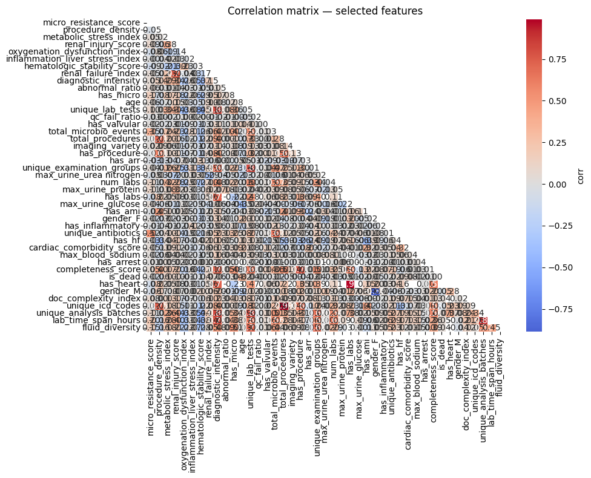
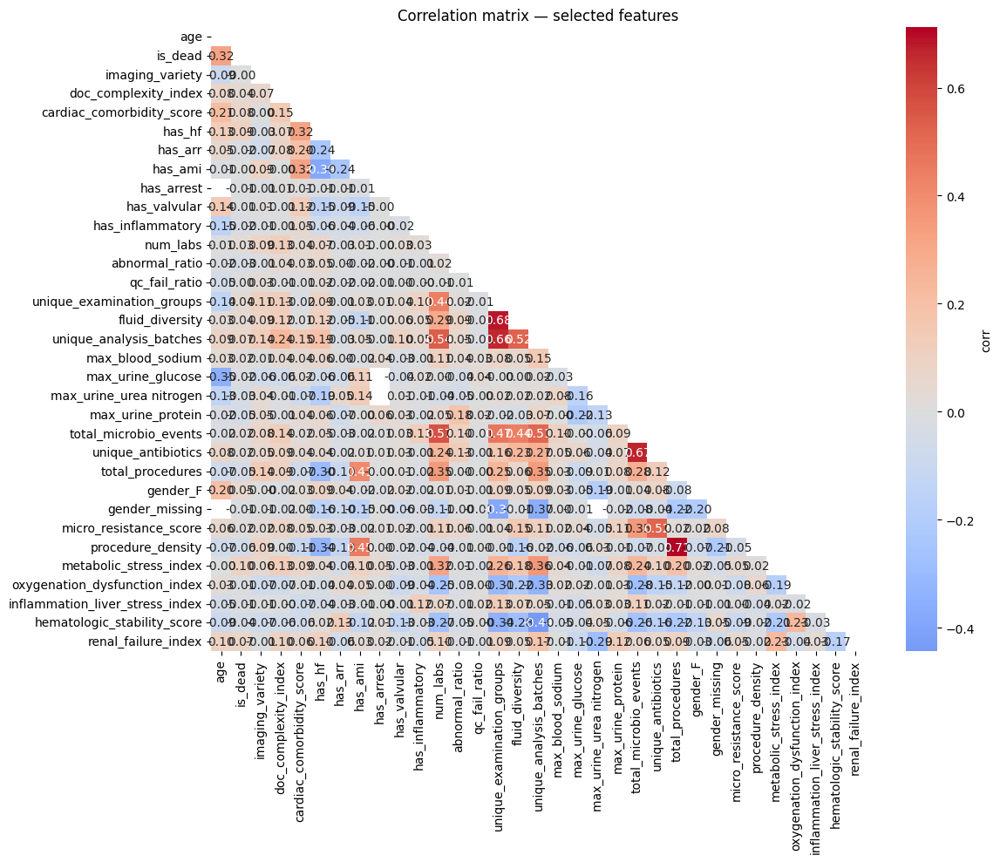
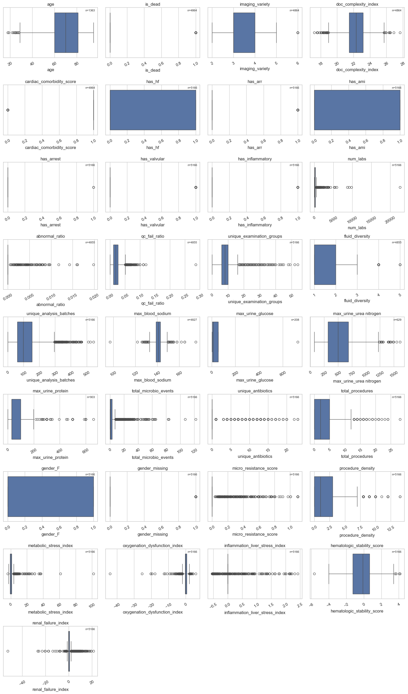

```python
%matplotlib inline
import math
import re
import numpy as np
import pandas as pd
import scipy.stats as stats
import matplotlib.pyplot as plt
import matplotlib.pyplot as plt
import seaborn as sns
import os
import re

from collections import defaultdict
from scipy.stats import pearsonr
import pandas as pd
from IPython.display import display
```

# Load calc agg features


```python
from pathlib import Path
# Set up file paths
notebook_dir = Path.cwd().resolve()
data_save_path = (notebook_dir / '..' /  'Data').resolve()

print(f"Data path: {data_save_path}")
```

    Data path: Y:\Studium\3. Sem UniPI\Data Analytics 4 digital Health\data_analytics_4_health_unipi\Data
    


```python
DATA_DIR = (notebook_dir / '..' /  '..' /  'Data').resolve()
print(DATA_DIR)

DATASETS = {
    "heart_diagnoses_1": "heart_diagnoses_1.csv",
    "laboratory_events_codes_2": "laboratory_events_codes_2.csv",
    "microbiology_events_codes_3": "microbiology_events_codes_3.csv",
    "procedure_code_4": "procedure_code_4.csv",
}
```

    Y:\Studium\3. Sem UniPI\Data Analytics 4 digital Health\Data
    


```python
paths = [f"{DATA_DIR}/{DATASETS[dataset].replace('.csv', '_agg_features.csv')}" for dataset in DATASETS.keys()]
dfs = [pd.read_csv(Path(path)) for path in paths]
len(dfs), 
```


    (4,)


```python
for df, name in zip(dfs, DATASETS.keys()):
    print(f"\nDataset: {name}")
    print("="*80)
    print(f"Shape: {df.shape}")
    print("Columns:")
    print(df.columns)
    display(df.head(2))
    display(df.describe())
```

    
    Dataset: heart_diagnoses_1
    ================================================================================
    Shape: (4864, 18)
    Columns:
    Index(['subject_id', 'hadm_id', 'gender', 'age', 'is_dead', 'charttime',
           'icd_code', 'icd_cat', 'imaging_variety', 'doc_complexity_index',
           'cardiac_comorbidity_score', 'has_heart', 'has_hf', 'has_arr',
           'has_ami', 'has_arrest', 'has_valvular', 'has_inflammatory'],
          dtype='object')
    


<div>
<style scoped>
    .dataframe tbody tr th:only-of-type {
        vertical-align: middle;
    }

    .dataframe tbody tr th {
        vertical-align: top;
    }

    .dataframe thead th {
        text-align: right;
    }
</style>
<table border="1" class="dataframe">
  <thead>
    <tr style="text-align: right;">
      <th></th>
      <th>subject_id</th>
      <th>hadm_id</th>
      <th>gender</th>
      <th>age</th>
      <th>is_dead</th>
      <th>charttime</th>
      <th>icd_code</th>
      <th>icd_cat</th>
      <th>imaging_variety</th>
      <th>doc_complexity_index</th>
      <th>cardiac_comorbidity_score</th>
      <th>has_heart</th>
      <th>has_hf</th>
      <th>has_arr</th>
      <th>has_ami</th>
      <th>has_arrest</th>
      <th>has_valvular</th>
      <th>has_inflammatory</th>
    </tr>
  </thead>
  <tbody>
    <tr>
      <th>0</th>
      <td>10000980</td>
      <td>26913865</td>
      <td>F</td>
      <td>75.0</td>
      <td>1</td>
      <td>2189-07-04 03:00:00</td>
      <td>I21</td>
      <td>acute_mi</td>
      <td>4</td>
      <td>21.972737</td>
      <td>1</td>
      <td>1</td>
      <td>0</td>
      <td>0</td>
      <td>1</td>
      <td>0</td>
      <td>0</td>
      <td>0</td>
    </tr>
    <tr>
      <th>1</th>
      <td>10000980</td>
      <td>29654838</td>
      <td>F</td>
      <td>75.0</td>
      <td>1</td>
      <td>2188-01-06 03:00:00</td>
      <td>I50</td>
      <td>heart_failure</td>
      <td>3</td>
      <td>23.273517</td>
      <td>1</td>
      <td>1</td>
      <td>1</td>
      <td>0</td>
      <td>0</td>
      <td>0</td>
      <td>0</td>
      <td>0</td>
    </tr>
  </tbody>
</table>
</div>


<div>
<style scoped>
    .dataframe tbody tr th:only-of-type {
        vertical-align: middle;
    }

    .dataframe tbody tr th {
        vertical-align: top;
    }

    .dataframe thead th {
        text-align: right;
    }
</style>
<table border="1" class="dataframe">
  <thead>
    <tr style="text-align: right;">
      <th></th>
      <th>subject_id</th>
      <th>hadm_id</th>
      <th>age</th>
      <th>is_dead</th>
      <th>imaging_variety</th>
      <th>doc_complexity_index</th>
      <th>cardiac_comorbidity_score</th>
      <th>has_heart</th>
      <th>has_hf</th>
      <th>has_arr</th>
      <th>has_ami</th>
      <th>has_arrest</th>
      <th>has_valvular</th>
      <th>has_inflammatory</th>
    </tr>
  </thead>
  <tbody>
    <tr>
      <th>count</th>
      <td>4.864000e+03</td>
      <td>4.864000e+03</td>
      <td>1363.000000</td>
      <td>4864.000000</td>
      <td>4864.000000</td>
      <td>4864.000000</td>
      <td>4864.000000</td>
      <td>4864.0</td>
      <td>4864.000000</td>
      <td>4864.000000</td>
      <td>4864.000000</td>
      <td>4864.000000</td>
      <td>4864.000000</td>
      <td>4864.000000</td>
    </tr>
    <tr>
      <th>mean</th>
      <td>1.510717e+07</td>
      <td>2.501745e+07</td>
      <td>68.978723</td>
      <td>0.081826</td>
      <td>3.297081</td>
      <td>22.306007</td>
      <td>0.802220</td>
      <td>1.0</td>
      <td>0.297492</td>
      <td>0.139391</td>
      <td>0.295847</td>
      <td>0.000411</td>
      <td>0.057977</td>
      <td>0.011102</td>
    </tr>
    <tr>
      <th>std</th>
      <td>2.938761e+06</td>
      <td>2.873736e+06</td>
      <td>14.973358</td>
      <td>0.274127</td>
      <td>0.529166</td>
      <td>1.271144</td>
      <td>0.398366</td>
      <td>0.0</td>
      <td>0.457202</td>
      <td>0.346390</td>
      <td>0.456470</td>
      <td>0.020276</td>
      <td>0.233724</td>
      <td>0.104790</td>
    </tr>
    <tr>
      <th>min</th>
      <td>1.000098e+07</td>
      <td>2.000446e+07</td>
      <td>18.000000</td>
      <td>0.000000</td>
      <td>2.000000</td>
      <td>17.229959</td>
      <td>0.000000</td>
      <td>1.0</td>
      <td>0.000000</td>
      <td>0.000000</td>
      <td>0.000000</td>
      <td>0.000000</td>
      <td>0.000000</td>
      <td>0.000000</td>
    </tr>
    <tr>
      <th>25%</th>
      <td>1.252385e+07</td>
      <td>2.260252e+07</td>
      <td>60.000000</td>
      <td>0.000000</td>
      <td>3.000000</td>
      <td>21.481264</td>
      <td>1.000000</td>
      <td>1.0</td>
      <td>0.000000</td>
      <td>0.000000</td>
      <td>0.000000</td>
      <td>0.000000</td>
      <td>0.000000</td>
      <td>0.000000</td>
    </tr>
    <tr>
      <th>50%</th>
      <td>1.507553e+07</td>
      <td>2.503238e+07</td>
      <td>70.000000</td>
      <td>0.000000</td>
      <td>3.000000</td>
      <td>22.309730</td>
      <td>1.000000</td>
      <td>1.0</td>
      <td>0.000000</td>
      <td>0.000000</td>
      <td>0.000000</td>
      <td>0.000000</td>
      <td>0.000000</td>
      <td>0.000000</td>
    </tr>
    <tr>
      <th>75%</th>
      <td>1.764939e+07</td>
      <td>2.746833e+07</td>
      <td>81.000000</td>
      <td>0.000000</td>
      <td>4.000000</td>
      <td>23.174916</td>
      <td>1.000000</td>
      <td>1.0</td>
      <td>1.000000</td>
      <td>0.000000</td>
      <td>1.000000</td>
      <td>0.000000</td>
      <td>0.000000</td>
      <td>0.000000</td>
    </tr>
    <tr>
      <th>max</th>
      <td>1.999860e+07</td>
      <td>2.999967e+07</td>
      <td>95.000000</td>
      <td>1.000000</td>
      <td>6.000000</td>
      <td>27.656885</td>
      <td>1.000000</td>
      <td>1.0</td>
      <td>1.000000</td>
      <td>1.000000</td>
      <td>1.000000</td>
      <td>1.000000</td>
      <td>1.000000</td>
      <td>1.000000</td>
    </tr>
  </tbody>
</table>
</div>


    
    Dataset: laboratory_events_codes_2
    ================================================================================
    Shape: (4855, 34)
    Columns:
    Index(['subject_id', 'hadm_id', 'num_labs', 'abnormal_ratio', 'qc_fail_ratio',
           'lab_time_span_hours', 'unique_lab_tests', 'unique_examination_groups',
           'fluid_diversity', 'unique_analysis_batches', 'has_labs',
           'max_blood_glucose', 'max_blood_lactate', 'max_blood_anion gap',
           'max_blood_creatinine', 'max_blood_urea nitrogen',
           'max_blood_potassium', 'max_blood_sodium', 'min_blood_hemoglobin',
           'min_blood_hematocrit', 'max_blood_c-reactive protein',
           'max_urine_glucose', 'max_urine_creatinine', 'max_urine_urea nitrogen',
           'max_urine_sodium', 'max_urine_protein', 'max_gas_pO2', 'max_gas_pCO2',
           'max_gas_pH', 'max_gas_base excess', 'count_cbc', 'count_blood_gas',
           'count_liver', 'count_cardiac'],
          dtype='object')
    


<div>
<style scoped>
    .dataframe tbody tr th:only-of-type {
        vertical-align: middle;
    }

    .dataframe tbody tr th {
        vertical-align: top;
    }

    .dataframe thead th {
        text-align: right;
    }
</style>
<table border="1" class="dataframe">
  <thead>
    <tr style="text-align: right;">
      <th></th>
      <th>subject_id</th>
      <th>hadm_id</th>
      <th>num_labs</th>
      <th>abnormal_ratio</th>
      <th>qc_fail_ratio</th>
      <th>lab_time_span_hours</th>
      <th>unique_lab_tests</th>
      <th>unique_examination_groups</th>
      <th>fluid_diversity</th>
      <th>unique_analysis_batches</th>
      <th>...</th>
      <th>max_urine_sodium</th>
      <th>max_urine_protein</th>
      <th>max_gas_pO2</th>
      <th>max_gas_pCO2</th>
      <th>max_gas_pH</th>
      <th>max_gas_base excess</th>
      <th>count_cbc</th>
      <th>count_blood_gas</th>
      <th>count_liver</th>
      <th>count_cardiac</th>
    </tr>
  </thead>
  <tbody>
    <tr>
      <th>0</th>
      <td>10000980</td>
      <td>26913865.0</td>
      <td>166</td>
      <td>0.0</td>
      <td>0.024096</td>
      <td>140.466667</td>
      <td>45</td>
      <td>12</td>
      <td>1</td>
      <td>136</td>
      <td>...</td>
      <td>NaN</td>
      <td>NaN</td>
      <td>NaN</td>
      <td>NaN</td>
      <td>73.2000</td>
      <td>NaN</td>
      <td>59.0</td>
      <td>0.0</td>
      <td>7.0</td>
      <td>10.0</td>
    </tr>
    <tr>
      <th>1</th>
      <td>10000980</td>
      <td>29654838.0</td>
      <td>59</td>
      <td>0.0</td>
      <td>0.000000</td>
      <td>33.433333</td>
      <td>35</td>
      <td>8</td>
      <td>1</td>
      <td>53</td>
      <td>...</td>
      <td>NaN</td>
      <td>NaN</td>
      <td>NaN</td>
      <td>NaN</td>
      <td>1.7119</td>
      <td>NaN</td>
      <td>18.0</td>
      <td>0.0</td>
      <td>2.0</td>
      <td>7.0</td>
    </tr>
  </tbody>
</table>
<p>2 rows × 34 columns</p>
</div>


<div>
<style scoped>
    .dataframe tbody tr th:only-of-type {
        vertical-align: middle;
    }

    .dataframe tbody tr th {
        vertical-align: top;
    }

    .dataframe thead th {
        text-align: right;
    }
</style>
<table border="1" class="dataframe">
  <thead>
    <tr style="text-align: right;">
      <th></th>
      <th>subject_id</th>
      <th>hadm_id</th>
      <th>num_labs</th>
      <th>abnormal_ratio</th>
      <th>qc_fail_ratio</th>
      <th>lab_time_span_hours</th>
      <th>unique_lab_tests</th>
      <th>unique_examination_groups</th>
      <th>fluid_diversity</th>
      <th>unique_analysis_batches</th>
      <th>...</th>
      <th>max_urine_sodium</th>
      <th>max_urine_protein</th>
      <th>max_gas_pO2</th>
      <th>max_gas_pCO2</th>
      <th>max_gas_pH</th>
      <th>max_gas_base excess</th>
      <th>count_cbc</th>
      <th>count_blood_gas</th>
      <th>count_liver</th>
      <th>count_cardiac</th>
    </tr>
  </thead>
  <tbody>
    <tr>
      <th>count</th>
      <td>4.855000e+03</td>
      <td>4.855000e+03</td>
      <td>4855.000000</td>
      <td>4855.000000</td>
      <td>4855.000000</td>
      <td>4855.000000</td>
      <td>4855.000000</td>
      <td>4855.000000</td>
      <td>4855.000000</td>
      <td>4855.000000</td>
      <td>...</td>
      <td>676.000000</td>
      <td>903.000000</td>
      <td>1202.000000</td>
      <td>1197.000000</td>
      <td>4713.000000</td>
      <td>1203.000000</td>
      <td>4855.000000</td>
      <td>4855.000000</td>
      <td>4855.000000</td>
      <td>4855.000000</td>
    </tr>
    <tr>
      <th>mean</th>
      <td>1.510805e+07</td>
      <td>2.501709e+07</td>
      <td>240.493306</td>
      <td>0.000086</td>
      <td>0.020154</td>
      <td>115.134343</td>
      <td>47.647168</td>
      <td>9.218332</td>
      <td>1.552626</td>
      <td>119.398764</td>
      <td>...</td>
      <td>57.590237</td>
      <td>85.225692</td>
      <td>26.367305</td>
      <td>6.441000</td>
      <td>59.284682</td>
      <td>2.929343</td>
      <td>69.267971</td>
      <td>23.490834</td>
      <td>5.736972</td>
      <td>7.646344</td>
    </tr>
    <tr>
      <th>std</th>
      <td>2.939544e+06</td>
      <td>2.874953e+06</td>
      <td>513.277369</td>
      <td>0.000800</td>
      <td>0.014587</td>
      <td>111.872999</td>
      <td>21.559055</td>
      <td>5.192832</td>
      <td>0.645785</td>
      <td>72.279992</td>
      <td>...</td>
      <td>33.727525</td>
      <td>113.275414</td>
      <td>18.725899</td>
      <td>1.798151</td>
      <td>105.428314</td>
      <td>5.146037</td>
      <td>121.124737</td>
      <td>164.087887</td>
      <td>20.387880</td>
      <td>9.589104</td>
    </tr>
    <tr>
      <th>min</th>
      <td>1.000098e+07</td>
      <td>2.000446e+07</td>
      <td>3.000000</td>
      <td>0.000000</td>
      <td>0.000000</td>
      <td>0.000000</td>
      <td>3.000000</td>
      <td>1.000000</td>
      <td>1.000000</td>
      <td>3.000000</td>
      <td>...</td>
      <td>10.000000</td>
      <td>0.100000</td>
      <td>2.261000</td>
      <td>3.059000</td>
      <td>0.516800</td>
      <td>-15.000000</td>
      <td>0.000000</td>
      <td>0.000000</td>
      <td>0.000000</td>
      <td>0.000000</td>
    </tr>
    <tr>
      <th>25%</th>
      <td>1.251722e+07</td>
      <td>2.260072e+07</td>
      <td>79.000000</td>
      <td>0.000000</td>
      <td>0.011236</td>
      <td>44.233333</td>
      <td>31.000000</td>
      <td>6.000000</td>
      <td>1.000000</td>
      <td>67.000000</td>
      <td>...</td>
      <td>29.000000</td>
      <td>30.000000</td>
      <td>10.640000</td>
      <td>5.320000</td>
      <td>1.356600</td>
      <td>0.000000</td>
      <td>27.000000</td>
      <td>0.000000</td>
      <td>0.000000</td>
      <td>3.000000</td>
    </tr>
    <tr>
      <th>50%</th>
      <td>1.507734e+07</td>
      <td>2.503202e+07</td>
      <td>136.000000</td>
      <td>0.000000</td>
      <td>0.019002</td>
      <td>81.100000</td>
      <td>43.000000</td>
      <td>8.000000</td>
      <td>1.000000</td>
      <td>103.000000</td>
      <td>...</td>
      <td>54.000000</td>
      <td>30.000000</td>
      <td>19.152000</td>
      <td>6.118000</td>
      <td>60.200000</td>
      <td>2.000000</td>
      <td>42.000000</td>
      <td>0.000000</td>
      <td>0.000000</td>
      <td>6.000000</td>
    </tr>
    <tr>
      <th>75%</th>
      <td>1.765293e+07</td>
      <td>2.746949e+07</td>
      <td>259.000000</td>
      <td>0.000000</td>
      <td>0.027141</td>
      <td>149.150000</td>
      <td>60.000000</td>
      <td>11.000000</td>
      <td>2.000000</td>
      <td>158.000000</td>
      <td>...</td>
      <td>81.000000</td>
      <td>100.000000</td>
      <td>43.191750</td>
      <td>7.182000</td>
      <td>85.000000</td>
      <td>5.000000</td>
      <td>80.000000</td>
      <td>6.000000</td>
      <td>5.000000</td>
      <td>10.000000</td>
    </tr>
    <tr>
      <th>max</th>
      <td>1.999860e+07</td>
      <td>2.999967e+07</td>
      <td>22580.000000</td>
      <td>0.019802</td>
      <td>0.285714</td>
      <td>1257.800000</td>
      <td>175.000000</td>
      <td>54.000000</td>
      <td>5.000000</td>
      <td>543.000000</td>
      <td>...</td>
      <td>212.000000</td>
      <td>660.000000</td>
      <td>73.017000</td>
      <td>19.152000</td>
      <td>3825.000000</td>
      <td>33.000000</td>
      <td>4840.000000</td>
      <td>8875.000000</td>
      <td>910.000000</td>
      <td>240.000000</td>
    </tr>
  </tbody>
</table>
<p>8 rows × 34 columns</p>
</div>


    
    Dataset: microbiology_events_codes_3
    ================================================================================
    Shape: (2756, 8)
    Columns:
    Index(['subject_id', 'hadm_id', 'has_micro', 'total_microbio_events',
           'unique_specimen_types', 'unique_organisms', 'resistant_ratio',
           'unique_antibiotics'],
          dtype='object')
    


<div>
<style scoped>
    .dataframe tbody tr th:only-of-type {
        vertical-align: middle;
    }

    .dataframe tbody tr th {
        vertical-align: top;
    }

    .dataframe thead th {
        text-align: right;
    }
</style>
<table border="1" class="dataframe">
  <thead>
    <tr style="text-align: right;">
      <th></th>
      <th>subject_id</th>
      <th>hadm_id</th>
      <th>has_micro</th>
      <th>total_microbio_events</th>
      <th>unique_specimen_types</th>
      <th>unique_organisms</th>
      <th>resistant_ratio</th>
      <th>unique_antibiotics</th>
    </tr>
  </thead>
  <tbody>
    <tr>
      <th>0</th>
      <td>10000980</td>
      <td>26913865</td>
      <td>1</td>
      <td>1</td>
      <td>1</td>
      <td>0</td>
      <td>0.0</td>
      <td>0</td>
    </tr>
    <tr>
      <th>1</th>
      <td>10002155</td>
      <td>23822395</td>
      <td>1</td>
      <td>12</td>
      <td>4</td>
      <td>0</td>
      <td>0.0</td>
      <td>0</td>
    </tr>
  </tbody>
</table>
</div>


<div>
<style scoped>
    .dataframe tbody tr th:only-of-type {
        vertical-align: middle;
    }

    .dataframe tbody tr th {
        vertical-align: top;
    }

    .dataframe thead th {
        text-align: right;
    }
</style>
<table border="1" class="dataframe">
  <thead>
    <tr style="text-align: right;">
      <th></th>
      <th>subject_id</th>
      <th>hadm_id</th>
      <th>has_micro</th>
      <th>total_microbio_events</th>
      <th>unique_specimen_types</th>
      <th>unique_organisms</th>
      <th>resistant_ratio</th>
      <th>unique_antibiotics</th>
    </tr>
  </thead>
  <tbody>
    <tr>
      <th>count</th>
      <td>2.756000e+03</td>
      <td>2.756000e+03</td>
      <td>2756.0</td>
      <td>2756.000000</td>
      <td>2756.000000</td>
      <td>2756.000000</td>
      <td>2756.000000</td>
      <td>2756.000000</td>
    </tr>
    <tr>
      <th>mean</th>
      <td>1.561649e+07</td>
      <td>2.503819e+07</td>
      <td>1.0</td>
      <td>5.655298</td>
      <td>2.033745</td>
      <td>0.356313</td>
      <td>0.022155</td>
      <td>1.425617</td>
    </tr>
    <tr>
      <th>std</th>
      <td>3.105062e+06</td>
      <td>2.879683e+06</td>
      <td>0.0</td>
      <td>8.387583</td>
      <td>1.431543</td>
      <td>0.715932</td>
      <td>0.097512</td>
      <td>3.740287</td>
    </tr>
    <tr>
      <th>min</th>
      <td>1.000098e+07</td>
      <td>2.000790e+07</td>
      <td>1.0</td>
      <td>1.000000</td>
      <td>1.000000</td>
      <td>0.000000</td>
      <td>0.000000</td>
      <td>0.000000</td>
    </tr>
    <tr>
      <th>25%</th>
      <td>1.294230e+07</td>
      <td>2.262280e+07</td>
      <td>1.0</td>
      <td>1.000000</td>
      <td>1.000000</td>
      <td>0.000000</td>
      <td>0.000000</td>
      <td>0.000000</td>
    </tr>
    <tr>
      <th>50%</th>
      <td>1.569462e+07</td>
      <td>2.506436e+07</td>
      <td>1.0</td>
      <td>2.500000</td>
      <td>2.000000</td>
      <td>0.000000</td>
      <td>0.000000</td>
      <td>0.000000</td>
    </tr>
    <tr>
      <th>75%</th>
      <td>1.847125e+07</td>
      <td>2.752187e+07</td>
      <td>1.0</td>
      <td>7.000000</td>
      <td>3.000000</td>
      <td>1.000000</td>
      <td>0.000000</td>
      <td>0.000000</td>
    </tr>
    <tr>
      <th>max</th>
      <td>1.999767e+07</td>
      <td>2.999967e+07</td>
      <td>1.0</td>
      <td>122.000000</td>
      <td>15.000000</td>
      <td>9.000000</td>
      <td>1.000000</td>
      <td>23.000000</td>
    </tr>
  </tbody>
</table>
</div>


    
    Dataset: procedure_code_4
    ================================================================================
    Shape: (3459, 6)
    Columns:
    Index(['subject_id', 'hadm_id', 'has_procedure', 'total_procedures',
           'unique_icd_codes', 'procedure_span_days'],
          dtype='object')
    


<div>
<style scoped>
    .dataframe tbody tr th:only-of-type {
        vertical-align: middle;
    }

    .dataframe tbody tr th {
        vertical-align: top;
    }

    .dataframe thead th {
        text-align: right;
    }
</style>
<table border="1" class="dataframe">
  <thead>
    <tr style="text-align: right;">
      <th></th>
      <th>subject_id</th>
      <th>hadm_id</th>
      <th>has_procedure</th>
      <th>total_procedures</th>
      <th>unique_icd_codes</th>
      <th>procedure_span_days</th>
    </tr>
  </thead>
  <tbody>
    <tr>
      <th>0</th>
      <td>10000980</td>
      <td>26913865</td>
      <td>1</td>
      <td>7</td>
      <td>7</td>
      <td>0.0</td>
    </tr>
    <tr>
      <th>1</th>
      <td>10002013</td>
      <td>24760295</td>
      <td>1</td>
      <td>2</td>
      <td>2</td>
      <td>0.0</td>
    </tr>
  </tbody>
</table>
</div>


<div>
<style scoped>
    .dataframe tbody tr th:only-of-type {
        vertical-align: middle;
    }

    .dataframe tbody tr th {
        vertical-align: top;
    }

    .dataframe thead th {
        text-align: right;
    }
</style>
<table border="1" class="dataframe">
  <thead>
    <tr style="text-align: right;">
      <th></th>
      <th>subject_id</th>
      <th>hadm_id</th>
      <th>has_procedure</th>
      <th>total_procedures</th>
      <th>unique_icd_codes</th>
      <th>procedure_span_days</th>
    </tr>
  </thead>
  <tbody>
    <tr>
      <th>count</th>
      <td>3.459000e+03</td>
      <td>3.459000e+03</td>
      <td>3459.0</td>
      <td>3459.000000</td>
      <td>3459.000000</td>
      <td>3459.000000</td>
    </tr>
    <tr>
      <th>mean</th>
      <td>1.499381e+07</td>
      <td>2.502943e+07</td>
      <td>1.0</td>
      <td>4.191096</td>
      <td>4.058398</td>
      <td>1.442324</td>
    </tr>
    <tr>
      <th>std</th>
      <td>2.868527e+06</td>
      <td>2.853466e+06</td>
      <td>0.0</td>
      <td>2.989024</td>
      <td>2.717689</td>
      <td>3.541510</td>
    </tr>
    <tr>
      <th>min</th>
      <td>1.000098e+07</td>
      <td>2.000790e+07</td>
      <td>1.0</td>
      <td>1.000000</td>
      <td>1.000000</td>
      <td>0.000000</td>
    </tr>
    <tr>
      <th>25%</th>
      <td>1.249509e+07</td>
      <td>2.264270e+07</td>
      <td>1.0</td>
      <td>2.000000</td>
      <td>2.000000</td>
      <td>0.000000</td>
    </tr>
    <tr>
      <th>50%</th>
      <td>1.495295e+07</td>
      <td>2.506423e+07</td>
      <td>1.0</td>
      <td>3.000000</td>
      <td>3.000000</td>
      <td>0.000000</td>
    </tr>
    <tr>
      <th>75%</th>
      <td>1.747168e+07</td>
      <td>2.747180e+07</td>
      <td>1.0</td>
      <td>6.000000</td>
      <td>6.000000</td>
      <td>1.000000</td>
    </tr>
    <tr>
      <th>max</th>
      <td>1.999850e+07</td>
      <td>2.999967e+07</td>
      <td>1.0</td>
      <td>28.000000</td>
      <td>21.000000</td>
      <td>43.000000</td>
    </tr>
  </tbody>
</table>
</div>


# Merge


```python
from functools import reduce

# Merge all on ['subject_id', 'hadm_id']
patient_profile = reduce(
    lambda left, right: pd.merge(left, right, on=['subject_id', 'hadm_id'], how='outer'),
    dfs
)
```


```python
len(patient_profile.columns), patient_profile.columns
```


    (60,
     Index(['subject_id', 'hadm_id', 'gender', 'age', 'is_dead', 'charttime',
            'icd_code', 'icd_cat', 'imaging_variety', 'doc_complexity_index',
            'cardiac_comorbidity_score', 'has_heart', 'has_hf', 'has_arr',
            'has_ami', 'has_arrest', 'has_valvular', 'has_inflammatory', 'num_labs',
            'abnormal_ratio', 'qc_fail_ratio', 'lab_time_span_hours',
            'unique_lab_tests', 'unique_examination_groups', 'fluid_diversity',
            'unique_analysis_batches', 'has_labs', 'max_blood_glucose',
            'max_blood_lactate', 'max_blood_anion gap', 'max_blood_creatinine',
            'max_blood_urea nitrogen', 'max_blood_potassium', 'max_blood_sodium',
            'min_blood_hemoglobin', 'min_blood_hematocrit',
            'max_blood_c-reactive protein', 'max_urine_glucose',
            'max_urine_creatinine', 'max_urine_urea nitrogen', 'max_urine_sodium',
            'max_urine_protein', 'max_gas_pO2', 'max_gas_pCO2', 'max_gas_pH',
            'max_gas_base excess', 'count_cbc', 'count_blood_gas', 'count_liver',
            'count_cardiac', 'has_micro', 'total_microbio_events',
            'unique_specimen_types', 'unique_organisms', 'resistant_ratio',
            'unique_antibiotics', 'has_procedure', 'total_procedures',
            'unique_icd_codes', 'procedure_span_days'],
           dtype='object'))


```python
# Targeted NA handling
has_columns = [col for col in patient_profile.columns if col.startswith('has_')]

print(has_columns)
# Fill indicators with 0 (absent)
patient_profile[has_columns] = patient_profile[has_columns].fillna(0).astype(int)
```

    ['has_heart', 'has_hf', 'has_arr', 'has_ami', 'has_arrest', 'has_valvular', 'has_inflammatory', 'has_labs', 'has_micro', 'has_procedure']
    


```python
# Identify numeric columns (exclude ids/flags)
numeric_cols = [c for c in patient_profile.select_dtypes(include='number').columns
                if c not in ('subject_id', 'hadm_id')]

# Heuristic: detect count-like columns and fill zeros when corresponding has_* indicates absence
count_like_keywords = ('num_', 'total_', 'unique_', 'count', '_count')
count_cols = [c for c in numeric_cols if any(k in c for k in count_like_keywords)]
count_cols
```


    ['num_labs',
     'unique_lab_tests',
     'unique_examination_groups',
     'unique_analysis_batches',
     'count_cbc',
     'count_blood_gas',
     'count_liver',
     'count_cardiac',
     'total_microbio_events',
     'unique_specimen_types',
     'unique_organisms',
     'unique_antibiotics',
     'total_procedures',
     'unique_icd_codes']


```python
# mapping heuristics from feature name -> has_ flag (extend if needed)
map_keywords = {
    'lab': 'has_labs',
    'micro': 'has_micro',
    'procedure': 'has_procedure',
    'proc': 'has_procedure',
    'note': 'has_heart',
}

for col in count_cols:
    filled = False
    lname = col.lower()
    for key, has_flag in map_keywords.items():
        if key in lname and has_flag in patient_profile.columns:
            patient_profile.loc[patient_profile[has_flag] == 0, col] = 0
            filled = True
            break
    if not filled:
        # safe fallback: fill remaining NaNs with 0 (counts mean absence)
        patient_profile[col] = patient_profile[col].fillna(0)

# Measurements / statistics: keep NaN but create missing indicators
exclude_from_measure = set(count_cols) | set(has_cols) | {'subject_id', 'hadm_id'}
measurement_cols = [c for c in numeric_cols if c not in exclude_from_measure and c != 'is_dead']

for c in measurement_cols:
    patient_profile[c + '_missing'] = patient_profile[c].isna().astype(int)
```


    ---------------------------------------------------------------------------

    NameError                                 Traceback (most recent call last)

    Cell In[10], line 23
         20         patient_profile[col] = patient_profile[col].fillna(0)
         22 # Measurements / statistics: keep NaN but create missing indicators
    ---> 23 exclude_from_measure = set(count_cols) | set(has_cols) | {'subject_id', 'hadm_id'}
         24 measurement_cols = [c for c in numeric_cols if c not in exclude_from_measure and c != 'is_dead']
         26 for c in measurement_cols:
    

    NameError: name 'has_cols' is not defined


```python
patient_profile.describe()
```


<div>
<style scoped>
    .dataframe tbody tr th:only-of-type {
        vertical-align: middle;
    }

    .dataframe tbody tr th {
        vertical-align: top;
    }

    .dataframe thead th {
        text-align: right;
    }
</style>
<table border="1" class="dataframe">
  <thead>
    <tr style="text-align: right;">
      <th></th>
      <th>subject_id</th>
      <th>hadm_id</th>
      <th>age</th>
      <th>is_dead</th>
      <th>imaging_variety</th>
      <th>doc_complexity_index</th>
      <th>cardiac_comorbidity_score</th>
      <th>has_heart</th>
      <th>has_hf</th>
      <th>has_arr</th>
      <th>...</th>
      <th>max_urine_creatinine_missing_missing</th>
      <th>max_urine_urea nitrogen_missing_missing</th>
      <th>max_urine_sodium_missing_missing</th>
      <th>max_urine_protein_missing_missing</th>
      <th>max_gas_pO2_missing_missing</th>
      <th>max_gas_pCO2_missing_missing</th>
      <th>max_gas_pH_missing_missing</th>
      <th>max_gas_base excess_missing_missing</th>
      <th>resistant_ratio_missing_missing</th>
      <th>procedure_span_days_missing_missing</th>
    </tr>
  </thead>
  <tbody>
    <tr>
      <th>count</th>
      <td>5.166000e+03</td>
      <td>5.166000e+03</td>
      <td>1363.000000</td>
      <td>4864.000000</td>
      <td>4864.000000</td>
      <td>4864.000000</td>
      <td>4864.000000</td>
      <td>5166.000000</td>
      <td>5166.000000</td>
      <td>5166.000000</td>
      <td>...</td>
      <td>5166.0</td>
      <td>5166.0</td>
      <td>5166.0</td>
      <td>5166.0</td>
      <td>5166.0</td>
      <td>5166.0</td>
      <td>5166.0</td>
      <td>5166.0</td>
      <td>5166.0</td>
      <td>5166.0</td>
    </tr>
    <tr>
      <th>mean</th>
      <td>1.539306e+07</td>
      <td>2.501832e+07</td>
      <td>68.978723</td>
      <td>0.081826</td>
      <td>3.297081</td>
      <td>22.306007</td>
      <td>0.802220</td>
      <td>0.941541</td>
      <td>0.280101</td>
      <td>0.131243</td>
      <td>...</td>
      <td>0.0</td>
      <td>0.0</td>
      <td>0.0</td>
      <td>0.0</td>
      <td>0.0</td>
      <td>0.0</td>
      <td>0.0</td>
      <td>0.0</td>
      <td>0.0</td>
      <td>0.0</td>
    </tr>
    <tr>
      <th>std</th>
      <td>3.073751e+06</td>
      <td>2.871364e+06</td>
      <td>14.973358</td>
      <td>0.274127</td>
      <td>0.529166</td>
      <td>1.271144</td>
      <td>0.398366</td>
      <td>0.234632</td>
      <td>0.449092</td>
      <td>0.337698</td>
      <td>...</td>
      <td>0.0</td>
      <td>0.0</td>
      <td>0.0</td>
      <td>0.0</td>
      <td>0.0</td>
      <td>0.0</td>
      <td>0.0</td>
      <td>0.0</td>
      <td>0.0</td>
      <td>0.0</td>
    </tr>
    <tr>
      <th>min</th>
      <td>1.000098e+07</td>
      <td>2.000446e+07</td>
      <td>18.000000</td>
      <td>0.000000</td>
      <td>2.000000</td>
      <td>17.229959</td>
      <td>0.000000</td>
      <td>0.000000</td>
      <td>0.000000</td>
      <td>0.000000</td>
      <td>...</td>
      <td>0.0</td>
      <td>0.0</td>
      <td>0.0</td>
      <td>0.0</td>
      <td>0.0</td>
      <td>0.0</td>
      <td>0.0</td>
      <td>0.0</td>
      <td>0.0</td>
      <td>0.0</td>
    </tr>
    <tr>
      <th>25%</th>
      <td>1.267767e+07</td>
      <td>2.261127e+07</td>
      <td>60.000000</td>
      <td>0.000000</td>
      <td>3.000000</td>
      <td>21.481264</td>
      <td>1.000000</td>
      <td>1.000000</td>
      <td>0.000000</td>
      <td>0.000000</td>
      <td>...</td>
      <td>0.0</td>
      <td>0.0</td>
      <td>0.0</td>
      <td>0.0</td>
      <td>0.0</td>
      <td>0.0</td>
      <td>0.0</td>
      <td>0.0</td>
      <td>0.0</td>
      <td>0.0</td>
    </tr>
    <tr>
      <th>50%</th>
      <td>1.539807e+07</td>
      <td>2.502269e+07</td>
      <td>70.000000</td>
      <td>0.000000</td>
      <td>3.000000</td>
      <td>22.309730</td>
      <td>1.000000</td>
      <td>1.000000</td>
      <td>0.000000</td>
      <td>0.000000</td>
      <td>...</td>
      <td>0.0</td>
      <td>0.0</td>
      <td>0.0</td>
      <td>0.0</td>
      <td>0.0</td>
      <td>0.0</td>
      <td>0.0</td>
      <td>0.0</td>
      <td>0.0</td>
      <td>0.0</td>
    </tr>
    <tr>
      <th>75%</th>
      <td>1.812905e+07</td>
      <td>2.746995e+07</td>
      <td>81.000000</td>
      <td>0.000000</td>
      <td>4.000000</td>
      <td>23.174916</td>
      <td>1.000000</td>
      <td>1.000000</td>
      <td>1.000000</td>
      <td>0.000000</td>
      <td>...</td>
      <td>0.0</td>
      <td>0.0</td>
      <td>0.0</td>
      <td>0.0</td>
      <td>0.0</td>
      <td>0.0</td>
      <td>0.0</td>
      <td>0.0</td>
      <td>0.0</td>
      <td>0.0</td>
    </tr>
    <tr>
      <th>max</th>
      <td>1.999860e+07</td>
      <td>2.999967e+07</td>
      <td>95.000000</td>
      <td>1.000000</td>
      <td>6.000000</td>
      <td>27.656885</td>
      <td>1.000000</td>
      <td>1.000000</td>
      <td>1.000000</td>
      <td>1.000000</td>
      <td>...</td>
      <td>0.0</td>
      <td>0.0</td>
      <td>0.0</td>
      <td>0.0</td>
      <td>0.0</td>
      <td>0.0</td>
      <td>0.0</td>
      <td>0.0</td>
      <td>0.0</td>
      <td>0.0</td>
    </tr>
  </tbody>
</table>
<p>8 rows × 126 columns</p>
</div>


```python
patient_profile.head()
```


<div>
<style scoped>
    .dataframe tbody tr th:only-of-type {
        vertical-align: middle;
    }

    .dataframe tbody tr th {
        vertical-align: top;
    }

    .dataframe thead th {
        text-align: right;
    }
</style>
<table border="1" class="dataframe">
  <thead>
    <tr style="text-align: right;">
      <th></th>
      <th>subject_id</th>
      <th>hadm_id</th>
      <th>gender</th>
      <th>age</th>
      <th>is_dead</th>
      <th>charttime</th>
      <th>icd_code</th>
      <th>icd_cat</th>
      <th>imaging_variety</th>
      <th>doc_complexity_index</th>
      <th>...</th>
      <th>max_urine_creatinine_missing</th>
      <th>max_urine_urea nitrogen_missing</th>
      <th>max_urine_sodium_missing</th>
      <th>max_urine_protein_missing</th>
      <th>max_gas_pO2_missing</th>
      <th>max_gas_pCO2_missing</th>
      <th>max_gas_pH_missing</th>
      <th>max_gas_base excess_missing</th>
      <th>resistant_ratio_missing</th>
      <th>procedure_span_days_missing</th>
    </tr>
  </thead>
  <tbody>
    <tr>
      <th>0</th>
      <td>10000980</td>
      <td>26913865</td>
      <td>F</td>
      <td>75.0</td>
      <td>1.0</td>
      <td>2189-07-04 03:00:00</td>
      <td>I21</td>
      <td>acute_mi</td>
      <td>4.0</td>
      <td>21.972737</td>
      <td>...</td>
      <td>1</td>
      <td>1</td>
      <td>1</td>
      <td>1</td>
      <td>1</td>
      <td>1</td>
      <td>0</td>
      <td>1</td>
      <td>0</td>
      <td>0</td>
    </tr>
    <tr>
      <th>1</th>
      <td>10000980</td>
      <td>29654838</td>
      <td>F</td>
      <td>75.0</td>
      <td>1.0</td>
      <td>2188-01-06 03:00:00</td>
      <td>I50</td>
      <td>heart_failure</td>
      <td>3.0</td>
      <td>23.273517</td>
      <td>...</td>
      <td>1</td>
      <td>1</td>
      <td>1</td>
      <td>1</td>
      <td>1</td>
      <td>1</td>
      <td>0</td>
      <td>1</td>
      <td>1</td>
      <td>1</td>
    </tr>
    <tr>
      <th>2</th>
      <td>10002013</td>
      <td>24760295</td>
      <td>F</td>
      <td>NaN</td>
      <td>0.0</td>
      <td>2160-07-13 03:00:00</td>
      <td>I21</td>
      <td>acute_mi</td>
      <td>4.0</td>
      <td>20.214975</td>
      <td>...</td>
      <td>1</td>
      <td>1</td>
      <td>1</td>
      <td>1</td>
      <td>1</td>
      <td>1</td>
      <td>0</td>
      <td>1</td>
      <td>1</td>
      <td>0</td>
    </tr>
    <tr>
      <th>3</th>
      <td>10002155</td>
      <td>23822395</td>
      <td>F</td>
      <td>NaN</td>
      <td>0.0</td>
      <td>2129-08-19 03:00:00</td>
      <td>I21</td>
      <td>acute_mi</td>
      <td>3.0</td>
      <td>22.286569</td>
      <td>...</td>
      <td>0</td>
      <td>0</td>
      <td>0</td>
      <td>1</td>
      <td>0</td>
      <td>0</td>
      <td>0</td>
      <td>0</td>
      <td>0</td>
      <td>0</td>
    </tr>
    <tr>
      <th>4</th>
      <td>10004457</td>
      <td>28723315</td>
      <td>M</td>
      <td>66.0</td>
      <td>0.0</td>
      <td>2141-08-14 03:00:00</td>
      <td>I35</td>
      <td>valvular</td>
      <td>3.0</td>
      <td>21.351221</td>
      <td>...</td>
      <td>1</td>
      <td>1</td>
      <td>1</td>
      <td>1</td>
      <td>1</td>
      <td>1</td>
      <td>0</td>
      <td>1</td>
      <td>1</td>
      <td>1</td>
    </tr>
  </tbody>
</table>
<p>5 rows × 95 columns</p>
</div>


# Completeness Analysis


```python
# Identify the 'has_' indicator columns
has_columns = [ 'has_heart', 'has_labs', 'has_micro', 'has_procedure']
print(f"Data source indicators: {has_columns}")
```

    Data source indicators: ['has_heart', 'has_labs', 'has_micro', 'has_procedure']
    


```python
# Completeness Matrix - Check which data sources are available for each patient
completeness = patient_profile[has_columns].copy()

# Summary statistics
print("\n" + "="*80)
print("COMPLETENESS SUMMARY")
print("="*80)

# Per-source completeness
print("\nPer-Source Availability:")
for col in has_columns:
    count = (patient_profile[col] == 1).sum()
    pct = count / len(patient_profile) * 100
    print(f"  {col}: {count:,} patients ({pct:.1f}%)")

# Combination completeness
print("\n" + "-"*80)
print("DATA SOURCE COMBINATIONS:")
print("-"*80)

# Create a combined key for each row
completeness['combination'] = completeness[has_columns].astype(int).astype(str).agg('-'.join, axis=1)
combo_counts = completeness['combination'].value_counts()

# Create readable labels
for combo, count in combo_counts.items():
    sources = [has_columns[i].replace('has_', '') for i, val in enumerate(combo.split('-')) if val == '1']
    sources_str = ', '.join(sources) if sources else 'None'
    pct = count / len(patient_profile) * 100
    print(f"  [{combo}] {sources_str}: {count:,} ({pct:.1f}%)")

# Visualization
fig, axes = plt.subplots(1, 3, figsize=(18, 5))

# Plot 1: Bar chart of individual source availability
ax1 = axes[0]
source_counts = [(col.replace('has_', ''), (patient_profile[col] == 1).sum()) for col in has_columns]
sources, counts = zip(*source_counts)
bars = ax1.bar(sources, counts, color=['#2ecc71', '#3498db', '#e74c3c', '#9b59b6'][:len(has_columns)])
ax1.set_ylabel('Number of Patients')
ax1.set_title('Data Source Availability', fontweight='bold')
ax1.set_xticklabels(sources, rotation=45, ha='right')
for bar, count in zip(bars, counts):
    ax1.text(bar.get_x() + bar.get_width()/2, bar.get_height() + 50, 
             f'{count:,}', ha='center', va='bottom', fontsize=9)

# Plot 2: Heatmap of co-occurrence
ax2 = axes[1]
cooccurrence = pd.DataFrame(index=has_columns, columns=has_columns, dtype=float)
for col1 in has_columns:
    for col2 in has_columns:
        both = ((patient_profile[col1] == 1) & (patient_profile[col2] == 1)).sum()
        cooccurrence.loc[col1, col2] = both

# Rename for display
cooccurrence.index = [c.replace('has_', '') for c in cooccurrence.index]
cooccurrence.columns = [c.replace('has_', '') for c in cooccurrence.columns]

sns.heatmap(cooccurrence.astype(float), annot=True, fmt='.0f', cmap='Blues', 
            ax=ax2, cbar_kws={'label': 'Patient Count'})
ax2.set_title('Data Source Co-occurrence', fontweight='bold')

# Plot 3: Completeness score distribution
ax3 = axes[2]
patient_profile['completeness_score'] = patient_profile[has_columns].sum(axis=1)
patient_profile['completeness_score'].value_counts().sort_index().plot(kind='bar', ax=ax3, color='#1abc9c')
ax3.set_xlabel('Number of Data Sources Available')
ax3.set_ylabel('Number of Patients')
ax3.set_title('Completeness Score Distribution', fontweight='bold')
ax3.set_xticklabels(ax3.get_xticklabels(), rotation=0)

plt.tight_layout()
plt.savefig(r'../plots/1.2_completeness_matrix.png', dpi=300, bbox_inches='tight')
plt.show()

# Final summary
print("\n" + "="*80)
print("COMPLETENESS SCORE SUMMARY")
print("="*80)
print(f"\nTotal patients: {len(patient_profile):,}")
print(f"Patients with ALL sources: {(patient_profile['completeness_score'] == len(has_columns)).sum():,}")
print(f"Patients with NO sources: {(patient_profile['completeness_score'] == 0).sum():,}")
print(f"Average sources per patient: {patient_profile['completeness_score'].mean():.2f}")
```

    
    ================================================================================
    COMPLETENESS SUMMARY
    ================================================================================
    
    Per-Source Availability:
      has_heart: 4,864 patients (94.2%)
      has_labs: 4,855 patients (94.0%)
      has_micro: 2,756 patients (53.3%)
      has_procedure: 3,459 patients (67.0%)
    
    --------------------------------------------------------------------------------
    DATA SOURCE COMBINATIONS:
    --------------------------------------------------------------------------------
      [1-1-1-1] heart, labs, micro, procedure: 1,932 (37.4%)
      [1-1-0-1] heart, labs, procedure: 1,525 (29.5%)
      [1-1-0-0] heart, labs: 876 (17.0%)
      [1-1-1-0] heart, labs, micro: 522 (10.1%)
      [0-0-1-0] micro: 302 (5.8%)
      [1-0-0-0] heart: 7 (0.1%)
      [1-0-0-1] heart, procedure: 2 (0.0%)
    

    C:\Users\dgars\AppData\Local\Temp\ipykernel_14308\1571333312.py:42: UserWarning: set_ticklabels() should only be used with a fixed number of ticks, i.e. after set_ticks() or using a FixedLocator.
      ax1.set_xticklabels(sources, rotation=45, ha='right')
    


    

    


    
    ================================================================================
    COMPLETENESS SCORE SUMMARY
    ================================================================================
    
    Total patients: 5,166
    Patients with ALL sources: 1,932
    Patients with NO sources: 0
    Average sources per patient: 3.08
    

## Encode gender


```python
patient_profile["gender"].value_counts(dropna=False)
```


    gender
    M      2841
    F      2017
    NaN     308
    Name: count, dtype: int64


```python
if 'patient_profile' in globals() and 'gender' in patient_profile.columns:
    g2 = patient_profile['gender'].astype(str).str.strip().str.upper()
    patient_profile['gender_F'] = (g2 == 'F').astype(int)
    patient_profile['gender_M'] = (g2 == 'M').astype(int)
    patient_profile['gender_missing'] = (~g2.isin(['F', 'M'])).astype(int)
    # drop any legacy encoding to avoid reuse
    patient_profile = patient_profile.drop(columns=['gender_enc'], errors='ignore')
    patient_profile = patient_profile.drop(columns=['gender'], errors='ignore')
```


```python
for col in ['gender_F', 'gender_M', 'gender_missing']:
    if col in patient_profile.columns:
        print(f"{col} counts:")
        display(patient_profile[col].value_counts(dropna=False))
```

    gender_F counts:
    


    gender_F
    0    3149
    1    2017
    Name: count, dtype: int64


    gender_M counts:
    


    gender_M
    1    2841
    0    2325
    Name: count, dtype: int64


    gender_missing counts:
    


    gender_missing
    0    4858
    1     308
    Name: count, dtype: int64


# Save big patient profile


```python
patient_profile.to_csv(os.path.join(DATA_DIR, "patient_profile_large.csv"), index=False)
```

# Corr


```python
patient_profile.columns
```


    Index(['subject_id', 'hadm_id', 'age', 'is_dead', 'charttime', 'icd_code',
           'icd_cat', 'imaging_variety', 'doc_complexity_index',
           'cardiac_comorbidity_score', 'has_heart', 'has_hf', 'has_arr',
           'has_ami', 'has_arrest', 'has_valvular', 'has_inflammatory', 'num_labs',
           'abnormal_ratio', 'qc_fail_ratio', 'lab_time_span_hours',
           'unique_lab_tests', 'unique_examination_groups', 'fluid_diversity',
           'unique_analysis_batches', 'has_labs', 'max_blood_glucose',
           'max_blood_lactate', 'max_blood_anion gap', 'max_blood_creatinine',
           'max_blood_urea nitrogen', 'max_blood_potassium', 'max_blood_sodium',
           'min_blood_hemoglobin', 'min_blood_hematocrit',
           'max_blood_c-reactive protein', 'max_urine_glucose',
           'max_urine_creatinine', 'max_urine_urea nitrogen', 'max_urine_sodium',
           'max_urine_protein', 'max_gas_pO2', 'max_gas_pCO2', 'max_gas_pH',
           'max_gas_base excess', 'count_cbc', 'count_blood_gas', 'count_liver',
           'count_cardiac', 'has_micro', 'total_microbio_events',
           'unique_specimen_types', 'unique_organisms', 'resistant_ratio',
           'unique_antibiotics', 'has_procedure', 'total_procedures',
           'unique_icd_codes', 'procedure_span_days', 'completeness_score',
           'gender_F', 'gender_M', 'gender_missing'],
          dtype='object')


```python
def corr_report(df, features, data_dir=None, plot_name='selected_features_corr.png', threshold=0.60, figsize=(12,10), show_plot=True):
    """
    Compute correlation matrix for given features in df, plot heatmap, and return correlations + high-corr pairs.
    ...
    """
    import os
    import matplotlib.pyplot as plt
    import seaborn as sns
    import numpy as np
    import pandas as pd

    # keep only existing requested cols
    sel = [c for c in features if c in df.columns]
    if not sel:
        raise ValueError("No requested features found in dataframe.")

    tmp = df[sel].copy()

    # one-hot encode gender into F/M/missing to avoid arbitrary numeric codes
    if 'gender' in tmp.columns:
        g = tmp['gender'].astype(str).str.strip().str.upper()
        tmp['gender_F'] = (g == 'F').astype(int)
        tmp['gender_M'] = (g == 'M').astype(int)
        tmp['gender_missing'] = (~g.isin(['F', 'M'])).astype(int)
        tmp = tmp.drop(columns=['gender'])

    # booleans -> int (FIXED: use vectorized approach)
    bool_cols = tmp.select_dtypes(include='bool').columns
    tmp[bool_cols] = tmp[bool_cols].astype(int)

    # select numeric columns only
    num_tmp = tmp.select_dtypes(include=[np.number]).copy()
    used_features = num_tmp.columns.tolist()
    if len(used_features) < 2:
        raise ValueError("Need at least two numeric features for correlation. Numeric found: " + ", ".join(used_features))

    # correlation
    corr_df = num_tmp.corr()

    # plot heatmap (mask upper triangle)
    plt.figure(figsize=figsize)
    mask = np.triu(np.ones_like(corr_df, dtype=bool))
    sns.heatmap(corr_df, mask=mask, annot=True, fmt='.2f', cmap='coolwarm', center=0,
                cbar_kws={'label':'corr'})
    plt.title('Correlation matrix — selected features')
    plt.tight_layout()

    # save
    if data_dir is None:
        save_dir = os.path.abspath('.')
    else:
        save_dir = data_dir
    plots_dir = os.path.join(save_dir, 'plots')
    os.makedirs(plots_dir, exist_ok=True)
    save_path = os.path.join(plots_dir, plot_name)
    plt.savefig(save_path, dpi=200, bbox_inches='tight')

    if show_plot:
        plt.show()
    else:
        plt.close()

    # extract high-correlation pairs (upper triangle only)
    cols = corr_df.columns.tolist()
    high_pairs = []
    for i in range(len(cols)):
        for j in range(i+1, len(cols)):
            val = corr_df.iloc[i, j]
            if pd.notna(val) and abs(val) >= threshold:
                high_pairs.append((cols[i], cols[j], float(val)))

    # print brief report
    print(f"Correlation matrix saved to: {save_path}")
    print(f"Numeric features used ({len(used_features)}): {used_features}")
    print(f"High-corr pairs (|r| >= {threshold}): {len(high_pairs)}")
    for a,b,v in sorted(high_pairs, key=lambda x: -abs(x[2])):
        print(f"  {a} <--> {b}  :  {v:.3f}")

    return corr_df, high_pairs, used_features
```


```python
#corr_df, high_pairs, used = corr_report(patient_profile, patient_profile.columns.tolist(), data_dir=DATA_DIR, threshold=0.80)
```

# Further select and compute combined features

Indicator,Formula
- Clinical Activity, mean(log1p(imaging, labs, micro, proc))
- Micro Resistance,resist_ratio * log1p(organisms + specimens)
- History Depth,log1p(hpi_length) + log1p(note_hours)
- Procedure Density,total_procedures / procedure_days
- Metabolic Stress,z(Glu) + z(Lac) + z(AnionGap) - z(Bicarb)
- Renal Injury,z(Cr) + z(BUN) + z(Phos) + z(K)
- Oxygenation,z(pCO2) - z(pO2) - z(pH) - z(BaseExcess)
- Liver/Inflam,z(CRP) + z(AST) + z(ALT) + z(LD)
- Hematologic,z(Hb) + z(Hct) + z(RBC) - z(RDW)
- Renal Failure,z(Serum_Cr) - z(Urine_Cr)
- Recentness,1 / (1 + days_since_last_adm)


```python
patient_profile.columns[:50]
```


    Index(['subject_id', 'hadm_id', 'age', 'is_dead', 'charttime', 'icd_code',
           'icd_cat', 'imaging_variety', 'doc_complexity_index',
           'cardiac_comorbidity_score', 'has_heart', 'has_hf', 'has_arr',
           'has_ami', 'has_arrest', 'has_valvular', 'has_inflammatory', 'num_labs',
           'abnormal_ratio', 'qc_fail_ratio', 'lab_time_span_hours',
           'unique_lab_tests', 'unique_examination_groups', 'fluid_diversity',
           'unique_analysis_batches', 'has_labs', 'max_blood_glucose',
           'max_blood_lactate', 'max_blood_anion gap', 'max_blood_creatinine',
           'max_blood_urea nitrogen', 'max_blood_potassium', 'max_blood_sodium',
           'min_blood_hemoglobin', 'min_blood_hematocrit',
           'max_blood_c-reactive protein', 'max_urine_glucose',
           'max_urine_creatinine', 'max_urine_urea nitrogen', 'max_urine_sodium',
           'max_urine_protein', 'max_gas_pO2', 'max_gas_pCO2', 'max_gas_pH',
           'max_gas_base excess', 'count_cbc', 'count_blood_gas', 'count_liver',
           'count_cardiac', 'has_micro'],
          dtype='object')


```python
def compute_indicators_and_run_corr(df, data_dir=None, save_plots=True, corr_threshold=0.70, figsize=(10,8)):
    d = df.copy()
    
    # --- Track components to exclude later ---
    # We will add any raw column used in a formula to this set
    found_components = set()

    # 2. Micro/Resistance Components
    micro_comps = ['resistant_ratio', 'unique_organisms', 'unique_specimen_types']
    for c in micro_comps:
        if c in d.columns:
            found_components.add(c)
    
    if 'resistant_ratio' in d.columns:
        rr = d['resistant_ratio'].fillna(0)
        uo = d['unique_organisms'].fillna(0) if 'unique_organisms' in d.columns else 0
        us = d['unique_specimen_types'].fillna(0) if 'unique_specimen_types' in d.columns else 0
        d['micro_resistance_score'] = rr * np.log1p(uo + us)


    # 4. Procedure Density Components
    if 'total_procedures' in d.columns:
        p_span = 'procedure_span_days'
        if p_span in d.columns: found_components.add(p_span)
        pdays = d[p_span].fillna(1) if p_span in d.columns else 1
        d['procedure_density'] = d['total_procedures'] / pdays.clip(lower=1)

    # 5. Diagnosis Components
    if 'n_diagnoses' in d.columns:
        found_components.add('n_diagnoses')
        d['diagnosis_burden'] = np.log1p(d['n_diagnoses'].fillna(0))

    # --- Analyte Composite Logic ---
    def first_existing(col_candidates):
        for c in col_candidates:
            if c in d.columns:
                return c
        return None

    def robust_z_series(s):
        s = pd.to_numeric(s, errors='coerce')
        med = s.median()
        iqr = s.quantile(0.75) - s.quantile(0.25)
        denom = iqr if iqr > 0 else (s.std() if s.std() > 0 else 1.0)
        return (s.fillna(med) - med) / (denom + 1e-9)

    analyte_candidates = {
        'glucose':       ['max_blood_glucose', 'max_glucose', 'mean_glucose'],
        'lactate':       ['max_blood_lactate', 'max_lactate', 'mean_lactate', 'lactate'],
        'anion_gap':     ['max_blood_anion gap', 'max_blood_anion_gap', 'max_anion_gap', 'anion_gap'],
        'bicarbonate':   ['max_blood_bicarbonate', 'max_bicarbonate', 'total_co2', 'bicarbonate'],
        'creatinine':    ['max_blood_creatinine', 'max_creatinine', 'creatinine'],
        'urea_nitrogen': ['max_blood_urea_nitrogen', 'max_blood_urea nitrogen', 'max_urea_nitrogen', 'bun'],
        'phosphate':     ['max_blood_phosphate', 'max_phosphate', 'phosphate'],
        'potassium':     ['max_blood_potassium', 'max_potassium', 'potassium'],
        'pO2':           ['max_gas_pO2', 'max_pO2', 'po2', 'pao2'],
        'pCO2':          ['max_gas_pCO2', 'max_pCO2', 'pco2', 'paco2'],
        'pH':            ['max_gas_pH', 'max_pH', 'ph'],
        'base_excess':   ['max_gas_base excess', 'max_gas_base_excess', 'max_base_excess', 'base_excess'],
        'crp':           ['max_blood_c-reactive protein', 'max_blood_c-reactive_protein', 'max_blood_crp', 'max_crp', 'c-reactive protein'],
        'ast':           ['max_blood_ast', 'max_ast', 'ast'],
        'alt':           ['max_blood_alt', 'max_alt', 'alt'],
        'ld':            ['max_blood_ld', 'max_ld', 'ldh'],
        'hemoglobin':    ['min_blood_hemoglobin', 'min_hemoglobin', 'hemoglobin'],
        'hematocrit':    ['min_blood_hematocrit', 'min_hematocrit', 'hematocrit'],
        'rbc':           ['min_blood_rbc', 'max_rbc', 'rbc'],
        'rdw':           ['max_blood_rdw', 'max_rdw', 'rdw'],
        'urine_creatinine': ['max_urine_creatinine', 'creatinine_urine'],
        'urine_sodium':     ['max_urine_sodium', 'sodium_urine']
    }

    # Prepare Z-series and track which specific component columns were used
    z = {}
    for analyte, candidates in analyte_candidates.items():
        col = first_existing(candidates)
        if col is not None:
            found_components.add(col) # Tracking the specific raw column
            z[analyte] = robust_z_series(d[col])
        else:
            z[analyte] = pd.Series(0.0, index=d.index)

    # --- Compute the "Old" Indicators ---
    d['metabolic_stress_index'] = z['glucose'] + z['lactate'] + z['anion_gap'] - z['bicarbonate']
    d['renal_injury_score'] = z['creatinine'] + z['urea_nitrogen'] + z['phosphate'] + z['potassium']
    d['oxygenation_dysfunction_index'] = -z['pO2'] + z['pCO2'] - z['pH'] - z['base_excess']
    d['inflammation_liver_stress_index'] = z['crp'] + z['ast'] + z['alt'] + z['ld']
    d['hematologic_stability_score'] = z['hemoglobin'] + z['hematocrit'] + z['rbc'] - z['rdw']

    # --- Compute the "New" Indicators ---
    if 'max_urine_creatinine' in d.columns:
        z_urine_creat = robust_z_series(d['max_urine_creatinine'])
        d['renal_failure_index'] = z['creatinine'] - z_urine_creat
    else:
        d['renal_failure_index'] = 0.0

    d['diagnostic_intensity'] = np.log1p(
        d.get('count_blood_gas', 0) + d.get('count_cardiac', 0) + 
        d.get('count_liver', 0) + d.get('count_cbc', 0)
    )
    # Track the intensity counts as components
    for c in ['count_blood_gas', 'count_cardiac', 'count_liver', 'count_cbc']:
        if c in d.columns: found_components.add(c)

    if 'days_since_last_admission' in d.columns:
        found_components.add('days_since_last_admission')
        d['recent_admission_score'] = 1.0 / (1.0 + d['days_since_last_admission'].fillna(3650))

    # --- Define the final list of Indicators ---
    indicators = [c for c in [
        'clinical_activity', 'micro_resistance_score', 'history_depth', 
        'procedure_density', 'diagnosis_burden', 'metabolic_stress_index', 
        'renal_injury_score', 'oxygenation_dysfunction_index', 
        'inflammation_liver_stress_index', 'hematologic_stability_score',
        'renal_failure_index', 'diagnostic_intensity', 'recent_admission_score'
    ] if c in d.columns]

    # --- Define the "Remaining" list (No Components) ---
    # Every numeric column minus the indicators and minus the components used to build them
    all_numeric = set(d.select_dtypes(include='number').columns)
    excluded = set(indicators) | found_components | {'subject_id', 'hadm_id'}
    remaining_features = [c for c in all_numeric if c not in excluded and not c.endswith('_missing')]

    # --- Run Correlation Reports ---
    save_dir = os.path.abspath('.') if data_dir is None else data_dir
    corr_results = {}

    # 1) NEW INDICATORS ONLY
    name = 'new_indicators_only'
    print(f"\nRunning correlation: {name}")
    corr_results[name] = corr_report(d, indicators, data_dir=save_dir, plot_name=f'{name}_corr.png',
                                    threshold=corr_threshold, figsize=figsize, show_plot=save_plots)

    # 2) INDICATORS + REMAINING (No raw components)
    # This shows how indicators relate to things like age, mortality, gender, etc.
    name = 'indicators_plus_non_components'
    features_combo = indicators + remaining_features
    print(f"\nRunning correlation: {name} (Excluding {len(found_components)} raw components)")
    corr_results[name] = corr_report(d, features_combo, data_dir=save_dir, plot_name=f'{name}_corr.png',
                                    threshold=corr_threshold, figsize=figsize, show_plot=save_plots)

    return d, corr_results, found_components
```


```python
patient_profile_new, corr_res, found_components = compute_indicators_and_run_corr(patient_profile, data_dir=DATA_DIR, save_plots=True)
```

    
    Running correlation: new_indicators_only
    


    

    


    Correlation matrix saved to: Y:\Studium\3. Sem UniPI\Data Analytics 4 digital Health\Data\plots\new_indicators_only_corr.png
    Numeric features used (9): ['micro_resistance_score', 'procedure_density', 'metabolic_stress_index', 'renal_injury_score', 'oxygenation_dysfunction_index', 'inflammation_liver_stress_index', 'hematologic_stability_score', 'renal_failure_index', 'diagnostic_intensity']
    High-corr pairs (|r| >= 0.7): 1
      renal_injury_score <--> renal_failure_index  :  0.745
    
    Running correlation: indicators_plus_non_components (Excluding 23 raw components)
    


    

    


    Correlation matrix saved to: Y:\Studium\3. Sem UniPI\Data Analytics 4 digital Health\Data\plots\indicators_plus_non_components_corr.png
    Numeric features used (43): ['micro_resistance_score', 'procedure_density', 'metabolic_stress_index', 'renal_injury_score', 'oxygenation_dysfunction_index', 'inflammation_liver_stress_index', 'hematologic_stability_score', 'renal_failure_index', 'diagnostic_intensity', 'abnormal_ratio', 'has_micro', 'age', 'unique_lab_tests', 'qc_fail_ratio', 'has_valvular', 'total_microbio_events', 'total_procedures', 'imaging_variety', 'has_procedure', 'has_arr', 'unique_examination_groups', 'max_urine_urea nitrogen', 'num_labs', 'max_urine_protein', 'has_labs', 'max_urine_glucose', 'has_ami', 'gender_F', 'has_inflammatory', 'unique_antibiotics', 'has_hf', 'cardiac_comorbidity_score', 'max_blood_sodium', 'has_arrest', 'completeness_score', 'is_dead', 'has_heart', 'gender_M', 'doc_complexity_index', 'unique_icd_codes', 'unique_analysis_batches', 'lab_time_span_hours', 'fluid_diversity']
    High-corr pairs (|r| >= 0.7): 17
      total_procedures <--> unique_icd_codes  :  0.987
      has_labs <--> has_heart  :  0.985
      unique_analysis_batches <--> lab_time_span_hours  :  0.886
      gender_F <--> gender_M  :  -0.885
      diagnostic_intensity <--> unique_analysis_batches  :  0.838
      diagnostic_intensity <--> unique_lab_tests  :  0.818
      unique_lab_tests <--> unique_examination_groups  :  0.811
      unique_lab_tests <--> unique_analysis_batches  :  0.810
      diagnostic_intensity <--> lab_time_span_hours  :  0.793
      has_procedure <--> completeness_score  :  0.765
      procedure_density <--> unique_icd_codes  :  0.746
      renal_injury_score <--> renal_failure_index  :  0.745
      diagnostic_intensity <--> has_labs  :  0.737
      diagnostic_intensity <--> has_heart  :  0.726
      unique_lab_tests <--> fluid_diversity  :  0.723
      diagnostic_intensity <--> completeness_score  :  0.714
      procedure_density <--> total_procedures  :  0.712
    


```python
found_components
```


    {'count_blood_gas',
     'count_cardiac',
     'count_cbc',
     'count_liver',
     'max_blood_anion gap',
     'max_blood_c-reactive protein',
     'max_blood_creatinine',
     'max_blood_glucose',
     'max_blood_lactate',
     'max_blood_potassium',
     'max_blood_urea nitrogen',
     'max_gas_base excess',
     'max_gas_pCO2',
     'max_gas_pH',
     'max_gas_pO2',
     'max_urine_creatinine',
     'max_urine_sodium',
     'min_blood_hematocrit',
     'min_blood_hemoglobin',
     'procedure_span_days',
     'resistant_ratio',
     'unique_organisms',
     'unique_specimen_types'}


## Drop correlated columns


```python
patient_profile_new.shape
```


    (5166, 72)


```python
to_drop = [
    ## dont dont need them anymore
    'has_heart', 'has_labs', 'has_procedure', 'has_micro',

    ## rest high corr
        'renal_injury_score',
        'gender_M',
        'unique_lab_tests',
        'completeness_score',
        'lab_time_span_hours',
        'unique_icd_codes',
        'diagnostic_intensity',
]
   
to_drop = to_drop + list(found_components)
print(f"Dropping {len(to_drop)} columns used as components or indicators: {to_drop}")

patient_profile_new = patient_profile_new.drop(columns=[c for c in to_drop if c in patient_profile_new.columns])

len(patient_profile_new.columns), patient_profile_new.columns
```

    Dropping 34 columns used as components or indicators: ['has_heart', 'has_labs', 'has_procedure', 'has_micro', 'renal_injury_score', 'gender_M', 'unique_lab_tests', 'completeness_score', 'lab_time_span_hours', 'unique_icd_codes', 'diagnostic_intensity', 'max_blood_glucose', 'count_cardiac', 'max_blood_anion gap', 'min_blood_hematocrit', 'count_liver', 'max_gas_pCO2', 'max_blood_lactate', 'count_cbc', 'count_blood_gas', 'procedure_span_days', 'max_gas_base excess', 'max_gas_pO2', 'max_gas_pH', 'max_blood_urea nitrogen', 'max_urine_sodium', 'max_urine_creatinine', 'unique_specimen_types', 'unique_organisms', 'max_blood_potassium', 'max_blood_c-reactive protein', 'resistant_ratio', 'min_blood_hemoglobin', 'max_blood_creatinine']
    


    (38,
     Index(['subject_id', 'hadm_id', 'age', 'is_dead', 'charttime', 'icd_code',
            'icd_cat', 'imaging_variety', 'doc_complexity_index',
            'cardiac_comorbidity_score', 'has_hf', 'has_arr', 'has_ami',
            'has_arrest', 'has_valvular', 'has_inflammatory', 'num_labs',
            'abnormal_ratio', 'qc_fail_ratio', 'unique_examination_groups',
            'fluid_diversity', 'unique_analysis_batches', 'max_blood_sodium',
            'max_urine_glucose', 'max_urine_urea nitrogen', 'max_urine_protein',
            'total_microbio_events', 'unique_antibiotics', 'total_procedures',
            'gender_F', 'gender_missing', 'micro_resistance_score',
            'procedure_density', 'metabolic_stress_index',
            'oxygenation_dysfunction_index', 'inflammation_liver_stress_index',
            'hematologic_stability_score', 'renal_failure_index'],
           dtype='object'))


```python
sel = [c for c in patient_profile_new.columns if c not in ('subject_id', 'hadm_id')]

corr_df, high_pairs, used = corr_report(patient_profile_new, sel, data_dir=DATA_DIR, threshold=0.70)
```


    

    


    Correlation matrix saved to: Y:\Studium\3. Sem UniPI\Data Analytics 4 digital Health\Data\plots\selected_features_corr.png
    Numeric features used (33): ['age', 'is_dead', 'imaging_variety', 'doc_complexity_index', 'cardiac_comorbidity_score', 'has_hf', 'has_arr', 'has_ami', 'has_arrest', 'has_valvular', 'has_inflammatory', 'num_labs', 'abnormal_ratio', 'qc_fail_ratio', 'unique_examination_groups', 'fluid_diversity', 'unique_analysis_batches', 'max_blood_sodium', 'max_urine_glucose', 'max_urine_urea nitrogen', 'max_urine_protein', 'total_microbio_events', 'unique_antibiotics', 'total_procedures', 'gender_F', 'gender_missing', 'micro_resistance_score', 'procedure_density', 'metabolic_stress_index', 'oxygenation_dysfunction_index', 'inflammation_liver_stress_index', 'hematologic_stability_score', 'renal_failure_index']
    High-corr pairs (|r| >= 0.7): 1
      total_procedures <--> procedure_density  :  0.712
    


```python
# Ensure bool/has_ are numeric
sel = [c for c in patient_profile_new.columns if c not in ('subject_id', 'hadm_id')]
corr_df, high_pairs, used = corr_report(patient_profile_new, sel, data_dir=DATA_DIR, threshold=0.70)
```


    

    


    Correlation matrix saved to: Y:\Studium\3. Sem UniPI\Data Analytics 4 digital Health\Data\plots\selected_features_corr.png
    Numeric features used (27): ['age', 'is_dead', 'abnormal_ratio', 'qc_fail_ratio', 'fluid_diversity', 'max_blood_sodium', 'max_urine_glucose', 'max_urine_urea nitrogen', 'max_urine_protein', 'num_intermediate', 'susceptible_ratio', 'micro_qc_fail', 'micro_qc_warn', 'age_missing', 'max_urine_creatinine_missing', 'max_gas_pO2_missing', 'procedure_span_days_missing', 'gender_F', 'clinical_activity', 'micro_resistance_score', 'history_depth', 'procedure_density', 'metabolic_stress_index', 'oxygenation_dysfunction_index', 'inflammation_liver_stress_index', 'hematologic_stability_score', 'renal_failure_index']
    High-corr pairs (|r| >= 0.7): 0
    

# Save this uncorrelated broad profile large "master" (with nans tho)


```python
patient_profile_new.info()
```

    <class 'pandas.core.frame.DataFrame'>
    RangeIndex: 5166 entries, 0 to 5165
    Data columns (total 38 columns):
     #   Column                           Non-Null Count  Dtype  
    ---  ------                           --------------  -----  
     0   subject_id                       5166 non-null   int64  
     1   hadm_id                          5166 non-null   int64  
     2   age                              1363 non-null   float64
     3   is_dead                          4864 non-null   float64
     4   charttime                        4864 non-null   object 
     5   icd_code                         4864 non-null   object 
     6   icd_cat                          4864 non-null   object 
     7   imaging_variety                  4864 non-null   float64
     8   doc_complexity_index             4864 non-null   float64
     9   cardiac_comorbidity_score        4864 non-null   float64
     10  has_hf                           5166 non-null   int64  
     11  has_arr                          5166 non-null   int64  
     12  has_ami                          5166 non-null   int64  
     13  has_arrest                       5166 non-null   int64  
     14  has_valvular                     5166 non-null   int64  
     15  has_inflammatory                 5166 non-null   int64  
     16  num_labs                         5166 non-null   float64
     17  abnormal_ratio                   4855 non-null   float64
     18  qc_fail_ratio                    4855 non-null   float64
     19  unique_examination_groups        5166 non-null   float64
     20  fluid_diversity                  4855 non-null   float64
     21  unique_analysis_batches          5166 non-null   float64
     22  max_blood_sodium                 4827 non-null   float64
     23  max_urine_glucose                208 non-null    float64
     24  max_urine_urea nitrogen          629 non-null    float64
     25  max_urine_protein                903 non-null    float64
     26  total_microbio_events            5166 non-null   float64
     27  unique_antibiotics               5166 non-null   float64
     28  total_procedures                 5166 non-null   float64
     29  gender_F                         5166 non-null   int64  
     30  gender_missing                   5166 non-null   int64  
     31  micro_resistance_score           5166 non-null   float64
     32  procedure_density                5166 non-null   float64
     33  metabolic_stress_index           5166 non-null   float64
     34  oxygenation_dysfunction_index    5166 non-null   float64
     35  inflammation_liver_stress_index  5166 non-null   float64
     36  hematologic_stability_score      5166 non-null   float64
     37  renal_failure_index              5166 non-null   float64
    dtypes: float64(25), int64(10), object(3)
    memory usage: 1.5+ MB
    


```python
patient_profile_new.describe().T
```


<div>
<style scoped>
    .dataframe tbody tr th:only-of-type {
        vertical-align: middle;
    }

    .dataframe tbody tr th {
        vertical-align: top;
    }

    .dataframe thead th {
        text-align: right;
    }
</style>
<table border="1" class="dataframe">
  <thead>
    <tr style="text-align: right;">
      <th></th>
      <th>count</th>
      <th>mean</th>
      <th>std</th>
      <th>min</th>
      <th>25%</th>
      <th>50%</th>
      <th>75%</th>
      <th>max</th>
    </tr>
  </thead>
  <tbody>
    <tr>
      <th>subject_id</th>
      <td>5166.0</td>
      <td>1.539306e+07</td>
      <td>3.073751e+06</td>
      <td>1.000098e+07</td>
      <td>1.267767e+07</td>
      <td>1.539807e+07</td>
      <td>1.812905e+07</td>
      <td>1.999860e+07</td>
    </tr>
    <tr>
      <th>hadm_id</th>
      <td>5166.0</td>
      <td>2.501832e+07</td>
      <td>2.871364e+06</td>
      <td>2.000446e+07</td>
      <td>2.261127e+07</td>
      <td>2.502269e+07</td>
      <td>2.746995e+07</td>
      <td>2.999967e+07</td>
    </tr>
    <tr>
      <th>age</th>
      <td>1363.0</td>
      <td>6.897872e+01</td>
      <td>1.497336e+01</td>
      <td>1.800000e+01</td>
      <td>6.000000e+01</td>
      <td>7.000000e+01</td>
      <td>8.100000e+01</td>
      <td>9.500000e+01</td>
    </tr>
    <tr>
      <th>is_dead</th>
      <td>4864.0</td>
      <td>8.182566e-02</td>
      <td>2.741271e-01</td>
      <td>0.000000e+00</td>
      <td>0.000000e+00</td>
      <td>0.000000e+00</td>
      <td>0.000000e+00</td>
      <td>1.000000e+00</td>
    </tr>
    <tr>
      <th>imaging_variety</th>
      <td>4864.0</td>
      <td>3.297081e+00</td>
      <td>5.291655e-01</td>
      <td>2.000000e+00</td>
      <td>3.000000e+00</td>
      <td>3.000000e+00</td>
      <td>4.000000e+00</td>
      <td>6.000000e+00</td>
    </tr>
    <tr>
      <th>doc_complexity_index</th>
      <td>4864.0</td>
      <td>2.230601e+01</td>
      <td>1.271144e+00</td>
      <td>1.722996e+01</td>
      <td>2.148126e+01</td>
      <td>2.230973e+01</td>
      <td>2.317492e+01</td>
      <td>2.765688e+01</td>
    </tr>
    <tr>
      <th>cardiac_comorbidity_score</th>
      <td>4864.0</td>
      <td>8.022204e-01</td>
      <td>3.983660e-01</td>
      <td>0.000000e+00</td>
      <td>1.000000e+00</td>
      <td>1.000000e+00</td>
      <td>1.000000e+00</td>
      <td>1.000000e+00</td>
    </tr>
    <tr>
      <th>has_hf</th>
      <td>5166.0</td>
      <td>2.801007e-01</td>
      <td>4.490917e-01</td>
      <td>0.000000e+00</td>
      <td>0.000000e+00</td>
      <td>0.000000e+00</td>
      <td>1.000000e+00</td>
      <td>1.000000e+00</td>
    </tr>
    <tr>
      <th>has_arr</th>
      <td>5166.0</td>
      <td>1.312427e-01</td>
      <td>3.376983e-01</td>
      <td>0.000000e+00</td>
      <td>0.000000e+00</td>
      <td>0.000000e+00</td>
      <td>0.000000e+00</td>
      <td>1.000000e+00</td>
    </tr>
    <tr>
      <th>has_ami</th>
      <td>5166.0</td>
      <td>2.785521e-01</td>
      <td>4.483299e-01</td>
      <td>0.000000e+00</td>
      <td>0.000000e+00</td>
      <td>0.000000e+00</td>
      <td>1.000000e+00</td>
      <td>1.000000e+00</td>
    </tr>
    <tr>
      <th>has_arrest</th>
      <td>5166.0</td>
      <td>3.871467e-04</td>
      <td>1.967414e-02</td>
      <td>0.000000e+00</td>
      <td>0.000000e+00</td>
      <td>0.000000e+00</td>
      <td>0.000000e+00</td>
      <td>1.000000e+00</td>
    </tr>
    <tr>
      <th>has_valvular</th>
      <td>5166.0</td>
      <td>5.458769e-02</td>
      <td>2.271957e-01</td>
      <td>0.000000e+00</td>
      <td>0.000000e+00</td>
      <td>0.000000e+00</td>
      <td>0.000000e+00</td>
      <td>1.000000e+00</td>
    </tr>
    <tr>
      <th>has_inflammatory</th>
      <td>5166.0</td>
      <td>1.045296e-02</td>
      <td>1.017138e-01</td>
      <td>0.000000e+00</td>
      <td>0.000000e+00</td>
      <td>0.000000e+00</td>
      <td>0.000000e+00</td>
      <td>1.000000e+00</td>
    </tr>
    <tr>
      <th>num_labs</th>
      <td>5166.0</td>
      <td>2.260153e+02</td>
      <td>5.008625e+02</td>
      <td>0.000000e+00</td>
      <td>6.900000e+01</td>
      <td>1.260000e+02</td>
      <td>2.470000e+02</td>
      <td>2.258000e+04</td>
    </tr>
    <tr>
      <th>abnormal_ratio</th>
      <td>4855.0</td>
      <td>8.644463e-05</td>
      <td>8.003173e-04</td>
      <td>0.000000e+00</td>
      <td>0.000000e+00</td>
      <td>0.000000e+00</td>
      <td>0.000000e+00</td>
      <td>1.980198e-02</td>
    </tr>
    <tr>
      <th>qc_fail_ratio</th>
      <td>4855.0</td>
      <td>2.015424e-02</td>
      <td>1.458749e-02</td>
      <td>0.000000e+00</td>
      <td>1.123596e-02</td>
      <td>1.900238e-02</td>
      <td>2.714055e-02</td>
      <td>2.857143e-01</td>
    </tr>
    <tr>
      <th>unique_examination_groups</th>
      <td>5166.0</td>
      <td>8.663376e+00</td>
      <td>5.490952e+00</td>
      <td>0.000000e+00</td>
      <td>6.000000e+00</td>
      <td>8.000000e+00</td>
      <td>1.000000e+01</td>
      <td>5.400000e+01</td>
    </tr>
    <tr>
      <th>fluid_diversity</th>
      <td>4855.0</td>
      <td>1.552626e+00</td>
      <td>6.457850e-01</td>
      <td>1.000000e+00</td>
      <td>1.000000e+00</td>
      <td>1.000000e+00</td>
      <td>2.000000e+00</td>
      <td>5.000000e+00</td>
    </tr>
    <tr>
      <th>unique_analysis_batches</th>
      <td>5166.0</td>
      <td>1.122108e+02</td>
      <td>7.560783e+01</td>
      <td>0.000000e+00</td>
      <td>6.000000e+01</td>
      <td>9.800000e+01</td>
      <td>1.540000e+02</td>
      <td>5.430000e+02</td>
    </tr>
    <tr>
      <th>max_blood_sodium</th>
      <td>4827.0</td>
      <td>1.410157e+02</td>
      <td>3.430767e+00</td>
      <td>9.700000e+01</td>
      <td>1.390000e+02</td>
      <td>1.410000e+02</td>
      <td>1.430000e+02</td>
      <td>1.750000e+02</td>
    </tr>
    <tr>
      <th>max_urine_glucose</th>
      <td>208.0</td>
      <td>2.544171e+01</td>
      <td>5.322073e+01</td>
      <td>3.885000e+00</td>
      <td>5.550000e+00</td>
      <td>1.387500e+01</td>
      <td>5.550000e+01</td>
      <td>7.270000e+02</td>
    </tr>
    <tr>
      <th>max_urine_urea nitrogen</th>
      <td>629.0</td>
      <td>5.343259e+02</td>
      <td>2.851412e+02</td>
      <td>7.200000e+01</td>
      <td>3.190000e+02</td>
      <td>4.980000e+02</td>
      <td>6.850000e+02</td>
      <td>1.612000e+03</td>
    </tr>
    <tr>
      <th>max_urine_protein</th>
      <td>903.0</td>
      <td>8.522569e+01</td>
      <td>1.132754e+02</td>
      <td>1.000000e-01</td>
      <td>3.000000e+01</td>
      <td>3.000000e+01</td>
      <td>1.000000e+02</td>
      <td>6.600000e+02</td>
    </tr>
    <tr>
      <th>total_microbio_events</th>
      <td>5166.0</td>
      <td>3.017034e+00</td>
      <td>6.744378e+00</td>
      <td>0.000000e+00</td>
      <td>0.000000e+00</td>
      <td>1.000000e+00</td>
      <td>3.000000e+00</td>
      <td>1.220000e+02</td>
    </tr>
    <tr>
      <th>unique_antibiotics</th>
      <td>5166.0</td>
      <td>7.605497e-01</td>
      <td>2.822767e+00</td>
      <td>0.000000e+00</td>
      <td>0.000000e+00</td>
      <td>0.000000e+00</td>
      <td>0.000000e+00</td>
      <td>2.300000e+01</td>
    </tr>
    <tr>
      <th>total_procedures</th>
      <td>5166.0</td>
      <td>2.806233e+00</td>
      <td>3.141424e+00</td>
      <td>0.000000e+00</td>
      <td>0.000000e+00</td>
      <td>2.000000e+00</td>
      <td>5.000000e+00</td>
      <td>2.800000e+01</td>
    </tr>
    <tr>
      <th>gender_F</th>
      <td>5166.0</td>
      <td>3.904375e-01</td>
      <td>4.878956e-01</td>
      <td>0.000000e+00</td>
      <td>0.000000e+00</td>
      <td>0.000000e+00</td>
      <td>1.000000e+00</td>
      <td>1.000000e+00</td>
    </tr>
    <tr>
      <th>gender_missing</th>
      <td>5166.0</td>
      <td>5.962060e-02</td>
      <td>2.368055e-01</td>
      <td>0.000000e+00</td>
      <td>0.000000e+00</td>
      <td>0.000000e+00</td>
      <td>0.000000e+00</td>
      <td>1.000000e+00</td>
    </tr>
    <tr>
      <th>micro_resistance_score</th>
      <td>5166.0</td>
      <td>1.694578e-02</td>
      <td>9.512432e-02</td>
      <td>0.000000e+00</td>
      <td>0.000000e+00</td>
      <td>0.000000e+00</td>
      <td>0.000000e+00</td>
      <td>1.098612e+00</td>
    </tr>
    <tr>
      <th>procedure_density</th>
      <td>5166.0</td>
      <td>2.057535e+00</td>
      <td>2.370711e+00</td>
      <td>0.000000e+00</td>
      <td>0.000000e+00</td>
      <td>1.000000e+00</td>
      <td>3.000000e+00</td>
      <td>1.400000e+01</td>
    </tr>
    <tr>
      <th>metabolic_stress_index</th>
      <td>5166.0</td>
      <td>5.366816e-01</td>
      <td>2.800145e+00</td>
      <td>-3.656627e+00</td>
      <td>-6.544193e-01</td>
      <td>0.000000e+00</td>
      <td>1.069571e+00</td>
      <td>1.019930e+02</td>
    </tr>
    <tr>
      <th>oxygenation_dysfunction_index</th>
      <td>5166.0</td>
      <td>-4.467932e-02</td>
      <td>1.320977e+00</td>
      <td>-4.405457e+01</td>
      <td>-3.108434e-01</td>
      <td>0.000000e+00</td>
      <td>7.038894e-01</td>
      <td>5.850936e+00</td>
    </tr>
    <tr>
      <th>inflammation_liver_stress_index</th>
      <td>5166.0</td>
      <td>9.187544e-03</td>
      <td>1.591256e-01</td>
      <td>-5.371486e-01</td>
      <td>0.000000e+00</td>
      <td>0.000000e+00</td>
      <td>0.000000e+00</td>
      <td>2.420683e+00</td>
    </tr>
    <tr>
      <th>hematologic_stability_score</th>
      <td>5166.0</td>
      <td>-2.867563e-01</td>
      <td>1.324859e+00</td>
      <td>-5.638587e+00</td>
      <td>-1.258152e+00</td>
      <td>-1.195652e-01</td>
      <td>6.526268e-01</td>
      <td>4.131341e+00</td>
    </tr>
    <tr>
      <th>renal_failure_index</th>
      <td>5166.0</td>
      <td>5.617604e-01</td>
      <td>2.323787e+00</td>
      <td>-5.242988e+01</td>
      <td>-2.500000e-01</td>
      <td>0.000000e+00</td>
      <td>6.250000e-01</td>
      <td>2.125000e+01</td>
    </tr>
  </tbody>
</table>
</div>


```python
patient_profile_new.to_csv(os.path.join(data_save_path, "patient_profile_master_large.csv"), index=False)
```

# FInal DU of patient prfile broad


```python
patient_profile_large = patient_profile_new.copy()
```


```python
patient_profile_large.info()
```

    <class 'pandas.core.frame.DataFrame'>
    RangeIndex: 5166 entries, 0 to 5165
    Data columns (total 38 columns):
     #   Column                           Non-Null Count  Dtype  
    ---  ------                           --------------  -----  
     0   subject_id                       5166 non-null   int64  
     1   hadm_id                          5166 non-null   int64  
     2   age                              1363 non-null   float64
     3   is_dead                          4864 non-null   float64
     4   charttime                        4864 non-null   object 
     5   icd_code                         4864 non-null   object 
     6   icd_cat                          4864 non-null   object 
     7   imaging_variety                  4864 non-null   float64
     8   doc_complexity_index             4864 non-null   float64
     9   cardiac_comorbidity_score        4864 non-null   float64
     10  has_hf                           5166 non-null   int64  
     11  has_arr                          5166 non-null   int64  
     12  has_ami                          5166 non-null   int64  
     13  has_arrest                       5166 non-null   int64  
     14  has_valvular                     5166 non-null   int64  
     15  has_inflammatory                 5166 non-null   int64  
     16  num_labs                         5166 non-null   float64
     17  abnormal_ratio                   4855 non-null   float64
     18  qc_fail_ratio                    4855 non-null   float64
     19  unique_examination_groups        5166 non-null   float64
     20  fluid_diversity                  4855 non-null   float64
     21  unique_analysis_batches          5166 non-null   float64
     22  max_blood_sodium                 4827 non-null   float64
     23  max_urine_glucose                208 non-null    float64
     24  max_urine_urea nitrogen          629 non-null    float64
     25  max_urine_protein                903 non-null    float64
     26  total_microbio_events            5166 non-null   float64
     27  unique_antibiotics               5166 non-null   float64
     28  total_procedures                 5166 non-null   float64
     29  gender_F                         5166 non-null   int64  
     30  gender_missing                   5166 non-null   int64  
     31  micro_resistance_score           5166 non-null   float64
     32  procedure_density                5166 non-null   float64
     33  metabolic_stress_index           5166 non-null   float64
     34  oxygenation_dysfunction_index    5166 non-null   float64
     35  inflammation_liver_stress_index  5166 non-null   float64
     36  hematologic_stability_score      5166 non-null   float64
     37  renal_failure_index              5166 non-null   float64
    dtypes: float64(25), int64(10), object(3)
    memory usage: 1.5+ MB
    


```python
patient_profile_large.describe().T
```


<div>
<style scoped>
    .dataframe tbody tr th:only-of-type {
        vertical-align: middle;
    }

    .dataframe tbody tr th {
        vertical-align: top;
    }

    .dataframe thead th {
        text-align: right;
    }
</style>
<table border="1" class="dataframe">
  <thead>
    <tr style="text-align: right;">
      <th></th>
      <th>count</th>
      <th>mean</th>
      <th>std</th>
      <th>min</th>
      <th>25%</th>
      <th>50%</th>
      <th>75%</th>
      <th>max</th>
    </tr>
  </thead>
  <tbody>
    <tr>
      <th>subject_id</th>
      <td>5166.0</td>
      <td>1.539306e+07</td>
      <td>3.073751e+06</td>
      <td>1.000098e+07</td>
      <td>1.267767e+07</td>
      <td>1.539807e+07</td>
      <td>1.812905e+07</td>
      <td>1.999860e+07</td>
    </tr>
    <tr>
      <th>hadm_id</th>
      <td>5166.0</td>
      <td>2.501832e+07</td>
      <td>2.871364e+06</td>
      <td>2.000446e+07</td>
      <td>2.261127e+07</td>
      <td>2.502269e+07</td>
      <td>2.746995e+07</td>
      <td>2.999967e+07</td>
    </tr>
    <tr>
      <th>age</th>
      <td>1363.0</td>
      <td>6.897872e+01</td>
      <td>1.497336e+01</td>
      <td>1.800000e+01</td>
      <td>6.000000e+01</td>
      <td>7.000000e+01</td>
      <td>8.100000e+01</td>
      <td>9.500000e+01</td>
    </tr>
    <tr>
      <th>is_dead</th>
      <td>4864.0</td>
      <td>8.182566e-02</td>
      <td>2.741271e-01</td>
      <td>0.000000e+00</td>
      <td>0.000000e+00</td>
      <td>0.000000e+00</td>
      <td>0.000000e+00</td>
      <td>1.000000e+00</td>
    </tr>
    <tr>
      <th>imaging_variety</th>
      <td>4864.0</td>
      <td>3.297081e+00</td>
      <td>5.291655e-01</td>
      <td>2.000000e+00</td>
      <td>3.000000e+00</td>
      <td>3.000000e+00</td>
      <td>4.000000e+00</td>
      <td>6.000000e+00</td>
    </tr>
    <tr>
      <th>doc_complexity_index</th>
      <td>4864.0</td>
      <td>2.230601e+01</td>
      <td>1.271144e+00</td>
      <td>1.722996e+01</td>
      <td>2.148126e+01</td>
      <td>2.230973e+01</td>
      <td>2.317492e+01</td>
      <td>2.765688e+01</td>
    </tr>
    <tr>
      <th>cardiac_comorbidity_score</th>
      <td>4864.0</td>
      <td>8.022204e-01</td>
      <td>3.983660e-01</td>
      <td>0.000000e+00</td>
      <td>1.000000e+00</td>
      <td>1.000000e+00</td>
      <td>1.000000e+00</td>
      <td>1.000000e+00</td>
    </tr>
    <tr>
      <th>has_hf</th>
      <td>5166.0</td>
      <td>2.801007e-01</td>
      <td>4.490917e-01</td>
      <td>0.000000e+00</td>
      <td>0.000000e+00</td>
      <td>0.000000e+00</td>
      <td>1.000000e+00</td>
      <td>1.000000e+00</td>
    </tr>
    <tr>
      <th>has_arr</th>
      <td>5166.0</td>
      <td>1.312427e-01</td>
      <td>3.376983e-01</td>
      <td>0.000000e+00</td>
      <td>0.000000e+00</td>
      <td>0.000000e+00</td>
      <td>0.000000e+00</td>
      <td>1.000000e+00</td>
    </tr>
    <tr>
      <th>has_ami</th>
      <td>5166.0</td>
      <td>2.785521e-01</td>
      <td>4.483299e-01</td>
      <td>0.000000e+00</td>
      <td>0.000000e+00</td>
      <td>0.000000e+00</td>
      <td>1.000000e+00</td>
      <td>1.000000e+00</td>
    </tr>
    <tr>
      <th>has_arrest</th>
      <td>5166.0</td>
      <td>3.871467e-04</td>
      <td>1.967414e-02</td>
      <td>0.000000e+00</td>
      <td>0.000000e+00</td>
      <td>0.000000e+00</td>
      <td>0.000000e+00</td>
      <td>1.000000e+00</td>
    </tr>
    <tr>
      <th>has_valvular</th>
      <td>5166.0</td>
      <td>5.458769e-02</td>
      <td>2.271957e-01</td>
      <td>0.000000e+00</td>
      <td>0.000000e+00</td>
      <td>0.000000e+00</td>
      <td>0.000000e+00</td>
      <td>1.000000e+00</td>
    </tr>
    <tr>
      <th>has_inflammatory</th>
      <td>5166.0</td>
      <td>1.045296e-02</td>
      <td>1.017138e-01</td>
      <td>0.000000e+00</td>
      <td>0.000000e+00</td>
      <td>0.000000e+00</td>
      <td>0.000000e+00</td>
      <td>1.000000e+00</td>
    </tr>
    <tr>
      <th>num_labs</th>
      <td>5166.0</td>
      <td>2.260153e+02</td>
      <td>5.008625e+02</td>
      <td>0.000000e+00</td>
      <td>6.900000e+01</td>
      <td>1.260000e+02</td>
      <td>2.470000e+02</td>
      <td>2.258000e+04</td>
    </tr>
    <tr>
      <th>abnormal_ratio</th>
      <td>4855.0</td>
      <td>8.644463e-05</td>
      <td>8.003173e-04</td>
      <td>0.000000e+00</td>
      <td>0.000000e+00</td>
      <td>0.000000e+00</td>
      <td>0.000000e+00</td>
      <td>1.980198e-02</td>
    </tr>
    <tr>
      <th>qc_fail_ratio</th>
      <td>4855.0</td>
      <td>2.015424e-02</td>
      <td>1.458749e-02</td>
      <td>0.000000e+00</td>
      <td>1.123596e-02</td>
      <td>1.900238e-02</td>
      <td>2.714055e-02</td>
      <td>2.857143e-01</td>
    </tr>
    <tr>
      <th>unique_examination_groups</th>
      <td>5166.0</td>
      <td>8.663376e+00</td>
      <td>5.490952e+00</td>
      <td>0.000000e+00</td>
      <td>6.000000e+00</td>
      <td>8.000000e+00</td>
      <td>1.000000e+01</td>
      <td>5.400000e+01</td>
    </tr>
    <tr>
      <th>fluid_diversity</th>
      <td>4855.0</td>
      <td>1.552626e+00</td>
      <td>6.457850e-01</td>
      <td>1.000000e+00</td>
      <td>1.000000e+00</td>
      <td>1.000000e+00</td>
      <td>2.000000e+00</td>
      <td>5.000000e+00</td>
    </tr>
    <tr>
      <th>unique_analysis_batches</th>
      <td>5166.0</td>
      <td>1.122108e+02</td>
      <td>7.560783e+01</td>
      <td>0.000000e+00</td>
      <td>6.000000e+01</td>
      <td>9.800000e+01</td>
      <td>1.540000e+02</td>
      <td>5.430000e+02</td>
    </tr>
    <tr>
      <th>max_blood_sodium</th>
      <td>4827.0</td>
      <td>1.410157e+02</td>
      <td>3.430767e+00</td>
      <td>9.700000e+01</td>
      <td>1.390000e+02</td>
      <td>1.410000e+02</td>
      <td>1.430000e+02</td>
      <td>1.750000e+02</td>
    </tr>
    <tr>
      <th>max_urine_glucose</th>
      <td>208.0</td>
      <td>2.544171e+01</td>
      <td>5.322073e+01</td>
      <td>3.885000e+00</td>
      <td>5.550000e+00</td>
      <td>1.387500e+01</td>
      <td>5.550000e+01</td>
      <td>7.270000e+02</td>
    </tr>
    <tr>
      <th>max_urine_urea nitrogen</th>
      <td>629.0</td>
      <td>5.343259e+02</td>
      <td>2.851412e+02</td>
      <td>7.200000e+01</td>
      <td>3.190000e+02</td>
      <td>4.980000e+02</td>
      <td>6.850000e+02</td>
      <td>1.612000e+03</td>
    </tr>
    <tr>
      <th>max_urine_protein</th>
      <td>903.0</td>
      <td>8.522569e+01</td>
      <td>1.132754e+02</td>
      <td>1.000000e-01</td>
      <td>3.000000e+01</td>
      <td>3.000000e+01</td>
      <td>1.000000e+02</td>
      <td>6.600000e+02</td>
    </tr>
    <tr>
      <th>total_microbio_events</th>
      <td>5166.0</td>
      <td>3.017034e+00</td>
      <td>6.744378e+00</td>
      <td>0.000000e+00</td>
      <td>0.000000e+00</td>
      <td>1.000000e+00</td>
      <td>3.000000e+00</td>
      <td>1.220000e+02</td>
    </tr>
    <tr>
      <th>unique_antibiotics</th>
      <td>5166.0</td>
      <td>7.605497e-01</td>
      <td>2.822767e+00</td>
      <td>0.000000e+00</td>
      <td>0.000000e+00</td>
      <td>0.000000e+00</td>
      <td>0.000000e+00</td>
      <td>2.300000e+01</td>
    </tr>
    <tr>
      <th>total_procedures</th>
      <td>5166.0</td>
      <td>2.806233e+00</td>
      <td>3.141424e+00</td>
      <td>0.000000e+00</td>
      <td>0.000000e+00</td>
      <td>2.000000e+00</td>
      <td>5.000000e+00</td>
      <td>2.800000e+01</td>
    </tr>
    <tr>
      <th>gender_F</th>
      <td>5166.0</td>
      <td>3.904375e-01</td>
      <td>4.878956e-01</td>
      <td>0.000000e+00</td>
      <td>0.000000e+00</td>
      <td>0.000000e+00</td>
      <td>1.000000e+00</td>
      <td>1.000000e+00</td>
    </tr>
    <tr>
      <th>gender_missing</th>
      <td>5166.0</td>
      <td>5.962060e-02</td>
      <td>2.368055e-01</td>
      <td>0.000000e+00</td>
      <td>0.000000e+00</td>
      <td>0.000000e+00</td>
      <td>0.000000e+00</td>
      <td>1.000000e+00</td>
    </tr>
    <tr>
      <th>micro_resistance_score</th>
      <td>5166.0</td>
      <td>1.694578e-02</td>
      <td>9.512432e-02</td>
      <td>0.000000e+00</td>
      <td>0.000000e+00</td>
      <td>0.000000e+00</td>
      <td>0.000000e+00</td>
      <td>1.098612e+00</td>
    </tr>
    <tr>
      <th>procedure_density</th>
      <td>5166.0</td>
      <td>2.057535e+00</td>
      <td>2.370711e+00</td>
      <td>0.000000e+00</td>
      <td>0.000000e+00</td>
      <td>1.000000e+00</td>
      <td>3.000000e+00</td>
      <td>1.400000e+01</td>
    </tr>
    <tr>
      <th>metabolic_stress_index</th>
      <td>5166.0</td>
      <td>5.366816e-01</td>
      <td>2.800145e+00</td>
      <td>-3.656627e+00</td>
      <td>-6.544193e-01</td>
      <td>0.000000e+00</td>
      <td>1.069571e+00</td>
      <td>1.019930e+02</td>
    </tr>
    <tr>
      <th>oxygenation_dysfunction_index</th>
      <td>5166.0</td>
      <td>-4.467932e-02</td>
      <td>1.320977e+00</td>
      <td>-4.405457e+01</td>
      <td>-3.108434e-01</td>
      <td>0.000000e+00</td>
      <td>7.038894e-01</td>
      <td>5.850936e+00</td>
    </tr>
    <tr>
      <th>inflammation_liver_stress_index</th>
      <td>5166.0</td>
      <td>9.187544e-03</td>
      <td>1.591256e-01</td>
      <td>-5.371486e-01</td>
      <td>0.000000e+00</td>
      <td>0.000000e+00</td>
      <td>0.000000e+00</td>
      <td>2.420683e+00</td>
    </tr>
    <tr>
      <th>hematologic_stability_score</th>
      <td>5166.0</td>
      <td>-2.867563e-01</td>
      <td>1.324859e+00</td>
      <td>-5.638587e+00</td>
      <td>-1.258152e+00</td>
      <td>-1.195652e-01</td>
      <td>6.526268e-01</td>
      <td>4.131341e+00</td>
    </tr>
    <tr>
      <th>renal_failure_index</th>
      <td>5166.0</td>
      <td>5.617604e-01</td>
      <td>2.323787e+00</td>
      <td>-5.242988e+01</td>
      <td>-2.500000e-01</td>
      <td>0.000000e+00</td>
      <td>6.250000e-01</td>
      <td>2.125000e+01</td>
    </tr>
  </tbody>
</table>
</div>


```python
# Boxplots for all numeric columns in patient_profile_large (exclude ids)
import math
import matplotlib.pyplot as plt
import seaborn as sns
sns.set(style="whitegrid")

num_cols = [c for c in patient_profile_large.select_dtypes(include=[np.number]).columns
            if c not in ('subject_id', 'hadm_id')]
if not num_cols:
    print("No numeric columns found for boxplots.")
else:
    cols_per_row = 4
    n = len(num_cols)
    rows = math.ceil(n / cols_per_row)
    fig, axes = plt.subplots(rows, cols_per_row, figsize=(cols_per_row * 4, rows * 3))
    axes = axes.flatten() if n > 1 else [axes]

    for i, col in enumerate(num_cols):
        ax = axes[i]
        # avoid plotting infinite values
        series = patient_profile_large[col].replace([np.inf, -np.inf], np.nan).dropna()
        if series.empty:
            ax.text(0.5, 0.5, "no data", ha='center', va='center')
            ax.set_title(col)
            continue
        sns.boxplot(x=series, ax=ax, color='C0')
        ax.set_title(col)
        ax.tick_params(axis='x', rotation=30)
        ax.text(0.97, 0.97, f"n={len(series)}", transform=ax.transAxes,
                ha='right', va='top', fontsize=8)

    # turn off any unused axes
    for j in range(i + 1, len(axes)):
        axes[j].axis('off')

    plt.tight_layout()
    os.makedirs(os.path.join(DATA_DIR, 'plots'), exist_ok=True)
    out_path = os.path.join(DATA_DIR, 'plots', 'patient_profile_large_boxplots_grid.png')
    plt.savefig(out_path, dpi=200, bbox_inches='tight')
    print(f"Boxplots saved to: {out_path}")
    plt.show()
```

    Boxplots saved to: Y:\Studium\3. Sem UniPI\Data Analytics 4 digital Health\Data\plots\patient_profile_large_boxplots_grid.png
    


    

    


```python
constant_cols = [col for col in patient_profile_large.columns if patient_profile_large[col].nunique() <= 1]
print(f"{len(constant_cols)} constant columns: {constant_cols}")
```

    0 constant columns: []
    

# Handle NaNs generally if possible


```python
patient_profile_large.info()
```

    <class 'pandas.core.frame.DataFrame'>
    RangeIndex: 5166 entries, 0 to 5165
    Data columns (total 38 columns):
     #   Column                           Non-Null Count  Dtype  
    ---  ------                           --------------  -----  
     0   subject_id                       5166 non-null   int64  
     1   hadm_id                          5166 non-null   int64  
     2   age                              1363 non-null   float64
     3   is_dead                          4864 non-null   float64
     4   charttime                        4864 non-null   object 
     5   icd_code                         4864 non-null   object 
     6   icd_cat                          4864 non-null   object 
     7   imaging_variety                  4864 non-null   float64
     8   doc_complexity_index             4864 non-null   float64
     9   cardiac_comorbidity_score        4864 non-null   float64
     10  has_hf                           5166 non-null   int64  
     11  has_arr                          5166 non-null   int64  
     12  has_ami                          5166 non-null   int64  
     13  has_arrest                       5166 non-null   int64  
     14  has_valvular                     5166 non-null   int64  
     15  has_inflammatory                 5166 non-null   int64  
     16  num_labs                         5166 non-null   float64
     17  abnormal_ratio                   4855 non-null   float64
     18  qc_fail_ratio                    4855 non-null   float64
     19  unique_examination_groups        5166 non-null   float64
     20  fluid_diversity                  4855 non-null   float64
     21  unique_analysis_batches          5166 non-null   float64
     22  max_blood_sodium                 4827 non-null   float64
     23  max_urine_glucose                208 non-null    float64
     24  max_urine_urea nitrogen          629 non-null    float64
     25  max_urine_protein                903 non-null    float64
     26  total_microbio_events            5166 non-null   float64
     27  unique_antibiotics               5166 non-null   float64
     28  total_procedures                 5166 non-null   float64
     29  gender_F                         5166 non-null   int64  
     30  gender_missing                   5166 non-null   int64  
     31  micro_resistance_score           5166 non-null   float64
     32  procedure_density                5166 non-null   float64
     33  metabolic_stress_index           5166 non-null   float64
     34  oxygenation_dysfunction_index    5166 non-null   float64
     35  inflammation_liver_stress_index  5166 non-null   float64
     36  hematologic_stability_score      5166 non-null   float64
     37  renal_failure_index              5166 non-null   float64
    dtypes: float64(25), int64(10), object(3)
    memory usage: 1.5+ MB
    


```python
# TODO handle Nans:   by other columns, gneder, age, icd_cat, ....
# dont do age and gender bc hard 
from sklearn.experimental import enable_iterative_imputer
from sklearn.impute import IterativeImputer

# drop urine mertrics
patient_profile_large_clean = patient_profile_large.copy()
patient_profile_large_clean.drop(columns=['max_urine_glucose', 'max_urine_urea nitrogen', 'max_urine_protein', ], inplace=True)

# 3. FILL Indices (8, 9, 22) using MICE 
# We use the 100% full features (33-37) to predict the 6% missing indices
imputer = IterativeImputer(random_state=42)
cols_to_fix = [
    'doc_complexity_index', 'cardiac_comorbidity_score', 'max_blood_sodium',
    'metabolic_stress_index', 'oxygenation_dysfunction_index', 
    'inflammation_liver_stress_index', 'hematologic_stability_score', 'renal_failure_index'
]
patient_profile_large_clean[cols_to_fix] = imputer.fit_transform(patient_profile_large_clean[cols_to_fix])

# 4. AGE IMPUTATION: Use the median age of the ICD Category
# If icd_cat is 'Cardiac', we give them the median age of other Cardiac patients
patient_profile_large_clean['age'] = patient_profile_large_clean['age'].fillna(patient_profile_large_clean.groupby('icd_cat')['age'].transform('median'))

# 5. FINAL SAFETY: If any ages are still missing (because a whole icd_cat was NaN)
patient_profile_large_clean['age'] = patient_profile_large_clean['age'].fillna(patient_profile_large_clean['age'].median())
patient_profile_large_clean.info()
```

    <class 'pandas.core.frame.DataFrame'>
    RangeIndex: 5166 entries, 0 to 5165
    Data columns (total 35 columns):
     #   Column                           Non-Null Count  Dtype  
    ---  ------                           --------------  -----  
     0   subject_id                       5166 non-null   int64  
     1   hadm_id                          5166 non-null   int64  
     2   age                              5166 non-null   float64
     3   is_dead                          4864 non-null   float64
     4   charttime                        4864 non-null   object 
     5   icd_code                         4864 non-null   object 
     6   icd_cat                          4864 non-null   object 
     7   imaging_variety                  4864 non-null   float64
     8   doc_complexity_index             5166 non-null   float64
     9   cardiac_comorbidity_score        5166 non-null   float64
     10  has_hf                           5166 non-null   int64  
     11  has_arr                          5166 non-null   int64  
     12  has_ami                          5166 non-null   int64  
     13  has_arrest                       5166 non-null   int64  
     14  has_valvular                     5166 non-null   int64  
     15  has_inflammatory                 5166 non-null   int64  
     16  num_labs                         5166 non-null   float64
     17  abnormal_ratio                   4855 non-null   float64
     18  qc_fail_ratio                    4855 non-null   float64
     19  unique_examination_groups        5166 non-null   float64
     20  fluid_diversity                  4855 non-null   float64
     21  unique_analysis_batches          5166 non-null   float64
     22  max_blood_sodium                 5166 non-null   float64
     23  total_microbio_events            5166 non-null   float64
     24  unique_antibiotics               5166 non-null   float64
     25  total_procedures                 5166 non-null   float64
     26  gender_F                         5166 non-null   int64  
     27  gender_missing                   5166 non-null   int64  
     28  micro_resistance_score           5166 non-null   float64
     29  procedure_density                5166 non-null   float64
     30  metabolic_stress_index           5166 non-null   float64
     31  oxygenation_dysfunction_index    5166 non-null   float64
     32  inflammation_liver_stress_index  5166 non-null   float64
     33  hematologic_stability_score      5166 non-null   float64
     34  renal_failure_index              5166 non-null   float64
    dtypes: float64(22), int64(10), object(3)
    memory usage: 1.4+ MB
    

# Create clustering sub profile Large


```python
patient_profile_large.columns
```


    Index(['subject_id', 'hadm_id', 'age', 'is_dead', 'charttime', 'icd_code',
           'icd_cat', 'imaging_variety', 'doc_complexity_index',
           'cardiac_comorbidity_score', 'has_hf', 'has_arr', 'has_ami',
           'has_arrest', 'has_valvular', 'has_inflammatory', 'num_labs',
           'abnormal_ratio', 'qc_fail_ratio', 'unique_examination_groups',
           'fluid_diversity', 'unique_analysis_batches', 'max_blood_sodium',
           'max_urine_glucose', 'max_urine_urea nitrogen', 'max_urine_protein',
           'total_microbio_events', 'unique_antibiotics', 'total_procedures',
           'gender_F', 'gender_missing', 'micro_resistance_score',
           'procedure_density', 'metabolic_stress_index',
           'oxygenation_dysfunction_index', 'inflammation_liver_stress_index',
           'hematologic_stability_score', 'renal_failure_index'],
          dtype='object')


## Biological / Pure Physiological patient state 
Profile A: The "Clinical Severity" Profile (For K-Means/GMM Clustering)
This profile ignores binary flags and focuses on the degree of organ dysfunction.

 'doc_complexity_index',
        'cardiac_comorbidity_score', 'num_labs', 'micro_resistance_score',
        'procedure_density', 'metabolic_stress_index',
        'oxygenation_dysfunction_index', 'inflammation_liver_stress_index',
        'hematologic_stability_score', 'renal_failure_index'

Math Prep: Must be Z-score standardized.

Goal: Identify "how sick" the patient is, regardless of their specific diagnosis.

Characterization: "High-Stress/Low-Renal" vs "Low-Stress/High-Renal" phenotypes.


```python
to_drop = ['age', 'is_dead', 'charttime', 'icd_code',
       'icd_cat', 'imaging_variety', 
       'has_hf', 'has_arr', 'has_ami',
       'has_arrest', 'has_valvular', 'has_inflammatory', 
       'abnormal_ratio', 'qc_fail_ratio', 'unique_examination_groups',
       'fluid_diversity', 'unique_analysis_batches', 'max_blood_sodium',
       'max_urine_glucose', 'max_urine_urea nitrogen', 'max_urine_protein',
       'total_microbio_events', 'unique_antibiotics', 'total_procedures',
       'gender_F', 'gender_missing']

patient_profile_clustering_biological = patient_profile_large.copy()
patient_profile_clustering_biological.drop(columns=to_drop, inplace=True)
patient_profile_clustering_biological.columns, patient_profile_clustering_biological.shape

```


    (Index(['subject_id', 'hadm_id', 'doc_complexity_index',
            'cardiac_comorbidity_score', 'num_labs', 'micro_resistance_score',
            'procedure_density', 'metabolic_stress_index',
            'oxygenation_dysfunction_index', 'inflammation_liver_stress_index',
            'hematologic_stability_score', 'renal_failure_index'],
           dtype='object'),
     (5166, 12))


```python
#Nans?
patient_profile_clustering_biological.info()
```

    <class 'pandas.core.frame.DataFrame'>
    Index: 4864 entries, 0 to 5165
    Data columns (total 12 columns):
     #   Column                           Non-Null Count  Dtype  
    ---  ------                           --------------  -----  
     0   subject_id                       4864 non-null   int64  
     1   hadm_id                          4864 non-null   int64  
     2   doc_complexity_index             4864 non-null   float64
     3   cardiac_comorbidity_score        4864 non-null   float64
     4   num_labs                         4864 non-null   float64
     5   micro_resistance_score           4864 non-null   float64
     6   procedure_density                4864 non-null   float64
     7   metabolic_stress_index           4864 non-null   float64
     8   oxygenation_dysfunction_index    4864 non-null   float64
     9   inflammation_liver_stress_index  4864 non-null   float64
     10  hematologic_stability_score      4864 non-null   float64
     11  renal_failure_index              4864 non-null   float64
    dtypes: float64(10), int64(2)
    memory usage: 494.0 KB
    


```python
patient_profile_clustering_biological.dropna(inplace=True)

```


```python
patient_profile_clustering_biological.to_csv(os.path.join(data_save_path, "patient_profile_clustering_biological.csv"), index=False)

```


```python
# mean inmpute doc by subject_id, hadm_id if possible 
```

## 3 way split by gender (F, M, missing gender)


```python
# 3-way split by gender (F, M, missing)
from sklearn.preprocessing import StandardScaler

print("="*80)
print("3-WAY GENDER SPLIT WITH Z-SCORE STANDARDIZATION")
print("="*80)

# Get gender info from original patient_profile_large
gender_data = patient_profile_large[['subject_id', 'hadm_id', 'gender_F', 'gender_M', 'gender_missing']].copy()

# Merge with clustering biological data
clustering_with_gender = patient_profile_clustering_biological.merge(
    gender_data, 
    on=['subject_id', 'hadm_id'], 
    how='left'
)

print(f"\nOriginal clustering data shape: {patient_profile_clustering_biological.shape}")
print(f"After adding gender: {clustering_with_gender.shape}")

# Define splits
gender_splits = {
    'Female': clustering_with_gender[clustering_with_gender['gender_F'] == 1].drop(columns=['gender_F', 'gender_M', 'gender_missing']),
    'Male': clustering_with_gender[clustering_with_gender['gender_M'] == 1].drop(columns=['gender_F', 'gender_M', 'gender_missing']),
    'Missing': clustering_with_gender[clustering_with_gender['gender_missing'] == 1].drop(columns=['gender_F', 'gender_M', 'gender_missing'])
}

# Display split sizes
print("\n" + "-"*80)
print("SPLIT SIZES:")
print("-"*80)
for gender_name, df_split in gender_splits.items():
    pct = len(df_split) / len(clustering_with_gender) * 100
    print(f"{gender_name:15s}: {len(df_split):,} samples ({pct:5.1f}%)")

# Z-score standardize each split
print("\n" + "-"*80)
print("Z-SCORE STANDARDIZATION FOR EACH SPLIT:")
print("-"*80)

gender_splits_standardized = {}
scalers = {}

for gender_name, df_split in gender_splits.items():
    if len(df_split) == 0:
        print(f"\n{gender_name}: EMPTY (skipping)")
        continue
    
    print(f"\n{gender_name} ({len(df_split)} samples):")
    
    # Store IDs
    ids = df_split[['subject_id', 'hadm_id']].copy()
    
    # Get numeric columns
    id_cols = ['subject_id', 'hadm_id']
    numeric_cols = [col for col in df_split.select_dtypes(include=[np.number]).columns 
                    if col not in id_cols]
    
    # Data to standardize
    data_to_std = df_split[numeric_cols].copy()
    
    # Handle NaNs: fill with mean
    data_to_std_filled = data_to_std.fillna(data_to_std.mean())
    
print("\n" + "="*80)
print("STANDARDIZED SPLITS READY FOR CLUSTERING")
print("="*80)

# Display summary
for gender_name, df_std in gender_splits_standardized.items():
    print(f"\n{gender_name}:")
    print(df_std.describe().T)

```


```python
# TODO ECXLUDE AND FEATURE WHICH HAS PART OF ICD CODE!! bc target is icd code
# TODO All columns except charttime and high-NaN urine columns.
```


```python
# impute age
from sklearn.experimental import enable_iterative_imputer
from sklearn.impute import IterativeImputer, SimpleImputer
from sklearn.metrics import mean_absolute_error

# 1. PREP: Subset data that HAS age to use as a gold-standard test set
df_test = df[df['age'].notna()].copy()

# 2. SIMULATE MISSINGNESS: Hide 20% of the ages in our test set
np.random.seed(42)
ix = df_test.sample(frac=0.2).index
y_true = df_test.loc[ix, 'age']
df_test.loc[ix, 'age'] = np.nan

# --- METHOD A: Global Median ---
median_val = df['age'].median()
pred_a = df_test.loc[ix, 'age'].fillna(median_val)
mae_a = mean_absolute_error(y_true, pred_a)

# --- METHOD B: Groupby ICD Category ---
# We calculate the median age for each category from the original data
cat_medians = df.groupby('icd_cat')['age'].median()
pred_b = df_test.loc[ix].apply(
    lambda row: cat_medians[row['icd_cat']] if pd.isna(row['age']) else row['age'], axis=1
)
mae_b = mean_absolute_error(y_true, pred_b.loc[ix])

# --- METHOD C: Iterative Imputer (MICE) ---
# This uses other clinical indices to "predict" the missing age
mice = IterativeImputer(random_state=42)
# Select columns that are likely correlated with age (Complexity, Stress, etc.)
cols = ['age', 'doc_complexity_index', 'metabolic_stress_index', 'renal_failure_index']
mice_data = mice.fit_transform(df_test[cols])
pred_c = mice_data[df_test.index.get_indexer(ix), 0]
mae_c = mean_absolute_error(y_true, pred_c)

print(f"Global Median MAE: {mae_a:.2f}")
print(f"ICD-Category Median MAE: {mae_b:.2f}")
print(f"MICE (Predictive) MAE: {mae_c:.2f}")
```

## Handle NaNs


```python
from sklearn.impute import SimpleImputer
df_work = patient_profile_large.copy()

# 1) Drop columns with too many NaNs or not desired
cols_to_drop = ['age', 'max_urine_glucose', 'max_urine_urea nitrogen', 'max_urine_protein']   # too sparse!
df_work = df_work.drop(columns=[c for c in cols_to_drop if c in df_work.columns], errors='ignore')

# impute with 0: columns where missingness usually implies "normalcy" or "neutrality"
for col in ['is_dead', 'susceptible_ratio', 'micro_qc_fail', 'micro_qc_warn', 'fluid_diversity', 'abnormal_ratio', 'qc_fail_ratio' ]:
    if col in df_work.columns:
        df_work[col] = pd.to_numeric(df_work[col], errors='coerce').fillna(0.0)

# # 4) Median impute: Using 0 would make the patient look dead or biologically impossible + enough other data points
# for col in ['max_blood_sodium']: 
#     if col in df_work.columns:
#         imp = SimpleImputer(strategy='median')
#         df_work[[col]] = imp.fit_transform(df_work[[col]])

final_profile_broad = df_work.copy()
final_profile_broad.to_csv(os.path.join(data_save_path, "patient_profile_broad.csv"), index=False)
final_profile_broad.info()
```

    <class 'pandas.core.frame.DataFrame'>
    RangeIndex: 5166 entries, 0 to 5165
    Data columns (total 25 columns):
     #   Column                           Non-Null Count  Dtype  
    ---  ------                           --------------  -----  
     0   subject_id                       5166 non-null   int64  
     1   hadm_id                          5166 non-null   float64
     2   is_dead                          5166 non-null   float64
     3   abnormal_ratio                   5166 non-null   float64
     4   qc_fail_ratio                    5166 non-null   float64
     5   fluid_diversity                  5166 non-null   float64
     6   max_blood_sodium                 5166 non-null   float64
     7   num_intermediate                 5166 non-null   float64
     8   susceptible_ratio                5166 non-null   float64
     9   micro_qc_fail                    5166 non-null   float64
     10  micro_qc_warn                    5166 non-null   float64
     11  age_missing                      5166 non-null   int64  
     12  max_urine_creatinine_missing     5166 non-null   int64  
     13  max_gas_pO2_missing              5166 non-null   int64  
     14  procedure_span_days_missing      5166 non-null   int64  
     15  gender_F                         5166 non-null   int64  
     16  clinical_activity                5166 non-null   float64
     17  micro_resistance_score           5166 non-null   float64
     18  history_depth                    5166 non-null   float64
     19  procedure_density                5166 non-null   float64
     20  metabolic_stress_index           5166 non-null   float64
     21  oxygenation_dysfunction_index    5166 non-null   float64
     22  inflammation_liver_stress_index  5166 non-null   float64
     23  hematologic_stability_score      5166 non-null   float64
     24  renal_failure_index              5166 non-null   float64
    dtypes: float64(19), int64(6)
    memory usage: 1009.1 KB
    


```python
# 2. Identify 'Constant' columns (columns where everyone has the same value)
# In a smaller subset, many has_ columns often become 100% '1'
constant_cols = [col for col in final_profile_broad.columns if final_profile_broad[col].nunique() <= 1]

print(f"Dropping {len(constant_cols)} constant columns: {constant_cols}")

# 3. Drop them
df_clean_broad = final_profile_broad.drop(columns=constant_cols).copy()

# 4. Identify 'Redundant' has_ columns 
# If you have the numeric result (min/max), the has_ indicator is 100% redundant
redundant_indicators = []
for col in df_clean_broad.columns:
    if col.startswith('has_'):
        lab_name = col.replace('has_', '')
        # Check if a numeric version of this lab exists in the columns
        numeric_matches = [c for c in df_clean_broad.columns if lab_name in c and c != col]
        if numeric_matches:
            redundant_indicators.append(col)

print(f"Dropping {len(redundant_indicators)} redundant indicators: {redundant_indicators}")
df_clean_broad = df_clean_broad.drop(columns=redundant_indicators)

print(f"Final feature count for clustering: {len(df_clean_broad.columns)}")
```

    Dropping 0 constant columns: []
    Dropping 0 redundant indicators: []
    Final feature count for clustering: 25
    


```python
data_save_path
```


    WindowsPath('Y:/Studium/3. Sem UniPI/Data Analytics 4 digital Health/data_analytics_4_health_unipi/data_analytics_4_health_unipi/Data')


```python
final_profile_broad = df_clean_broad.copy()
final_profile_broad.to_csv(os.path.join(data_save_path, "patient_profile_broad_clean.csv"), index=False)
```


```python
import math
import matplotlib.pyplot as plt
import seaborn as sns
sns.set(style="whitegrid")

num_cols = [c for c in final_profile_broad.select_dtypes(include=[np.number]).columns
            if c not in ('subject_id', 'hadm_id')]
if not num_cols:
    print("No numeric columns found for boxplots.")
else:
    cols_per_row = 4
    n = len(num_cols)
    rows = math.ceil(n / cols_per_row)
    fig, axes = plt.subplots(rows, cols_per_row, figsize=(cols_per_row * 4, rows * 3))
    axes = axes.flatten() if n > 1 else [axes]

    for i, col in enumerate(num_cols):
        print(f"Distribution of {col}: std={final_profile_broad[col].std():.3f}, mean={final_profile_broad[col].mean():.3f}")
        ax = axes[i]
        # avoid plotting infinite values
        series = final_profile_broad[col].replace([np.inf, -np.inf], np.nan).dropna()
        if series.empty:
            ax.text(0.5, 0.5, "no data", ha='center', va='center')
            ax.set_title(col)
            continue
        sns.boxplot(x=series, ax=ax, color='C0')
        ax.set_title(col)
        ax.tick_params(axis='x', rotation=30)
        ax.text(0.97, 0.97, f"n={len(series)}", transform=ax.transAxes,
                ha='right', va='top', fontsize=8)

    # turn off any unused axes
    for j in range(i + 1, len(axes)):
        axes[j].axis('off')

    plt.tight_layout()
    os.makedirs(os.path.join(DATA_DIR, 'plots'), exist_ok=True)
    out_path = os.path.join(DATA_DIR, 'plots', 'patient_profile_broad_boxplots_grid.png')
    plt.savefig(out_path, dpi=200, bbox_inches='tight')
    print(f"Boxplots saved to: {out_path}")
    plt.show()
```

    Distribution of is_dead: std=0.267, mean=0.077
    Distribution of abnormal_ratio: std=0.001, mean=0.000
    Distribution of qc_fail_ratio: std=0.015, mean=0.019
    Distribution of fluid_diversity: std=0.727, mean=1.459
    Distribution of max_blood_sodium: std=3.316, mean=141.015
    Distribution of num_intermediate: std=0.247, mean=0.030
    Distribution of susceptible_ratio: std=0.202, mean=0.058
    Distribution of micro_qc_fail: std=0.510, mean=0.151
    Distribution of micro_qc_warn: std=0.842, mean=0.304
    Distribution of age_missing: std=0.441, mean=0.736
    Distribution of max_urine_creatinine_missing: std=0.363, mean=0.844
    Distribution of max_gas_pO2_missing: std=0.423, mean=0.767
    Distribution of procedure_span_days_missing: std=0.470, mean=0.330
    Distribution of gender_F: std=0.488, mean=0.390
    Distribution of clinical_activity: std=0.680, mean=1.961
    Distribution of micro_resistance_score: std=0.068, mean=0.012
    Distribution of history_depth: std=1.778, mean=6.944
    Distribution of procedure_density: std=2.371, mean=2.058
    Distribution of metabolic_stress_index: std=2.800, mean=0.537
    Distribution of oxygenation_dysfunction_index: std=1.321, mean=-0.045
    Distribution of inflammation_liver_stress_index: std=0.159, mean=0.009
    Distribution of hematologic_stability_score: std=1.325, mean=-0.287
    Distribution of renal_failure_index: std=2.324, mean=0.562
    Boxplots saved to: Y:\Studium\3. Sem UniPI\Data Analytics 4 digital Health\Data\plots\patient_profile_broad_boxplots_grid.png
    


    

    


```python
log_features = [
    'procedure_density',
    'history_depth',
    'num_intermediate',
    'fluid_diversity'
]

print("Applying log1p to:", log_features)

for c in log_features:
    final_profile_broad[c] = np.log1p(final_profile_broad[c])
    
final_profile_broad.to_csv(os.path.join(data_save_path, "patient_profile_broad_clean_clustering.csv"), index=False)

```

    Applying log1p to: ['procedure_density', 'history_depth', 'num_intermediate', 'fluid_diversity']
    


```python
final_profile_broad.drop(columns=["procedure_span_days_missing"], errors='ignore', inplace=True)
final_profile_broad.to_csv(os.path.join(data_save_path, "patient_profile_broad_clean_clustering.csv"), index=False)
```
