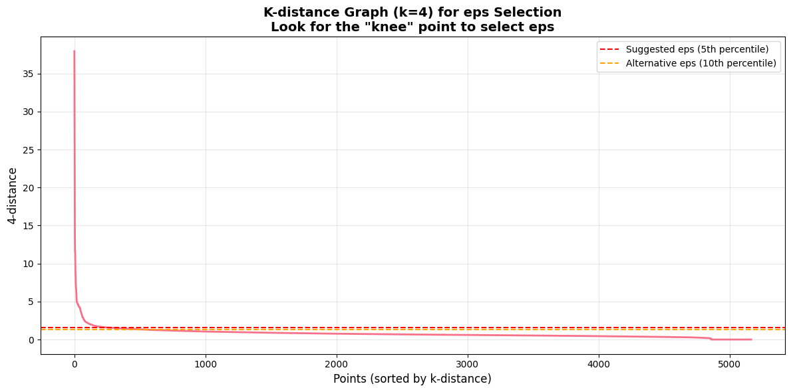
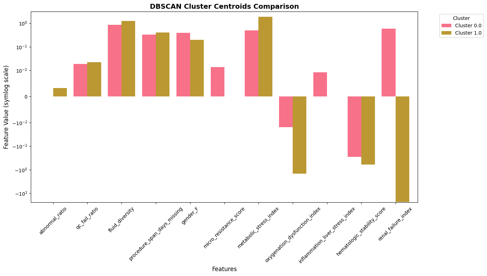
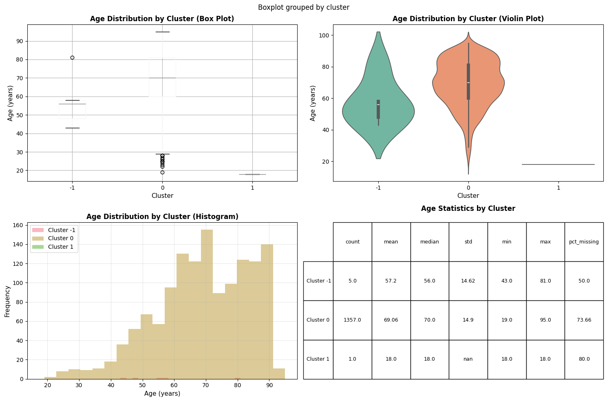

# Data Analytics for Health - Task 2.2: Density-Based Clustering Analysis

## Overview
This notebook performs density-based clustering (DBSCAN) analysis on the prepared patient profile:
- 2.2.1: Study of the clustering parameters (eps and min_samples)
- 2.2.2: Characterization and interpretation of the obtained clusters

## Objectives
- Determine optimal DBSCAN parameters (eps and min_samples)
- Analyze cluster characteristics and identify noise points
- Interpret the density-based clustering results

---


```python
import os
import pandas as pd
import numpy as np
import matplotlib.pyplot as plt
import seaborn as sns
import warnings
from pathlib import Path
from sklearn.cluster import DBSCAN
from sklearn.preprocessing import StandardScaler, RobustScaler
from sklearn.metrics import silhouette_score, davies_bouldin_score, calinski_harabasz_score
from sklearn.neighbors import NearestNeighbors
from sklearn.decomposition import PCA

warnings.filterwarnings('ignore')
plt.style.use('default')
sns.set_palette("husl")

# Set up file paths
notebook_dir = Path.cwd().resolve()
data_path = (notebook_dir / '..' / 'Data').resolve()
plots_dir = (notebook_dir / '..' / 'plots').resolve()
plots_dir.mkdir(parents=True, exist_ok=True)

print("Libraries imported successfully")
print(f"Data path: {data_path}")
print(f"Plots directory: {plots_dir}")

```

    Libraries imported successfully
    Data path: Y:\Studium\3. Sem UniPI\Data Analytics 4 digital Health\data_analytics_4_health_unipi\Data
    Plots directory: Y:\Studium\3. Sem UniPI\Data Analytics 4 digital Health\data_analytics_4_health_unipi\plots
    

## 1. Load Prepared Patient Profile


```python
# Load prepared patient profile
df = pd.read_csv(data_path / 'patient_profile_broad_clean_clustering.csv')  

print(f"Loaded patient profile: {df.shape[0]:,} subjects × {df.shape[1]} features")
print(f"\nColumns: {df.columns.tolist()}")

# Get numeric features (excluding subject_id and categorical variables)
numeric_features = [col for col in df.columns if col != 'subject_id' and col != 'hadm_id' and df[col].dtype in [np.float64, np.int64]]
print(f"\nNumeric features for clustering: {len(numeric_features)}")
print(f"Features: {numeric_features}")
df.info()
```

    Loaded patient profile: 5,166 subjects × 13 features
    
    Columns: ['subject_id', 'hadm_id', 'abnormal_ratio', 'qc_fail_ratio', 'fluid_diversity', 'procedure_span_days_missing', 'gender_F', 'micro_resistance_score', 'metabolic_stress_index', 'oxygenation_dysfunction_index', 'inflammation_liver_stress_index', 'hematologic_stability_score', 'renal_failure_index']
    
    Numeric features for clustering: 11
    Features: ['abnormal_ratio', 'qc_fail_ratio', 'fluid_diversity', 'procedure_span_days_missing', 'gender_F', 'micro_resistance_score', 'metabolic_stress_index', 'oxygenation_dysfunction_index', 'inflammation_liver_stress_index', 'hematologic_stability_score', 'renal_failure_index']
    <class 'pandas.core.frame.DataFrame'>
    RangeIndex: 5166 entries, 0 to 5165
    Data columns (total 13 columns):
     #   Column                           Non-Null Count  Dtype  
    ---  ------                           --------------  -----  
     0   subject_id                       5166 non-null   int64  
     1   hadm_id                          5166 non-null   int64  
     2   abnormal_ratio                   5166 non-null   float64
     3   qc_fail_ratio                    5166 non-null   float64
     4   fluid_diversity                  5166 non-null   float64
     5   procedure_span_days_missing      5166 non-null   int64  
     6   gender_F                         5166 non-null   int64  
     7   micro_resistance_score           5166 non-null   float64
     8   metabolic_stress_index           5166 non-null   float64
     9   oxygenation_dysfunction_index    5166 non-null   float64
     10  inflammation_liver_stress_index  5166 non-null   float64
     11  hematologic_stability_score      5166 non-null   float64
     12  renal_failure_index              5166 non-null   float64
    dtypes: float64(9), int64(4)
    memory usage: 524.8 KB
    


```python
# Get numeric features (excluding subject_id and categorical variables)
numeric_features = [col for col in df.columns if col != 'subject_id' and col != 'hadm_id' and df[col].dtype in [np.float64, np.int64]]
print(f"\nNumeric features for clustering: {len(numeric_features)}")
print(f"Features: {numeric_features}")
```

    
    Numeric features for clustering: 11
    Features: ['abnormal_ratio', 'qc_fail_ratio', 'fluid_diversity', 'procedure_span_days_missing', 'gender_F', 'micro_resistance_score', 'metabolic_stress_index', 'oxygenation_dysfunction_index', 'inflammation_liver_stress_index', 'hematologic_stability_score', 'renal_failure_index']
    


```python
X = df[numeric_features].copy()
# Create composite unique record id (subject_id + hadm_id) for mapping back results
df['record_id'] = df['subject_id'].astype(str) + '_' + df['hadm_id'].astype(str)
record_ids = df['record_id'].copy()

# Handle any remaining NaN values: NOTE is_Dead, abnormal_rat, qc_fail_ratio have some NaNs
print(f"\nNaN values before handling: {X.isna().sum().sum()}")
X = X.fillna(X.mean())  # Fill with mean or use appropriate strategy
print(f"NaN values after handling: {X.isna().sum().sum()}")

# Standardize features
scaler = RobustScaler()
X_scaled = scaler.fit_transform(X)
X_scaled_df = pd.DataFrame(X_scaled, columns=numeric_features, index=X.index)

print(f"\nData prepared for clustering: {X_scaled_df.shape}")
```

    
    NaN values before handling: 0
    NaN values after handling: 0
    
    Data prepared for clustering: (5166, 11)
    

## 2.2.1 Study of the Clustering Parameters

### K-distance Graph for eps Selection


```python
# Compute k-distances to help select eps parameter
# Use k = min_samples (typically 4 or 5 for DBSCAN)
k = 4
neighbors = NearestNeighbors(n_neighbors=k)
neighbors_fit = neighbors.fit(X_scaled)
distances, indices = neighbors_fit.kneighbors(X_scaled)

# Get k-th nearest neighbor distances (k-distance)
k_distances = distances[:, k-1]
k_distances_sorted = np.sort(k_distances)[::-1]  # Sort in descending order

# Plot k-distance graph
plt.figure(figsize=(12, 6))
plt.plot(range(len(k_distances_sorted)), k_distances_sorted, linewidth=2)
plt.xlabel('Points (sorted by k-distance)', fontsize=12)
plt.ylabel(f'{k}-distance', fontsize=12)
plt.title(f'K-distance Graph (k={k}) for eps Selection\nLook for the "knee" point to select eps', 
         fontsize=14, fontweight='bold')
plt.grid(True, alpha=0.3)
plt.axhline(y=k_distances_sorted[int(len(k_distances_sorted) * 0.05)], 
           color='r', linestyle='--', label='Suggested eps (5th percentile)')
plt.axhline(y=k_distances_sorted[int(len(k_distances_sorted) * 0.1)], 
           color='orange', linestyle='--', label='Alternative eps (10th percentile)')
plt.legend()
plt.tight_layout()
plt.savefig(plots_dir / '2.2.1_k_distance_graph.png', dpi=300, bbox_inches='tight')
plt.show()

suggested_eps = k_distances_sorted[int(len(k_distances_sorted) * 0.05)]
alt_eps = k_distances_sorted[int(len(k_distances_sorted) * 0.1)]
print(f"Suggested eps (5th percentile): {suggested_eps:.4f}")
print(f"Alternative eps (10th percentile): {alt_eps:.4f}")

```


    

    


    Suggested eps (5th percentile): 1.5739
    Alternative eps (10th percentile): 1.3247
    

### Parameter Grid Search: Testing Different eps and min_samples Values


```python
# Test different combinations of eps and min_samples
eps_values = np.linspace(1.0, 7.0, 8)  # Adjust range based on k-distance graph
min_samples_values = [3, 4, 5, 6, 7]

param_results = []

print("Testing different parameter combinations...")
for eps in eps_values:
    for min_samples in min_samples_values:
        dbscan = DBSCAN(eps=eps, min_samples=min_samples)
        labels = dbscan.fit_predict(X_scaled)
        
        n_clusters = len(set(labels)) - (1 if -1 in labels else 0)
        n_noise = list(labels).count(-1)
        noise_ratio = n_noise / len(labels)
        
        # Compute metrics only if we have at least 2 clusters
        if n_clusters >= 2:
            # Filter out noise points for metric computation
            non_noise_mask = labels != -1
            if np.sum(non_noise_mask) > 1:
                silhouette = silhouette_score(X_scaled[non_noise_mask], labels[non_noise_mask])
                davies_bouldin = davies_bouldin_score(X_scaled[non_noise_mask], labels[non_noise_mask])
                calinski_harabasz = calinski_harabasz_score(X_scaled[non_noise_mask], labels[non_noise_mask])
            else:
                silhouette = -1
                davies_bouldin = np.inf
                calinski_harabasz = 0
        else:
            silhouette = -1
            davies_bouldin = np.inf
            calinski_harabasz = 0
        
        param_results.append({
            'eps': eps,
            'min_samples': min_samples,
            'n_clusters': n_clusters,
            'n_noise': n_noise,
            'noise_ratio': noise_ratio,
            'silhouette': silhouette,
            'davies_bouldin': davies_bouldin,
            'calinski_harabasz': calinski_harabasz
        })
        
        print(f"eps={eps:.2f}, min_samples={min_samples}: "
              f"{n_clusters} clusters, {n_noise} noise ({noise_ratio:.1%}), "
              f"Silhouette={silhouette:.3f}")

param_df = pd.DataFrame(param_results)

```

    Testing different parameter combinations...
    eps=1.00, min_samples=3: 33 clusters, 727 noise (14.1%), Silhouette=0.017
    eps=1.00, min_samples=4: 13 clusters, 827 noise (16.0%), Silhouette=0.097
    eps=1.00, min_samples=5: 8 clusters, 894 noise (17.3%), Silhouette=0.135
    eps=1.00, min_samples=6: 10 clusters, 947 noise (18.3%), Silhouette=0.131
    eps=1.00, min_samples=7: 8 clusters, 1002 noise (19.4%), Silhouette=0.135
    eps=1.86, min_samples=3: 2 clusters, 98 noise (1.9%), Silhouette=0.790
    eps=1.86, min_samples=4: 2 clusters, 104 noise (2.0%), Silhouette=0.791
    eps=1.86, min_samples=5: 1 clusters, 117 noise (2.3%), Silhouette=-1.000
    eps=1.86, min_samples=6: 1 clusters, 119 noise (2.3%), Silhouette=-1.000
    eps=1.86, min_samples=7: 1 clusters, 123 noise (2.4%), Silhouette=-1.000
    eps=2.71, min_samples=3: 1 clusters, 54 noise (1.0%), Silhouette=-1.000
    eps=2.71, min_samples=4: 1 clusters, 59 noise (1.1%), Silhouette=-1.000
    eps=2.71, min_samples=5: 1 clusters, 59 noise (1.1%), Silhouette=-1.000
    eps=2.71, min_samples=6: 1 clusters, 62 noise (1.2%), Silhouette=-1.000
    eps=2.71, min_samples=7: 1 clusters, 62 noise (1.2%), Silhouette=-1.000
    eps=3.57, min_samples=3: 4 clusters, 30 noise (0.6%), Silhouette=0.730
    eps=3.57, min_samples=4: 3 clusters, 34 noise (0.7%), Silhouette=0.771
    eps=3.57, min_samples=5: 1 clusters, 46 noise (0.9%), Silhouette=-1.000
    eps=3.57, min_samples=6: 1 clusters, 46 noise (0.9%), Silhouette=-1.000
    eps=3.57, min_samples=7: 1 clusters, 47 noise (0.9%), Silhouette=-1.000
    eps=4.43, min_samples=3: 3 clusters, 17 noise (0.3%), Silhouette=0.818
    eps=4.43, min_samples=4: 2 clusters, 21 noise (0.4%), Silhouette=0.820
    eps=4.43, min_samples=5: 3 clusters, 24 noise (0.5%), Silhouette=0.777
    eps=4.43, min_samples=6: 1 clusters, 36 noise (0.7%), Silhouette=-1.000
    eps=4.43, min_samples=7: 1 clusters, 38 noise (0.7%), Silhouette=-1.000
    eps=5.29, min_samples=3: 1 clusters, 13 noise (0.3%), Silhouette=-1.000
    eps=5.29, min_samples=4: 1 clusters, 15 noise (0.3%), Silhouette=-1.000
    eps=5.29, min_samples=5: 1 clusters, 17 noise (0.3%), Silhouette=-1.000
    eps=5.29, min_samples=6: 1 clusters, 19 noise (0.4%), Silhouette=-1.000
    eps=5.29, min_samples=7: 1 clusters, 22 noise (0.4%), Silhouette=-1.000
    eps=6.14, min_samples=3: 1 clusters, 9 noise (0.2%), Silhouette=-1.000
    eps=6.14, min_samples=4: 1 clusters, 10 noise (0.2%), Silhouette=-1.000
    eps=6.14, min_samples=5: 2 clusters, 10 noise (0.2%), Silhouette=0.868
    eps=6.14, min_samples=6: 1 clusters, 18 noise (0.3%), Silhouette=-1.000
    eps=6.14, min_samples=7: 1 clusters, 19 noise (0.4%), Silhouette=-1.000
    eps=7.00, min_samples=3: 1 clusters, 8 noise (0.2%), Silhouette=-1.000
    eps=7.00, min_samples=4: 1 clusters, 10 noise (0.2%), Silhouette=-1.000
    eps=7.00, min_samples=5: 1 clusters, 10 noise (0.2%), Silhouette=-1.000
    eps=7.00, min_samples=6: 1 clusters, 10 noise (0.2%), Silhouette=-1.000
    eps=7.00, min_samples=7: 1 clusters, 17 noise (0.3%), Silhouette=-1.000
    


```python
# Visualize parameter search results
fig, axes = plt.subplots(2, 2, figsize=(16, 12))

# Number of clusters
pivot_clusters = param_df.pivot(index='eps', columns='min_samples', values='n_clusters')
sns.heatmap(pivot_clusters, annot=True, fmt='d', cmap='viridis', ax=axes[0, 0], cbar_kws={'label': 'Number of Clusters'})
axes[0, 0].set_title('Number of Clusters', fontsize=14, fontweight='bold')
axes[0, 0].set_xlabel('min_samples', fontsize=12)
axes[0, 0].set_ylabel('eps', fontsize=12)

# Noise ratio
pivot_noise = param_df.pivot(index='eps', columns='min_samples', values='noise_ratio')
sns.heatmap(pivot_noise, annot=True, fmt='.2%', cmap='Reds', ax=axes[0, 1], cbar_kws={'label': 'Noise Ratio'})
axes[0, 1].set_title('Noise Ratio', fontsize=14, fontweight='bold')
axes[0, 1].set_xlabel('min_samples', fontsize=12)
axes[0, 1].set_ylabel('eps', fontsize=12)

# Silhouette score (only valid clusters)
pivot_sil = param_df.pivot(index='eps', columns='min_samples', values='silhouette')
pivot_sil = pivot_sil.replace(-1, np.nan)  # Replace invalid values
sns.heatmap(pivot_sil, annot=True, fmt='.3f', cmap='YlGnBu', ax=axes[1, 0], 
           cbar_kws={'label': 'Silhouette Score'}, mask=pivot_sil.isna())
axes[1, 0].set_title('Silhouette Score (higher is better)', fontsize=14, fontweight='bold')
axes[1, 0].set_xlabel('min_samples', fontsize=12)
axes[1, 0].set_ylabel('eps', fontsize=12)

# Davies-Bouldin score
pivot_db = param_df.pivot(index='eps', columns='min_samples', values='davies_bouldin')
pivot_db = pivot_db.replace(np.inf, np.nan)
sns.heatmap(pivot_db, annot=True, fmt='.3f', cmap='YlOrRd_r', ax=axes[1, 1], 
           cbar_kws={'label': 'Davies-Bouldin Score'}, mask=pivot_db.isna())
axes[1, 1].set_title('Davies-Bouldin Score (lower is better)', fontsize=14, fontweight='bold')
axes[1, 1].set_xlabel('min_samples', fontsize=12)
axes[1, 1].set_ylabel('eps', fontsize=12)

plt.tight_layout()
plt.savefig(plots_dir / '2.2.1_parameter_search.png', dpi=300, bbox_inches='tight')
plt.show()

```


    

    


```python
# Find best parameters (balance between clusters, noise, and quality)
# Filter valid results (at least 2 clusters, reasonable noise ratio)
valid_results = param_df[(param_df['n_clusters'] >= 2) & (param_df['noise_ratio'] < 0.5)]

if len(valid_results) > 0:
    # Score based on silhouette (higher better) and noise ratio (lower better)
    valid_results['score'] = (valid_results['silhouette'] + 1) / 2 - valid_results['noise_ratio']
    best_params = valid_results.loc[valid_results['score'].idxmax()]
    
    optimal_eps = best_params['eps']
    optimal_min_samples = int(best_params['min_samples'])
    
    print("="*80)
    print("OPTIMAL PARAMETERS")
    print("="*80)
    print(f"eps: {optimal_eps:.2f}")
    print(f"min_samples: {optimal_min_samples}")
    print(f"\nExpected results:")
    print(f"  Number of clusters: {int(best_params['n_clusters'])}")
    print(f"  Noise points: {int(best_params['n_noise'])} ({best_params['noise_ratio']:.1%})")
    print(f"  Silhouette score: {best_params['silhouette']:.3f}")
else:
    # Fallback: use suggested eps from k-distance graph
    optimal_eps = suggested_eps
    optimal_min_samples = 4
    print(f"Using default parameters: eps={optimal_eps:.2f}, min_samples={optimal_min_samples}")
```

    ================================================================================
    OPTIMAL PARAMETERS
    ================================================================================
    eps: 6.14
    min_samples: 5
    
    Expected results:
      Number of clusters: 2
      Noise points: 10 (0.2%)
      Silhouette score: 0.868
    


```python
# manually select optimal parameters
# optimal_eps = 2.0
# optimal_min_samples = 4
print(f"Using selected parameters: eps={optimal_eps:.2f}, min_samples={optimal_min_samples}")
```

    Using selected parameters: eps=2.00, min_samples=4
    

## 2.2.2 Characterization and Interpretation of the Obtained Clusters

### Perform Final DBSCAN Clustering


```python
# Perform DBSCAN clustering with optimal parameters
dbscan_final = DBSCAN(eps=optimal_eps, min_samples=optimal_min_samples)
cluster_labels = dbscan_final.fit_predict(X_scaled)

# Add cluster labels to original dataframe
df_clustered = df.copy()
df_clustered['cluster'] = cluster_labels

# Analyze results
n_clusters = len(set(cluster_labels)) - (1 if -1 in cluster_labels else 0)
n_noise = list(cluster_labels).count(-1)
noise_ratio = n_noise / len(cluster_labels)

print("="*80)
print("DBSCAN CLUSTERING RESULTS")
print("="*80)
print(f"Parameters: eps={optimal_eps:.2f}, min_samples={optimal_min_samples}")
print(f"Number of clusters: {n_clusters}")
print(f"Noise points: {n_noise} ({noise_ratio:.1%})")
print(f"\nCluster distribution:")
cluster_counts = df_clustered['cluster'].value_counts().sort_index()
print(cluster_counts)

# Save clustered data
df_clustered.to_csv(data_path / '2.2_dbscan_clustered_data.csv', index=False)
print(f"\nClustered data saved to: {data_path / '2.2_dbscan_clustered_data.csv'}")

```

    ================================================================================
    DBSCAN CLUSTERING RESULTS
    ================================================================================
    Parameters: eps=6.14, min_samples=5
    Number of clusters: 2
    Noise points: 10 (0.2%)
    
    Cluster distribution:
    cluster
    -1      10
     0    5151
     1       5
    Name: count, dtype: int64
    
    Clustered data saved to: Y:\Studium\3. Sem UniPI\Data Analytics 4 digital Health\data_analytics_4_health_unipi\Data\2.2_dbscan_clustered_data.csv
    

### Cluster Characteristics Analysis


```python
# Analyze cluster characteristics (excluding noise points)
valid_clusters = df_clustered[df_clustered['cluster'] != -1]

if len(valid_clusters) > 0:
    # Compute cluster statistics
    cluster_stats = []
    for cluster_id in sorted(valid_clusters['cluster'].unique()):
        cluster_data = valid_clusters[valid_clusters['cluster'] == cluster_id]
        
        stats = {'cluster': cluster_id, 'size': len(cluster_data)}
        for feature in numeric_features:
            stats[f'{feature}_mean'] = cluster_data[feature].mean()
            stats[f'{feature}_std'] = cluster_data[feature].std()
        
        cluster_stats.append(stats)
    
    cluster_stats_df = pd.DataFrame(cluster_stats)
    
    # Display mean values for each cluster
    print("Cluster Characteristics (Mean Values):")
    mean_cols = [col for col in cluster_stats_df.columns if col.endswith('_mean')]
    display_df = cluster_stats_df[['cluster', 'size'] + mean_cols].copy()
    display_df.columns = ['cluster', 'size'] + [col.replace('_mean', '') for col in mean_cols]
    print(display_df.round(2))
    
    # Visualize cluster centroids comparison
    centroid_data = []
    for cluster_id in sorted(valid_clusters['cluster'].unique()):
        cluster_data = valid_clusters[valid_clusters['cluster'] == cluster_id]
        centroid = cluster_data[numeric_features].mean()
        centroid['cluster'] = cluster_id
        centroid_data.append(centroid)
    
    centroids_df = pd.DataFrame(centroid_data)
    centroids_df = centroids_df.set_index('cluster')
    centroids_df.index = [f'Cluster {i}' for i in centroids_df.index]
    
    # Plot centroids
    fig, ax = plt.subplots(figsize=(14, 8))
    centroids_df.T.plot(kind='bar', ax=ax, width=0.8)
    # Apply log scaling to y-axis (uses 'log' if all centroid values are > 0, else 'symlog')
    if np.all(centroids_df.values > 0):
        ax.set_yscale('log')
        y_label = 'Feature Value (log scale)'
    else:
        ax.set_yscale('symlog', linthresh=1e-2)
        y_label = 'Feature Value (symlog scale)'
    ax.set_xlabel('Features', fontsize=12)
    ax.set_ylabel(y_label, fontsize=12)
    ax.set_title('DBSCAN Cluster Centroids Comparison', fontsize=14, fontweight='bold')
    ax.legend(title='Cluster', bbox_to_anchor=(1.05, 1), loc='upper left')
    ax.tick_params(axis='x', rotation=45)
    plt.tight_layout()
    plt.savefig(plots_dir / '2.2.2_centroids_comparison.png', dpi=300, bbox_inches='tight')
    plt.show()
else:
    print("No valid clusters found (all points are noise). Try adjusting parameters.")

```

    Cluster Characteristics (Mean Values):
       cluster  size  abnormal_ratio  qc_fail_ratio  fluid_diversity  \
    0        0  5151             0.0           0.02             0.85   
    1        1     5             0.0           0.02             1.26   
    
       procedure_span_days_missing  gender_F  micro_resistance_score  \
    0                         0.33      0.39                    0.01   
    1                         0.40      0.20                    0.00   
    
       metabolic_stress_index  oxygenation_dysfunction_index  \
    0                    0.49                          -0.02   
    1                    1.86                          -1.44   
    
       inflammation_liver_stress_index  hematologic_stability_score  \
    0                             0.01                        -0.28   
    1                             0.00                        -0.60   
    
       renal_failure_index  
    0                 0.59  
    1               -23.24  
    


    

    


```python
# Compare distributions: clusters vs overall vs noise
if len(valid_clusters) > 0:
    key_features = numeric_features[:6]  # Select first 6 features
    
    n_features = len(key_features)
    n_cols = 3
    n_rows = (n_features + n_cols - 1) // n_cols
    
    fig, axes = plt.subplots(n_rows, n_cols, figsize=(15, 5*n_rows))
    axes = axes.flatten() if n_features > 1 else [axes]
    
    for idx, feature in enumerate(key_features):
        ax = axes[idx]
        
        # Plot distribution for each cluster
        for cluster_id in sorted(valid_clusters['cluster'].unique()):
            cluster_data = valid_clusters[valid_clusters['cluster'] == cluster_id][feature]
            ax.hist(cluster_data, alpha=0.5, label=f'Cluster {cluster_id}', bins=30, density=True)
        
        # Plot noise points
        if n_noise > 0:
            noise_data = df_clustered[df_clustered['cluster'] == -1][feature]
            ax.hist(noise_data, alpha=0.3, color='red', label='Noise', bins=30, density=True, 
                   linestyle=':', linewidth=2)
        
        # Plot overall distribution
        ax.hist(df_clustered[feature], alpha=0.2, color='black', 
               label='Overall', bins=30, density=True, linestyle='--', linewidth=2)
        
        ax.set_xlabel(feature, fontsize=11)
        ax.set_ylabel('Density', fontsize=11)
        ax.set_title(f'Distribution: {feature}', fontsize=12, fontweight='bold')
        ax.legend()
        ax.grid(True, alpha=0.3)
    
    # Hide unused subplots
    for idx in range(n_features, len(axes)):
        axes[idx].axis('off')
    
    plt.tight_layout()
    plt.savefig(plots_dir / '2.2.2_feature_distributions.png', dpi=300, bbox_inches='tight')
    plt.show()

```


    

    


### 2D Visualization using PCA


```python
# Reduce to 2D using PCA for visualization
pca = PCA(n_components=2, random_state=42)
X_pca = pca.fit_transform(X_scaled)

# Create visualization
fig, ax = plt.subplots(figsize=(12, 8))

# Plot clusters
for cluster_id in sorted(df_clustered['cluster'].unique()):
    mask = cluster_labels == cluster_id
    if cluster_id == -1:
        # Noise points
        ax.scatter(X_pca[mask, 0], X_pca[mask, 1], 
                  c='red', marker='x', s=30, alpha=0.5, label='Noise', linewidths=1)
    else:
        # Regular clusters
        ax.scatter(X_pca[mask, 0], X_pca[mask, 1], 
                  label=f'Cluster {cluster_id}', alpha=0.6, s=50, edgecolors='k', linewidth=0.5)

ax.set_xlabel(f'First Principal Component (explained variance: {pca.explained_variance_ratio_[0]:.2%})', 
             fontsize=12)
ax.set_ylabel(f'Second Principal Component (explained variance: {pca.explained_variance_ratio_[1]:.2%})', 
             fontsize=12)
ax.set_title(f'DBSCAN Clustering Results (eps={optimal_eps:.2f}, min_samples={optimal_min_samples}) - PCA Visualization', 
            fontsize=14, fontweight='bold')
ax.legend(bbox_to_anchor=(1.05, 1), loc='upper left')
ax.grid(True, alpha=0.3)
plt.tight_layout()
plt.savefig(plots_dir / '2.2.2_pca_visualization.png', dpi=300, bbox_inches='tight')
plt.show()

print(f"PCA explained variance ratio: {pca.explained_variance_ratio_}")
print(f"Total explained variance: {pca.explained_variance_ratio_.sum():.2%}")

```


    

    


    PCA explained variance ratio: [0.53163852 0.1914993 ]
    Total explained variance: 72.31%
    


```python
import umap
from sklearn.decomposition import PCA
import matplotlib.pyplot as plt
import seaborn as sns

# 1. Initialize UMAP
# n_neighbors: low (5-20) focuses on local detail; high (50+) focuses on global structure
# min_dist: controls how tightly points are packed together
reducer = umap.UMAP(n_neighbors=15, min_dist=0.1, n_components=2, random_state=42)
X_umap = reducer.fit_transform(X_scaled)

# 2. Re-run your PCA for the comparison
pca = PCA(n_components=2, random_state=42)
X_pca = pca.fit_transform(X_scaled)

# 3. Create Side-by-Side Visualization
fig, (ax1, ax2) = plt.subplots(1, 2, figsize=(20, 8))

# Plot PCA
scatter1 = ax1.scatter(X_pca[:, 0], X_pca[:, 1], c=cluster_labels, 
                      cmap='viridis', alpha=0.6, s=30, edgecolors='k', linewidth=0.2)
ax1.set_title('PCA Projection (Linear)', fontsize=15, fontweight='bold')
ax1.set_xlabel('PC1')
ax1.set_ylabel('PC2')

# Plot UMAP
scatter2 = ax2.scatter(X_umap[:, 0], X_umap[:, 1], c=cluster_labels, 
                      cmap='viridis', alpha=0.6, s=30, edgecolors='k', linewidth=0.2)
ax2.set_title('UMAP Projection (Non-Linear)', fontsize=15, fontweight='bold')
ax2.set_xlabel('UMAP 1')
ax2.set_ylabel('UMAP 2')

# Add a shared colorbar
cbar = fig.colorbar(scatter2, ax=[ax1, ax2], location='right', shrink=0.6)
cbar.set_label('Cluster ID', fontsize=12)

plt.suptitle(f'Dimensionality Reduction Comparison', fontsize=18, fontweight='bold', y=1.02)
plt.savefig(plots_dir / '2.2.2_pca_vs_umap_comparison.png', dpi=300, bbox_inches='tight')
plt.show()
```


    

    


```python
# Create a quick summary table of clinical outcomes
outcome_summary = df_clustered.groupby('cluster').agg({
    'metabolic_stress_index': 'mean',
}).round(3)

print("Clinical Outcomes by Cluster:")
print(outcome_summary)
```

    Clinical Outcomes by Cluster:
             metabolic_stress_index
    cluster                        
    -1                       21.684
     0                        0.494
     1                        1.863
    


```python
print("=" * 80)
print("CLUSTER CHARACTERIZATION WITH AGE")
print("=" * 80)

# Load df1 for age analysis of clusters
OG_DATA_DIR = (notebook_dir / ".." / ".." / "Data").resolve()
path = f"{OG_DATA_DIR}/heart_diagnoses_1_agg_features.csv"
age_df = pd.read_csv(Path(path))

# Merge age data from age_df back to clustered data
# age_df should have columns: subject_id, hadm_id, age (and possibly others)
print(f"\nAge dataframe shape: {age_df.shape}")
print(f"Age dataframe columns: {age_df.columns.tolist()}")

# Select relevant columns from age_df (subject_id, hadm_id, age)
age_cols = [col for col in ["subject_id", "hadm_id", "age"] if col in age_df.columns]
age_subset = age_df[age_cols].copy()

# Merge on subject_id and hadm_id
df_with_age = df_clustered.merge(
    age_subset,
    on=["subject_id", "hadm_id"],
    how="left"
)

print(f"\nMerged data shape: {df_with_age.shape}")
print(f"Rows with age data: {df_with_age['age'].notna().sum()} / {len(df_with_age)}")

# Cluster characterization by age
print("\n" + "=" * 80)
print("AGE STATISTICS BY CLUSTER")
print("=" * 80)

age_cluster_stats = df_with_age.groupby("cluster")["age"].agg([
    ("count", "count"),
    ("mean", "mean"),
    ("median", "median"),
    ("std", "std"),
    ("min", "min"),
    ("max", "max"),
    ("pct_missing", lambda x: (x.isna().sum() / len(x) * 100))
]).round(2)

print(age_cluster_stats)

# Visualize age distribution by cluster
fig, axes = plt.subplots(2, 2, figsize=(15, 10))

# 1. Box plot
ax = axes[0, 0]
df_with_age.boxplot(column="age", by="cluster", ax=ax)
ax.set_xlabel("Cluster", fontsize=11)
ax.set_ylabel("Age (years)", fontsize=11)
ax.set_title("Age Distribution by Cluster (Box Plot)", fontsize=12, fontweight="bold")
plt.sca(ax)
plt.xticks(rotation=0)

# 2. Violin plot
ax = axes[0, 1]
sns.violinplot(data=df_with_age, x="cluster", y="age", ax=ax, palette="Set2")
ax.set_xlabel("Cluster", fontsize=11)
ax.set_ylabel("Age (years)", fontsize=11)
ax.set_title("Age Distribution by Cluster (Violin Plot)", fontsize=12, fontweight="bold")

# 3. Histogram with overlaid distributions
ax = axes[1, 0]
for cluster_id in sorted(df_with_age["cluster"].unique()):
    if cluster_id is not None:
        cluster_age = df_with_age[df_with_age["cluster"] == cluster_id]["age"].dropna()
        ax.hist(cluster_age, alpha=0.5, label=f"Cluster {cluster_id}", bins=20)
ax.set_xlabel("Age (years)", fontsize=11)
ax.set_ylabel("Frequency", fontsize=11)
ax.set_title("Age Distribution by Cluster (Histogram)", fontsize=12, fontweight="bold")
ax.legend()
ax.grid(alpha=0.3)

# 4. Statistics table
ax = axes[1, 1]
ax.axis("off")
table_data = age_cluster_stats.values
table_cols = age_cluster_stats.columns.tolist()
table_rows = [f"Cluster {i}" for i in age_cluster_stats.index]

table = ax.table(
    cellText=table_data,
    colLabels=table_cols,
    rowLabels=table_rows,
    cellLoc="center",
    loc="center",
    bbox=[0, 0, 1, 1]
)
table.auto_set_font_size(False)
table.set_fontsize(9)
table.scale(1, 2)
ax.set_title("Age Statistics by Cluster", fontsize=12, fontweight="bold", pad=20)

plt.tight_layout()
plt.savefig(plots_dir / "2.2.2_age_characterization_by_cluster.png", dpi=300, bbox_inches="tight")
plt.show()

print("\nAge characterization plot saved!")
```

    ================================================================================
    CLUSTER CHARACTERIZATION WITH AGE
    ================================================================================
    
    Age dataframe shape: (4864, 18)
    Age dataframe columns: ['subject_id', 'hadm_id', 'gender', 'age', 'is_dead', 'charttime', 'icd_code', 'icd_cat', 'imaging_variety', 'doc_complexity_index', 'cardiac_comorbidity_score', 'has_heart', 'has_hf', 'has_arr', 'has_ami', 'has_arrest', 'has_valvular', 'has_inflammatory']
    
    Merged data shape: (5166, 16)
    Rows with age data: 1363 / 5166
    
    ================================================================================
    AGE STATISTICS BY CLUSTER
    ================================================================================
             count   mean  median    std   min   max  pct_missing
    cluster                                                      
    -1           5  57.20    56.0  14.62  43.0  81.0        50.00
     0        1357  69.06    70.0  14.90  19.0  95.0        73.66
     1           1  18.00    18.0    NaN  18.0  18.0        80.00
    


    

    


    
    Age characterization plot saved!
    

### Evaluation Metrics


```python
# Compute evaluation metrics (excluding noise points)
if len(valid_clusters) >= 2:
    non_noise_mask = cluster_labels != -1
    non_noise_labels = cluster_labels[non_noise_mask]
    non_noise_X = X_scaled[non_noise_mask]
    
    silhouette_avg = silhouette_score(non_noise_X, non_noise_labels)
    davies_bouldin = davies_bouldin_score(non_noise_X, non_noise_labels)
    calinski_harabasz = calinski_harabasz_score(non_noise_X, non_noise_labels)
    
    print("="*80)
    print("DBSCAN CLUSTERING EVALUATION METRICS")
    print("="*80)
    print(f"Parameters: eps={optimal_eps:.2f}, min_samples={optimal_min_samples}")
    print(f"Number of clusters: {n_clusters}")
    print(f"Noise points: {n_noise} ({noise_ratio:.1%})")
    print(f"\nSilhouette Score: {silhouette_avg:.4f} (excluding noise)")
    print(f"Davies-Bouldin Score: {davies_bouldin:.4f} (excluding noise)")
    print(f"Calinski-Harabasz Score: {calinski_harabasz:.4f} (excluding noise)")
else:
    print("Not enough clusters for evaluation metrics (need at least 2 clusters)")

```

    ================================================================================
    DBSCAN CLUSTERING EVALUATION METRICS
    ================================================================================
    Parameters: eps=6.14, min_samples=5
    Number of clusters: 2
    Noise points: 10 (0.2%)
    
    Silhouette Score: 0.8681 (excluding noise)
    Davies-Bouldin Score: 0.2436 (excluding noise)
    Calinski-Harabasz Score: 353.5876 (excluding noise)
    

## Summary and Conclusions

### Key Findings:
1. **Optimal Parameters**: Selected eps and min_samples based on k-distance graph and grid search
2. **Cluster Characteristics**: Each cluster shows distinct density-based patterns
3. **Noise Points**: Identified outliers that don't belong to any dense cluster
4. **Evaluation**: Clustering quality assessed using standard metrics

### Advantages of DBSCAN:
- Can identify clusters of arbitrary shape
- Automatically determines number of clusters
- Identifies noise/outlier points
- Robust to outliers


