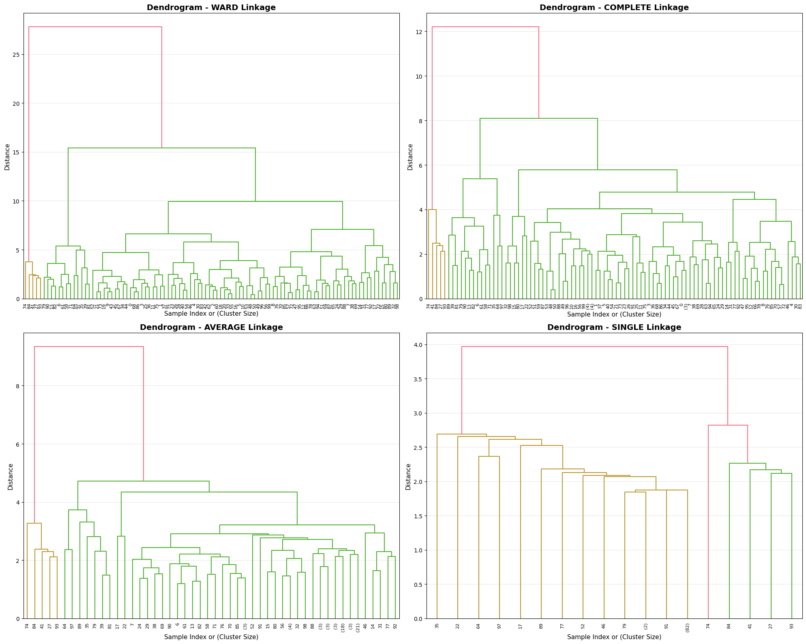
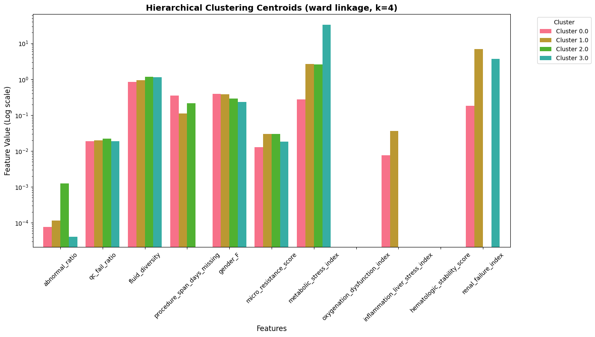
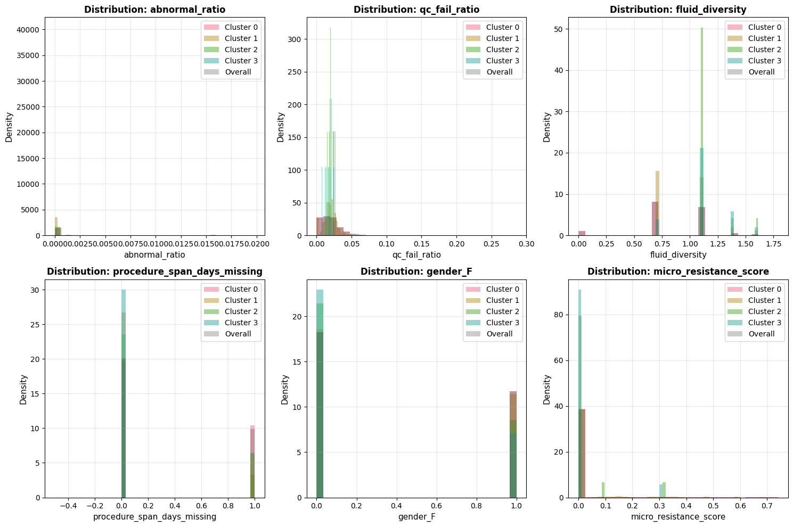

# Data Analytics for Health - Task 2.3: Hierarchical Clustering Analysis

## Overview
This notebook performs hierarchical clustering analysis on the prepared patient profile:
- 2.3.1: Compare different clustering results using different versions of the algorithm
- 2.3.2: Show and discuss different dendrograms using different algorithms

## Objectives
- Compare different linkage methods (ward, complete, average, single)
- Visualize dendrograms for different algorithms
- Analyze cluster characteristics for different approaches
- Select optimal number of clusters and linkage method

---


```python
import os
import pandas as pd
import numpy as np
import matplotlib.pyplot as plt
import seaborn as sns
import warnings
from pathlib import Path
from sklearn.cluster import AgglomerativeClustering
from sklearn.preprocessing import StandardScaler, RobustScaler
from sklearn.metrics import silhouette_score, davies_bouldin_score, calinski_harabasz_score
from scipy.cluster.hierarchy import dendrogram, linkage, fcluster
from scipy.spatial.distance import pdist
from sklearn.decomposition import PCA

warnings.filterwarnings('ignore')
plt.style.use('default')
sns.set_palette("husl")

# Set up file paths
notebook_dir = Path.cwd().resolve()
data_path = (notebook_dir / '..' / 'Data').resolve()
plots_dir = (notebook_dir / '..' / 'plots').resolve()
plots_dir.mkdir(parents=True, exist_ok=True)

print("Libraries imported successfully")
print(f"Data path: {data_path}")
print(f"Plots directory: {plots_dir}")

```

    Libraries imported successfully
    Data path: Y:\Studium\3. Sem UniPI\Data Analytics 4 digital Health\data_analytics_4_health_unipi\Data
    Plots directory: Y:\Studium\3. Sem UniPI\Data Analytics 4 digital Health\data_analytics_4_health_unipi\plots
    

## 1. Load Prepared Patient Profile


```python
# Load prepared patient profile
df = pd.read_csv(data_path / 'patient_profile_broad_clean_clustering.csv')

print(f"Loaded patient profile: {df.shape[0]:,} subjects × {df.shape[1]} features")
print(f"\nColumns: {df.columns.tolist()}")

# Get numeric features (excluding subject_id and categorical variables)
numeric_features = [col for col in df.columns if col != 'subject_id' and col != 'hadm_id' and df[col].dtype in [np.float64, np.int64]]
print(f"\nNumeric features for clustering: {len(numeric_features)}")
print(f"Features: {numeric_features}")
```

    Loaded patient profile: 5,166 subjects × 13 features
    
    Columns: ['subject_id', 'hadm_id', 'abnormal_ratio', 'qc_fail_ratio', 'fluid_diversity', 'procedure_span_days_missing', 'gender_F', 'micro_resistance_score', 'metabolic_stress_index', 'oxygenation_dysfunction_index', 'inflammation_liver_stress_index', 'hematologic_stability_score', 'renal_failure_index']
    
    Numeric features for clustering: 11
    Features: ['abnormal_ratio', 'qc_fail_ratio', 'fluid_diversity', 'procedure_span_days_missing', 'gender_F', 'micro_resistance_score', 'metabolic_stress_index', 'oxygenation_dysfunction_index', 'inflammation_liver_stress_index', 'hematologic_stability_score', 'renal_failure_index']
    


```python
# Get numeric features (excluding subject_id and categorical variables)
numeric_features = [col for col in df.columns if col != 'subject_id' and col != 'hadm_id' and df[col].dtype in [np.float64, np.int64]]
print(f"\nNumeric features for clustering: {len(numeric_features)}")
print(f"Features: {numeric_features}")

# maunally decrease featureset
#numeric_features = [c for c in numeric_features if c not in ['is_dead' ]] #  'abnormal_ratio', 'age_missing', 'max_urine_creatinine_missing', 'max_gas_pO2_missing', 'procedure_span_days_missing', 'micro_qc_warn' , 'micro_qc_warn']]

X = df[numeric_features].copy()
X.info()
```

    
    Numeric features for clustering: 11
    Features: ['abnormal_ratio', 'qc_fail_ratio', 'fluid_diversity', 'procedure_span_days_missing', 'gender_F', 'micro_resistance_score', 'metabolic_stress_index', 'oxygenation_dysfunction_index', 'inflammation_liver_stress_index', 'hematologic_stability_score', 'renal_failure_index']
    <class 'pandas.core.frame.DataFrame'>
    RangeIndex: 5166 entries, 0 to 5165
    Data columns (total 11 columns):
     #   Column                           Non-Null Count  Dtype  
    ---  ------                           --------------  -----  
     0   abnormal_ratio                   5166 non-null   float64
     1   qc_fail_ratio                    5166 non-null   float64
     2   fluid_diversity                  5166 non-null   float64
     3   procedure_span_days_missing      5166 non-null   int64  
     4   gender_F                         5166 non-null   int64  
     5   micro_resistance_score           5166 non-null   float64
     6   metabolic_stress_index           5166 non-null   float64
     7   oxygenation_dysfunction_index    5166 non-null   float64
     8   inflammation_liver_stress_index  5166 non-null   float64
     9   hematologic_stability_score      5166 non-null   float64
     10  renal_failure_index              5166 non-null   float64
    dtypes: float64(9), int64(2)
    memory usage: 444.1 KB
    


```python

```


```python
# Create composite unique record id (subject_id + hadm_id) for mapping back results
df['record_id'] = df['subject_id'].astype(str) + '_' + df['hadm_id'].astype(str)
record_ids = df['record_id'].copy()

# Handle any remaining NaN values: NOTE is_Dead, abnormal_rat, qc_fail_ratio have some NaNs
print(f"\nNaN values before handling: {X.isna().sum().sum()}")
X = X.fillna(X.mean())  # Fill with mean or use appropriate strategy
print(f"NaN values after handling: {X.isna().sum().sum()}")

# Standardize features
scaler = RobustScaler()
X_scaled = scaler.fit_transform(X)
X_scaled_df = pd.DataFrame(X_scaled, columns=numeric_features, index=X.index)

print(f"\nData prepared for clustering: {X_scaled_df.shape}")
```

    
    NaN values before handling: 0
    NaN values after handling: 0
    
    Data prepared for clustering: (5166, 11)
    

## 2.3.1 Compare Different Clustering Results Using Different Algorithms

### Test Different Linkage Methods


```python
# Test different linkage methods
linkage_methods = ['ward', 'complete', 'average', 'single']
n_clusters_range = range(2, 11)  # Test different numbers of clusters

results = []

print("Testing different linkage methods and numbers of clusters...")
for linkage_method in linkage_methods:
    print(f"\n--- Testing {linkage_method.upper()} linkage ---")
    
    for n_clusters in n_clusters_range:
        try:
            clustering = AgglomerativeClustering(
                n_clusters=n_clusters, 
                linkage=linkage_method
            )
            labels = clustering.fit_predict(X_scaled)
            
            # Compute metrics
            silhouette = silhouette_score(X_scaled, labels)
            davies_bouldin = davies_bouldin_score(X_scaled, labels)
            calinski_harabasz = calinski_harabasz_score(X_scaled, labels)
            
            results.append({
                'linkage': linkage_method,
                'n_clusters': n_clusters,
                'silhouette': silhouette,
                'davies_bouldin': davies_bouldin,
                'calinski_harabasz': calinski_harabasz
            })
            
            print(f"  k={n_clusters}: Silhouette={silhouette:.3f}, "
                  f"DB={davies_bouldin:.3f}, CH={calinski_harabasz:.2f}")
        except Exception as e:
            print(f"  k={n_clusters}: Error - {e}")

results_df = pd.DataFrame(results)

```

    Testing different linkage methods and numbers of clusters...
    
    --- Testing WARD linkage ---
    

      k=2: Silhouette=0.638, DB=0.835, CH=2051.83
      k=3: Silhouette=0.644, DB=0.739, CH=1563.70
      k=4: Silhouette=0.628, DB=0.686, CH=1411.04
      k=5: Silhouette=0.229, DB=1.213, CH=1343.99
      k=6: Silhouette=0.223, DB=1.116, CH=1304.54
      k=7: Silhouette=0.217, DB=1.129, CH=1249.52
      k=8: Silhouette=0.186, DB=1.072, CH=1194.20
      k=9: Silhouette=0.186, DB=0.960, CH=1159.01
      k=10: Silhouette=0.187, DB=0.873, CH=1137.90
    
    --- Testing COMPLETE linkage ---
      k=2: Silhouette=0.877, DB=0.390, CH=574.58
      k=3: Silhouette=0.877, DB=0.386, CH=501.57
      k=4: Silhouette=0.855, DB=0.479, CH=467.29
      k=5: Silhouette=0.788, DB=0.467, CH=538.23
      k=6: Silhouette=0.787, DB=0.400, CH=463.07
      k=7: Silhouette=0.576, DB=0.584, CH=960.84
      k=8: Silhouette=0.576, DB=0.523, CH=845.36
      k=9: Silhouette=0.564, DB=0.588, CH=860.09
      k=10: Silhouette=0.564, DB=0.514, CH=776.96
    
    --- Testing AVERAGE linkage ---
      k=2: Silhouette=0.937, DB=0.043, CH=282.21
      k=3: Silhouette=0.919, DB=0.257, CH=333.39
      k=4: Silhouette=0.912, DB=0.240, CH=282.28
      k=5: Silhouette=0.857, DB=0.255, CH=331.93
      k=6: Silhouette=0.856, DB=0.163, CH=272.04
      k=7: Silhouette=0.786, DB=0.202, CH=353.33
      k=8: Silhouette=0.778, DB=0.334, CH=353.01
      k=9: Silhouette=0.758, DB=0.331, CH=313.74
      k=10: Silhouette=0.756, DB=0.346, CH=281.95
    
    --- Testing SINGLE linkage ---
      k=2: Silhouette=0.937, DB=0.043, CH=282.21
      k=3: Silhouette=0.934, DB=0.044, CH=289.27
      k=4: Silhouette=0.912, DB=0.051, CH=251.05
      k=5: Silhouette=0.891, DB=0.058, CH=218.69
      k=6: Silhouette=0.767, DB=0.091, CH=179.83
      k=7: Silhouette=0.767, DB=0.094, CH=167.95
      k=8: Silhouette=0.755, DB=0.100, CH=148.47
      k=9: Silhouette=0.756, DB=0.100, CH=138.20
      k=10: Silhouette=0.756, DB=0.180, CH=131.12
    


```python
# Visualize comparison of linkage methods
fig, axes = plt.subplots(2, 2, figsize=(16, 12))

for idx, metric in enumerate(['silhouette', 'davies_bouldin', 'calinski_harabasz']):
    ax = axes[idx // 2, idx % 2]
    
    for linkage_method in linkage_methods:
        method_data = results_df[results_df['linkage'] == linkage_method]
        ax.plot(method_data['n_clusters'], method_data[metric], 
               marker='o', label=linkage_method, linewidth=2, markersize=6)
    
    ax.set_xlabel('Number of Clusters', fontsize=12)
    ax.set_ylabel(metric.replace('_', ' ').title(), fontsize=12)
    ax.set_title(f'{metric.replace("_", " ").title()} Score by Linkage Method', 
                fontsize=14, fontweight='bold')
    ax.legend()
    ax.grid(True, alpha=0.3)

# Find best combination for each metric
ax = axes[1, 1]
best_combinations = []
for linkage_method in linkage_methods:
    method_data = results_df[results_df['linkage'] == linkage_method]
    best_sil = method_data.loc[method_data['silhouette'].idxmax()]
    best_combinations.append({
        'linkage': linkage_method,
        'n_clusters': int(best_sil['n_clusters']),
        'silhouette': best_sil['silhouette']
    })
    ax.bar(f"{linkage_method}\nk={int(best_sil['n_clusters'])}", 
          best_sil['silhouette'], label=linkage_method)

ax.set_ylabel('Best Silhouette Score', fontsize=12)
ax.set_title('Best Configuration per Linkage Method', fontsize=14, fontweight='bold')
ax.grid(True, alpha=0.3, axis='y')

plt.tight_layout()
plt.savefig(plots_dir / '2.3.1_linkage_comparison.png', dpi=300, bbox_inches='tight')
plt.show()

print("\nBest configuration for each linkage method:")
best_df = pd.DataFrame(best_combinations)
print(best_df.to_string(index=False))

```


    

    


    
    Best configuration for each linkage method:
     linkage  n_clusters  silhouette
        ward           3    0.643545
    complete           3    0.877228
     average           2    0.937144
      single           2    0.937144
    

## 2.3.2 Show and Discuss Different Dendrograms

### Generate Dendrograms for Different Linkage Methods


```python
# For dendrogram visualization, we may need to sample the data if it's too large
# Dendrograms become unreadable with too many points
max_samples_for_dendrogram = 100

if len(X_scaled) > max_samples_for_dendrogram:
    print(f"Sampling {max_samples_for_dendrogram} points for dendrogram visualization...")
    sample_indices = np.random.choice(len(X_scaled), max_samples_for_dendrogram, replace=False)
    X_scaled_dendro = X_scaled[sample_indices]
    print(f"Using {len(X_scaled_dendro)} samples for dendrogram")
else:
    X_scaled_dendro = X_scaled
    sample_indices = np.arange(len(X_scaled))

# Generate linkage matrices for different methods
linkage_matrices = {}
for linkage_method in linkage_methods:
    try:
        if linkage_method == 'ward':
            # Ward requires Euclidean distance
            Z = linkage(X_scaled_dendro, method=linkage_method, metric='euclidean')
        else:
            Z = linkage(X_scaled_dendro, method=linkage_method, metric='euclidean')
        linkage_matrices[linkage_method] = Z
        print(f"Generated linkage matrix for {linkage_method}")
    except Exception as e:
        print(f"Error generating linkage matrix for {linkage_method}: {e}")

```

    Sampling 100 points for dendrogram visualization...
    Using 100 samples for dendrogram
    Generated linkage matrix for ward
    Generated linkage matrix for complete
    Generated linkage matrix for average
    Generated linkage matrix for single
    


```python
# Plot dendrograms for each linkage method
fig, axes = plt.subplots(2, 2, figsize=(20, 16))
axes = axes.flatten()

for idx, linkage_method in enumerate(linkage_methods):
    if linkage_method in linkage_matrices:
        Z = linkage_matrices[linkage_method]
        
        # Create dendrogram
        dendrogram(
            Z,
            ax=axes[idx],
            leaf_rotation=90,
            leaf_font_size=8,
            truncate_mode='level',
            p=10 if len(X_scaled_dendro) > 50 else None  # Show last 10 merged levels
        )
        
        axes[idx].set_title(f'Dendrogram - {linkage_method.upper()} Linkage', 
                           fontsize=14, fontweight='bold')
        axes[idx].set_xlabel('Sample Index or (Cluster Size)', fontsize=11)
        axes[idx].set_ylabel('Distance', fontsize=11)
        axes[idx].grid(True, alpha=0.3, axis='y')

plt.tight_layout()
plt.savefig(plots_dir / '2.3.2_dendrograms_comparison.png', dpi=300, bbox_inches='tight')
plt.show()

```


    

    


### Select Optimal Configuration and Perform Final Clustering


```python
# Select best configuration (highest silhouette score)
best_config = results_df.loc[results_df['silhouette'].idxmax()]
best_config
```


    linkage                 average
    n_clusters                    2
    silhouette             0.937144
    davies_bouldin         0.043032
    calinski_harabasz    282.209772
    Name: 18, dtype: object


```python
# overwirte manually the best onfig, set params manually:
best_config = results_df.loc[results_df['linkage'] == 'ward'].loc[results_df['n_clusters'] == 3]
# convert df to pandas series
best_config = best_config.iloc[0]
best_config
```


    linkage                     ward
    n_clusters                     3
    silhouette              0.643545
    davies_bouldin          0.739286
    calinski_harabasz    1563.702381
    Name: 1, dtype: object


```python
optimal_linkage = best_config['linkage']
optimal_n_clusters = int(best_config['n_clusters'])
print(f"\nOptimal Linkage Method: {optimal_linkage}")
print(f"Optimal Number of Clusters: {optimal_n_clusters}")
```

    
    Optimal Linkage Method: ward
    Optimal Number of Clusters: 3
    


```python
print("="*80)
print("OPTIMAL HIERARCHICAL CLUSTERING CONFIGURATION")
print("="*80)
print(f"Linkage method: {optimal_linkage}")
print(f"Number of clusters: {optimal_n_clusters}")
print(f"Silhouette score: {best_config['silhouette']:.4f}")
print(f"Davies-Bouldin score: {best_config['davies_bouldin']:.4f}")
print(f"Calinski-Harabasz score: {best_config['calinski_harabasz']:.4f}")

# Perform final clustering with optimal parameters
hierarchical_final = AgglomerativeClustering(
    n_clusters=optimal_n_clusters,
    linkage=optimal_linkage
)
cluster_labels = hierarchical_final.fit_predict(X_scaled)

# Add cluster labels to original dataframe
df_clustered = df.copy()
df_clustered['cluster'] = cluster_labels

print(f"\nCluster distribution:")
print(df_clustered['cluster'].value_counts().sort_index())

# Save clustered data
df_clustered.to_csv(data_path / '2.3_hierarchical_clustered_data.csv', index=False)
print(f"\nClustered data saved to: {data_path / '2.3_hierarchical_clustered_data.csv'}")

```

    ================================================================================
    OPTIMAL HIERARCHICAL CLUSTERING CONFIGURATION
    ================================================================================
    Linkage method: ward
    Number of clusters: 3
    Silhouette score: 0.6435
    Davies-Bouldin score: 0.7393
    Calinski-Harabasz score: 1563.7024
    

### Cluster Characteristics Analysis


```python
# Analyze cluster characteristics
cluster_stats = []
for cluster_id in sorted(df_clustered['cluster'].unique()):
    cluster_data = df_clustered[df_clustered['cluster'] == cluster_id]
    
    stats = {'cluster': cluster_id, 'size': len(cluster_data)}
    for feature in numeric_features:
        stats[f'{feature}_mean'] = cluster_data[feature].mean()
        stats[f'{feature}_std'] = cluster_data[feature].std()
    
    cluster_stats.append(stats)

cluster_stats_df = pd.DataFrame(cluster_stats)

# Display mean values for each cluster
print("Cluster Characteristics (Mean Values):")
mean_cols = [col for col in cluster_stats_df.columns if col.endswith('_mean')]
display_df = cluster_stats_df[['cluster', 'size'] + mean_cols].copy()
display_df.columns = ['cluster', 'size'] + [col.replace('_mean', '') for col in mean_cols]
print(display_df.round(2))

# Visualize cluster centroids
centroid_data = []
for cluster_id in sorted(df_clustered['cluster'].unique()):
    cluster_data = df_clustered[df_clustered['cluster'] == cluster_id]
    centroid = cluster_data[numeric_features].mean()
    centroid['cluster'] = cluster_id
    centroid_data.append(centroid)

centroids_df = pd.DataFrame(centroid_data)
centroids_df = centroids_df.set_index('cluster')
centroids_df.index = [f'Cluster {i}' for i in centroids_df.index]

# Plot centroids
fig, ax = plt.subplots(figsize=(14, 8))
centroids_df.T.plot(kind='bar', ax=ax, width=0.8)
ax.set_xlabel('Features', fontsize=12)
ax.set_yscale('log')
ax.set_ylabel('Feature Value (Log scale)', fontsize=12)
ax.set_title(f'Hierarchical Clustering Centroids ({optimal_linkage} linkage, k={optimal_n_clusters})', 
            fontsize=14, fontweight='bold')
ax.legend(title='Cluster', bbox_to_anchor=(1.05, 1), loc='upper left')
ax.tick_params(axis='x', rotation=45)
plt.tight_layout()
plt.savefig(plots_dir / '2.3.2_centroids_comparison.png', dpi=300, bbox_inches='tight')
plt.show()

```

    Cluster Characteristics (Mean Values):
       cluster  size  abnormal_ratio  qc_fail_ratio  fluid_diversity  \
    0        0  4817             0.0           0.02             0.85   
    1        1   318             0.0           0.02             0.94   
    2        2    14             0.0           0.02             1.16   
    3        3    17             0.0           0.02             1.13   
    
       procedure_span_days_missing  gender_F  micro_resistance_score  \
    0                         0.35      0.39                    0.01   
    1                         0.11      0.38                    0.03   
    2                         0.21      0.29                    0.03   
    3                         0.00      0.24                    0.02   
    
       metabolic_stress_index  oxygenation_dysfunction_index  \
    0                    0.28                          -0.03   
    1                    2.66                          -0.19   
    2                    2.58                          -0.91   
    3                   32.88                          -0.87   
    
       inflammation_liver_stress_index  hematologic_stability_score  \
    0                             0.01                        -0.23   
    1                             0.04                        -1.11   
    2                             0.00                        -0.96   
    3                            -0.02                        -1.74   
    
       renal_failure_index  
    0                 0.18  
    1                 7.00  
    2               -18.75  
    3                 3.72  
    


    

    


```python
# Compare distributions: clusters vs overall
key_features = numeric_features[:6]  # Select first 6 features

n_features = len(key_features)
n_cols = 3
n_rows = (n_features + n_cols - 1) // n_cols

fig, axes = plt.subplots(n_rows, n_cols, figsize=(15, 5*n_rows))
axes = axes.flatten() if n_features > 1 else [axes]

for idx, feature in enumerate(key_features):
    ax = axes[idx]
    
    # Plot distribution for each cluster
    for cluster_id in sorted(df_clustered['cluster'].unique()):
        cluster_data = df_clustered[df_clustered['cluster'] == cluster_id][feature]
        ax.hist(cluster_data, alpha=0.5, label=f'Cluster {cluster_id}', bins=30, density=True)
    
    # Plot overall distribution
    ax.hist(df_clustered[feature], alpha=0.2, color='black', 
           label='Overall', bins=30, density=True, linestyle='--', linewidth=2)
    
    ax.set_xlabel(feature, fontsize=11)
    ax.set_ylabel('Density', fontsize=11)
    ax.set_title(f'Distribution: {feature}', fontsize=12, fontweight='bold')
    ax.legend()
    ax.grid(True, alpha=0.3)

# Hide unused subplots
for idx in range(n_features, len(axes)):
    axes[idx].axis('off')

plt.tight_layout()
plt.savefig(plots_dir / '2.3.2_feature_distributions.png', dpi=300, bbox_inches='tight')
plt.show()

```


    

    


### 2D Visualization using PCA


```python
# Reduce to 2D using PCA for visualization
pca = PCA(n_components=2, random_state=42)
X_pca = pca.fit_transform(X_scaled)

# Create visualization
fig, ax = plt.subplots(figsize=(12, 8))

scatter = ax.scatter(X_pca[:, 0], X_pca[:, 1], c=cluster_labels, 
                    cmap='viridis', alpha=0.6, s=50, edgecolors='k', linewidth=0.5)

ax.set_xlabel(f'First Principal Component (explained variance: {pca.explained_variance_ratio_[0]:.2%})', 
             fontsize=12)
ax.set_ylabel(f'Second Principal Component (explained variance: {pca.explained_variance_ratio_[1]:.2%})', 
             fontsize=12)
ax.set_title(f'Hierarchical Clustering Results ({optimal_linkage} linkage, k={optimal_n_clusters}) - PCA Visualization', 
            fontsize=14, fontweight='bold')
ax.legend()
ax.grid(True, alpha=0.3)
plt.colorbar(scatter, ax=ax, label='Cluster')
plt.tight_layout()
plt.savefig(plots_dir / '2.3.2_pca_visualization.png', dpi=300, bbox_inches='tight')
plt.show()

print(f"PCA explained variance ratio: {pca.explained_variance_ratio_}")
print(f"Total explained variance: {pca.explained_variance_ratio_.sum():.2%}")

```


    

    


    PCA explained variance ratio: [0.53163852 0.1914993 ]
    Total explained variance: 72.31%
    


```python
import umap
from sklearn.decomposition import PCA
import matplotlib.pyplot as plt
import seaborn as sns

# 1. Initialize UMAP
# n_neighbors: low (5-20) focuses on local detail; high (50+) focuses on global structure
# min_dist: controls how tightly points are packed together
reducer = umap.UMAP(n_neighbors=15, min_dist=0.1, n_components=2, random_state=42)
X_umap = reducer.fit_transform(X_scaled)

# 2. Re-run your PCA for the comparison
pca = PCA(n_components=2, random_state=42)
X_pca = pca.fit_transform(X_scaled)

# 3. Create Side-by-Side Visualization
fig, (ax1, ax2) = plt.subplots(1, 2, figsize=(20, 8))

# Plot PCA
# add centroids of clusters
scatter1 = ax1.scatter(X_pca[:, 0], X_pca[:, 1], c=cluster_labels, 
                      cmap='viridis', alpha=0.6, s=30, edgecolors='k', linewidth=0.2)
ax1.set_title('PCA Projection (Linear)', fontsize=15, fontweight='bold')
ax1.set_xlabel('PC1')
ax1.set_ylabel('PC2')

# Plot UMAP
scatter2 = ax2.scatter(X_umap[:, 0], X_umap[:, 1], c=cluster_labels, 
                      cmap='viridis', alpha=0.6, s=30, edgecolors='k', linewidth=0.2)
ax2.set_title('UMAP Projection (Non-Linear)', fontsize=15, fontweight='bold')
ax2.set_xlabel('UMAP 1')
ax2.set_ylabel('UMAP 2')

# Add a shared colorbar
cbar = fig.colorbar(scatter2, ax=[ax1, ax2], location='right', shrink=0.6)
cbar.set_label('Cluster ID', fontsize=12)

plt.suptitle(f'Dimensionality Reduction Comparison', fontsize=18, fontweight='bold', y=1.02)
plt.savefig(plots_dir / '2.3.2_pca_vs_umap_comparison.png', dpi=300, bbox_inches='tight')
plt.show()
```


    

    


```python
# Create a quick summary table of clinical outcomes
outcome_summary = df_clustered.groupby('cluster').agg({
    'metabolic_stress_index': 'mean',
    #'age': 'mean' # only if using the narrow profile
}).round(3)

print("Clinical Outcomes by Cluster:")
print(outcome_summary)
```

    Clinical Outcomes by Cluster:
             metabolic_stress_index
    cluster                        
    0                         0.276
    1                         2.662
    2                         2.582
    3                        32.880
    


```python
print("=" * 80)
print("CLUSTER CHARACTERIZATION WITH AGE")
print("=" * 80)

# Load df1 for age analysis of clusters
OG_DATA_DIR = (notebook_dir / ".." / ".." / "Data").resolve()
path = f"{OG_DATA_DIR}/heart_diagnoses_1_agg_features.csv"
age_df = pd.read_csv(Path(path))

# Merge age data from age_df back to clustered data
# age_df should have columns: subject_id, hadm_id, age (and possibly others)
print(f"\nAge dataframe shape: {age_df.shape}")
print(f"Age dataframe columns: {age_df.columns.tolist()}")

# Select relevant columns from age_df (subject_id, hadm_id, age)
age_cols = [col for col in ["subject_id", "hadm_id", "age"] if col in age_df.columns]
age_subset = age_df[age_cols].copy()

# Merge on subject_id and hadm_id
df_with_age = df_clustered.merge(
    age_subset,
    on=["subject_id", "hadm_id"],
    how="left"
)

print(f"\nMerged data shape: {df_with_age.shape}")
print(f"Rows with age data: {df_with_age['age'].notna().sum()} / {len(df_with_age)}")

# Cluster characterization by age
print("\n" + "=" * 80)
print("AGE STATISTICS BY CLUSTER")
print("=" * 80)

age_cluster_stats = df_with_age.groupby("cluster")["age"].agg([
    ("count", "count"),
    ("mean", "mean"),
    ("median", "median"),
    ("std", "std"),
    ("min", "min"),
    ("max", "max"),
    ("pct_missing", lambda x: (x.isna().sum() / len(x) * 100))
]).round(2)

print(age_cluster_stats)

# Visualize age distribution by cluster
fig, axes = plt.subplots(2, 2, figsize=(15, 10))

# 1. Box plot
ax = axes[0, 0]
df_with_age.boxplot(column="age", by="cluster", ax=ax)
ax.set_xlabel("Cluster", fontsize=11)
ax.set_ylabel("Age (years)", fontsize=11)
ax.set_title("Age Distribution by Cluster (Box Plot)", fontsize=12, fontweight="bold")
plt.sca(ax)
plt.xticks(rotation=0)

# 2. Violin plot
ax = axes[0, 1]
sns.violinplot(data=df_with_age, x="cluster", y="age", ax=ax, palette="Set2")
ax.set_xlabel("Cluster", fontsize=11)
ax.set_ylabel("Age (years)", fontsize=11)
ax.set_title("Age Distribution by Cluster (Violin Plot)", fontsize=12, fontweight="bold")

# 3. Histogram with overlaid distributions
ax = axes[1, 0]
for cluster_id in sorted(df_with_age["cluster"].unique()):
    if cluster_id is not None:
        cluster_age = df_with_age[df_with_age["cluster"] == cluster_id]["age"].dropna()
        ax.hist(cluster_age, alpha=0.5, label=f"Cluster {cluster_id}", bins=20)
ax.set_xlabel("Age (years)", fontsize=11)
ax.set_ylabel("Frequency", fontsize=11)
ax.set_title("Age Distribution by Cluster (Histogram)", fontsize=12, fontweight="bold")
ax.legend()
ax.grid(alpha=0.3)

# 4. Statistics table
ax = axes[1, 1]
ax.axis("off")
table_data = age_cluster_stats.values
table_cols = age_cluster_stats.columns.tolist()
table_rows = [f"Cluster {i}" for i in age_cluster_stats.index]

table = ax.table(
    cellText=table_data,
    colLabels=table_cols,
    rowLabels=table_rows,
    cellLoc="center",
    loc="center",
    bbox=[0, 0, 1, 1]
)
table.auto_set_font_size(False)
table.set_fontsize(9)
table.scale(1, 2)
ax.set_title("Age Statistics by Cluster", fontsize=12, fontweight="bold", pad=20)

plt.tight_layout()
plt.savefig(plots_dir / "2.3.2_age_characterization_by_cluster.png", dpi=300, bbox_inches="tight")
plt.show()

print("\nAge characterization plot saved!")
```

    ================================================================================
    CLUSTER CHARACTERIZATION WITH AGE
    ================================================================================
    
    Age dataframe shape: (4864, 18)
    Age dataframe columns: ['subject_id', 'hadm_id', 'gender', 'age', 'is_dead', 'charttime', 'icd_code', 'icd_cat', 'imaging_variety', 'doc_complexity_index', 'cardiac_comorbidity_score', 'has_heart', 'has_hf', 'has_arr', 'has_ami', 'has_arrest', 'has_valvular', 'has_inflammatory']
    
    Merged data shape: (5166, 16)
    Rows with age data: 1363 / 5166
    
    ================================================================================
    AGE STATISTICS BY CLUSTER
    ================================================================================
             count   mean  median    std   min   max  pct_missing
    cluster                                                      
    0         1289  68.98    70.0  15.00  19.0  95.0        73.24
    1           66  69.88    70.0  13.47  39.0  93.0        79.25
    2            2  38.00    38.0  28.28  18.0  58.0        85.71
    3            6  68.17    68.0  13.64  52.0  85.0        64.71
    


    

    


    
    Age characterization plot saved!
    


```python

```


```python

```


```python

```


```python

```


```python

```


```python

```


```python

```


```python

```


```python

```
