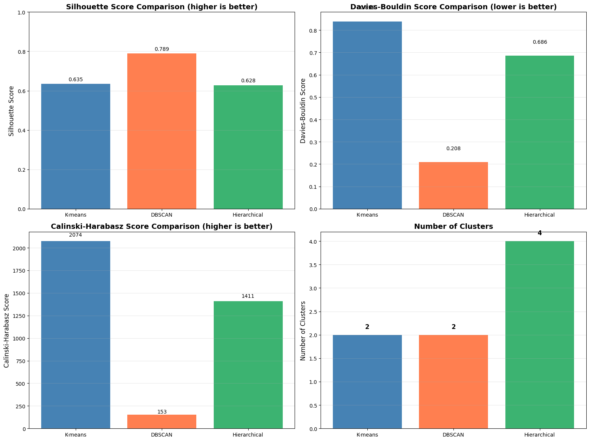
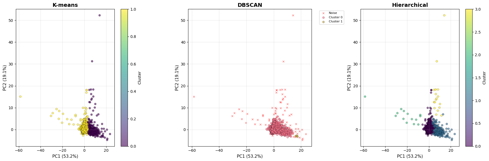
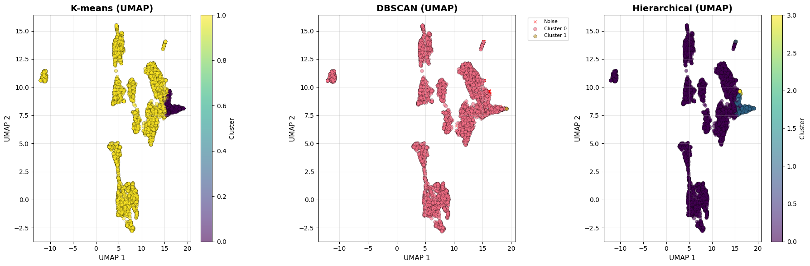

# Data Analytics for Health - Task 2.4: Final Clustering Evaluation and Comparison

## Overview
This notebook performs final evaluation and comparison of all clustering methods:
- K-means clustering
- Density-based clustering (DBSCAN)
- Hierarchical clustering

## Objectives
- Compare clustering results from all three methods
- Evaluate and compare performance metrics
- Visualize differences between clustering approaches
- Select the best clustering approach for the dataset
- Discuss advantages and disadvantages of each method

---


```python
import os
import pandas as pd
import numpy as np
import matplotlib.pyplot as plt
import seaborn as sns
import warnings
from pathlib import Path
from sklearn.preprocessing import RobustScaler
from sklearn.metrics import silhouette_score, davies_bouldin_score, calinski_harabasz_score, adjusted_rand_score
from sklearn.decomposition import PCA

warnings.filterwarnings('ignore')
plt.style.use('default')
sns.set_palette("husl")

# Set up file paths
notebook_dir = Path.cwd().resolve()
data_path = (notebook_dir / '..' / 'Data').resolve()
plots_dir = (notebook_dir / '..' / 'plots').resolve()
plots_dir.mkdir(parents=True, exist_ok=True)

print("Libraries imported successfully")
print(f"Data path: {data_path}")
print(f"Plots directory: {plots_dir}")

```

    Libraries imported successfully
    Data path: Y:\Studium\3. Sem UniPI\Data Analytics 4 digital Health\data_analytics_4_health_unipi\Data
    Plots directory: Y:\Studium\3. Sem UniPI\Data Analytics 4 digital Health\data_analytics_4_health_unipi\plots
    

## 1. Load Data and Clustering Results


```python
# Load prepared patient profile
df = pd.read_csv(data_path / 'patient_profile_broad_clean_clustering.csv')  

print(f"Loaded patient profile: {df.shape[0]:,} subjects × {df.shape[1]} features")
print(f"\nColumns: {df.columns.tolist()}")

# Get numeric features (excluding subject_id and categorical variables)
numeric_features = [col for col in df.columns if col != 'subject_id' and col != 'hadm_id' and df[col].dtype in [np.float64, np.int64]]
print(f"\nNumeric features for clustering: {len(numeric_features)}")
print(f"Features: {numeric_features}")

# Prepare data
X = df[numeric_features].copy()
X = X.fillna(X.mean())
scaler = RobustScaler()
X_scaled = scaler.fit_transform(X)

# Load clustering results
try:
    df_kmeans = pd.read_csv(data_path / '2.1_kmeans_clustered_data.csv')
    labels_kmeans = df_kmeans['cluster'].values
    print(f"\n✓ Loaded K-means results: {len(np.unique(labels_kmeans))} clusters")
except FileNotFoundError:
    print("\n✗ K-means results not found. Run 2.1_kmeans_clustering.ipynb first.")
    labels_kmeans = None

try:
    df_dbscan = pd.read_csv(data_path / '2.2_dbscan_clustered_data.csv')
    labels_dbscan = df_dbscan['cluster'].values
    n_clusters_dbscan = len(np.unique(labels_dbscan[labels_dbscan != -1]))
    n_noise_dbscan = np.sum(labels_dbscan == -1)
    print(f"✓ Loaded DBSCAN results: {n_clusters_dbscan} clusters, {n_noise_dbscan} noise points")
except FileNotFoundError:
    print("✗ DBSCAN results not found. Run 2.2_density_based_clustering.ipynb first.")
    labels_dbscan = None

try:
    df_hierarchical = pd.read_csv(data_path / '2.3_hierarchical_clustered_data.csv')
    labels_hierarchical = df_hierarchical['cluster'].values
    print(f"✓ Loaded Hierarchical results: {len(np.unique(labels_hierarchical))} clusters")
except FileNotFoundError:
    print("✗ Hierarchical results not found. Run 2.3_hierarchical_clustering.ipynb first.")
    labels_hierarchical = None

```

    Loaded patient profile: 5,166 subjects × 13 features
    
    Columns: ['subject_id', 'hadm_id', 'abnormal_ratio', 'qc_fail_ratio', 'fluid_diversity', 'procedure_span_days_missing', 'gender_F', 'micro_resistance_score', 'metabolic_stress_index', 'oxygenation_dysfunction_index', 'inflammation_liver_stress_index', 'hematologic_stability_score', 'renal_failure_index']
    
    Numeric features for clustering: 11
    Features: ['abnormal_ratio', 'qc_fail_ratio', 'fluid_diversity', 'procedure_span_days_missing', 'gender_F', 'micro_resistance_score', 'metabolic_stress_index', 'oxygenation_dysfunction_index', 'inflammation_liver_stress_index', 'hematologic_stability_score', 'renal_failure_index']
    
    ✓ Loaded K-means results: 2 clusters
    ✓ Loaded DBSCAN results: 2 clusters, 94 noise points
    ✓ Loaded Hierarchical results: 3 clusters
    

## 2. Comprehensive Evaluation Metrics Comparison


```python
# Compute evaluation metrics for each method
evaluation_results = []

methods = {
    'K-means': labels_kmeans,
    'DBSCAN': labels_dbscan,
    'Hierarchical': labels_hierarchical
}

for method_name, labels in methods.items():
    if labels is not None:
        # Basic statistics
        unique_labels = np.unique(labels)
        n_clusters = len(unique_labels[unique_labels != -1]) if -1 in unique_labels else len(unique_labels)
        n_noise = np.sum(labels == -1) if -1 in labels else 0
        
        # Compute metrics (excluding noise for DBSCAN)
        if n_clusters >= 2:
            if -1 in labels:
                # DBSCAN: exclude noise points
                non_noise_mask = labels != -1
                if np.sum(non_noise_mask) > 1:
                    silhouette = silhouette_score(X_scaled[non_noise_mask], labels[non_noise_mask])
                    davies_bouldin = davies_bouldin_score(X_scaled[non_noise_mask], labels[non_noise_mask])
                    calinski_harabasz = calinski_harabasz_score(X_scaled[non_noise_mask], labels[non_noise_mask])
                else:
                    silhouette = -1
                    davies_bouldin = np.inf
                    calinski_harabasz = 0
            else:
                # K-means and Hierarchical: use all points
                silhouette = silhouette_score(X_scaled, labels)
                davies_bouldin = davies_bouldin_score(X_scaled, labels)
                calinski_harabasz = calinski_harabasz_score(X_scaled, labels)
        else:
            silhouette = -1
            davies_bouldin = np.inf
            calinski_harabasz = 0
        
        evaluation_results.append({
            'Method': method_name,
            'N_Clusters': n_clusters,
            'N_Noise': n_noise,
            'Noise_Ratio': n_noise / len(labels) if len(labels) > 0 else 0,
            'Silhouette_Score': silhouette,
            'Davies_Bouldin': davies_bouldin,
            'Calinski_Harabasz': calinski_harabasz
        })

evaluation_df = pd.DataFrame(evaluation_results)
print("="*80)
print("COMPREHENSIVE EVALUATION METRICS")
print("="*80)
print(evaluation_df.to_string(index=False))

```


```python
# Visualize comparison of metrics
fig, axes = plt.subplots(2, 2, figsize=(16, 12))

# Silhouette Score
ax = axes[0, 0]
valid_data = evaluation_df[evaluation_df['Silhouette_Score'] >= 0]
if len(valid_data) > 0:
    bars = ax.bar(valid_data['Method'], valid_data['Silhouette_Score'], 
                  color=['steelblue', 'coral', 'mediumseagreen'][:len(valid_data)])
    ax.set_ylabel('Silhouette Score', fontsize=12)
    ax.set_title('Silhouette Score Comparison (higher is better)', fontsize=14, fontweight='bold')
    ax.set_ylim([0, max(1, valid_data['Silhouette_Score'].max() * 1.1)])
    ax.grid(True, alpha=0.3, axis='y')
    for i, (idx, row) in enumerate(valid_data.iterrows()):
        ax.text(i, row['Silhouette_Score'] + 0.01, f"{row['Silhouette_Score']:.3f}", 
               ha='center', va='bottom', fontsize=10)

# Davies-Bouldin Score
ax = axes[0, 1]
valid_data = evaluation_df[evaluation_df['Davies_Bouldin'] < np.inf]
if len(valid_data) > 0:
    bars = ax.bar(valid_data['Method'], valid_data['Davies_Bouldin'],
                  color=['steelblue', 'coral', 'mediumseagreen'][:len(valid_data)])
    ax.set_ylabel('Davies-Bouldin Score', fontsize=12)
    ax.set_title('Davies-Bouldin Score Comparison (lower is better)', fontsize=14, fontweight='bold')
    ax.grid(True, alpha=0.3, axis='y')
    for i, (idx, row) in enumerate(valid_data.iterrows()):
        ax.text(i, row['Davies_Bouldin'] + 0.05, f"{row['Davies_Bouldin']:.3f}", 
               ha='center', va='bottom', fontsize=10)

# Calinski-Harabasz Score
ax = axes[1, 0]
valid_data = evaluation_df[evaluation_df['Calinski_Harabasz'] > 0]
if len(valid_data) > 0:
    bars = ax.bar(valid_data['Method'], valid_data['Calinski_Harabasz'],
                  color=['steelblue', 'coral', 'mediumseagreen'][:len(valid_data)])
    ax.set_ylabel('Calinski-Harabasz Score', fontsize=12)
    ax.set_title('Calinski-Harabasz Score Comparison (higher is better)', fontsize=14, fontweight='bold')
    ax.grid(True, alpha=0.3, axis='y')
    for i, (idx, row) in enumerate(valid_data.iterrows()):
        ax.text(i, row['Calinski_Harabasz'] + row['Calinski_Harabasz']*0.02, 
               f"{row['Calinski_Harabasz']:.0f}", ha='center', va='bottom', fontsize=10)

# Number of Clusters
ax = axes[1, 1]
bars = ax.bar(evaluation_df['Method'], evaluation_df['N_Clusters'],
             color=['steelblue', 'coral', 'mediumseagreen'][:len(evaluation_df)])
ax.set_ylabel('Number of Clusters', fontsize=12)
ax.set_title('Number of Clusters', fontsize=14, fontweight='bold')
ax.grid(True, alpha=0.3, axis='y')
for i, (idx, row) in enumerate(evaluation_df.iterrows()):
    ax.text(i, row['N_Clusters'] + 0.1, f"{int(row['N_Clusters'])}", 
           ha='center', va='bottom', fontsize=12, fontweight='bold')

plt.tight_layout()
plt.savefig(plots_dir / '2.4_metrics_comparison.png', dpi=300, bbox_inches='tight')
plt.show()

```


    

    


## 3. Cluster Agreement Analysis


```python
# Compute Adjusted Rand Index (ARI) between different methods
if labels_kmeans is not None and labels_hierarchical is not None:
    ari_kmeans_hierarchical = adjusted_rand_score(labels_kmeans, labels_hierarchical)
    print(f"Adjusted Rand Index (K-means vs Hierarchical): {ari_kmeans_hierarchical:.4f}")

if labels_kmeans is not None and labels_dbscan is not None:
    # For DBSCAN, compare only non-noise points
    non_noise_mask = labels_dbscan != -1
    if np.sum(non_noise_mask) > 0:
        ari_kmeans_dbscan = adjusted_rand_score(
            labels_kmeans[non_noise_mask], 
            labels_dbscan[non_noise_mask]
        )
        print(f"Adjusted Rand Index (K-means vs DBSCAN, non-noise only): {ari_kmeans_dbscan:.4f}")

if labels_hierarchical is not None and labels_dbscan is not None:
    non_noise_mask = labels_dbscan != -1
    if np.sum(non_noise_mask) > 0:
        ari_hierarchical_dbscan = adjusted_rand_score(
            labels_hierarchical[non_noise_mask],
            labels_dbscan[non_noise_mask]
        )
        print(f"Adjusted Rand Index (Hierarchical vs DBSCAN, non-noise only): {ari_hierarchical_dbscan:.4f}")

# Create agreement matrix
agreement_data = []
if labels_kmeans is not None and labels_hierarchical is not None:
    agreement_data.append(['K-means', 'Hierarchical', adjusted_rand_score(labels_kmeans, labels_hierarchical)])
if labels_kmeans is not None and labels_dbscan is not None:
    non_noise_mask = labels_dbscan != -1
    if np.sum(non_noise_mask) > 0:
        agreement_data.append(['K-means', 'DBSCAN', adjusted_rand_score(labels_kmeans[non_noise_mask], labels_dbscan[non_noise_mask])])
if labels_hierarchical is not None and labels_dbscan is not None:
    non_noise_mask = labels_dbscan != -1
    if np.sum(non_noise_mask) > 0:
        agreement_data.append(['Hierarchical', 'DBSCAN', adjusted_rand_score(labels_hierarchical[non_noise_mask], labels_dbscan[non_noise_mask])])

if agreement_data:
    agreement_df = pd.DataFrame(agreement_data, columns=['Method 1', 'Method 2', 'ARI'])
    print("\n" + "="*80)
    print("CLUSTER AGREEMENT (Adjusted Rand Index)")
    print("="*80)
    print(agreement_df.to_string(index=False))
    print("\nNote: ARI ranges from -1 to 1, where 1 indicates perfect agreement")

```

    Adjusted Rand Index (K-means vs Hierarchical): 0.9231
    Adjusted Rand Index (K-means vs DBSCAN, non-noise only): 0.0237
    Adjusted Rand Index (Hierarchical vs DBSCAN, non-noise only): 0.0248
    
    ================================================================================
    CLUSTER AGREEMENT (Adjusted Rand Index)
    ================================================================================
        Method 1     Method 2      ARI
         K-means Hierarchical 0.923105
         K-means       DBSCAN 0.023700
    Hierarchical       DBSCAN 0.024823
    
    Note: ARI ranges from -1 to 1, where 1 indicates perfect agreement
    

## 4. Visual Comparison of Clustering Results


```python
# Reduce to 2D using PCA for visualization
pca = PCA(n_components=2, random_state=42)
X_pca = pca.fit_transform(X_scaled)

# Create side-by-side comparison
n_methods = sum([1 for labels in methods.values() if labels is not None])
fig, axes = plt.subplots(1, n_methods, figsize=(6*n_methods, 6))

plot_idx = 0
for method_name, labels in methods.items():
    if labels is not None:
        ax = axes[plot_idx] if n_methods > 1 else axes
        
        # Plot clusters
        if -1 in labels:
            # DBSCAN: handle noise points
            for cluster_id in sorted(np.unique(labels)):
                mask = labels == cluster_id
                if cluster_id == -1:
                    ax.scatter(X_pca[mask, 0], X_pca[mask, 1], 
                             c='red', marker='x', s=20, alpha=0.5, label='Noise', linewidths=1)
                else:
                    ax.scatter(X_pca[mask, 0], X_pca[mask, 1], 
                             label=f'Cluster {cluster_id}', alpha=0.6, s=30, edgecolors='k', linewidth=0.3)
        else:
            # K-means and Hierarchical
            scatter = ax.scatter(X_pca[:, 0], X_pca[:, 1], c=labels, 
                               cmap='viridis', alpha=0.6, s=30, edgecolors='k', linewidth=0.3)
            plt.colorbar(scatter, ax=ax, label='Cluster')
        
        ax.set_xlabel(f'PC1 ({pca.explained_variance_ratio_[0]:.1%})', fontsize=11)
        ax.set_ylabel(f'PC2 ({pca.explained_variance_ratio_[1]:.1%})', fontsize=11)
        ax.set_title(f'{method_name}', fontsize=14, fontweight='bold')
        ax.grid(True, alpha=0.3)
        if -1 in labels:
            ax.legend(bbox_to_anchor=(1.05, 1), loc='upper left', fontsize=8)
        
        plot_idx += 1

plt.tight_layout()
plt.savefig(plots_dir / '2.4_clustering_visual_comparison.png', dpi=300, bbox_inches='tight')
plt.show()

print(f"PCA explained variance: {pca.explained_variance_ratio_.sum():.2%}")

```


    

    


    PCA explained variance: 72.31%
    


```python
import umap

# Reduce to 2D using UMAP for visualization
reducer = umap.UMAP(n_neighbors=15, min_dist=0.1, n_components=2, random_state=42)
X_umap = reducer.fit_transform(X_scaled)

# Create side-by-side UMAP comparison
n_methods = sum([1 for labels in methods.values() if labels is not None])
fig, axes = plt.subplots(1, n_methods, figsize=(6*n_methods, 6))

plot_idx = 0
for method_name, labels in methods.items():
    if labels is not None:
        ax = axes[plot_idx] if n_methods > 1 else axes
        
        # Plot clusters
        if -1 in labels:
            # DBSCAN: handle noise points
            for cluster_id in sorted(np.unique(labels)):
                mask = labels == cluster_id
                if cluster_id == -1:
                    ax.scatter(X_umap[mask, 0], X_umap[mask, 1], 
                             c='red', marker='x', s=20, alpha=0.5, label='Noise', linewidths=1)
                else:
                    ax.scatter(X_umap[mask, 0], X_umap[mask, 1], 
                             label=f'Cluster {cluster_id}', alpha=0.6, s=30, edgecolors='k', linewidth=0.3)
        else:
            # K-means and Hierarchical
            scatter = ax.scatter(X_umap[:, 0], X_umap[:, 1], c=labels, 
                               cmap='viridis', alpha=0.6, s=30, edgecolors='k', linewidth=0.3)
            plt.colorbar(scatter, ax=ax, label='Cluster')
        
        ax.set_xlabel('UMAP 1', fontsize=11)
        ax.set_ylabel('UMAP 2', fontsize=11)
        ax.set_title(f'{method_name} (UMAP)', fontsize=14, fontweight='bold')
        ax.grid(True, alpha=0.3)
        if -1 in labels:
            ax.legend(bbox_to_anchor=(1.05, 1), loc='upper left', fontsize=8)
        
        plot_idx += 1

plt.tight_layout()
plt.savefig(plots_dir / '2.4_clustering_umap_comparison.png', dpi=300, bbox_inches='tight')
plt.show()

print("UMAP visualization complete")
```


    

    


    UMAP visualization complete
    

## 5. Method Comparison: Advantages and Disadvantages


```python
comparison_table = pd.DataFrame({
    'Method': ['K-means', 'DBSCAN', 'Hierarchical'],
    'Advantages': [
        'Fast and scalable; Works well with spherical clusters; Simple to implement',
        'Finds clusters of arbitrary shape; Identifies noise/outliers; No need to specify k',
        'Provides hierarchical structure; No need to specify k; Interpretable dendrograms'
    ],
    'Disadvantages': [
        'Assumes spherical clusters; Requires k a priori; Sensitive to initialization',
        'Sensitive to parameters (eps, min_samples); Struggles with varying densities',
        'Computationally expensive; Sensitive to noise; Different linkage methods give different results'
    ],
    'Best For': [
        'Well-separated, spherical clusters; Large datasets',
        'Clusters of arbitrary shape; Outlier detection; Unknown number of clusters',
        'Small to medium datasets; Need for hierarchical structure; Interpretability'
    ]
})

print("="*80)
print("METHOD COMPARISON: ADVANTAGES AND DISADVANTAGES")
print("="*80)
for idx, row in comparison_table.iterrows():
    print(f"\n{row['Method']}:")
    print(f"  Advantages: {row['Advantages']}")
    print(f"  Disadvantages: {row['Disadvantages']}")
    print(f"  Best For: {row['Best For']}")

```

    ================================================================================
    METHOD COMPARISON: ADVANTAGES AND DISADVANTAGES
    ================================================================================
    
    K-means:
      Advantages: Fast and scalable; Works well with spherical clusters; Simple to implement
      Disadvantages: Assumes spherical clusters; Requires k a priori; Sensitive to initialization
      Best For: Well-separated, spherical clusters; Large datasets
    
    DBSCAN:
      Advantages: Finds clusters of arbitrary shape; Identifies noise/outliers; No need to specify k
      Disadvantages: Sensitive to parameters (eps, min_samples); Struggles with varying densities
      Best For: Clusters of arbitrary shape; Outlier detection; Unknown number of clusters
    
    Hierarchical:
      Advantages: Provides hierarchical structure; No need to specify k; Interpretable dendrograms
      Disadvantages: Computationally expensive; Sensitive to noise; Different linkage methods give different results
      Best For: Small to medium datasets; Need for hierarchical structure; Interpretability
    

## 6. Final Recommendations and Conclusions


```python
# Determine best method based on metrics
if len(evaluation_df) > 0:
    # Normalize scores for comparison (higher is better for all after normalization)
    eval_normalized = evaluation_df.copy()
    
    # Silhouette: already in [-1, 1], higher is better
    eval_normalized['Silhouette_Norm'] = eval_normalized['Silhouette_Score']
    
    # Davies-Bouldin: lower is better, so invert
    max_db = eval_normalized[eval_normalized['Davies_Bouldin'] < np.inf]['Davies_Bouldin'].max()
    eval_normalized['DB_Norm'] = 1 - (eval_normalized['Davies_Bouldin'] / max_db)
    eval_normalized.loc[eval_normalized['Davies_Bouldin'] == np.inf, 'DB_Norm'] = 0
    
    # Calinski-Harabasz: higher is better, normalize
    max_ch = eval_normalized['Calinski_Harabasz'].max()
    eval_normalized['CH_Norm'] = eval_normalized['Calinski_Harabasz'] / max_ch
    
    # Combined score (weighted average)
    eval_normalized['Combined_Score'] = (
        0.4 * eval_normalized['Silhouette_Norm'] +
        0.3 * eval_normalized['DB_Norm'] +
        0.3 * eval_normalized['CH_Norm']
    )
    
    best_method = eval_normalized.loc[eval_normalized['Combined_Score'].idxmax(), 'Method']
    
    print("="*80)
    print("FINAL RECOMMENDATION")
    print("="*80)
    print(f"\nBased on comprehensive evaluation metrics, the best clustering method is:")
    print(f"  → {best_method}")
    print(f"\nCombined Score: {eval_normalized.loc[eval_normalized['Method'] == best_method, 'Combined_Score'].values[0]:.4f}")
    print(f"\nDetailed metrics for {best_method}:")
    best_row = evaluation_df[evaluation_df['Method'] == best_method].iloc[0]
    print(f"  - Number of clusters: {int(best_row['N_Clusters'])}")
    if best_row['N_Noise'] > 0:
        print(f"  - Noise points: {int(best_row['N_Noise'])} ({best_row['Noise_Ratio']:.1%})")
    print(f"  - Silhouette Score: {best_row['Silhouette_Score']:.4f}")
    print(f"  - Davies-Bouldin Score: {best_row['Davies_Bouldin']:.4f}")
    print(f"  - Calinski-Harabasz Score: {best_row['Calinski_Harabasz']:.4f}")
    
    print("\n" + "="*80)
    print("ALL METHODS RANKED BY COMBINED SCORE")
    print("="*80)
    ranked = eval_normalized.sort_values('Combined_Score', ascending=False)[['Method', 'Combined_Score', 'Silhouette_Score', 'Davies_Bouldin', 'Calinski_Harabasz']]
    print(ranked.to_string(index=False))

```

    ================================================================================
    FINAL RECOMMENDATION
    ================================================================================
    
    Based on comprehensive evaluation metrics, the best clustering method is:
      → DBSCAN
    
    Combined Score: 0.5634
    
    Detailed metrics for DBSCAN:
      - Number of clusters: 2
      - Noise points: 94 (1.8%)
      - Silhouette Score: 0.7892
      - Davies-Bouldin Score: 0.2084
      - Calinski-Harabasz Score: 153.3079
    
    ================================================================================
    ALL METHODS RANKED BY COMBINED SCORE
    ================================================================================
          Method  Combined_Score  Silhouette_Score  Davies_Bouldin  Calinski_Harabasz
          DBSCAN        0.563384          0.789242        0.208401         153.307898
         K-means        0.554081          0.635203        0.839285        2073.611437
    Hierarchical        0.510110          0.627786        0.685827        1411.041697
    


